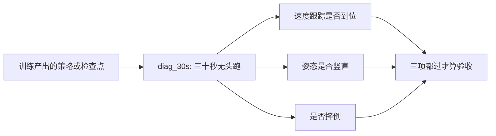
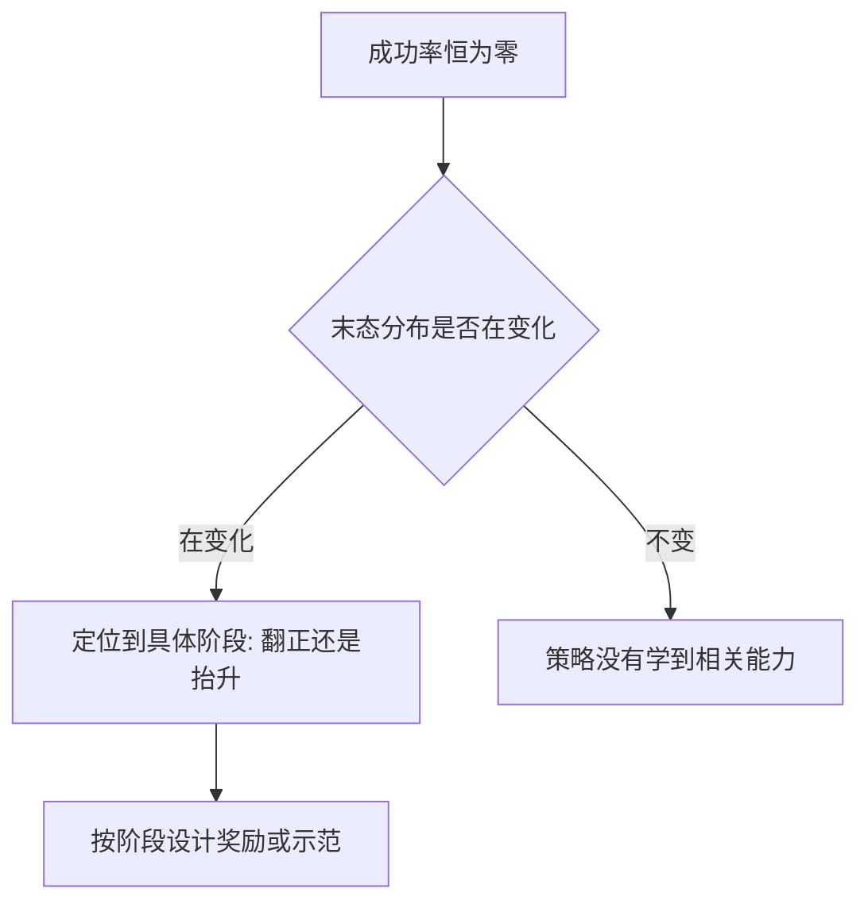
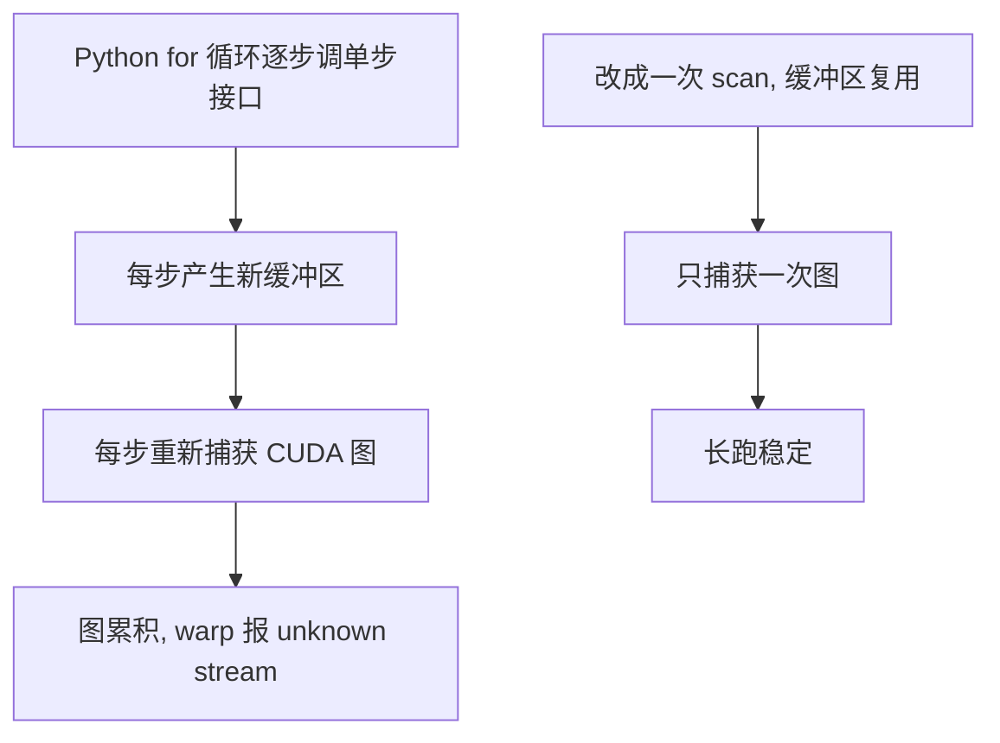

# 评估脚本与结论结算

训练跑完之后，「这一版是不是更好」不能靠训练曲线回答。记录里有一组六份检查点的对比：严格档与实用档成功率全部为零，但末态竖直度的中位数都在 0.97 以上，相对地面高度的中位数从 0.084 m 一路升到 0.128 m。只看成功率的 0% 会得出「什么也没学会」，而数字实际说的是「翻正了，但一直趴着」。

评估脚本的价值就在这里：它把「有没有变好」拆成能分别观察的几个量，让结论从「成功率是多少」变成「卡在哪一步」。四支脚本按结算顺序接起来，可视化排在最后，负责确认数字与现象是否一致。

## 验收长测：三十秒无头跑

行走任务的验收是一条命令加一行输出（`实验记录_Go1复现.md:310-315`）：

```bash
../.venv/bin/python sim/diag_30s.py --pkl models/go1_walk_policy_v10.pkl --hard_contact
# 指令[0.5, 0.0, 0.0] | vx=+0.492 vy=0 wz=-0.002 | up_z=1.00 | 30s 未摔
```

这行输出回答三件事：跟指令的速度跟踪是否到位、姿态是否竖直、以及三十秒内是否摔倒。策略文件与检查点目录两种输入方式给出相同结果，说明保存与恢复的路径一致（`实验记录_Go1复现.md:313-314`）。

| 指标 | 对照实现 | 本项目验收 |
| --- | --- | --- |
| 训练预算 | 5M 环境步 | 5.14M 环境步 |
| 梯度更新次数 | 779,520 | 802,560 |
| 指令速度 | 0.5 m/s | 实测 +0.492 m/s |
| 回合长度 | 750 步 | 满 750 步，30 秒长测不摔 |

换算一下梯度更新次数就能看出两边是同一档预算：203 与 209 个训练步，各自乘 3840 次更新（`实验记录_Go1复现.md:319-320`）。这种「换算后对照」比直接比步数可靠，理由在上一页讲过。



## 多检查点横向对比

一次训练的检查点只说明最终状态，多份检查点排在一起才能看出趋势。起身任务的对比做法是固定评估参数、逐份检查点跑同一支脚本（`实验记录_Go1复现.md:5322-5332`）：

```bash
../.venv/bin/python sim/eval_getup.py --envs 128 --steps 300
```

| 检查点 | 严格 | 实用 | 末态竖直度中位 | 末态相对高度中位 | 落在带内 |
| --- | --- | --- | --- | --- | --- |
| 旧冒烟 1.08M | 0% | 0% | +0.995 | 0.084 m | 1% |
| v24 1.62M | 0% | 0% | +0.980 | 0.094 m | 0% |
| v24 2.70M | 0% | 0% | +0.974 | 0.103 m | 0% |
| v24 5.41M | 0% | 0% | +0.994 | 0.112 m | 0% |
| v24 9.19M | 0% | 0% | +0.996 | 0.128 m | 1% |
| v24 10.81M | 0% | 0% | +0.997 | 0.128 m | 2% |

评估参数里的掉落概率设成 1.0，表示只用真摔倒样本，不掺入站立出生（`实验记录_Go1复现.md:5323`）。检查点的名字要带步数，否则六份数据无法排序，也没法判断训练是否在进步。

## 末态分布比成功率更能说明问题

上面这张表的读法要单独说：成功率一列全是 0，但另外两列在动。竖直度中位数几乎不变（一直在 0.97 以上），相对高度中位数稳步上升（0.084 到 0.128 m）。目标高度约 0.26 m，高度带的下界是 0.20 m，所以趋势是「越来越接近」但没有跨过门槛。

| 观察 | 只看成功率 | 加上分布 |
| --- | --- | --- |
| 结论 | 什么也没学会 | 学会了翻正，卡在抬升 |
| 下一步 | 重训或换奖励 | 针对抬升阶段加信号或给示范 |

这也是为什么评估脚本除了成功率还要打出末态分布与分桶：单个比率在接近零时几乎不携带信息，分布的位置与形状才说明差距在哪里（`eval_getup.py:220-236`）。


## 逐指令评估

评估奖励与平均回合长度都是整条指令分布上的平均值，看不出「哪一档不会」。项目里有两版策略的失败完全被平均值掩盖了，于是新增了逐指令评估：一次加载策略，顺序跑多条指令，报每条的三个速度分量、存活步数、奖励与终止原因（`实验记录_Go1复现.md:569-571`）。

| 指标 | 覆盖范围 | 能否定位档位 |
| --- | --- | --- |
| 评估奖励 | 整条指令分布 | 不能 |
| 平均回合长度 | 整条指令分布 | 不能 |
| 逐指令输出 | 每条指令一行 | 能 |

写这支脚本时踩到过一个与后端相关的崩溃：用 Python 循环逐步调用单步接口，几千步之后会报 `Warp error: unknown stream`。原因是 mjx 的 warp 后端默认自己捕获 CUDA 图，而逐步调用时每步都会产生新的缓冲区，于是每一步都要重新捕获一张图，累积到一定数量后 warp 挂掉（`实验记录_Go1复现.md:573-576`）。

修法是把整个 rollout 写成一次 `jax.lax.scan`，缓冲区在迭代之间复用，图只捕获一次。改完之后十条指令三十九秒跑完，不再崩溃（`实验记录_Go1复现.md:577-578`）。这个崩溃与查看器启动时偶发的问题同源，因此这条经验同时适用于评估脚本与观察脚本。



## 起身成功率的结算入口

起身任务的结算入口是 `sim/eval_getup.py`。它的判据与查看器一致，同时给出两档：严格档要求姿态与高度都合格并保持，实用档放宽到末态倾角小于 20 度（`eval_getup.py:2-7`、`:189-194`）。

| 参数 | 默认 | 说明 |
| --- | --- | --- |
| 环境数 | 256 | 样本量 |
| 步数 | 300 | 单次评估长度 |
| 结算间隔 | 5 步 | 每 5 步检查一次判据 |
| 直立阈值 | 0.99 | 倾角约 8.1 度 |
| 高度带 | 0.24 到 0.32 | 判定用带 |

训练入口里也写了同一件事：训练进度的真信号是这支脚本给出的成功率与竖直度，评估奖励只当参考（`train_getup.py:17-18`）。这条约定让「训练健康」与「任务完成」分成两个可分别判断的问题。

输出里要一起看的还有出界与陷落终止数：这两类样本不进末态统计（`eval_getup.py:217-219`），如果数量异常，说明统计已经被污染，先修出生与边界再谈成功率。

## 可视化脚本的定位

可视化脚本负责最后一件事：确认数字描述的现象与实际看到的一致。行走用 `sim/view_go1.py`，带策略文件与接触档两个参数（`实验记录_Go1复现.md:358-360`）。

| 脚本 | 回答的问题 | 不能承担的任务 |
| --- | --- | --- |
| 长测脚本 | 指标是否达标 | 解释原因 |
| 逐指令脚本 | 哪一档不会 | 观察动作细节 |
| 可视化脚本 | 现象是否与数字一致 | 方案对照 |

查看器一侧还有脚本化的核对工具，例如把查看器的帧流程与预期逐项比对的脚本，以及用于交还方案对照的离线探针。它们的存在让「现场观察到的问题」能退回脚本里复现，避免在窗口里反复试参数（`当前状态.md:41-48`）。


## 易错点

| 现象 | 原因 | 判据 |
| --- | --- | --- |
| 只看成功率就下结论 | 比率接近零时信息极少 | 同时看末态分布 |
| 平均值好看但某一档不会 | 平均值掩盖档位差异 | 跑逐指令评估 |
| 逐指令脚本跑几千步崩溃 | 逐步调用导致重复捕获图 | 改成一次扫描 |
| 检查点无法排序 | 名字不含步数 | 命名带步数 |
| 评估混入站立出生样本 | 掉落概率未设 1.0 | 检查出生分布参数 |
| 末态统计被出界样本污染 | 未剔除越界环境 | 看出界与陷落计数 |

## 小结

### 核心概念

- 验收是一条无头长测命令，回答速度、姿态与是否摔倒三件事。
- 多检查点对比看趋势，末态分布说明差距在哪一步。
- 成功率接近零时，分布与分桶才是有效信息。
- 逐指令评估用于发现被平均值掩盖的档位失败。

### 设计权衡

| 决策 | 选择 | 收益 | 代价 |
| --- | --- | --- | --- |
| 验收方式 | 无头长测加人工可视化 | 数字与现象互相印证 | 两步都要做 |
| 评估粒度 | 逐指令输出 | 能定位档位 | 运行时间更长 |
| 结算间隔 | 每 5 步一次 | 更快 | 时间分辨率变粗 |
| 样本筛选 | 只用真摔倒 | 反映实际能力 | 与训练分布有差距 |

## 练习

### 基础题

1. 三十秒无头长测的输出告诉你哪三件事？
2. 成功率全是 0 时，还应该看哪些量？
3. 逐指令评估解决了平均值掩盖的什么问题？

### 挑战题

4. 给出一套检查点命名与评估参数约定，要求任何两份历史报告都能直接对照。

5. 解释逐步调用单步接口为什么会累积 CUDA 图，并说明扫描写法为什么能避免。

6. 设计一份从训练日志到最终结论的结算流程，标出每一步的输入与输出。

### 附：本页引用的路径

| 路径 | 用途 |
| --- | --- |
| `RLcontroller_go1_moreinformation/实验记录_Go1复现.md` | 验收输出与对照表、六份检查点对比、逐指令评估与崩溃修复（`:310-323`、`:5317-5332`、`:569-578`） |
| `mjx-go1-getup/sim/eval_getup.py` | 起身评估的判据、两档与样本筛选（`:2-7`、`:50-58`、`:189-194`、`:217-219`） |
| `RLcontroller_go1_moreinformation/train/train_getup.py` | 训练进度的真信号约定（`:17-18`） |
| `当前状态.md` | 查看器与探针的对照命令（`:41-48`） |

（引用的文件以 /home/tc63/mujoco 为根。）