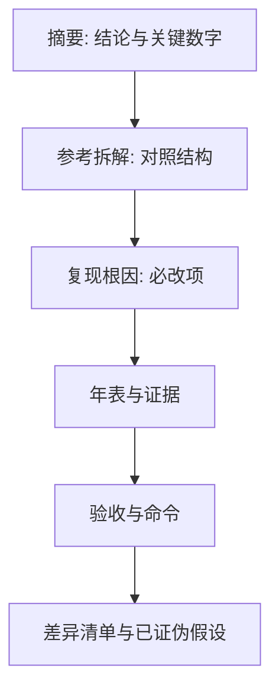
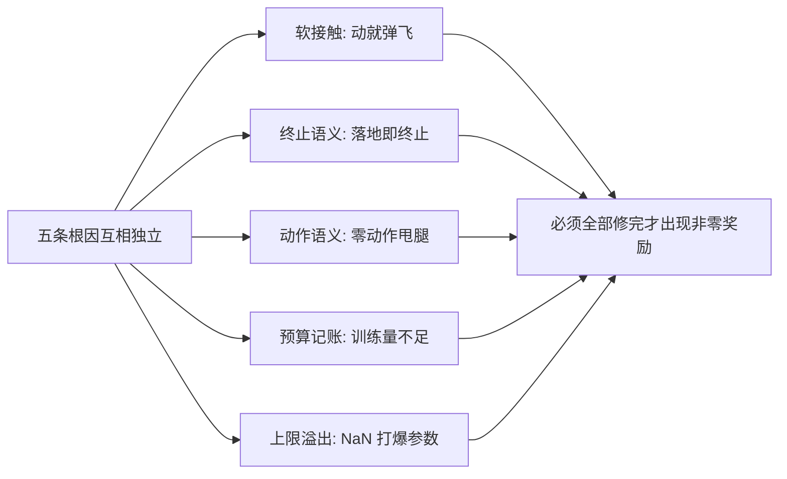
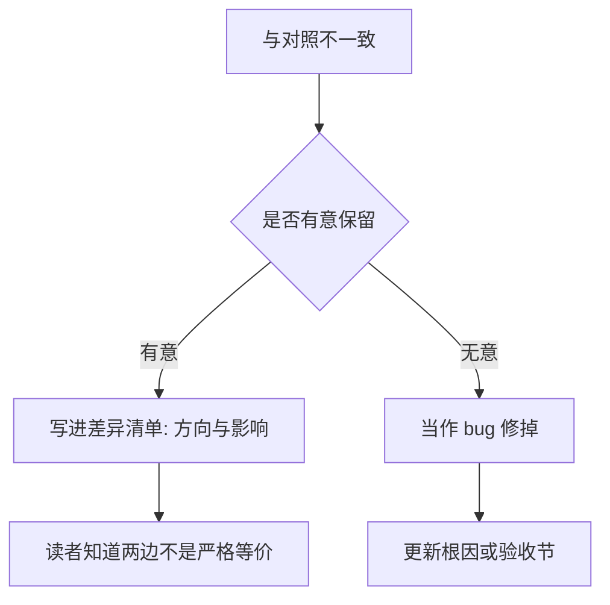
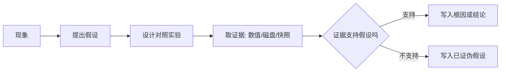

# 实验记录与可复现清单

一份实验记录的价值不在它记了多少条命令，而在于三个月后的自己或另一个人照着它能重走一遍，走不通时知道该先查哪一条。这个仓库的记录本里，事后回看收益最高的两节是「已证伪的假设」与「与参考实现的差异清单」，而非结论表——它们省下的是重新犯同一个错误的时间。

记录本的结构与写法、五条复现根因、证伪清单与差异清单是下面四节的例子，最后会压成一份可以直接照着执行的最小清单。

## 记录的结构：从摘要到附录

记录本的前九节是固定结构，顺序按读者的使用路径安排（`实验记录_Go1复现.md:13-44`、`:88-112`、`:194-405`）：

| 节 | 内容 | 给谁看 |
| --- | --- | --- |
| 摘要 | 摘要式结论与关键数字 | 只想看结果的人 |
| 参考仓库拆解 | 对照实现的结构与关键文件 | 要动手改的人 |
| 复现根因 | 按影响排序的必改项 | 要复现的人 |
| 实验年表 | 每个版本的动机与结果 | 要理解演进的人 |
| 关键诊断证据 | 支撑根因的对照数据 | 要验证结论的人 |
| 验收对照 | 达标数字与训练曲线 | 验收的人 |
| 复现命令 | 可执行的命令块 | 要重跑的人 |
| 差异清单 | 与对照实现有意保留的差别 | 要对齐口径的人 |
| 已证伪假设 | 试过但错的判断 | 想重试旧方案的人 |

最后两节的写法要单独学：它们记录的是「不该再做什么」。差异清单让读者知道两边不是严格等价，避免把差异当成 bug；已证伪假设让读者知道某些看起来更聪明的做法为什么不行（`实验记录_Go1复现.md:372-401`）。

## 五条复现根因（按影响排序）

记录本把行走复现的必改项压缩成五条，并明确写着它们互相独立、任何一条不修都走不起来（`实验记录_Go1复现.md:112-116`）。

| 序号 | 根因 | 证据 |
| --- | --- | --- |
| 1 | 足端用软接触，求解器不收敛 | 静平衡残差 324 对硬接触的 0.083；随机动作把机器人弹到 z=1.08 |
| 2 | 终止语义比对照严一倍 | 对照用四元数的 x、y 分量做阈值，实际容忍约 ±20 度 |
| 3 | 动作语义做成了仿射映射 | 零动作落到控制范围中点，髋目标 1.9 而名义 0.8，关节速度 7 rad/s |
| 4 | 训练预算被记错 32 倍 | 检查点间隔 786432 步等于参考 rollout 的 32 倍 |
| 5 | 约束行数上限溢出导致 NaN | `nefc overflow` 提示涨到 66/69/72，护栏回填字段不全 |

第一条与第五条在本单元的两支探针里还会再出现：软接触的残差是用数值对照判定的，上限溢出则是用非有限值计数判定的（`实验记录_Go1复现.md:117-122`、`:179-190`）。

第二条有一个细节要记住：四元数分量约等于欧拉角的一半，所以「按字面实现阈值」会把自己的容忍度做窄一倍，症状是回合第一步就终止（`实验记录_Go1复现.md:124-136`）。修复后的写法是先把四元数归一化，再用 x、y 分量与角度阈值比较。

第三条是纯语义错误：对照实现里动作就是控制目标，由引擎按控制范围内部裁剪；本项目做成了从区间到控制范围的仿射映射，于是「零动作」不再等于「保持名义姿态」（`实验记录_Go1复现.md:138-147`）。修复只需一步裁剪。

## 已证伪的假设清单

这一节用一张两列表把「曾经以为」与「实际情况」并排放，覆盖了七个判断（`实验记录_Go1复现.md:393-401`）：

| 曾经的假设 | 实际情况 |
| --- | --- |
| warp 硬接触不收敛，只能用软接触 | 伪命题。硬接触与 CPU 逐位一致，不收敛的是软接触 |
| 评估奖励为 0 是正常现象 | 部分错。下限确实存在，但长期为 0 是三个错误叠加 |
| NaN 是缺少观测归一化造成的 | 错。不归一化也能零 NaN，真因是上限溢出与护栏不全 |
| 对照实现默认使用观测归一化 | 错。对照没有任何归一化包装 |
| `nefc overflow` 只是警告 | 错。会写坏加速度与传感器数据，把参数打爆 |
| 约束行数上限 64 够用 | 错。摔倒自碰撞需要更大，提到 256 后零告警 |
| 全局速度跟踪可以直接拿来训转向 | 错。全局速度加偏航指令等于要求边自转边横行 |

这张表里有一行的写法需要注意：第二条的结论是「部分错」，而不是简单的对或错。奖励下限确实存在，所以早期为 0 有其合理成分；错的是把它当成长期为 0 的解释（`实验记录_Go1复现.md:396`）。记录结论时保留这种分寸，比写成非黑即白更有用。

## 与参考实现的差异清单

差异清单记录有意保留的差别，每条都写清方向与影响（`实验记录_Go1复现.md:374-387`）：

| 差异 | 对照实现 | 本项目 | 影响 |
| --- | --- | --- | --- |
| 优势估计视野 | 2048 步 | 展开长度 32 | 衰减因子 0.72，影响有限 |
| 价值网络观测 | 与策略共享 48 维 | 特权状态 119 维 | 信息更多 |
| 采样并行 | 12 个异步环境 | 768 环境锁步 | 样本相关性略有差异 |
| 重力投影写法 | 直立时返回零向量 | 标准体系重力 | 数值特征不同 |
| 碰撞成本 | 算了但没加 | 权重置 0 | 与对照一致 |
| 关节速度成本 | 算了但没加 | 权重置 0 | 与对照一致 |

后两行说明一个反直觉的处理：为了让奖励地形与对照一致，本项目把对照「算了但没加」的两项也置 0，而不是「补全」它们（`实验记录_Go1复现.md:386-387`）。复现的目标是对齐行为，不是把实现改得更完整。

## 每条结论要带什么证据

记录里的结论不是凭印象写的，每种结论都有对应的证据形式：

| 结论类型 | 证据形式 | 示例 |
| --- | --- | --- |
| 物理设置错误 | 数值对照表 | 软接触残差 324，硬接触 0.083 |
| 预算记账错误 | 磁盘证据 | 检查点间隔 786432 步 |
| 数值稳定性问题 | 告警次数加字段清单 | 提示涨到 66/69/72，护栏漏回填的字段列出 |
| 行为是否达标 | 命令输出快照 | 速度、姿态与三十秒不摔一行打印 |
| 阶段能力不足 | 多检查点分布表 | 末态竖直度与相对高度中位数 |
| 方案选择 | 对照探针的标量表 | 跳变、抖动、摔倒与站住 |

「磁盘证据」这一类在复盘时特别好用：训练脚本的日志可能被覆盖，但检查点目录的间隔会留在磁盘上，且它的数值与超参有确定的换算关系（`实验记录_Go1复现.md:164-166`）。写记录时优先选这种不依赖日志保留的证据。

## 一个最小可复现清单

把前几节的内容压成一份可执行清单，按顺序核对即可（`实验记录_Go1复现.md:344-363`、`train_getup.py:38-42`）：

| 项 | 值或做法 |
| --- | --- |
| 仓库位置 | `/home/tc63/mujoco/RLcontroller_go1` 或 `..._moreinformation`，按任务选 |
| 解释器 | 仓库外层的虚拟环境，用相对路径调用 |
| 引擎版本 | mujoco 3.12.0 |
| 硬件 | WSL2、16 核、RTX 5060 Laptop 8 GiB |
| 显存比例 | 导入 jax 前设置，行走 0.80、起身 0.45、克隆 0.40 |
| 接触档 | 评估必须带硬接触开关 |
| 随机种子 | 显式指定，默认 0 |
| 检查点命名 | 含步数，目录不复用 |
| 判据阈值 | 与查看器一致，改一处要同步另一处 |
| 每步记录 | 分段 fps、GPU 时钟与温度、样本量、出界计数 |

这份清单里有两项容易被省略却最容易出问题：接触档与判据阈值。前者决定物理是否与训练一致，后者决定数字能否与现场对照；两者属于结论有效性的前提，不能当配置细节看待。

## 易错点

| 现象 | 原因 | 判据 |
| --- | --- | --- |
| 三个月后无法复现 | 版本、显存比例或接触档没记 | 对照最小清单 |
| 结论无法验证 | 没留证据 | 看结论是否配了数值或磁盘证据 |
| 重试已失败的方案 | 未记录已证伪假设 | 查记录最后两节 |
| 把有意差异当 bug | 差异清单没写 | 对照差异表 |
| 修一处看不到变化 | 多因素叠加 | 按根因表逐项排除 |
| 日志丢失后无法复盘 | 只依赖日志证据 | 优先留磁盘证据 |

## 小结

### 核心概念

- 记录按读者的使用路径组织，摘要与命令在前，证伪与差异在后。
- 根因按影响排序，并说明它们互相独立。
- 已证伪假设与差异清单的价值高于结论表。
- 每种结论都要配对应的证据形式，优先选择不依赖日志的证据。

### 设计权衡

| 决策 | 选择 | 收益 | 代价 |
| --- | --- | --- | --- |
| 记录粒度 | 命令加证据 | 可重走也可验证 | 写作成本高 |
| 差异处理 | 如实列出而非消除 | 读者知道口径边界 | 需要持续维护 |
| 证伪记录 | 保留失败方案 | 少走弯路 | 记录更长 |
| 证据类型 | 优先磁盘证据 | 不依赖日志保留 | 需要提前设计命名 |

## 练习

### 基础题

1. 记录的哪两节事后回看收益最高？为什么？
2. 「部分错」这种结论为什么比非黑即白更有用？
3. 最小清单里哪两项最容易省略却最关键？

### 挑战题

4. 为一次新实验设计记录模板，要求包含根因、证据、差异与证伪四部分。

5. 举出一个只能靠磁盘证据才能事后确认的结论，并说明为什么日志不足以支撑它。

6. 说明「为了对齐行为而故意不复刻更完整的实现」这一取舍的边界，什么情况下应当反过来。

### 附：本页引用的路径

| 路径 | 用途 |
| --- | --- |
| `RLcontroller_go1_moreinformation/实验记录_Go1复现.md` | 记录结构、五条根因、差异清单、已证伪假设、最小命令与磁盘证据（`:13-44`、`:112-190`、`:164-166`、`:344-405`） |
| `RLcontroller_go1_moreinformation/train/train_getup.py` | 显存比例与运行约定（`:38-42`） |

（引用的文件以 /home/tc63/mujoco 为根。）