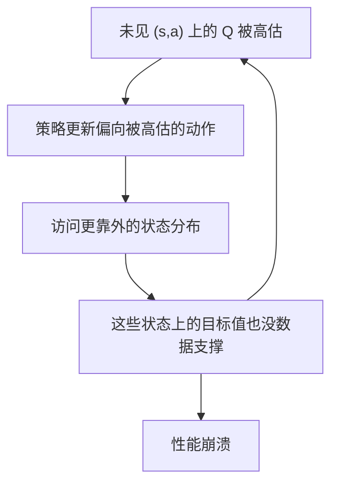
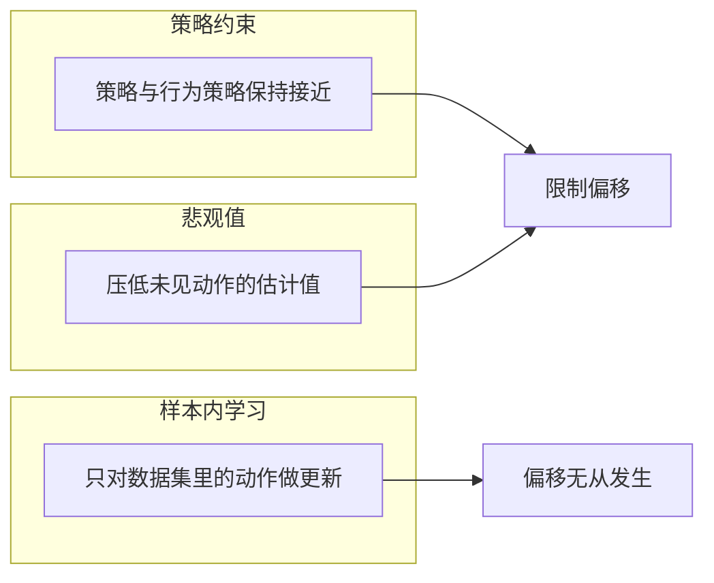

在线强化学习里，策略与环境互为因果：策略决定看到什么数据，数据又反过来修正策略。离线强化学习把这条回路切断，只给一份固定的数据集，要求算法从里面学出一个还能在真实环境里跑的策略。回路被切断的代价是，算法再也无法验证自己对未见过的状态动作对的估计是否正确。

这就是分布偏移问题的来源。文中的算法结论来自知识库素材，本仓库没有实现 CQL、IQL 或 TD3-BC，相关内容属方法梳理。

## 离线设定：数据集固定而策略仍在变

离线学习的目标函数写起来和在线一样，都是最大化期望回报，但它对状态的期望是在数据集分布上取的，而评估时策略会走到数据集从来没有覆盖的状态（`02_modern_control/offline_rl/README.md:24-26`）。

数据集由某个行为策略产生。只要学到的策略与行为策略不同，它访问的状态分布就会偏离数据集分布，这种偏离在训练过程中会自己放大：策略越自信，越会去它“自认为”好的区域，而那些区域又缺少数据支撑。

与行为克隆相比，离线强化学习多了一个值函数通道，因此有超越数据集平均水平的可能；代价是必须处理值函数在数据外区域的估计误差。素材里的对照表把两者的泛化能力与最优性列在一起（`:45-53`）。

## 偏移的链条：从高估到崩溃

偏移沿一条四步链条逐步发生：值函数在未见过的状态动作对上给出过高估计，策略更新于是偏向这些被高估的动作，策略进一步偏移到分布外区域，最终性能崩溃（`02_modern_control/offline_rl/README.md:65-70`）。

链条里最关键的一环是第一步。值函数是用贝尔曼备份学出来的，备份会把当前估计传回前一个状态；只要某个动作的估计偏高一丁点，这个偏差就会沿时间反向传播并被放大。在线设定里这种偏差会被新采集的数据纠正回来，离线设定里没有新数据，于是偏差只能被算法结构本身抑制。

## 策略约束路线

第一条路线是在策略优化时直接或隐式地让学到的策略靠近行为策略，例如加一个分布距离约束，要求策略与行为策略的散度不超过阈值（`02_modern_control/offline_rl/README.md:74-83`）。

它的优点是原理直观、实现简单，缺点是保守程度需要精调：约束太松挡不住偏移，太紧则性能上限被行为策略锁死。素材把 TD3+BC、BCQ、BEAR、BRAC 归入这一族，并把 TD3+BC 列为其中较实用的选择（`:88`）。

## 悲观值路线

第二条路线不对策略加约束，而是让值函数自己变得保守：在损失里加入一项，压低策略分布下动作的估计值，同时抬高数据集中真实出现过的动作的估计值，净效果是数据内的动作不被低估、数据外的动作被低估（`02_modern_control/offline_rl/README.md:90-103`）。

这一族的理论保证更强，代表算法是 CQL、COMBO、MOPO 与 MOReL，其中 CQL 配合 Q 集成被列为较安全的选择（`:103`）。代价是保守偏置本身是个超参数，偏置过大时会丢弃数据集里有用的信息。

## 样本内学习路线

第三条路线最彻底：训练过程中完全不查询数据外动作。值函数的更新目标只用数据集中真实出现过的动作，策略则通过加权回归从数据集里已有的动作中挑出好的（`02_modern_control/offline_rl/README.md:105-119`）。

不该选这一族的情形同样清楚：数据集覆盖过窄时它连基线都够不到，因为策略只能从数据里已有的动作中挑；需要外推到数据之外的更好动作时，这条路线没有通道。代表算法是 IQL、IMC、InAC、SQL，其中 IQL 被列为这族里较实用的选择（`:119`）。

## 三族方法的横向对照

把三族放在同一张表里，差别集中在“是否查询数据外动作”与“外推能力”两列（`02_modern_control/offline_rl/README.md:121-131`）：

| 维度 | 策略约束 | 悲观值 | 样本内学习 |
| --- | --- | --- | --- |
| 代表算法 | TD3+BC、BCQ | CQL、COMBO | IQL、InAC |
| 是否查询数据外动作 | 部分 | 是 | 从不 |
| 实现复杂度 | 低 | 中 | 低到中 |
| 稳定性 | 中 | 中低 | 最高 |
| 外推能力 | 弱 | 中 | 无 |
| 数据质量敏感度 | 最敏感 | 中 | 最鲁棒 |

“数据质量敏感度”这一列解释了为什么三族都有存在价值：数据以混合质量为主时，悲观值路线能靠压低坏动作的估计取胜；数据基本是专家演示时，策略约束路线更省事；数据质量未知时，样本内学习路线的失败风险最小。

## 数据集侧的偏移防线

算法侧的三条路线之外，数据侧还有一层更朴素的防线。素材给出的实践顺序是：先按 episode 累计奖励筛掉低质量轨迹（常保留前 50% 到 80%），对视觉数据做帧级去重，把观测与动作标准化到零均值单位方差，必要时重标奖励（`02_modern_control/offline_rl/README.md:520-527`）。

这些步骤的作用在于减少噪声对值函数的干扰，而不在于提高算法上限。标准化尤其重要：动作尺度不统一时，同一个保守化系数在不同维度上的实际强度不同，等于给每个关节配了不同的约束（`:640-648`）。

| 数据步骤 | 作用 | 不做会怎样 |
| --- | --- | --- |
| 按回报筛轨迹 | 去掉低质量样本 | 值函数被拖低 |
| 帧级去重 | 降低重复样本权重 | 少数轨迹主导训练 |
| 观测动作标准化 | 各维度量纲一致 | 约束强度失衡 |
| 重标奖励 | 补上缺失信号 | 稀疏奖励下学不到 |

## 本项目的位置：从行为克隆到离线算法

这套工程里没有 CQL、IQL 或 TD3-BC 的实现。与本单元内容最接近的是起身任务里的两条工作线：一条是用关键帧示范做行为克隆，产出可以直接喂给 PPO 的热启动权重（`RLcontroller_go1_moreinformation/train/bc_getup.py:1-14`）；另一条是 DAgger 式的状态聚合，让当前策略自己跑，在它实际访问到的状态上请专家生成纠正样本（`RLcontroller_go1_moreinformation/sim/dagger_getup.py:1-11`）。

DAgger 的动机说明正好是本单元要讲的分布偏移：纯行为克隆的成功率只有 5.1%，原因是策略一旦偏离专家轨迹就进入没有监督的状态，误差单调累积；而训练损失仍然很小（`RLcontroller_go1_moreinformation/sim/dagger_getup.py:4-9`）。离线强化学习要解决的也是同一类偏移，区别在于它用值函数与保守化机制来抵抗，而不是靠补充专家标注。

| 工作线 | 数据来源 | 抗偏移手段 | 本仓库状态 |
| --- | --- | --- | --- |
| 行为克隆 | 关键帧成功轨迹 | 无 | 已实现（`train/bc_getup.py`） |
| DAgger 聚合 | 策略自己访问的状态加专家纠正 | 扩充状态覆盖 | 已实现（`sim/dagger_getup.py`） |
| 离线强化学习 | 固定数据集 | 保守化或样本内更新 | 未实现，属方法梳理 |

## 小结

### 核心概念

- 离线强化学习只给固定数据集，学到的策略与环境不再有交互回路。
- 分布偏移的核心是评估分布与数据分布不一致，值函数在数据外区域不可靠。
- 偏移沿“高估、偏向、外移、崩溃”四步自我放大。
- 策略约束路线限制策略靠近行为策略，实现简单但保守程度难调。
- 悲观值路线压低未见动作的估计，理论更强但偏置是超参数。
- 样本内学习路线从不查询数据外动作，稳定性最高但无外推。
- 本仓库最接近的实现是行为克隆与 DAgger，离线算法本身未实现。

### 设计权衡

| 决策 | 选择 | 收益 | 代价 |
| --- | --- | --- | --- |
| 抗偏移方式 | 约束、悲观、样本内三选一 | 覆盖不同数据条件 | 没有一种通吃 |
| 策略约束强度 | 需要精调 | 挡住偏移 | 上限被行为策略锁住 |
| 悲观偏置 | 需要调参 | 理论保证强 | 可能丢弃有用信息 |
| 样本内更新 | 不查询数据外动作 | 稳定 | 无外推能力 |
| 本项目路径 | 行为克隆加热启动 | 见效快 | 仍需在线微调纠偏 |

## 练习

### 基础题

1. 写出分布偏移四步链条，并指出哪一步是放大器。
2. 说明三族解法各自“是否查询数据外动作”的答案。
3. 解释为什么样本内学习路线的稳定性最高。

### 挑战题

1. 给定一份以低质量轨迹为主的数据集，说明三族中哪一族更合适，并给出理由。
2. 用本仓库 DAgger 的动机解释“训练损失很小但成功率只有 5.1%”这一现象。
3. 设计一个实验，比较行为克隆与样本内学习路线在同一份数据上的外推差异。

## 附：本页引用的路径

| 路径 | 用途 |
| --- | --- |
| robot_control_simulation/ | 知识库素材根，正文相对路径均相对它 |
| `02_modern_control/offline_rl/README.md` | 离线设定、分布偏移、三族解法与对照表 |
| RLcontroller_go1_moreinformation/ | 本仓库最接近的实现所在仓库 |
| `train/bc_getup.py` | 行为克隆产热启动权重 |
| `sim/dagger_getup.py` | DAgger 状态聚合与分布漂移说明 |
| `sim/collect_getup_demos.py` | 关键帧示范采集 |
