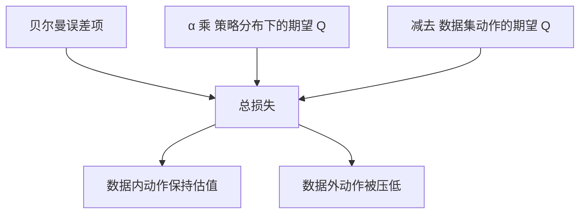
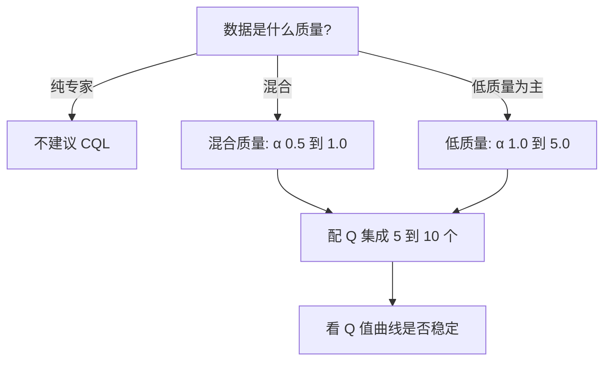

分布偏移的根源是值函数在没见过的动作上给分太高。CQL 的思路很直接：不去限制策略能走到哪里，而是在损失函数里加一项，专门把没见过的动作的估计值压下去，同时保证数据集里真实出现过的动作不被误伤。

这项正则化让 CQL 在混合质量数据上表现突出，也让它比样本内方法多出几个必须调的超参数。这一页按损失结构、实现形式、系数取值、集成手段、失效模式的顺序展开。文中算法结论来自知识库素材，本仓库未实现 CQL。

## 损失结构：贝尔曼项加正则项

CQL 的损失是在标准贝尔曼误差上叠加一个正则项，形如：贝尔曼项加上系数 α 乘以“策略分布下的期望估计值减去数据集里的期望估计值”（`02_modern_control/offline_rl/README.md:159-166`）。

两项的方向相反：第一项对策略当前分布下的动作求期望，最小化它会压低这些估计；第二项对数据集里真实出现的动作求期望，最小化负号后的它会抬高这些估计。合起来就是“数据内不悲观，数据外悲观”（`:168`）。

## 实现形式与 log-sum-exp

策略分布下的期望在连续动作空间上没法精确计算，实际实现用 log-sum-exp 在采样动作上近似“最坏情况”的估计值，把正则项写成：系数乘上 log(对动作求 exp(Q) 的和) 再减去数据集动作的平均估计（`02_modern_control/offline_rl/README.md:170-178`）。

这样做的效果是在动作空间上形成一个尖锐的估计分布：数据内的动作保持高值，数据外的动作被压到低位。素材把这一项的作用描述为等价于在策略上施加隐式约束（`:178`）——它没有显式地约束策略输出，但通过压低数据外动作的值，让策略更新没有动力往那里去。

## 保守系数 α 与数据质量

α 控制悲观程度，取值随数据质量变化：高质量数据用小值（0.1 到 0.5），混合质量用中值（0.5 到 1.0），低质量数据为主用大值（1.0 到 5.0）（`02_modern_control/offline_rl/README.md:593-597`）。

推荐做法是先做一轮对数间隔的扫描（0.1、0.5、1.0、2.0、5.0），再按验证表现选值（`:597`）。默认值 1.0 属于中间档，适合不确定数据质量时的起点（`:587`）。

| 数据情况 | α 取值 | 理由 |
| --- | --- | --- |
| 基本是专家演示 | 0.1 到 0.5 | 数据本身可信，不需要强压制 |
| 混合质量 | 0.5 到 1.0 | 需要压低坏动作又不误伤好动作 |
| 低质量为主 | 1.0 到 5.0 | 数据外与数据内都不可信，只能强保守 |
| 不确定 | 先扫描再选 | 单个值无法覆盖不同数据集 |

## Q 集成的必要性

素材反复强调一点：使用 5 到 10 个 Q 网络并取最小值可以显著提升 CQL 的稳定性（`02_modern_control/offline_rl/README.md:187`）。推荐配置表里的默认值是 2 个，范围可以到 10 个（`:588`）。

集成生效的机制是取最小值：单个网络的高估会被其他网络拉回来，只有多个网络同时认为某个动作好，估计才会留在高位。这与乐观初始化相反，属于把不确定性直接变成保守性。

## CQL 的失效模式

第一类是专家数据上的过度悲观。当数据全部来自高质量演示时，CQL 的保守项可能压过了有用信号，表现反而不如简单的行为克隆；素材的建议是这种数据上改用 TD3+BC 或行为克隆（`02_modern_control/offline_rl/README.md:191`、`:197`）。

第二类是 α 的调参成本。不同数据集需要不同的 α，而这没有通用规则（`:192`）。第三类是奖励尺度敏感：奖励量纲变化时同一个 α 的实际强度会变，也就是说 α 的含义依赖于奖励的归一化方式（`:193`）。

| 失效模式 | 现象 | 应对 |
| --- | --- | --- |
| 专家数据上过悲观 | 不如行为克隆 | 换算法或减小 α |
| α 调参成本高 | 换数据集就要重扫 | 固定扫描序列形成经验 |
| 奖励尺度敏感 | 同 α 效果差很多 | 先归一化奖励再调 α |

## 与策略约束路线的分工

CQL 与 TD3+BC 都处理数据外动作，但手法不同：前者压值，后者把策略拉回行为策略附近。这决定了它们的分工。数据以低质量或混合质量为主时，压值能有效阻止策略跟坏动作走，CQL 更合适；数据基本是专家演示时，策略本来就该靠近行为策略，约束路线更省事（`02_modern_control/offline_rl/README.md:191-198`）。

另一个差别是性能上限的来源。悲观值路线不把策略锁在行为策略附近，因此有超越数据集最优动作的余地；策略约束路线的上限被约束半径限制，很难超过演示者太多（`:149`）。这两条特性互为代价：上限高意味着行为更不可预测，也更依赖 α 调得准。

| 对比项 | CQL | TD3+BC |
| --- | --- | --- |
| 处理数据外动作的方式 | 压值 | 约束策略 |
| 低质量数据 | 擅长 | 差 |
| 专家数据 | 可能过悲观 | 简单可靠 |
| 超参数数量 | 多 | 少 |
| 超越数据集最优 | 有余地 | 近似到数据上界 |

## 实现路径与训练预算

素材把 CQL 的共训练阶段描述为“多轮交替”，也就是值更新与策略更新轮流进行，而不是像样本内方法那样把两步解耦（`02_modern_control/offline_rl/README.md:143`）。这带来两个预算项：一是集成规模决定每步的前向次数，二是 α 扫描要求同一份数据跑多组配置。

入门阶段的实现路径在素材的参考资源里：d3rlpy 是目前较完善的离线算法库，CORL 提供单文件实现，适合先读懂再迁移（`:837-843`）。实践顺序建议先用单文件实现确认数据与指标通路，再把配置搬到工程代码里，避免一开始就被训练框架的复杂度淹没。

## 训练中要盯的信号

素材列出的监控项里，与 CQL 直接相关的有两条：Q 值均值持续上升说明数据外动作仍在被高估，处理办法是增大 α 或增加集成规模；训练集上的 Q 值高而验证回滚表现差，说明分布偏移严重，应换用样本内方法或补充数据覆盖（`02_modern_control/offline_rl/README.md:611-636`）。

还有一条容易被忽略的对照项是策略与行为策略的散度：散度过大意味着策略已经偏移出数据集覆盖，散度过小则说明约束把策略锁死（`:617`）。这两条一起看才能区分“保守过头”与“保守不够”。

## 保守偏置与不确定性的关系

α 是一个全局标量，而真实的不确定性因状态动作而异：数据密集的区域其实不需要压制，数据稀疏的边缘才需要。用一个常数近似整片空间，是 CQL 需要调参的根本原因。

素材里同一族的不同算法给出了不同答案：CQL 用值函数的尖锐分布与集成来近似，模型类方法（MOPO、MOReL）改用动力学模型的不确定性作为惩罚依据（`02_modern_control/offline_rl/README.md:98`）。前者不需要学模型，后者对动力学建模质量敏感。

| 不确定性来源 | 代表手段 | 依赖 |
| --- | --- | --- |
| 值估计分散 | Q 集成取最小值 | 训练成本 |
| 数据密度低 | 惩罚项加系数 | 超参数 |
| 动力学未知 | 模型不确定性惩罚 | 动力学模型 |

## 小结

### 核心概念

- CQL 在贝尔曼误差上加正则项，压低数据外动作、抬高数据内动作。
- 实现上用 log-sum-exp 近似策略分布下的最坏估计。
- α 控制悲观程度，随数据质量从 0.1 调到 5.0。
- 奖励尺度变化会改变 α 的实际含义，需先归一化。
- Q 集成取最小值，把不确定性转成保守性。
- 专家数据上 CQL 可能过悲观，表现不如行为克隆。
- 监控 Q 值均值与策略散度，用来判断保守是否合适。

### 设计权衡

| 决策 | 选择 | 收益 | 代价 |
| --- | --- | --- | --- |
| 保守方式 | 值函数正则化 | 数据外动作被压低 | 需要调 α |
| 期望近似 | log-sum-exp | 可计算且尖锐 | 依赖采样动作 |
| 集成规模 | 5 到 10 个 | 稳定性提升 | 训练与显存成本上升 |
| 数据质量假设 | 随 α 变化 | 覆盖多种数据 | 无通用取值 |

## 练习

### 基础题

1. 写出 CQL 正则项的两部分各自的方向与作用。
2. 说明 log-sum-exp 在这里替代了什么运算。
3. 列出 α 随数据质量变化的三档取值。

### 挑战题

1. 给定一份混合质量数据集，设计 α 的扫描方案与判定指标。
2. 论证奖励归一化对 α 取值的影响，并给出一种让两者解耦的做法。
3. 说明 Q 集成规模从 2 增到 10 时，稳定性与计算成本的权衡点在哪里。

## 附：本页引用的路径

| 路径 | 用途 |
| --- | --- |
| robot_control_simulation/ | 知识库素材根，正文相对路径均相对它 |
| `02_modern_control/offline_rl/README.md` | CQL 损失、实现、α 取值、集成与失效模式 |
| `02_modern_control/offline_rl/README.md`:611-648 | 监控信号与常见错误 |
