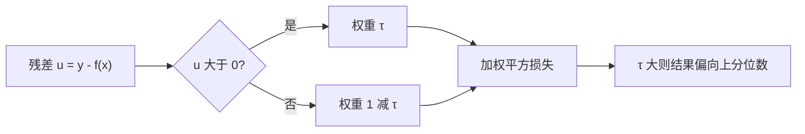
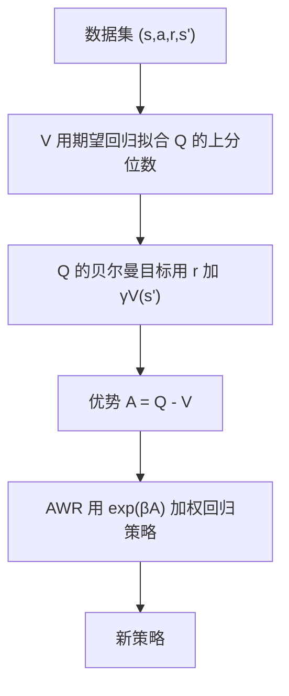

CQL 的代价是引入了一个需要扫描的保守系数。有没有办法完全不引入保守项，也不查询数据外动作，只靠数据集里出现过的动作把值函数学好？IQL 给出的答案是肯定的，代价是需要一个不对称的回归损失，以及一个决定乐观程度的参数。

它的稳定性来自一个很强的前提：训练过程中出现的每一个动作都来自数据集。没有查询，就不会有“幻想出来的高值”。这一页按期望回归、三步更新、为什么不查询、参数调节、局限与超参数的顺序展开；本仓库未实现 IQL，以下按公开资料整理。

## 期望回归：给残差加不对称权重

标准回归最小化残差平方，得到的是条件均值。期望回归给正负残差不同的权重：残差为正时权重是 τ，为负时权重是 1 减 τ（`02_modern_control/offline_rl/README.md`）。

当 τ 等于 0.5 时权重对称，退化为普通均方误差；τ 大于 0.5 时正残差被放大，拟合结果偏向分布的上分位数；τ 小于 0.5 时偏向低分位数。

期望回归与三步更新简化后如下（示意）：

```python
def expectile_loss(u, tau):                 # u = 目标 - 预测，即残差
    w = torch.where(u > 0, tau, 1.0 - tau)  # 正负残差权重不同
    return (w * u ** 2).mean()

v_loss   = expectile_loss(q_sa.detach() - v_s, tau)          # V 拟合 Q 的上分位数
q_loss   = ((q_sa - (r + gamma * v_next)) ** 2).mean()       # 目标用 V(s')，不取 max Q
awr_loss = (torch.exp(beta * (q_sa - v_s).detach()) * bc_loss).mean()  # 优势加权回归
```

| τ | 权重偏向 | 拟合目标 |
| --- | --- | --- |
| 0.1 | 偏向负残差 | 条件分布下分位数 |
| 0.5 | 对称 | 条件均值 |
| 0.7 | 偏向正残差 | 偏上的分位数 |
| 0.9 | 强偏向正残差 | 接近上分位数 |



## 三步更新

IQL 的训练由三个互相衔接的更新组成（`02_modern_control/offline_rl/README.md`）。状态值用期望回归拟合，目标是让它靠近 Q 函数在数据集动作上的上分位数；Q 函数用标准的平方误差，但目标里用的是下一状态的状态值而不是对动作取最大；策略用优势加权回归，权重是优势的指数放大。

三步的关系可以这样理解：状态值回答“在这个状态上，数据里较好的动作大概值多少”；Q 函数把这个值沿时间传播；策略则从数据里那些超过平均水平的动作中学习。整套流程没有任何一步需要采样数据外动作。



## 为什么不查询数据外动作

关键在 Q 的更新目标。常规方法写的是下一状态上的最大值，要算这个最大值就得对每个候选动作求估计，其中必然包含数据里没有的动作。IQL 把这一项换成状态值，而状态值只用数据集动作拟合过，于是 OOD 动作从头到尾没有出现过（`02_modern_control/offline_rl/README.md`）。

策略提取同样在数据内进行：优势加权回归（AWR，用优势的指数作权重做行为克隆，优势高的动作被更多地模仿）对数据集里的每个动作赋予权重。整个过程不会出现灾难性的值发散，素材把这一点概括为“从不崩溃”。

## τ 的调节逻辑

τ 决定乐观程度，也决定这一步有多接近行为克隆（`02_modern_control/offline_rl/README.md`）：τ 等于 0.5 时上分位数变成均值，值函数不再偏向好动作，接近行为克隆；0.6 到 0.7 是稳健区间，默认取 0.7；0.8 到 0.9 更乐观，可能拿到更高性能，也可能因为过分相信少数高回报样本而不稳。

素材给的默认值是 0.7，范围 0.5 到 0.9。调这个参数的直觉是：数据里好动作的比例越低，越需要把分位数往上推，才能让值函数注意到它们；但推得太高就变成只盯着少数样本。

## 局限

第一是丢失数据外信息：因为不查询，它无法外推到数据集里没有的更好的动作，补救办法是接一段在线微调（`02_modern_control/offline_rl/README.md`）。

第二是 τ 需要调。第三是稀疏奖励下的困难：优势加权回归要靠优势把好动作与坏动作分开，当绝大多数样本的奖励都为零时，区分度不足，性能会掉下来。素材给出的缓解思路是配合序列建模方法或增加奖励密度。

| 局限 | 表现 | 缓解 |
| --- | --- | --- |
| 无外推 | 上限受数据覆盖限制 | 在线微调 |
| τ 需调 | 过保守或过激进 | 从 0.7 起步 |
| 稀疏奖励 | 优势区分度低 | 加奖励密度或换序列建模 |

## 推荐超参数

素材给出的 IQL 推荐配置（`02_modern_control/offline_rl/README.md`）：

| 参数 | 推荐范围 | 默认值 |
| --- | --- | --- |
| τ | 0.5 到 0.9 | 0.7 |
| β | 0.3 到 10.0 | 3.0 |
| 学习率 | 3e-4 到 1e-3 | 3e-4 |
| 网络宽度 | (256,256) 到 (512,512) | (256,256) |
| 目标网络软更新 | 0.005 到 0.01 | 0.005 |
| 折扣因子 | 0.99 | 0.99 |
| 批大小 | 256 到 1024 | 256 |

β 是优势权重的温度：值大时权重分布更平，几乎所有样本都被模仿；值小时只有优势最大的样本被模仿。它与 τ 一起决定策略提取的“挑剔程度”。

## IQL 与行为克隆的边界

素材的 2026 共识里有一条与这里相关：离线强化学习与模仿学习的边界正在模糊，例如 IQL 在做法上融合了离线强化学习与加权行为克隆（`02_modern_control/offline_rl/README.md`）。把三步更新里的值函数部分去掉，剩下的就是按优势加权的模仿。

这条边界在工程上很有用。本仓库已有的行为克隆与 DAgger 工作线（`RLcontroller_go1_moreinformation/train/bc_getup.py`、`sim/dagger_getup.py`）可以看作这条谱系上的一端：等权模仿专家动作，没有值函数；IQL 是另一端：先用期望回归学出相对好坏，再按好坏加权。

| 方法 | 动作权重 | 是否需要值函数 | 对坏样本的处理 |
| --- | --- | --- | --- |
| 行为克隆 | 全部等权 | 否 | 一并模仿 |
| 优势加权回归 | 按优势指数加权 | 是（优势） | 降低权重 |
| IQL | 优势权重加期望回归的值 | 是 | 降权且不查询数据外动作 |
| DAgger 式聚合 | 按访问到的状态补标注 | 否 | 用专家纠正覆盖 |

## 与其他两族的稳定性差别

素材的总览表把稳定性一列给了 IQL 最高、CQL 中、TD3+BC 中高（`02_modern_control/offline_rl/README.md`）。造成差别的是“是否查询数据外动作”这一列：查询带来的信息可能有用，也可能把值函数带偏，而 IQL 直接放弃了这份信息。

代价也体现在表格的另一列：IQL 的外推能力是“无”，CQL 是“中”。所以 IQL 适合作为默认起点，当需要更高上限时再换 CQL，而不是把 IQL 当成在所有场景都最优的方案。

## 小结

### 核心概念

- 期望回归用不对称权重拟合分位数，τ 决定偏向哪一侧。
- IQL 的状态值用期望回归拟合，逼近数据里较好动作的价值。
- Q 的贝尔曼目标用状态值而不是动作最大值，因此不查询数据外动作。
- 策略通过优势加权回归从数据集动作中提取。
- τ 等于 0.5 退化为行为克隆，0.7 是稳健默认值。
- IQL 的稳定性最高，代价是没有外推能力。
- 稀疏奖励下优势区分度不足，是 IQL 的主要短板。

### 设计权衡

| 决策 | 选择 | 收益 | 代价 |
| --- | --- | --- | --- |
| 贝尔曼目标 | 用状态值替代动作最大值 | 不查询数据外动作 | 失去外推 |
| 值拟合 | 期望回归 | 关注好动作 | 需要调 τ |
| 策略提取 | 优势加权回归 | 数据内选优 | 依赖优势估计质量 |
| 定位 | 默认起点 | 失败风险低 | 上限受数据限制 |

## 练习

### 基础题

1. 写出期望回归的损失式，并说明 τ 在两个分支上的取值。
2. 解释 IQL 的 Q 更新目标与常规方法差在哪一项。
3. 说明 τ 等于 0.5 时 IQL 退化成什么。

### 挑战题

1. 给定一份稀疏奖励数据集，说明 IQL 会在哪一步遇到困难，并给出两种缓解方案。
2. 设计一轮实验，扫描 τ 的四个取值并给出选择依据。
3. 论证“不查询数据外动作”为什么同时是 IQL 的最大优势与最大限制。

## 附：本页引用的路径

| 路径 | 用途 |
| --- | --- |
| robot_control_simulation/ | 知识库素材根，正文相对路径均相对它 |
| `02_modern_control/offline_rl/README.md` | IQL 原理与三步更新、τ 调节与推荐超参数、四算法总览 |
