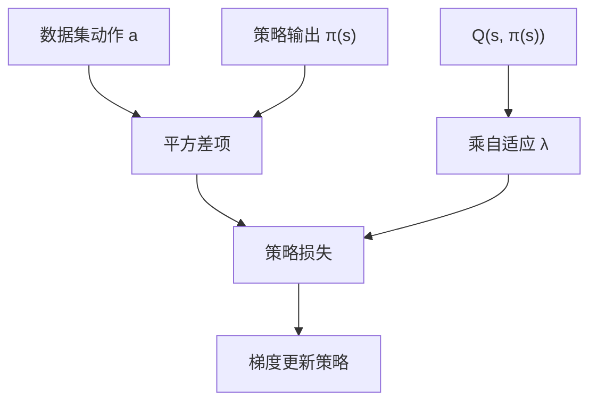
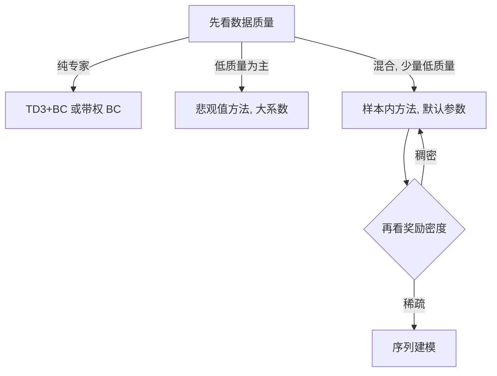
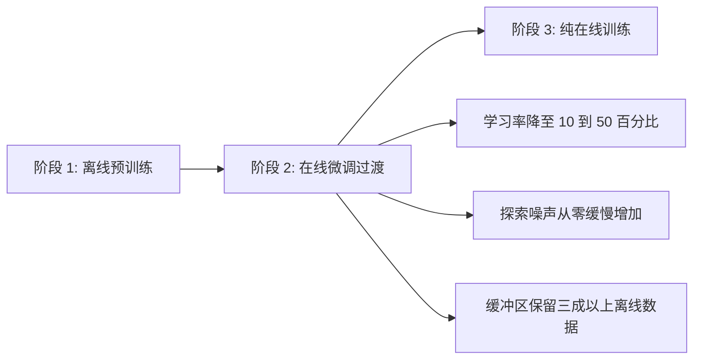

如果数据集本身质量不错，离线强化学习不必走保守值估计那条重路线：在现成的 TD3 上把行为克隆项加到策略目标里，多写几行代码就能得到一个可用基线。TD3+BC 就是这条极简路线，代价是它对数据质量的容忍度最低。

文中算法结论来自知识库素材，本仓库未实现 TD3+BC 与在线微调。

## 策略目标：最大化值、同时贴近数据动作

TD3+BC 的策略更新目标写成两项之和：系数乘上对动作的估计值，减去策略输出与数据集动作的平方差（`02_modern_control/offline_rl/README.md:260-270`）。

第一项是标准的 TD3 目标，鼓励策略选值高的动作；第二项是行为克隆正则，把策略输出拉回数据集里出现过的动作。权重 λ 取系数 α 除以估计值的平均绝对值，这个自适应归一化让两项的量纲可比——否则值函数的尺度一变，同一个 α 的实际强度也跟着变（`:271`）。

## 一行改动与一个超参

素材把实现成本写得很清楚：在 TD3 基础上只增加大约五行代码，关键超参数只有 α 一个（`02_modern_control/offline_rl/README.md:273-278`）。推荐取值范围 1.0 到 10.0，默认 2.5（`:603`）。

便宜是有代价的。它对数据质量很敏感，低质量数据中表现差；对数据覆盖要求也高，覆盖不均衡时容易只模仿常见动作（`:279-280`）。这两条限制解释了为什么它通常被当作基线与快速实现方案，而不是通用首选。

## 筛选与退火：增强版 TD3+BC

两个增强手段可以压低上面两条限制的影响（`02_modern_control/offline_rl/README.md:282-291`）。第一个是 episode 筛选：训练前按累计回报对轨迹排序，只保留前若干比例的高质量轨迹参与策略更新。第二个是退火：训练过程中逐渐降低行为克隆系数，让后期更多依赖值优化。

退火的形式是一条从初值线性降到下限的曲线（`:290`）。素材给出的经验是，在偏高质量数据集上，这两项合计可以比原版提升 15% 到 30%，且几乎没有额外开销（`:293-296`）。它适合的场景是数据质量基本可靠但混有部分低质量轨迹（`:298-301`）。

| 增强项 | 做法 | 作用 |
| --- | --- | --- |
| Episode 筛选 | 按累计回报保留前若干比例 | 去掉低质量轨迹 |
| 系数退火 | 从初值线性降到下限 | 后期少依赖模仿 |
| 组合效果 | 两项同时用 | 偏高质量数据上提升明显 |

## 按数据特征选择

选择框架的第一层看数据（`02_modern_control/offline_rl/README.md:366-377`）：纯专家数据用 TD3+BC 或带权行为克隆；混合质量数据里若低质量占多数，用悲观值路线并配大系数；低质量只占少数，用样本内方法配默认参数；只有部分样本带奖励时，用样本内方法或行为克隆加奖励标注；异构多机器人数据则用跨本体的样本内或悲观值方法。

这一层的判断依据是数据的质量分布，而不是任务本身。同一套算法在不同质量分布上的表现差异，比它们在同一种数据上的差异更大。

## 按任务特征选择

第二层看任务（`02_modern_control/offline_rl/README.md:379-394`）：稀疏奖励优先序列建模；稠密奖励且求稳用样本内方法、追求上限用悲观值方法；环境随机性强用样本内方法；长视距任务用带注意力机制的方法；有高质量人类演示用样本内方法或 TD3+BC 加筛选；数据以低质量为主时悲观值方法是唯一推荐。

## 决策矩阵与快速启动

素材把两个维度合成一张星级矩阵：序列建模在稀疏奖励与长视距上最强，样本内方法在稠密奖励与高随机性上最强，悲观值方法在稠密奖励上表现好但稀疏奖励较弱，TD3+BC 只在稠密奖励上到“推荐”档（`02_modern_control/offline_rl/README.md:396-409`）。

快速启动的顺序是四步：先跑样本内方法作为基线，默认参数；不满意且数据以混合质量为主，再跑悲观值方法并扫描系数；任务稀疏奖励明显，才上序列建模；数据质量分布极端不均时，先做筛选再重试（`:411-420`）。

| 场景 | 首选 | 备选 |
| --- | --- | --- |
| 不确定用什么 | 样本内方法 | 悲观值方法 |
| 稀疏奖励 | 序列建模 | 样本内方法 |
| 低质量数据为主 | 悲观值方法 | 无 |
| 快速实现 | TD3+BC | 行为克隆 |

## 在线微调：三阶段与三个挑战

离线策略的上限受数据集限制，突破的办法是接一段在线交互，流程分三阶段：离线预训练、在线微调过渡、纯在线训练（`02_modern_control/offline_rl/README.md:654-663`）。

过渡阶段有三个已知挑战（`:665-671`）：离线值函数在新数据分布上可能突然失准；初期探索产生的低质量数据会污染训练；新数据会过快覆盖离线学到的价值。对应的实践手段是降低学习率、逐步释放探索、保留离线数据。

## 缓冲区与算法各自的微调方式

混合缓冲区的常见比例是离线数据占 30% 到 50%、在线数据占 50% 到 70%，采样时两路各半；随着在线步数增加逐步降低离线数据比例（`02_modern_control/offline_rl/README.md:702-714`）。学习率降到离线阶段的 10% 到 50%（`:675-685`）。

不同算法的过渡方式不同：悲观值方法随在线步数线性衰减系数，衰减期约 10 万到 20 万步，衰减到零后回到标准在线算法（`:716-726`）；样本内方法最稳定，不需要系数衰减，把小学习率与混合缓冲区配好即可，素材把它推荐为默认方案（`:728-735`）；序列建模方法需要额外设计适配器（`:737-743`）。

| 算法 | 过渡手段 | 特点 |
| --- | --- | --- |
| 悲观值方法 | 系数线性衰减 | 需要设定衰减期 |
| 样本内方法 | 小学习率加混合缓冲区 | 最稳定，推荐默认 |
| 序列建模 | 冻结主干加值函数头 | 需额外设计 |

## 实证与检查清单

素材给出的在线微调提升数据来自一个仿真基准，样本内方法从 65% 到 88%，悲观值方法从 72% 到 85%，TD3+BC 从 58% 到 82%，序列建模从 60% 到 75%，全部在 50 万在线步以内（`02_modern_control/offline_rl/README.md:745-754`）。

过渡前的检查清单包括：离线策略在验证环境上达到可接受水平、学习率已下调、缓冲区保留足够离线数据、探索噪声逐步释放、监控值函数变化、预留 2 万到 5 万步预热、性能下降时退回离线策略并增大保守度（`:756-764`）。

| 环节 | 判据 | 越界后的动作 |
| --- | --- | --- |
| 预训练 | 验证成功率达标 | 继续离线训练 |
| 学习率 | 降至一成到五成 | 重新调 |
| 缓冲区 | 离线数据不低于三成 | 减少在线采样 |
| 探索 | 前 5 万步低探索 | 减慢释放速度 |

## 小结

### 核心概念

- TD3+BC 在策略目标里加行为克隆项，λ 用估计值均值做自适应归一化。
- 实现只需少量代码，关键超参数只有行为克隆系数。
- 它对数据质量最敏感，低质量数据上表现差。
- Episode 筛选与系数退火能提升偏高质量数据上的表现。
- 算法选择先看数据质量分布，再看任务奖励密度。
- 在线微调分三阶段，核心手段是保守学习率与混合缓冲区。
- 样本内方法的在线过渡最稳定，被列为默认方案。

### 设计权衡

| 决策 | 选择 | 收益 | 代价 |
| --- | --- | --- | --- |
| 实现路线 | 行为克隆加 TD3 | 改动少 | 对数据质量敏感 |
| 系数处理 | 线性退火 | 后期少依赖模仿 | 需要设衰减期 |
| 数据筛选 | 按回报保留前列 | 去掉坏轨迹 | 可能丢覆盖 |
| 在线过渡 | 小学习率加混合缓冲区 | 防止崩溃 | 收敛慢 |
| 算法切换 | 样本内作基线 | 失败风险低 | 上限受数据限制 |

## 练习

### 基础题

1. 写出 TD3+BC 的策略目标两项，并说明 λ 的作用。
2. 说明 episode 筛选与系数退火各自解决什么问题。
3. 列出在线微调的三阶段与三个挑战。

### 挑战题

1. 给定一份混有低质量轨迹的专家数据集，说明选择哪条路线并给出完整参数方案。
2. 设计一个缓冲区混合比例的退火方案，并说明用什么指标判断是否过热。
3. 论证“先跑样本内方法再考虑悲观值方法”这一启动顺序的合理性。

## 附：本页引用的路径

| 路径 | 用途 |
| --- | --- |
| robot_control_simulation/ | 知识库素材根，正文相对路径均相对它 |
| `02_modern_control/offline_rl/README.md`:256-301 | TD3+BC 目标、特性与增强手段 |
| `02_modern_control/offline_rl/README.md`:364-420 | 算法选择框架与快速启动 |
| `02_modern_control/offline_rl/README.md`:652-764 | 在线微调流程、手段、实证与清单 |
| `02_modern_control/offline_rl/README.md`:599-607 | TD3+BC 推荐配置 |
