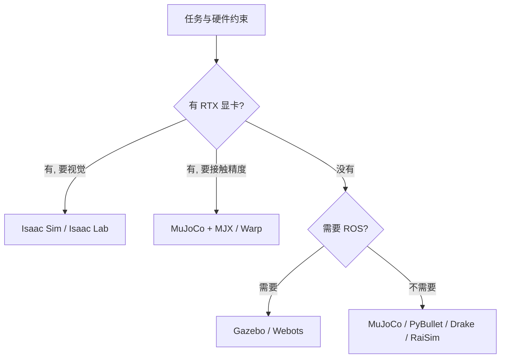
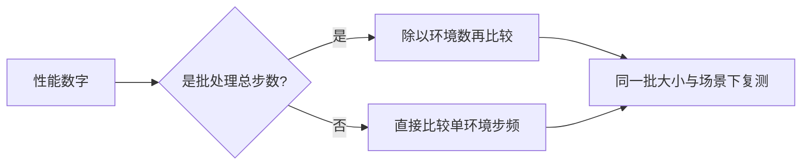

选仿真器时最容易犯的错是拿一张「步每秒」排行榜直接下单。真实的约束条件往往先来自任务之外：手头有没有 NVIDIA 显卡、需不需要 ROS 集成、渲染是不是评价指标的一部分、团队能不能维护一套 Omniverse 环境。这些条件先删掉一批候选，剩下的才轮到物理精度与速度比较。

文中矩阵与性能数字来自知识库素材，本仓库的实际使用情况单独标出。

## 七个选型维度

素材给出的维度有七个：物理保真度、计算速度、渲染质量、可编程性、生态集成、域随机化能力、许可与成本（`05_simulation_environments/README.md`）。

这七项里只有前两项与仿真器本身的技术指标强相关，后五项更多取决于工程条件。举例来说，许可这一项直接把 CoppeliaSim 与 RaiSim 从「随便装一个试试」的候选里划掉，而渲染质量只在视觉策略或数字孪生场景中才是硬指标。

| 维度 | 什么时候成为硬指标 |
| --- | --- |
| 物理保真度 | 接触密集、需要可证明性质 |
| 计算速度 | 大规模策略搜索、在线训练 |
| 渲染质量 | 视觉策略、数字孪生、数据生成 |
| 可编程性 | 需要自定义传感器或求解器接口 |
| 生态集成 | ROS 系统、标准模型格式 |
| 域随机化 | 需要从仿真迁移到真机 |
| 许可与成本 | 商业项目、团队硬件预算 |

## 八款仿真器的核心定位

约束条件的顺序决定候选名单的长度。显卡先把没有设备方案的路线删掉，ROS 需求再把不绑定 ROS 的删掉，剩下的才进入物理精度与速度的比较；MuJoCo 与 Isaac 两系因此覆盖了多数学术与工业场景，Drake、RaiSim、Webots、CoppeliaSim 各自守住一个专门方向（`05_simulation_environments/README.md`）。

## 约束条件的先后顺序

约束之间并不并列，有先后之分：

| 顺序 | 约束 | 结果 |
| --- | --- | --- |
| 一 | 有没有设备方案 | 无 RTX 时 Isaac 系出局 |
| 二 | 要不要绑定 ROS | Gazebo 与 Webots 留下 |
| 三 | 许可能不能接受 | CoppeliaSim 商业版与 RaiSim 专有许可出局 |
| 四 | 接触精度与速度够不够 | 剩下的才进入比较 |

前三条都是非技术条件，只有第四条才是仿真器之间的直接比较（`05_simulation_environments/README.md`）。这也解释了同一张综合矩阵在不同团队里为什么会得出不同结论。

## 定位背后的关键事实

核心定位背后各有事实支撑。素材里与选型最相关的几条是：MuJoCo 的接触求解用凸优化，MJX 在 GPU 或 TPU 上可以做到每秒 65 万到 270 万步，NVIDIA 的 MuJoCo-Warp 又是 MJX 的 152 到 313 倍（`05_simulation_environments/README.md`）。

Isaac Lab 的单卡并行环境数是 4096 到 10000 以上，3.0 版本把物理后端做成可切换，除 PhysX 还能选 Newton 或 MuJoCo Warp（）。PyBullet 的典型速度约每秒一万步，Gazebo 约每秒一千步，Drake 约每秒五千步，RaiSim 约每秒八万步（）。

| 仿真器 | 关键事实 | 代价 |
| --- | --- | --- |
| MuJoCo | 凸优化接触、MJX 可微、安装五分钟 | 无原生 GPU 渲染 |
| Isaac Sim/Lab | 并行环境数最大、渲染最佳 | 强制 RTX、安装约两小时 |
| PyBullet | 一行安装、URDF 兼容最好 | 仅 CPU |
| Gazebo | ROS 绑定最深、传感器最全 | 速度最低 |
| CoppeliaSim | 五引擎可切换、刚柔复合 | 商业版收费 |
| Webots | 预置机器人库最丰富 | 物理引擎单一 |
| Drake | 数学严谨、优化求解器齐全 | 学习曲线最陡 |
| RaiSim | 线性时间铰接体求解 | 专有许可、无 GPU |

## 综合矩阵怎么读

素材的综合矩阵把八款仿真器按十个维度打了星级，其中许可与安装时间是文字而非星级（`05_simulation_environments/README.md`）。读这张表时要注意两点。

第一点是同一款仿真器在不同维度上的星级差距很大，没有哪一列是全能冠军：MuJoCo 的物理保真度与 GPU 并行都是满分，渲染只有两星；Isaac 的渲染与并行是满分，学习曲线只有两星。第二点是矩阵里的 GPU 并行一列把 MJX 与 MuJoCo-Warp 计入 MuJoCo 名下，因此它反映的是生态能力，而不是核心库自带的能力。

## 性能数字的量纲差异

性能参考数据表里并列了几种速度数字，但它们不是同一种量纲（`05_simulation_environments/README.md`）：MuJoCo 的 CPU 数字是单个环境每秒步数，MJX 与 Warp 的数字是批处理下所有环境的总步数，Isaac Lab 的折算标注了星号，说明它随场景复杂度波动很大。

把总步数当成单环境步数去比较，会得出「Isaac Lab 比 PyBullet 快十倍」这种没有意义的结论。正确的比法是先固定批大小与场景，再测墙钟时间。

## 许可与部署成本

许可分布在三个档位上（`05_simulation_environments/README.md`）：Apache 2.0 或 BSD 的开源方案有 MuJoCo、Gazebo、Webots、PyBullet 与 Drake；免费但专有的是 Isaac 系列；CoppeliaSim 教育免费而商业收费，RaiSim 为专有二进制、学术免费。

安装时间也列在同一张表里：MuJoCo 与 PyBullet 约五分钟，Drake 约十分钟，Webots 约十五分钟，CoppeliaSim 与 RaiSim 约二十分钟，Gazebo 约半小时，Isaac 系列约两小时（）。这个数字在容器化部署里会放大——pip 能装的方案写进依赖清单即可复现，需要下载安装包的方案要额外维护镜像。

| 档位 | 仿真器 | 部署影响 |
| --- | --- | --- |
| 开源许可 | MuJoCo、Gazebo、Webots、PyBullet、Drake | 可直接进依赖清单 |
| 免费专有 | Isaac Sim、Isaac Lab | 需要 RTX 与 NVIDIA 账号 |
| 教育免费或学术免费 | CoppeliaSim、RaiSim | 商业使用需确认授权 |

## 本仓库实际用到的组合

这套工程训练与调试用的是 MuJoCo 加 MJX，并通过 MuJoCo-Warp 走 GPU 后端；查看器用 MuJoCo 的原生渲染做实时可视化（`MuJoCo查看器指南.md`）。这条路线对应素材里“足式运动研究、学术 RL”的定位。

同时，工程的参考素材里保留了同一项起身任务在 Isaac Lab 上的实现：它标注了 Isaac Lab 3.0.0、rsl_rl 5.4.2 与 MuJoCo 3.10.0，并把 MuJoCo 用作 Sim-to-Sim 的第二个仿真器（`research/get-up-isaaclab/README.md`）。也就是说，本仓库没有用 Isaac Lab 训练，但用它作为跨仿真器对照的来源。

| 环节 | 本仓库选择 | 素材中的对照 |
| --- | --- | --- |
| 训练物理 | MuJoCo + MJX / Warp | Isaac Lab 3.0 |
| 并行方式 | MJX 批处理加 Warp 后端 | Isaac Lab 单卡 4096 环境 |
| 可视化 | MuJoCo 原生渲染 | Isaac Sim 光线追踪渲染 |
| 跨仿真器 | 未实现 | 参考实现用 MuJoCo 做 Sim-to-Sim |

## 小结

### 核心概念

- 选型先从硬件、生态、许可三类工程条件筛，再比技术指标。
- 七个维度里只有物理保真度与速度强依赖仿真器本身。
- 八款仿真器各有定位，没有全能冠军。
- 综合矩阵中 MuJoCo 与 Isaac 分别在接触与渲染两个方向领先。
- 性能数字的批处理与单环境量纲不能直接比较。
- 本仓库用 MuJoCo 加 MJX 训练，Isaac Lab 只作跨仿真器对照。

### 设计权衡

| 决策 | 选择 | 收益 | 代价 |
| --- | --- | --- | --- |
| 物理后端 | MuJoCo 加 MJX | 接触精度与可微兼顾 | 渲染能力有限 |
| 可视化 | MuJoCo 原生渲染 | 安装简单 | 无照片级画质 |
| 参考实现 | Isaac Lab 对照 | 可做跨仿真器验证 | 需要 RTX 环境 |
| 模型格式 | MJCF | 与训练链路一致 | 跨仿真器需转换 |

## 练习

### 基础题

1. 列出七个选型维度，并指出哪两项强依赖仿真器技术指标。
2. 写出 MuJoCo、Isaac Lab、Gazebo、RaiSim 各自的核心定位。
3. 解释为什么不能直接比较 MJX 与 PyBullet 的每秒步数。

### 挑战题

1. 给定一个没有独立显卡、需要 ROS 集成的项目，给出首选与备选并说明理由。
2. 设计一张适合本团队的三列选型表，说明你删掉了素材矩阵里的哪些维度。
3. 论证把 MuJoCo 与 Isaac Lab 同时纳入项目的成本与收益。

## 附：本页引用的路径

| 路径 | 用途 |
| --- | --- |
| robot_control_simulation/ | 知识库素材根，正文相对路径均相对它 |
| `05_simulation_environments/README.md` | 八个仿真器详解、综合矩阵与性能数据 |
| research/get-up-isaaclab/README.md | Isaac Lab 上的同任务实现与跨仿真器说明 |
| `MuJoCo查看器指南.md` | 本仓库的可视化路线 |
