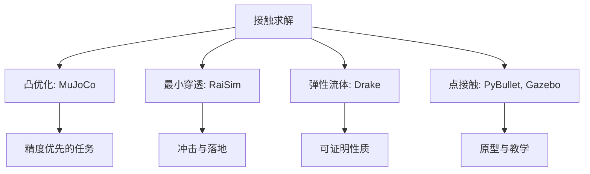
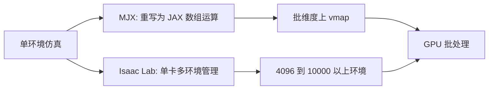

把两款仿真器的速度或精度差异归到“引擎好坏”上没有解释力。实际差异来自两个可以分开讨论的决策：接触点怎么求解，以及成千上万个环境怎么并行。前者决定摔倒、抓取这类场景里算出来的力对不对，后者决定一小时能跑多少步。

这两条路线相互独立，可以组合出四种结果：精度高但只能单环境跑，精度一般但能批处理，两者都强，或者两者都弱。这一页把两条路线分别拆开，再用本仓库的实际配置说明它们在工程里怎么落地。

## 接触求解的三种做法

MuJoCo 采用凸优化的接触求解方案，把接触力求解写成一个带约束的优化问题，素材评价它在密集接触场景下精度领先（`05_simulation_environments/README.md:34`）。这条路线对灵巧手抓取这类大量接触点的任务最有利。

RaiSim 的做法是“最小穿透”接触模型，通过限制渗透深度来减少弹跳伪影（`:258`）。Drake 提供弹性流体动力学接触模型，用面接触与摩擦锥替代传统点接触，更适合需要可证明性质的场合（`:228`）。PyBullet 与 Gazebo 使用传统点接触方案，精度中等（`:119`、`:154`）。

| 方案 | 代表 | 适用 |
| --- | --- | --- |
| 凸优化接触 | MuJoCo | 密集接触、抓取 |
| 最小穿透 | RaiSim | 足式落地冲击 |
| 弹性流体接触 | Drake | 需要理论保证 |
| 点接触 | PyBullet、Gazebo | 一般验证 |

## 并行的两条路径

不依赖 GPU 的仿真器只能在单个环境上一步步推进，典型速度从每秒一千步到每秒八万步不等（`05_simulation_environments/README.md:286-297`）。要把它变成批处理，需要把整条仿真循环写成可并行的函数，这就是 MJX 与 Isaac Lab 各自在做的事。

MJX 把 MuJoCo 的物理计算重写成 JAX 数组操作，因此可以用向量化映射在一个批维度上同时推进所有环境（`:35`）。Isaac Lab 走的是另一条路：单卡直接管理 4096 到 10000 以上的并行环境，物理后端可切换（`:75-76`）。两者都能批处理，区别在于 MJX 与 JAX 生态耦合，Isaac Lab 与 Omniverse 生态耦合。

## Warp 后端与 MJX 的关系

同一套 MuJoCo 物理还可以走 NVIDIA Warp 后端，素材给出的速度是 MJX 的 152 到 313 倍，是目前最快的 MuJoCo 加速方案（`05_simulation_environments/README.md:36`）。本仓库的依赖清单里同时包含 MJX 与 Warp，训练脚本启动时会打印实际使用的后端（`train/train_getup.py:208`）。

需要注意的是这两条后端共享同一份模型定义与大部分接口语义，但不共享实现细节，因此同一个问题的报错信息、内核编译缓存、显存行为都不同。本仓库的冒烟日志里能看到 Warp 的内核缓存目录与计算能力代号（`data/smoke_v23.log:27-33`）。

## Isaac Lab 的并行配置实例

参考素材里同一项起身任务的 Isaac Lab 配置是一个具体的并行例子：场景里环境数是 4096、环境间距 4 米，物理步长两百分之一秒，控制用四次物理步做一次决策，也就是控制频率 50 赫兹（`research/get-up-isaaclab/source_get_up_isaaclab_get_up_isaaclab_tasks_get_up_go2_env_cfg.py:160`、`:228-229`、`:256`）。

训练侧对应的配置是每次迭代每个环境采 24 步，学习率千分之一，两个任务分支分别跑 1000 与 8000 次迭代（`research/get-up-isaaclab/source_get_up_isaaclab_get_up_isaaclab_tasks_get_up_agents_rsl_rl_ppo_cfg.py:16-17`、`:39`、`:51-52`）。

| 项目 | Isaac Lab 参考实现 | 本仓库 MJX 路线 |
| --- | --- | --- |
| 并行环境数 | 4096 | 由显存与批量决定 |
| 物理步长 | 两百分之一秒 | 由模型配置决定 |
| 控制频率 | 50 赫兹 | 0.02 秒控制周期 |
| 每次迭代步数 | 24 | 由训练脚本参数决定 |

## 本仓库的实测约束

批处理并不免费。本仓库在查看器里测过数据搬运的成本：把整个物理数据搬到主机要 1.13 毫秒，而只搬位姿与速度只要 0.02 毫秒，相差五十倍，原因是前者包含了一张六万多行的接触数组（`mjx-go1-getup/sim/view_go1.py:996-998`）。

约束预算也随批处理放大。MuJoCo 的约束行数上限是每个世界独立计算的，本仓库起身环境继承的值是 256，而地形上摔倒时单个世界实测需要约 1300 行（`mjx-go1-getup/docs/status.md:170-174`）。显存同样紧张：八吉字节的卡上默认预留比例会吃掉约六吉字节，剩下的空间不够 Warp 编译内核（`mjx-go1-getup/train/train_getup.py:38-42`）。

评估脚本用 512 个并行环境跑评估，也是同类权衡（`mjx-go1-getup/sim/eval_v19_checkpoint.py:34-36`）。

## 控制频率与物理步长的换算

跨仿真器比较时有一个容易忽略的对齐项：物理步长与决策频率的乘积关系。Isaac Lab 的参考配置用两百分之一秒的物理步长、四次物理步做一次决策，等价于 50 赫兹的控制频率（`research/get-up-isaaclab/source_get_up_isaaclab_get_up_isaaclab_tasks_get_up_go2_env_cfg.py:228-229`）；本仓库的控制周期是 0.02 秒，也是 50 赫兹（`mjx-go1-getup/docs/status.md:93`）。

两边一致是个巧合，也是一条有用的经验：把控制频率对齐之后，同一份策略在两个仿真器上的动作序列才具有可比性。否则看到的差异里混着“决策密度不同”这一项，物理精度的高低根本没法判断。

| 项目 | 物理步长 | 每决策物理步 | 控制频率 |
| --- | --- | --- | --- |
| Isaac Lab 参考实现 | 二百分之一秒 | 4 | 50 赫兹 |
| 本仓库 MJX | 由模型配置决定 | 由环境配置决定 | 50 赫兹 |

换算关系还提醒一件事：物理步长太大会让接触求解失真，太小则吞吐下降；两百分之一秒是本仓库与参考实现共同的选择，可以当作足式任务的起点。

## 两条路线的组合判据

把两条路线合成一个判断表，选型时先问接触是否密集，再问需要多少并行：

| 接触需求 | 并行需求 | 建议 |
| --- | --- | --- |
| 密集接触 | 单环境或小批量 | MuJoCo 原生或 MJX 小批量 |
| 密集接触 | 大规模 | MJX 或 MuJoCo-Warp |
| 一般接触 | 大规模视觉 | Isaac Lab |
| 一般接触 | 单环境验证 | PyBullet、Gazebo |
| 需要理论保证 | 单环境 | Drake |

## 小结

### 核心概念

- 仿真器差异可拆成接触求解与并行架构两条独立路线。
- 接触方案有凸优化、最小穿透、弹性流体与点接触四类。
- MJX 通过把物理重写为数组运算获得批处理能力。
- Isaac Lab 直接管理数千个并行环境，物理后端可切换。
- Warp 后端在 MJX 基础上进一步加速，但实现细节不同。
- 批处理的代价体现在数据搬运、约束预算与显存三处。
- 选型先看接触需求，再看并行规模。

### 设计权衡

| 决策 | 选择 | 收益 | 代价 |
| --- | --- | --- | --- |
| 接触模型 | 凸优化 | 密集接触精度高 | 求解成本高 |
| 并行方式 | GPU 批处理 | 吞吐提升几个数量级 | 显存与约束预算受限 |
| 后端 | MJX 加 Warp | 速度与可微兼顾 | 两套实现细节要分别维护 |
| 数据搬运 | 只搬渲染需要的量 | 快五十倍 | 需要手写搬运代码 |

## 练习

### 基础题

1. 列出四种接触方案及各自的代表仿真器。
2. 说明 MJX 与 Isaac Lab 在并行实现上的差别。
3. 解释为什么搬运整个物理数据比搬运位姿慢五十倍。

### 挑战题

1. 给定一项需要 2048 个并行环境的足式训练，说明约束预算与显存两项约束如何影响实现。
2. 设计一个实验，比较 MJX 与 Warp 后端在同一个起身任务上的墙钟时间与显存占用。
3. 论证把“约束行数上限”做成按任务自适应取值的收益与风险。

## 附：本页引用的路径

| 路径 | 用途 |
| --- | --- |
| robot_control_simulation/ | 知识库素材根 |
| `05_simulation_environments/README.md` | 接触方案、并行能力与性能数据 |
| mjx-go1-getup/ | 本仓库所在仓库根 |
| `sim/view_go1.py` | 数据搬运成本的实测注释 |
| `docs/status.md` | 约束行数实测 |
| `train/train_getup.py` | 显存预留与后端打印 |
| `sim/eval_v19_checkpoint.py` | 评估用的并行环境数 |
| research/get-up-isaaclab/ | Isaac Lab 参考实现的配置 |
