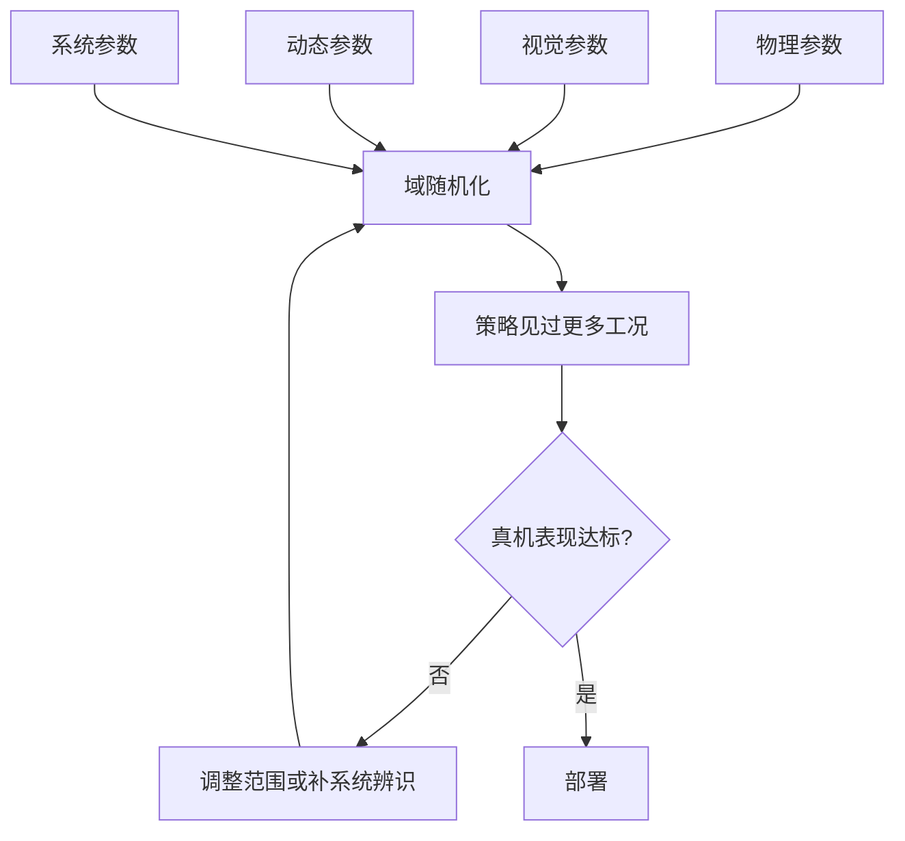
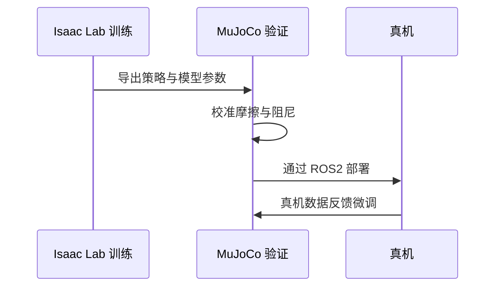

在仿真里训练得再好的策略，搬到真机上也可能立刻失效，原因通常不在策略本身，而在仿真里缺了真实世界的一些变化：摩擦系数不是常数、电机会有响应延迟、地面不平、传感器读数带噪声。域随机化就是在训练时把这些变化显式地随机化，让策略学到的是能覆盖一整族参数的解，而不是只对某一组参数有效的解。

这套思路的成本是训练难度上升：随机化范围越大，策略需要覆盖的工况越多，收敛越慢。范围给多大、哪些参数要随机化，是这一页要讲清楚的问题。

## 随机化要覆盖什么

素材把域随机化的目标写得很直接：让策略在仿真中见过的变化足够覆盖真实世界的不确定性（`05_simulation_environments/README.md:305-307`）。

这句话有两个隐含条件。第一，随机化范围要包含真机的实际取值，否则迁移时仍会遇到没见过的工况；第二，范围不能无边界地放大，否则策略会把容量浪费在几乎不会出现的极端参数上。两端都靠系统辨识或真机测量来定，而不是拍脑袋。

## 各仿真器的内建支持

素材比较了六款仿真器的随机化能力（`05_simulation_environments/README.md:309-318`）：

| 仿真器 | 随机化方式 | 评价 |
| --- | --- | --- |
| Isaac Lab | 事件项系统，可按阶段调度 | 最系统化 |
| MuJoCo | 手动随机化，配 MJX | 灵活但无内建框架 |
| PyBullet | 手动随机化 | 基本，需自行实现 |
| Gazebo | 插件加 ROS 参数服务 | 配置繁琐 |
| CoppeliaSim | 脚本级随机化 | 灵活但门槛高 |
| Drake | 代码级随机化 | 无内建框架 |

差别在于“有没有框架”。Isaac Lab 把随机化做成事件项，可以声明在训练第几个阶段生效、随机化哪些量；MuJoCo 与 Drake 需要自己在环境代码里写随机采样。框架的价值是让随机化配置可复用、可调度，代价是多一层抽象。

## 四类可随机化的参数

素材把随机化参数分成四类（`05_simulation_environments/README.md:320-325`）：物理参数（质量正负一成、摩擦系数区间、阻尼、关节刚度）、视觉参数（纹理、光照、相机位姿、背景、颜色）、动态参数（初始关节角、目标位置、时间步抖动、控制延迟）、系统参数（力矩限制、通信延迟、传感器偏移与噪声）。

这四类的迁移难度依次上升。物理参数只影响动力学，视觉参数影响感知，动态与系统参数把仿真与真机之间的时间关系也改了。实际项目通常先把物理与动态两类做实，再补视觉。

## 渐进式迁移流程

素材给的流程是先做基础随机化，再加视觉随机化，然后分两条路：一条是零样本直接部署，另一条是做系统辨识缩小差距、再用少量真实数据微调（`05_simulation_environments/README.md:327-337`）。

两条路的选择依据是差距大小。当仿真与真机的参数差异可以通过测量解释时，系统辨识加微调见效更快；当差异主要来自感知或接触这类难以建模的部分时，只能靠更宽的随机化换取鲁棒性。

## 本仓库的随机化现场

起身环境的出生姿态随机化是本仓库最典型的一处。出生位置在正负两米的方形范围内均匀采样，姿态四元数用正态采样后归一化，关节角从下界到上界的均匀分布按一个系数与默认姿态做插值（`mjx-go1-getup/envs/go1_getup_v2.py:81-82`、`:196-206`）。

那个插值系数就是课程学习的旋钮：取 1 表示完全随机，取小值表示出生姿态更接近规范站姿，可以从简单阶段逐步过渡到困难阶段（`mjx-go1-getup/envs/go1_getup_v2.py:98-101`）。

走路环境一侧的随机化项目更完整（`mjx-go1-getup/envs/go1_walk.py:376-398`）：出生点范围、随机朝向、出生高度偏移、出生速度、周期性外力推挤、以及观测噪声的五项幅值，其中推挤与观测噪声默认关闭，观测噪声按线性速度、角速度、重力方向、关节位置与关节速度分别给出幅值。观测噪声的生成方式与参考实现的缩放口径一致，按已缩放的观测量级给出（`:1050-1058`）。

查看器会把每次启动的出生点与原地坡度打印出来，因为固定种子会让每次启动落在同一点，不打印就看不见（`mjx-go1-getup/sim/view_go1.py:821-833`）。

| 随机化项 | 位置 | 默认状态 |
| --- | --- | --- |
| 出生位置与朝向 | 起身环境、走路环境 | 开启（起身） |
| 出生关节角课程 | 起身环境 | 由系数控制 |
| 出生速度 | 走路环境 | 配置项 |
| 外力推挤 | 走路环境 | 默认关闭 |
| 观测噪声 | 走路环境 | 默认关闭 |

## Sim-to-Sim 迁移

跨仿真器迁移本身也有域差距。素材给出四条降低成本的策略：统一模型格式（用 URDF 做中间格式）、用统一接口封装各仿真器、校准摩擦与阻尼、先在 A 仿真器预训练再到 B 微调（`05_simulation_environments/README.md:421-428`）。

本仓库素材里的参考实现正是这条路的例子：同一项起身任务在 Isaac Lab 上训练，再把 MuJoCo 作为第二个仿真器做 Sim-to-Sim 验证，最后经 ROS2 部署到真机（`research/get-up-isaaclab/README.md:15-25`）。

## 随机化与噪声的区别

两个概念常被混在一起。域随机化改的是环境参数或初始条件的分布，每次复位重新采样，属于环境的一部分；观测噪声改的是策略每步看到的输入，环境本身没变。作用点不同，后果也不同：前者让最优策略随采样变化，后者考验策略对输入扰动的容忍度。

本仓库的配置把两者分开：出生点、出生速度、推挤属于环境侧；线性速度、角速度、重力方向、关节位置与速度的噪声属于观测侧（`mjx-go1-getup/envs/go1_walk.py:376-398`）。排查迁移失败时先分清是哪一侧的问题，能少走一半弯路。

| 项目 | 作用点 | 生效时机 |
| --- | --- | --- |
| 域随机化 | 环境参数与初值 | 每次复位 |
| 观测噪声 | 策略输入 | 每步 |

## 迁移失败时的排查顺序

真机或另一个仿真器上表现异常时，按五项顺序排查比乱改参数有效：先确认控制频率与动作语义是否对齐，再看模型参数（质量、摩擦、关节限位）是否一致，然后是接触模型差异，接着是观测噪声与延迟，最后才是判据口径（成功率怎么算）。

顺序的依据是改动成本与影响范围：前两项只需要对齐配置，中间两项可能要改模型文件，最后一项只是统计口径。把口径问题误当成物理差异，会在错误的层面反复调参。

## 小结

### 核心概念

- 域随机化让策略覆盖真实世界参数范围，而不是某一个参数点。
- 随机化范围的两端由系统辨识与真机测量界定。
- Isaac Lab 有事件项框架，MuJoCo 与 Drake 需要手写随机采样。
- 四类参数按物理、视觉、动态、系统递进，迁移难度依次上升。
- 迁移流程有零样本部署与系统辨识加微调两条路。
- 本仓库随机化出生姿态、出生点、推挤与观测噪声。
- Sim-to-Sim 是部署前的第二道验证。

### 设计权衡

| 决策 | 选择 | 收益 | 代价 |
| --- | --- | --- | --- |
| 随机化范围 | 覆盖真机取值 | 迁移成功率高 | 训练收敛慢 |
| 随机化框架 | 事件项或手写 | 可调度或灵活 | 抽象成本或维护成本 |
| 课程系数 | 从规范姿态过渡 | 起步容易 | 需要多阶段训练 |
| 迁移路线 | 零样本或微调 | 快或稳 | 需要真机数据 |

## 练习

### 基础题

1. 说明域随机化的目标与为什么要限制范围。
2. 列出四类随机化参数各包含什么。
3. 写出 Sim-to-Sim 迁移的四条策略。

### 挑战题

1. 给出一份足式起身任务的随机化清单，标明每项的取值范围依据。
2. 设计一个课程系数的三阶段训练计划，并说明每阶段的判据。
3. 论证观测噪声默认关闭的取舍，以及开启后需要观察哪些指标。

## 附：本页引用的路径

| 路径 | 用途 |
| --- | --- |
| robot_control_simulation/ | 知识库素材根 |
| `05_simulation_environments/README.md` | 随机化能力、参数分类与迁移流程 |
| research/get-up-isaaclab/README.md | Sim-to-Sim 与真机部署说明 |
| mjx-go1-getup/ | 本仓库所在仓库根 |
| `envs/go1_getup_v2.py` | 出生姿态随机化与课程系数 |
| `envs/go1_walk.py` | 出生点、推挤与观测噪声配置 |
| `sim/view_go1.py` | 出生点打印 |
