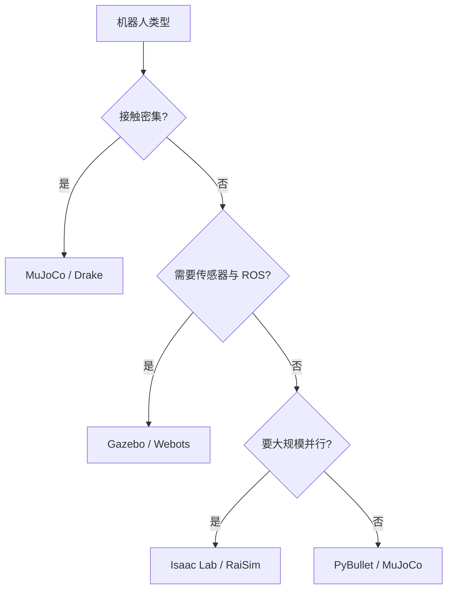
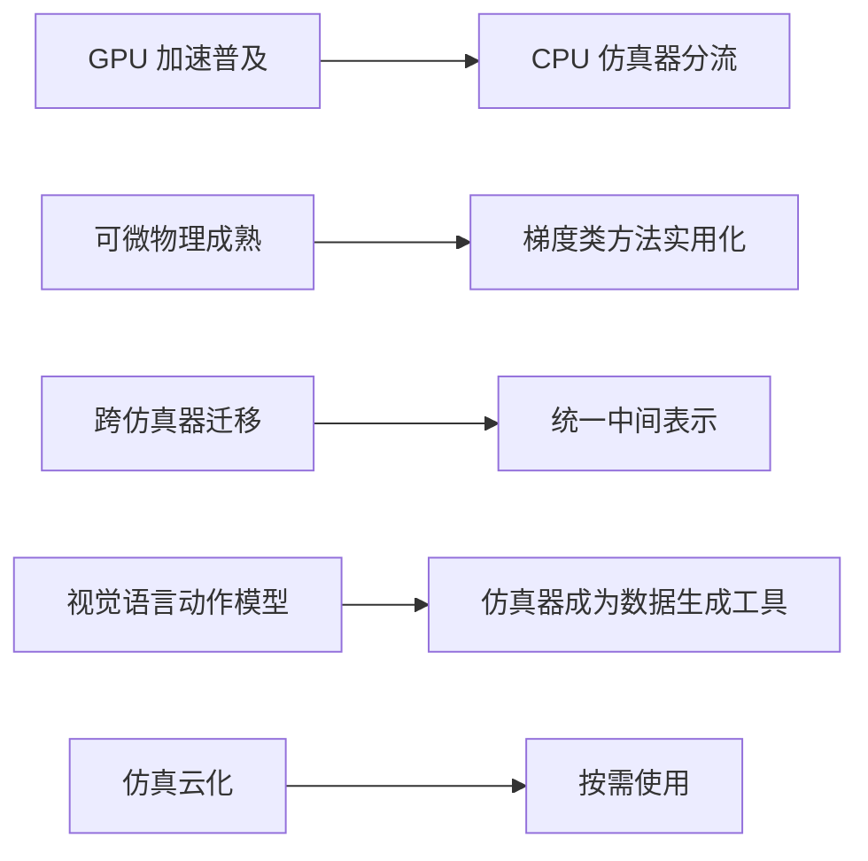

选型表里很少出现“唯一答案”，更常见的是管线：一款仿真器负责大规模训练，另一款负责视觉验证或系统集成，最后经一个统一接口对接真机。把这种搭配画出来，比记某款仿真器的星级更有用。

## 按场景选型

素材的推荐表覆盖十个场景（`05_simulation_environments/README.md:343-356`）：

| 场景 | 首选 | 备选 |
| --- | --- | --- |
| 灵巧操作训练 | MuJoCo / MJX | Isaac Lab |
| 大规模视觉训练 | Isaac Lab | MuJoCo-Warp |
| 足式运动训练 | RaiSim / Isaac Lab | MuJoCo |
| ROS 系统集成 | Gazebo | Webots |
| 快速原型与教学 | PyBullet | MuJoCo |
| 课堂教学 | Webots | PyBullet |
| 轨迹优化 | Drake | MuJoCo（MJX） |
| 数字孪生 | Isaac Sim | CoppeliaSim |
| 刚体加柔体多物理 | CoppeliaSim | Isaac Sim |
| 控制理论验证 | Drake | MuJoCo |

读这张表要注意足式运动那一行的首选与备选。RaiSim 的优势来自线性时间的铰接体求解器与每秒八万步的单环境速度，Isaac Lab 的优势来自数千环境的并行；MuJoCo 被列为备选，而本仓库走的正是这条备选路线，理由是接触精度与 MJX 的批处理能力更契合起身这类接触密集的任务。

## 按机器人类型选型

第二张表按机器人类型给推荐（`05_simulation_environments/README.md:358-368`）：机械臂与灵巧手优先 MuJoCo 或 Drake；四足优先 RaiSim、Isaac Lab 或 MuJoCo；双足与人形优先 Isaac Lab 或 MuJoCo；轮式移动与无人机优先 Gazebo；多机器人系统优先 Gazebo 或 Isaac Sim。

规律是“接触密集的上 MuJoCo 系，感知与系统集成的上 Gazebo 系，规模最大的上 Isaac 系”。四足这一行覆盖了三款，也说明它对仿真器的要求比较宽容。



## 四条典型管线

素材给了四条搭配（`05_simulation_environments/README.md:376-419`）：

管线 A 面向学术研究与灵巧操作，用 MuJoCo 做快速原型与训练，MJX 做可微优化与 GPU 加速，Drake 做轨迹优化与控制理论验证，最后部署到真机。

管线 B 面向大规模视觉与工业场景，Isaac Lab 做训练与域随机化，Isaac Sim 做照片级渲染验证与数字孪生测试，Gazebo 做 ROS 系统集成测试。

管线 C 面向足式运动研究，RaiSim 做大量动力学策略搜索，Isaac Lab 做域随机化与视觉迁移，Gazebo 做系统集成。

管线 D 面向教学与快速原型，PyBullet 验证概念，MuJoCo 做更精确的物理验证，Webots 做跨平台演示。

| 管线 | 组合 | 分工逻辑 |
| --- | --- | --- |
| A | MuJoCo 加 MJX 加 Drake | 训练与理论验证分离 |
| B | Isaac Lab 加 Isaac Sim 加 Gazebo | 训练、视觉、系统集成分离 |
| C | RaiSim 加 Isaac Lab 加 Gazebo | 速度、随机化、集成分离 |
| D | PyBullet 加 MuJoCo 加 Webots | 门槛由低到高 |

## 本仓库的工作流归属

本仓库的实际组合最接近管线 A 去掉 Drake：MuJoCo 加 MJX 负责训练，MuJoCo-Warp 提供 GPU 后端，MuJoCo 原生渲染做查看器，没有引入轨迹优化求解器；参考素材里另有 Isaac Lab 的同任务实现用于跨仿真器对照（`research/get-up-isaaclab/README.md:15-25`）。

与管线 C 相比，本仓库没有用 RaiSim，也没有做 ROS 集成。取舍的理由可以从任务看出来：起身任务的核心难点在接触与判据，而不是动力学求解速度或系统集成，因此把预算放在接触精度与可视化调试上更划算。

## 2026 年的五个方向

素材列了五条趋势（`05_simulation_environments/README.md:432-462`）：GPU 加速从可选项变成标配，传统 CPU 仿真器面临 GPU 化或边缘化；跨仿真器迁移研究兴起，推动统一中间表示；可微物理普及，基于梯度的优化方法开始实用化；视觉语言动作模型把仿真器变成训练数据生成的核心工具；仿真开始云化，出现按需使用的服务形态。

对选型的影响是两方面的：一方面 GPU 后端与可微能力会成为新一轮筛选条件；另一方面“绑定某一个仿真器”的风险在上升，因为跨仿真器迁移正在被标准化。



## 快速入门命令

素材末尾给了七款仿真器的最小命令（`05_simulation_environments/README.md:466-498`），其中 pip 可装的三款可以写进依赖清单直接复现：

```bash
pip install mujoco
python -c "import mujoco; print(mujoco.__version__)"

pip install pybullet
python -c "import pybullet as p; p.connect(p.GUI)"

pip install drake
python -c "import pydrake; print(pydrake.__version__)"
```

Isaac Sim 需要 NVIDIA 账号并安装 Omniverse 环境，Gazebo 与 Webots 有各自的包管理器或安装包，RaiSim 需要下载二进制。这几款的部署成本主要花在环境准备上，不适合放进“五分钟试一下”的流程。

## 选型记录要写什么

选型结论本身过几个月就没人记得理由了，把过程写下来才可复用。一份够用的记录包含五栏：硬件条件、任务场景、候选清单、选中项与理由、被淘汰项与淘汰原因。

最后一栏最容易被省略，也最有价值：它记录了当时被硬件或许可挡掉的方案，下次条件变化时可以直接翻出来重新评估。

| 栏目 | 示例 |
| --- | --- |
| 硬件条件 | 单卡八吉字节显存 |
| 任务场景 | 足式起身、接触密集 |
| 候选清单 | MuJoCo、Isaac Lab、RaiSim |
| 选中理由 | 接触精度与可微批处理 |
| 淘汰原因 | 需要 RTX 环境或专有许可 |

## 小结

### 核心概念

- 场景与机器人类型两张表给出的是首选与备选，不是唯一答案。
- 足式运动对仿真器较宽容，接触密集的任务更适合 MuJoCo 系。
- 四条典型管线都把训练、验证、系统集成拆给不同仿真器。
- 本仓库最接近管线 A 的简化版，没有引入轨迹优化与 ROS。
- GPU 加速与跨仿真器迁移是 2026 年的两条主线。
- pip 可装的三款仿真器部署成本最低。

### 设计权衡

| 决策 | 选择 | 收益 | 代价 |
| --- | --- | --- | --- |
| 管线长度 | 单仿真器或少环节 | 维护简单 | 覆盖不全 |
| 多仿真器搭配 | 各取所长 | 验证更充分 | 迁移成本上升 |
| 后端选择 | GPU 优先 | 吞吐高 | 硬件门槛 |
| 部署形态 | 本地或云端 | 云端免维护 | 数据与网络依赖 |

## 练习

### 基础题

1. 列出四条典型管线各自的组合与分工。
2. 说明本仓库的工作流与哪条管线最接近，差在哪两处。
3. 写出 2026 年五个方向中与选型关系最直接的两个。

### 挑战题

1. 为一个需要 ROS 集成且要训练视觉策略的项目设计混合管线，标明每段用什么。
2. 论证“多仿真器搭配”在什么团队条件下反而增加风险。
3. 设计一份选型记录模板，把硬件条件、场景、候选与最终理由写在一起。

## 附：本页引用的路径

| 路径 | 用途 |
| --- | --- |
| robot_control_simulation/ | 知识库素材根 |
| `05_simulation_environments/README.md` | 场景与机型推荐、四条管线、趋势与命令 |
| research/get-up-isaaclab/README.md | 同任务的跨仿真器实现 |
| mjx-go1-getup/ | 本仓库训练与查看器的实际组合 |
