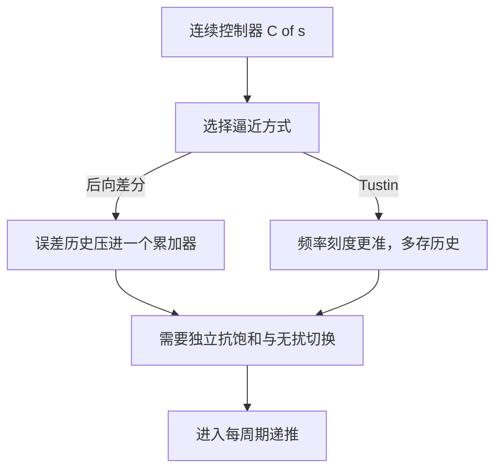
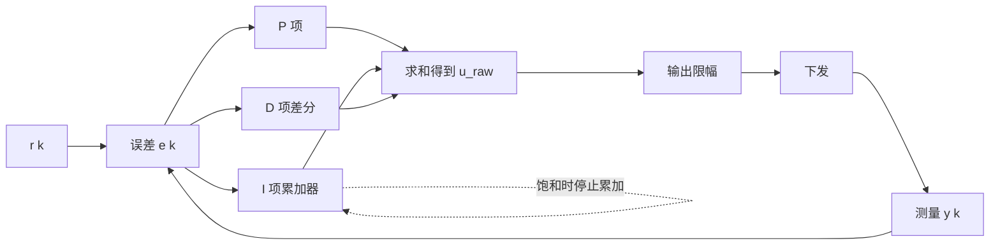

# PID形式与离散化

同一个 PID 控制器在文档与代码里有至少四套写法：连续时域的独立增益形式、工业整定表常用的 ISA 形式、按后向差分离散得到的位置式，以及把输出变化量累加起来的增量式。四套写法描述的控制律相同，参数之间的换算却不都是同向关系：$K_i$ 越大积分越强，$T_i$ 越大积分反而越弱。读整定表、移植别人代码、对照固件实现时，最先出错的就是这一步换算。

这三项在两种形式下的职责与量纲必须逐项固定，ISA 与独立增益的互算、三种离散化逼近对稳定域的影响、位置式与增量式的递推结构都建立在这一步之上。素材仓库 `01_control_theory/pid_control/README.md` 的第 1 节与第 5 节给出两套可运行实现，云台固件里同时存在 `PidBase` 与 `PID` 两个类，两处实现的口径需要对齐。

> 本页对照 `01_control_theory/pid_control/README.md` 第 1 节（`:47-155`）。运行期实现落在云台固件 `PID/PidBase.h` 与 `PID/PID.cpp`，固件侧逐行分析见本站 `06-PID 控制`。

## 三项各自的职责与量纲

连续时域的标准写法是

$$
u(t) = K_p e(t) + K_i \int_0^t e(\tau)\,d\tau + K_d \frac{de(t)}{dt}, \qquad e(t) = r(t) - y(t)
$$

$r$ 是设定值，$y$ 是测量值，$e$ 是两者之差。三项按同一个误差的不同变换线性组合：$K_p$ 直接取当前值，$K_i$ 对历史积分，$K_d$ 对变化率求导。三项各自解决一个问题，也各自带来一类副作用。

| 项 | 作用 | 副作用 | 量纲 |
| --- | --- | --- | --- |
| P | 响应当前误差，缩短上升时间 | 稳态误差消不掉，增益过大产生超调 | 与输出同量纲 |
| I | 累积历史误差，消除稳态误差 | 引入相位滞后，饱和时积分失控 | 输出/(误差·秒) |
| D | 对误差变化率响应，增加阻尼 | 放大高频噪声，设定值跳变时冲击大 | 输出·秒/误差 |

复频域传函把三项并列写成

$$
C(s) = \frac{U(s)}{E(s)} = K_p + \frac{K_i}{s} + K_d s
$$

三个式子的性质可以这样看：$K_p$ 是一段平坦增益，$K_i/s$ 在低频处幅值趋于无穷，$K_d s$ 的幅值随频率线性上升。积分项把系统在低频段的无静差能力提上来，代价是 $-90^\circ$ 的相位滞后；微分项在高频段提供正相位，但增益同时被放大，传感器噪声正好落在这一段。这个幅频形状是后面几篇的公共前提：03 处理积分在饱和区失控，04 处理微分在高频段放大噪声。

## ISA 形式用时间量纲替换增益

工业整定表更常写 ISA 标准形式，把积分与微分写成时间量纲：

$$
C(s) = K_p \left[ 1 + \frac{1}{T_i s} + \frac{T_d s}{1 + \frac{T_d}{N} s} \right]
$$

两种参数可以互换：

| 参数 | 独立增益形式 | ISA 形式 |
| --- | --- | --- |
| 积分强度 | $K_i$ | $T_i = K_p / K_i$ |
| 微分强度 | $K_d$ | $T_d = K_d / K_p$ |
| 微分高频限制 | 无对应项 | $N = 8 \sim 20$ |

换算是除法，所以方向性要记住：$K_i$ 与 $T_i$ 成反比，增大 $T_i$ 等于把积分作用调弱。$K_p$ 同时出现在两处，改 $K_p$ 会连带改变 $T_i$ 与 $T_d$ 对应的实际增益，这一点在按整定表套参数时经常被忽略。微分项多了 $N$ 这个限制：ISA 形式的微分写成一阶环节 $T_d s/(1 + T_d s/N)$，并非纯 $T_d s$ 的写法被收进了这个环节，频率高于 $N/T_d$ 之后增益封顶在 $N$，纯微分的高频放大被削掉。素材 `README.md:86-89` 只给出换算关系，$N$ 的取值范围见 `README.md:489`。

## 从 s 域到 z 域的三种逼近

数字控制器按采样周期 $T_s$ 把 $s$ 映射到 $z$，常用三种逼近：

| 方法 | 逼近式 | 稳定域映射 | 适用 |
| --- | --- | --- | --- |
| 前向差分 | $s \approx (z-1)/T_s$ | 左半平面部分落到单位圆外 | 不推荐 |
| 后向差分 | $s \approx (z-1)/(T_s z)$ | 左半平面完整落入单位圆内 | 常用 |
| Tustin | $s \approx \frac{2}{T_s}\frac{z-1}{z+1}$ | 左半平面精确映射到单位圆内 | 精度最高 |

三者的差别可以直接从映射式看出来。前向差分给出 $z = 1 + T_s s$，左半平面被映成以 1 为圆心、半径 $T_s$ 的圆盘，当 $\mathrm{Re}(s) < -2/T_s$ 时 $|z| > 1$，连续域判稳的系统离散后可能发散，采样周期越大越明显。后向差分给出 $z = 1/(1 - T_s s)$，左半平面映成以 $1/2$ 为圆心、半径 $1/2$ 的圆盘，整个圆盘都在单位圆内，任意采样周期下都不会把稳定判成不稳定，代价是频率刻度被压缩。Tustin 用双线性变换，左半平面正好映到单位圆内部，频率轴在低频段与连续域几乎重合，高频段的频率压缩由预畸变补偿，精度最高但要多存历史量。

采样周期按经验取 $T_s < 0.05\,T_{dominant}$，即主导时间常数的二十分之一以内。这个约束来自相位误差：后向差分的积分项在 $\omega T_s$ 处额外引入 $\arctan(\omega T_s)$ 的滞后，采样越慢，离散控制器与连续设计的偏离越大。

## 位置式的递推与两个附带负担

按后向差分离散化的位置式公式是

$$
u[k] = K_p e[k] + K_i T_s \sum_{j=0}^{k} e[j] + \frac{K_d}{T_s}\left(e[k] - e[k-1]\right)
$$

输出是完整控制量。语义上积分项依赖从 0 到 k 的全部历史误差，工程实现不会真的每步重算这个求和，而是维护一个累加器 $S \mathrel{+}= K_i T_s e[k]$，把全部历史压缩进一个 float。这个做法带来两个负担：

1. 累加器与输出限幅没有耦合。当 $|u_{raw}|$ 已经超过执行器上限，误差仍然同号，累加器会继续增长，退饱和时要把这部分无效量先吐出来，表现为大超调。位置式必须单独设计抗饱和。
2. 控制器从手动切回自动时，输入是绝对量。手动期间累加器停在哪、自动开始时的期望值是多少，两者不一致就会跳变，需要无扰切换把累加器预置到当前输出对应的水平。

## 增量式只依赖最近三个样本

增量式只算控制量的变化量，把 $u[k] - u[k-1]$ 展开：

$$
\begin{aligned}
\Delta u[k] &= K_p (e[k] - e[k-1]) + K_i T_s e[k] + \frac{K_d}{T_s}(e[k] - 2e[k-1] + e[k-2]) \\
u[k] &= u[k-1] + \Delta u[k]
\end{aligned}
$$

推导过程把两个相邻时刻的绝对量相减：P 项变成相邻误差之差，I 项的求和从 0 到 k 减到 0 到 k-1 后只剩 $e[k]$ 一项，D 项从一阶差分变成二阶差分 $e[k] - 2e[k-1] + e[k-2]$。结果是只依赖最近三个样本，不需要独立积分累加器，经典意义上的积分饱和不成立。

代价转移到输出累加器上：`prev_output_` 长期累加，float 有效位数被消耗，长时间运行后会出现静差；执行机构本身还得带积分特性（步进电机、带减速比的电机）才能接受增量指令。两类结构的差异整理如下。

| 特性 | 位置式 | 增量式 |
| --- | --- | --- |
| 依赖样本 | 语义上全部历史误差 | 最近三个误差 |
| 积分饱和 | 需要专门处理 | 无独立积分器 |
| 手动自动切换 | 需要无扰过渡 | 天然连续 |
| 静差 | 积分项消除 | 累加器精度决定 |
| 执行机构 | 通用 | 带积分特性 |

## 素材与固件里的两套实现

素材仓库把两类实现并列给出。`README.md:110-122` 是位置式，`README.md:124-155` 是增量式，后者明确列出增量式无积分饱和、切换冲击小的结论。第 5 节 `README.md:648-788` 的结构体实现采用位置式加条件积分，`README.md:790-894` 的 SimpleFOC 风格实现改用 Tustin 积分。

云台固件里有两套并行的类：

| 实现 | 位置 | 结构 |
| --- | --- | --- |
| `PidBase` | `PID/PidBase.h:29-91` | 位置式，`Calculate` 条件积分、`Calculate_with` 无条件积分 |
| `PID` | `PID/PID.cpp:92-169` | 同时支持位置式与增量式，按 `mode_` 分支 |

`PID::PIDMode` 在 `PID/PID.h:12-15` 定义 `PID_MODE_POSITION` 与 `PID_MODE_INCREMENTAL` 两个枚举值。位置式在 `PID/PID.cpp:119-135`，积分项每周期无条件累加后钳位；增量式在 `PID/PID.cpp:137-169`，输出由 `prev_output_` 加 `delta_output` 得到。增量式里那段抗饱和代码（`PID/PID.cpp:163-166`）只有一个空的条件分支和注释，判断写出来了但分支体是空的，没有实际动作。

`PidBase` 与 `PID` 还有一个容易忽略的差别：`PidBase` 在目标符号翻转时清积分（`PID/PidBase.h:33-35`），`PID` 的位置式没有这个动作。`PID::setSampleTime` 提供了一个换算（`PID/PID.cpp:81-90`）：改动 `dt_` 时按新旧周期之比缩放 `integral_`，保持积分效果不变。这个处理在 `PidBase` 中不存在，它的周期由调用方每次传入。

固件运行期实际调用的是 `PidBase` 体系的派生类，构造函数分布在 `Task/Src/GimbalTask.cpp:27-34` 与 `Task/Src/FireTask.cpp:31-38`。`PID` 类只被 `PID/PID.cpp` 自身包含，当前源码里没有调用点，属于备选实现。角度环、速度环、温度环的逐行分析见 `06-PID 控制`。

## 边界情况与常见误用

| # | 现象 | 成因 | 位置 |
| --- | --- | --- | --- |
| 1 | 照搬整定表后积分方向相反 | 把 $T_i$ 当成积分增益 | `README.md:86-89` |
| 2 | 采样率不足时稳定系统算出发散 | 用前向差分离散化 | `README.md:104` |
| 3 | 长时间运行出现静差 | 认为增量式完全没有饱和风险，忽略累加器漂移 | `README.md:143-145` |
| 4 | 手动转自动时输出跳变 | 位置式不加无扰切换 | `README.md:122` |
| 5 | 增量式阻尼不足 | 微分项用简化写法，注释承认需要 $e[k-2]$ | `PID/PID.cpp:150-153` |
| 6 | 认为两套固件类等价 | `PID` 类在运行期无调用点 | `PID/PID.cpp:92-169` |
| 7 | 改 `dt` 后积分效果突变 | 不知道 `PID::setSampleTime` 会缩放累加器 | `PID/PID.cpp:83-88` |

还有一处属于实现细节：`PID::calculate` 在死区判据内把误差直接置零（`PID/PID.cpp:97-99`），死区内的误差既不进比例项也不进积分累加器，等效于把小于阈值的稳态偏差主动放弃。这个行为在 `PidBase` 中没有，两个类的稳态精度因此不同。

## 小结

### 核心概念

- 连续形式的三项分别是当前误差、历史误差与误差变化率，副作用对应超调、滞后与噪声放大。
- ISA 形式用 $T_i$、$T_d$ 代替 $K_i$、$K_d$，换算关系是除法，$T_i$ 越大积分越弱。
- 前向差分会把左半平面部分映出单位圆，后向差分与 Tustin 都完整落进单位圆，后者频率刻度更准。
- 位置式输出绝对量，语义上依赖全部历史误差，实现上用累加器压缩，必须配抗饱和与无扰切换。
- 增量式只依赖最近三个样本，积分隐含在输出累加里，风险转移到累加器精度。
- 云台固件的运行期实现是 `PidBase`，`PID` 类没有调用点。

### 设计权衡

| 权衡点 | 可选做法 | 收益与代价 |
| --- | --- | --- |
| 离散化 | 后向差分 / Tustin | 后向差分实现短；Tustin 精度高但要多存历史 |
| 形式 | 位置式 / 增量式 | 位置式通用；增量式省积分器但可能漂移 |
| 参数体系 | 独立增益 / ISA | 独立增益直观；ISA 与整定表直接对应 |
| 微分限制 | 纯 $K_d s$ / 带 $N$ 的一阶环节 | 纯微分结构简单；带 $N$ 后高频增益封顶 |
| 周期变更 | 每次传入 / 内部缩放累加器 | 每次传入责任在调用方；内部缩放避免积分效果突变 |

## 练习

基础题

1. 写出 $K_p = 4$、$K_i = 8$ 对应的 $T_i$，并说明把 $T_i$ 从 0.5 s 改成 2 s 时积分作用是变强还是变弱。
2. 后向差分与前向差分的映射式分别把 $s = -200$ rad/s 映到哪个 $z$ 值？取 $T_s = 1$ ms，判断哪一个落在单位圆外。
3. 从位置式公式出发，逐项推导增量式的三个部分，指出积分项为什么只剩 $e[k]$。

挑战题

4. `PID::setSampleTime` 用 `integral_ *= dt / dt_` 保持积分效果。说明这个换算在积分已被钳位到上限时是否仍然成立，并给出一个会失真的场景。
5. 增量式的空抗饱和分支（`PID/PID.cpp:163-166`）如果要补全，判据应当取输出饱和还是增量饱和？写出补充逻辑，并说明与位置式的条件积分有什么区别。
6. 素材第 5 节的 SimpleFOC 风格实现用 Tustin 积分。在同一组参数下，说明它与后向差分的静态积分值是否一致，以及动态响应差异出现在哪个频段。

## 附：本页引用的路径

| 路径 | 用途 |
| --- | --- |
| `~/robot_control_simulation/01_control_theory/pid_control/README.md` | 素材仓库根，第 1 节（`:47-155`）与第 5 节（`:648-894`） |
| `PID/PID.cpp` | 位置式与增量式实现（`:92-169`） |
| `PID/PID.h` | 模式枚举与状态成员（`:12-15`、`:63-87`） |
| `PID/PidBase.h` | 位置式基类与两种积分入口（`:29-91`） |
| `Task/Src/GimbalTask.cpp`、`Task/Src/FireTask.cpp` | 派生类构造与参数（`:27-34`、`:31-38`） |
| `/home/wyx/rm/2026SentriOmeniGimbal/2026OmniSentryGimbal` | 云台固件仓库根，正文路径相对该根 |

