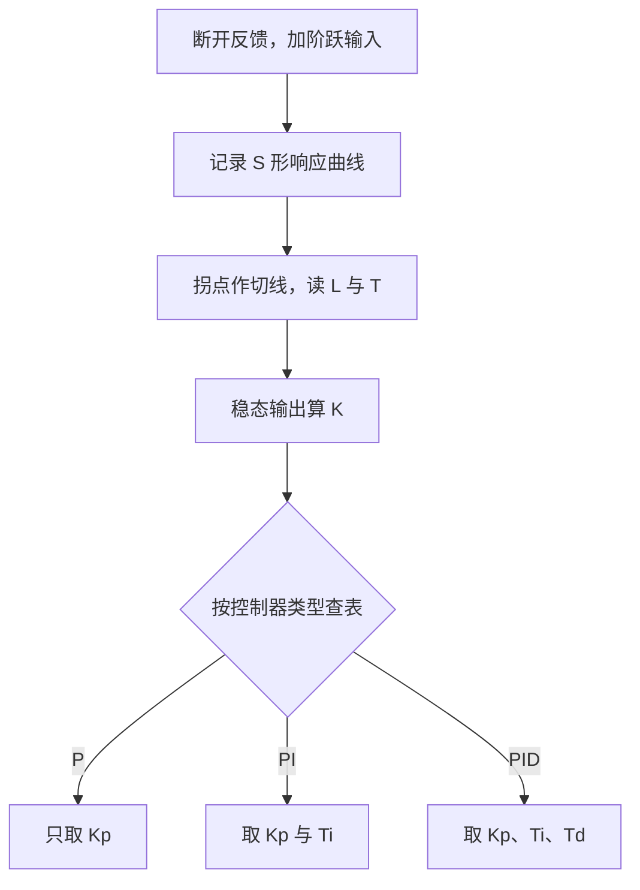
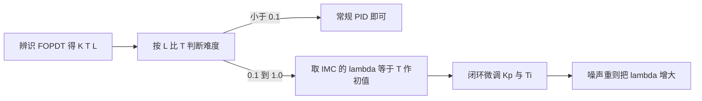
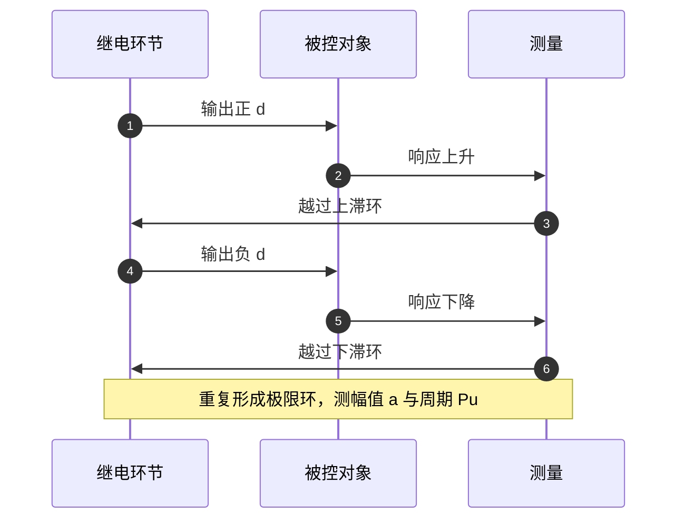

# PID整定方法

整定的输入是参数，输出也是参数，中间那一步才是方法。工程上有五类成体系的整定方法，它们对被测对象的假设不同、允许的操作不同、得到的参数激进程度也不同，选错方法比调错参数更难补救。FOPDT 近似与可控制比是这些方法的公共前提；云台固件里那几组手工参数没有经过任何整定流程，正好用作对照。

素材 `01_control_theory/pid_control/README.md` 第 2 节把五类方法组织成 FOPDT、ZN 开环、ZN 闭环、Cohen-Coon、IMC、Relay 与选型七段，整定表同时给出 ISA 与独立增益两套写法。本页的公式与结论都出自这些小节，云台固件部分引用 `Task/Src/GimbalTask.cpp` 与 `Task/Src/FireTask.cpp` 作对照。

## FOPDT 的三个参数从阶跃响应里读出来

整定先要给被控对象一个可计算的名义模型。工业过程常用一阶加纯滞后近似：

$$
G(s) = \frac{K \cdot e^{-Ls}}{T s + 1}
$$

$K$ 是稳态增益，$T$ 是时间常数，$L$ 是纯滞后。三者由一次开环阶跃响应读出：阶跃幅值 $\Delta u$ 与稳态输出变化 $\Delta y$ 给出

$$
K = \frac{\Delta y}{\Delta u}
$$

响应曲线的拐点处作切线，切线与时间轴的交点给出 $L$，切线的斜率与稳态值决定 $T$。三个量的量纲分别是输出/输入、秒、秒，$K$ 的量纲决定了整定表算出的 $K_p$ 会落到什么数量级，这也是为什么同一套整定表换到不同量纲的反馈上必须重算。

$K$ 的测量精度依赖阶跃幅值：$\Delta u$ 太小时输出变化被噪声淹没，$K$ 会被估偏；$\Delta u$ 太大则可能触发限幅或机械限位，测到的根本不是线性段的响应。素材 `README.md` 把这一点列在 FOPDT 一节末尾。

## 可控制比决定 PID 能达到的上限

把 $L$ 与 $T$ 相除得到的 $L/T$ 称为可控制比，它决定了标准 PID 能走多远：

| $L/T$ | 难度 | 结论 |
| --- | --- | --- |
| < 0.1 | 容易 | 常规 PID 足够 |
| 0.1 ~ 0.3 | 中等 | 常规 PID 可用，注意超调 |
| 0.3 ~ 1.0 | 困难 | PID 效果有限，考虑 Smith 预估或 IMC |
| > 1.0 | 不适用 | 需要模型预测类控制器 |

这个比值的物理含义是纯滞后与控制作用时间尺度的竞争。纯滞后期间执行器已经动作，传感器还看不到任何变化，控制器只能凭历史误差外推。$L$ 接近 $T$ 时，反馈回路在能够观察到响应之前就已经把输出推过头，$K_p$ 一提高就直接振荡，所以 $L/T > 1$ 的对象怎么调都收敛不了，问题不在参数上（`README.md`）。

整定方法据此分成两类：开环法先辨识 FOPDT 再查表，适合过程允许断反馈的场合；闭环法直接在回路里把系统推到振荡边界，适合不允许长时间开环的设备。

## ZN 的开环表与闭环表

开环整定断开反馈，手动加阶跃，从 S 形响应曲线取 $K$、$T$、$L$ 后查表：

| 控制器 | $K_p$ | $T_i$ | $T_d$ |
| --- | --- | --- | --- |
| P | $T/(K L)$ | 无 | 无 |
| PI | $0.9T/(K L)$ | $3.33 L$ | 无 |
| PID | $1.2T/(K L)$ | $2 L$ | $0.5 L$ |

写成独立增益形式后积分与微分项为

$$
K_i = \frac{K_p}{T_i} = \frac{0.6T}{K L^2}, \qquad K_d = K_p T_d = \frac{0.6T}{K}
$$

闭环整定只用比例环节，把 $K_p$ 从小往大调，直到输出出现等幅振荡，记下临界增益 $K_u$ 与临界周期 $P_u$：

| 控制器 | $K_p$ | $T_i$ | $T_d$ |
| --- | --- | --- | --- |
| P | $0.5 K_u$ | 无 | 无 |
| PI | $0.45 K_u$ | $0.85 P_u$ | 无 |
| PID | $0.6 K_u$ | $0.5 P_u$ | $0.125 P_u$ |

对应的独立增益形式是 $K_p = 0.6K_u$、$K_i = 1.2K_u/P_u$、$K_d = 0.075K_u P_u$（`README.md`）。两套表的用途不同：开环表需要模型，闭环表只需要一次临界振荡实验，但实验过程要求设备能被推到振荡，机械系统在这个阶段可能受损，这是 Relay 自整定被广泛采用的原因。两套 ZN 参数的超调量典型都在 50% 左右，只适合建立初始值，不适合直接上机（`README.md`）。

素材 `README.md` 专门把 ZN 开环表换成独立增益写法，因为固件直接用 $K_i$、$K_d$ 传参，查表后不换算就没法填。

## Cohen-Coon 与 IMC 的取舍

Cohen-Coon 同样基于 FOPDT，公式里带 $L/T$ 的一阶修正项，对 $L/T$ 较大的对象比 ZN 响应更快，代价是超调更大（`README.md`）：

| 控制器 | $K_p$ | $T_i$ |
| --- | --- | --- |
| P | $\frac{T}{KL}\left(1 + \frac{L}{3T}\right)$ | 无 |
| PI | $\frac{T}{KL}\left(0.9 + \frac{L}{12T}\right)$ | $\frac{L(30T + 3L)}{9T + 20L}$ |
| PID | $\frac{T}{KL}\left(\frac{4}{3} + \frac{L}{4T}\right)$ | $\frac{L(32T + 6L)}{13T + 8L}$ |

修正项的作用可以直接看出来：$L \to 0$ 时 $K_p$ 回到 $T/(KL)$ 的 ZN 开环值，$L$ 增大时括号内的系数随之上升，用更大的增益补偿滞后。它的适用区间是 $0.1 < L/T < 1.0$，对设定值跟踪要求高的场合比 ZN 合适。

IMC 引入一个设计参数 $\lambda$，物理含义是期望闭环时间常数。PI 与 PID 参数为

$$
K_p = \frac{T + L/2}{K(\lambda + L/2)}, \quad T_i = T + \frac{L}{2}, \quad T_d = \frac{T L}{2T + L}
$$

$\lambda$ 的取值直接决定激进程度：

| $\lambda$ | 特点 | 适用 |
| --- | --- | --- |
| $L/2$ | 最激进，响应最快 | 模型精度高，鲁棒性要求低 |
| $T$ | 平衡点 | 一般推荐 |
| $2T \sim 5T$ | 保守 | 模型不确定大、噪声重 |
| $< L/2$ | 可能不稳定 | 不推荐 |

把 $K_p$ 写成 $(T + L/2)/(K(\lambda + L/2))$ 可以看出 $\lambda$ 只出现在分母：$\lambda$ 增大，$K_p$ 单调下降，闭环变慢也变稳。模型准确时 $\lambda$ 可以取到 $L/2$，模型误差大或测量噪声重时把 $\lambda$ 推到 $2T$ 以上，用响应速度换鲁棒裕度。这就是 IMC 相比 ZN 的实用之处：只有一个旋钮，且旋钮的物理含义明确。

## 继电反馈自整定测出临界点

闭环整定的困难在于把系统推到等幅振荡这一步：手动找 $K_u$ 需要反复试探，试过头就发散。继电反馈的做法是在回路里插入带滞环的继电环节，输出在 $\pm d$ 之间切换，系统自动进入幅值受控的极限环。测得振荡幅值 $a$ 与周期 $P_u$ 后估算临界增益

$$
K_u = \frac{4d}{\pi a}
$$

这个式子是描述函数法的结论：继电环节对正弦输入的等效增益是 $4d/(\pi a)$，极限环意味着这个等效增益正好等于被控对象在振荡频率处的临界增益。再用 ZN 闭环表或 Tyreus-Luyben 修正表求参数：

| 控制器 | $K_p$ | $T_i$ | $T_d$ |
| --- | --- | --- | --- |
| PI | $0.31 K_u$ | $2.2 P_u$ | 无 |
| PID | $0.45 K_u$ | $2.0 P_u$ | $0.42 P_u$ |

Tyreus-Luyben 的增益比 ZN 小、积分时间比 ZN 长，得到的是稳态裕度更大的参数。振荡振幅由 $d$ 控制，取 $d$ 小一些就能把极限环压在安全范围内，所以 Relay 比 ZN 闭环安全，这也是现代工业 PID 自整定模块的通用做法（`README.md`）。

## 五类方法的选择与组合

| 方法 | 需要模型 | 开环或闭环 | 超调 | 场景 |
| --- | --- | --- | --- | --- |
| ZN 开环 | FOPDT | 开环 | 较大 | 初始调参 |
| ZN 闭环 | 无 | 闭环 | 较大 | 允许振荡 |
| Cohen-Coon | FOPDT | 开环 | 大 | $L/T$ 大 |
| IMC | FOPDT | 开环 | 可控 | 通用推荐 |
| Relay | 无 | 闭环 | 可控 | 自整定模块 |
| 手工试凑 | 无 | 闭环 | 灵活 | 经验与在线微调 |

推荐的流程是先测开环阶跃辨识 FOPDT，用 IMC 取 $\lambda = T$ 作为初值，再闭环微调，模型不确定大时改用 Relay 拿更准确的 $K_u$、$P_u$（`README.md`）。微调的方向可以量化：增大 $K_p$ 加快响应，增大 $T_i$（等于减小 $K_i$）减少超调，增大 $T_d$ 增加阻尼。

整定方法解决的是初值问题，现场微调解决的是模型误差与噪声问题，两者不能互相替代。素材给的五类方法都没有把执行器饱和、采样周期抖动、传感器延迟纳入模型，这几项要么在实现层处理，要么靠微调兜住。

## 云台固件里的四组手工参数

云台固件没有实现任何自动整定或辨识流程，参数全部在任务构造函数里写死。`Task/Src/GimbalTask.cpp` 给出四组：

| 环路 | Kp | Ki | Kd | maxOut | maxIout | 位置 |
| --- | --- | --- | --- | --- | --- | --- |
| Yaw 角度环 | 60.0 | 0.000 | 0.3 | 200000.0 | 180.0 | `GimbalTask.cpp` |
| Yaw 速度环 | 20.0 | 0.0 | 0.000 | 1000000.0 | 20000.0 |—|
| Pitch 角度环 | 1.0 | 0.1 | 0.01 | 10000.0 | 5000.0 |—|
| Pitch 速度环 | 40.0 | 0.0 | 0.0 | 30000.0 | 20000.0 |—|

注释 `GimbalTask.cpp` 写「调整参数以减少抖动：减小 KP，增加 KD，添加小的 KI」，这几个值来自在线试凑，源码里没有任何整定记录，按经验法则反推不出对应的 FOPDT（属推断，待整定记录补充）。两个速度环的 $K_i$ 都是 0，退化成纯 P 控制，稳态误差只能由角度外环的积分承担。这个分工在本工程里是有意的：速度内环的反馈来自陀螺仪差分，噪声重，加积分容易把噪声积进输出。

同一目录的 `Task/Src/FireTask.cpp` 另有四个速度环实例，$K_i$ 取 0.11、0.11、0.01 与 0.5。摩擦轮与拨弹盘对转速精度要求高，速度环带积分；云台的两个速度环对抖动更敏感，所以走了另一条路线。两组参数放在一起可以看出，固件的整定口径是按被控对象分别定的，没有全局统一。`GimbalTask.cpp` 还把 Pitch 角度环的 `maxIntegral` 从构造参数 5000 直接改成 1000，运行期唯一一次钳位收紧。

参数与实际周期还有一处错位：`GimbalTask.cpp` 声明 `dt = 0.001f`，循环尾却是 `osDelay(2)`；`FireTask.cpp` 用 `0.01f` 传参，循环尾是 `osDelay(1)`。积分与微分都按声明值计算，实际动作间隔约为一到两倍，等效于把 $K_i$、$K_d$ 同时改了比例。这一项属于真实缺陷，不是整定方法的误差。

## 套用整定表时的误用

| # | 现象 | 成因 | 位置 |
| --- | --- | --- | --- |
| 1 | 稳态增益估不准 | 阶跃幅值取太小，噪声淹没有用响应 | `README.md` |
| 2 | 上机即触发机械限位 | 直接用 ZN 开环结果，超调约 50% | `README.md` |
| 3 | 积分作用方向相反 | 把 $T_i$ 当成 $K_i$ 代入 | `README.md` |
| 4 | 怎么调都振荡 | $L/T > 1$ 仍硬调 PID，方法本身失效 | `README.md` |
| 5 | 稳态误差只能靠外环消 | 速度环 $K_i = 0$ 长期不补 | `GimbalTask.cpp` |
| 6 | 改参数后无法复现 | 没有记录工况与响应 | 源码无整定记录 |
| 7 | 积分与微分的时间尺度错位 | 声明周期与循环周期不一致 | `GimbalTask.cpp` |

整定表里的 $K_p$ 与误差、输出的量纲绑定。把一张按角度误差整定的表直接套到按转速或电流的反馈上，量纲一变数值就失去意义。固件四组参数的 `maxOut` 从 10 000 跨到 200 000，正是输出落到不同物理量上的结果。

## 小结

### 核心概念

- 整定的前提是知道对象的名义模型，FOPDT 的 $K$、$T$、$L$ 由一次开环阶跃读出。
- $L/T$ 决定控制难度，超过 0.3 常规 PID 效果有限，超过 1.0 方法本身失效。
- ZN 开环与闭环都追求快，超调约 50%，适合建立初值而非直接上机。
- Cohen-Coon 用 $L/T$ 修正项加快 $L/T$ 较大的对象，超调比 ZN 更大。
- IMC 用 $\lambda$ 统管鲁棒性与速度，$\lambda = T$ 是一般初值。
- Relay 自整定在幅值受控的极限环里测 $K_u$，$K_u = 4d/(\pi a)$，比 ZN 闭环安全。
- 云台固件采用手工试凑，两个速度环退化为纯 P，积分由角度环承担。

### 设计权衡

| 权衡点 | 可选做法 | 收益与代价 |
| --- | --- | --- |
| 整定输入 | FOPDT 模型 / 现场试凑 | 模型法可复现；试凑快但不可复现 |
| 超调取舍 | ZN 快 / IMC 稳 | ZN 建立时间短；IMC 超调可控 |
| 积分分配 | 内外环都加 / 只外环加 | 只外环加实现简单，静差消除变慢 |
| 自整定 | 手动 / Relay | 手动无需额外逻辑；Relay 要处理振荡风险 |
| 参数记录 | 只留代码 / 同时记工况 | 只留代码省事；记工况才能复现与回退 |

## 练习

基础题

1. 从 S 形响应读出 $K = 2$、$T = 0.8$ s、$L = 0.1$ s，计算 $L/T$ 并判断用常规 PID 是否合适。
2. 用 ZN 开环 PID 表算出 $K_p$、$T_i$、$T_d$，再换算成独立增益 $K_i$、$K_d$，写出每一步的公式。
3. 继电环节输出 $\pm 0.4$，测得振荡幅值 $a = 0.25$，求 $K_u$；再按 ZN 闭环 PID 表写出 $K_p$。

挑战题

4. 云台 `GimbalTask.cpp` 的 `dt = 0.001f` 与实际 `osDelay(2)` 不一致。说明在 $K_i$、$K_d$ 不变的前提下，实际积分与微分作用各被放大了多少倍，并给出两种修正方案。
5. 摩擦轮速度环（`FireTask.cpp`）取 $K_i = 0.11$，云台速度环取 $K_i = 0$。从反馈信号噪声与积分滞后的角度解释这个差别，并说明云台速度环如果补上积分需要注意什么。
6. 素材推荐的流程是 IMC 取初值后再 Relay 修正。说明当 $L/T$ 落到 0.5 附近时，两步的先后顺序是否需要调整，以及为什么。

## 附：本页引用的路径

| 路径 | 用途 |
| --- | --- |
| `~/robot_control_simulation/01_control_theory/pid_control/README.md` | 素材仓库根，第 2 节 |
| `Task/Src/GimbalTask.cpp` | 四组手工整定参数、注释与运行期钳位 |
| `Task/Src/FireTask.cpp` | 四个速度环实例与周期 |
| `docs/06-PID 控制/04-串级与积分限幅/04-本项目串级实例.md` | 串级参数与整定顺序的固件侧展开 |
| `/home/wyx/rm/2026SentriOmeniGimbal/2026OmniSentryGimbal` | 云台固件仓库根，正文路径相对该根 |

