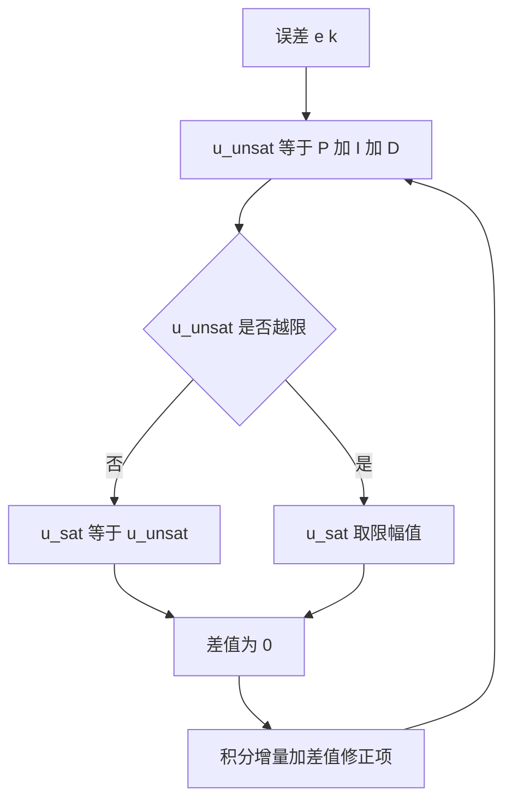
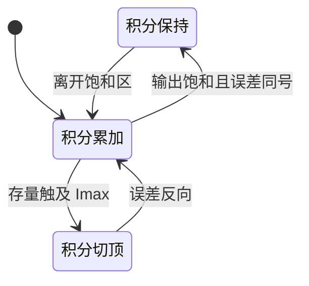

# 抗积分饱和

执行器有物理上限，积分项没有。当输出已经顶到上限、误差仍然同号时，积分累加器继续按 $K_i e \Delta t$ 增长，这部分量在任何时刻都不会被执行器用到。等误差换号，控制器必须先把这些无效量卸掉才能开始反向动作，表现为大超调和恢复慢。抗饱和要解决的就是让积分只记录执行器实际能用到的部分。

三类对策作用在不同环节：条件积分与积分钳位改的是积分累加本身，反计算改的是积分项之外的反馈路径，各自需要新增的参数也不同。位置式与增量式的结构差异见 `01-PID形式与离散化`，固件侧逐行对照见 `06-PID 控制/04-串级与积分限幅`。

> 本页对照 `01_control_theory/pid_control/README.md` 第 3.3 节与第 5 节。

## 饱和期间积分项做的是无效功

控制器原始输出由三项相加：

$$
u_{raw} = K_p e + K_i \int e \, dt + K_d \frac{de}{dt}
$$

执行器只能接受有限幅值，实际下发量是

$$
u = sat(u_{raw}, -u_{max}, u_{max})
$$

饱和区间内 $u_{raw}$ 与 $u$ 不相等，差值是执行器拒绝掉的部分。积分项按未饱和量计算，所以它记录的是控制器内部的意愿，不是执行器的实际动作。这个脱节有两层后果：饱和越深、持续时间越长，累积的无效量越大；退出饱和后这部分量要按 $-K_i e \Delta t$ 的速率逆向消化，消化期间输出维持在正向限幅上，系统看起来像卡住了。

用一个小例子量化：$K_i = 0.2$、误差恒为 2、$\Delta t = 1$ ms，输出到限后积分每秒增加 $0.2 \times 2 \times 1000 = 400$，限幅值是 4500 时，十几秒就能把积分堆到与输出同量级。恢复阶段误差反向，积分要以同样速率回落，这段时间执行器拿不到有效的反向指令。

## 发散的充要条件

设误差恒定、采样周期 $\Delta t$，积分递推为

$$
I_k = I_{k-1} + K_i e \, \Delta t
$$

只要 $K_i e$ 非零，$I$ 就单调增长，增长速率是 $|K_i e|$。发散需要两项同时成立：

$$
| u_{raw} | \ge u_{max} \quad \text{且} \quad sign(u_{raw}) = sign(e)
$$

第一项说明已经到限，第二项说明误差还在把积分往限外推。两项符号相反时，误差产生的积分增量会把累加器拉回可执行区间，不需要额外干预。这个判据也解释了为什么只看总输出的条件积分比只看比例项的更强：比例项符号与误差一致时，$u_{raw}$ 的符号主要由 P 项决定，用它判饱和与用总输出判饱和在多数工况下等价，但在积分存量很大时两者会分叉，只看 P+D 的判据会把由积分主导的饱和漏过去。

## 条件积分：饱和时暂停累加

条件积分在饱和时暂停累加：

$$
| u_{raw} | < u_{max} \Rightarrow I_k = I_{k-1} + K_i e \, \Delta t
$$

否则 $I_k = I_{k-1}$。实现上只要一个 `if`，代价是饱和期间积分停滞，退出饱和后的补偿变慢。素材 `README.md` 给出两种判据写法，一种用误差阈值，一种用输出与符号：

```c
if ((u >= u_max && error > 0) || (u <= u_min && error < 0)) {
 /* 输出饱和且误差同号，跳过本次累加 */
} else {
 integrator += Ki * Ts * error;
}
```

第二种写法与前面推出的发散条件一一对应：$u$ 到正向限且误差为正，或者到负向限且误差为负，两种情况都跳过。素材第 5.1 节的结构体实现（`README.md`）把条件判断与积分钳位并排放在一个函数里，条件积分负责拦增量，钳位负责兜住存量。

判据取哪一路信号决定了能拦住什么。取总输出 $u_{raw}$ 时，只要输出越限就停积分，包含积分自己推出来的饱和；取 P+D（云台固件用的是这一路）时，积分存量已经很大、P+D 还没到限的情况下不会停积分，这时只能靠积分钳位兜底。两者的差别在覆盖范围，不在实现精度。

## 反计算：把饱和差反馈回积分入口

反计算把饱和前后的差值反馈到积分输入端：

$$
\dot{I} = \frac{K_p}{T_i} e(t) + \frac{1}{T_t} (u_{sat} - u_{unsat})
$$

第二项在饱和时非零，$u_{sat} - u_{unsat}$ 的符号与超出的方向相反，对积分起卸荷作用；未饱和时差值为 0，积分退回纯反馈形式。跟踪时间常数 $T_t$ 的推荐取值是

$$
T_t = \sqrt{T_i \cdot T_d} \quad \text{或} \quad T_t = T_i / 2
$$

$T_t$ 决定了卸荷速度：取值小，积分被快速拉回，边界平滑但可能把正常的积分作用也削掉，稳态误差回得慢；取值大，卸荷不足，行为接近条件积分。素材 `README.md` 给出这两个推荐值。

离散实现是先算未饱和输出，再限幅，最后用差值修正积分（`README.md`）：

```c
float u_unsat = kp * error + integrator + kd * derivative;
float u_sat = clamp(u_unsat, u_min, u_max);
integrator += (ki * Ts * error) + (Ts / Tt) * (u_sat - u_unsat);
```



反计算是三类对策里唯一在边界上平滑的一种，代价是引入一个需要整定的 $T_t$，并且要求实现里能同时拿到饱和前后的两个值。云台固件没有采用，结构里没有区分 $u_{unsat}$ 与 $u_{sat}$（属推断，全仓未出现反计算修正项）。

## 积分钳位：给累加器单独的上界

积分钳位直接限制累加器的幅值：

$$
I_k = clamp\left(I_{k-1} + K_i e \, \Delta t, -I_{max}, I_{max}\right)
$$

$I_{max}$ 与 $u_{max}$ 是两个量。$I_{max}$ 远大于 $u_{max}$ 时这项退化成只有输出限幅，积分仍能涨到远超输出的量级；$I_{max}$ 取得贴近 $u_{max}$，退饱和后的恢复快，但正常工况下积分也会被频繁切顶，稳态误差消不掉。合理取值让积分单独占用输出预算的一个固定份额，素材 `README.md` 给出的估算式是 $u_{max} - K_p e_{max} - K_d \dot{e}_{max}$，含义是输出上限扣掉比例与微分可能占用的最大份额，剩下的留给积分。

钳位与条件积分解决的是两个不同阶段的量：条件积分拦的是每周期新增的增量，钳位管的是已经存下来的存量。只做钳位时，增量照加，靠切顶把总量压住，输出在限幅上的停留时间不变；只做条件积分时，存量没有独立上界，由条件判据间接限制。两者组合才同时约束增量与存量，这也是素材的推荐组合（`README.md`）。

## 三类对策的作用位置与组合

| 方法 | 实现难度 | 额外参数 | 边界行为 | 适用 |
| --- | --- | --- | --- | --- |
| 条件积分 | 低 | 无 | 累加动作跳变 | 通用第一道防线 |
| 反计算 | 中 | $T_t$ | 平滑 | 性能要求高 |
| 积分钳位 | 低 | $I_{max}$ | 到达上限后停滞 | 与条件积分组合 |

三类方法作用在积分量的不同环节：条件积分控制增量，反计算同时控制增量与存量并带平滑过渡，积分钳位只控制存量。它们可以并存，素材推荐的是条件积分加积分钳位为主，高要求场合再叠反计算（`README.md`）。



三条边的语义需要分清：进入 Hold 由输出饱和触发，进入 Limit 由存量到顶触发，退出 Hold 与退出 Limit 分别由饱和消失与误差反向触发。一个工况下可能同时满足两条，实现里通常写成先判饱和再加、最后钳位的顺序，让两个条件各自生效。

## 固件里六处分散的抗饱和写法

素材仓库第 3.3 节用 `README.md` 讲透三类方法，第 5.1 节 `README.md` 的结构体示例把条件判断与积分钳位并排，第 5.2 节 `README.md` 的 SimpleFOC 风格实现只做无条件累加后钳位。

云台固件没有统一的抗饱和模块，六处写法分散在不同文件里：

| 策略 | 落点 | 条件 |
| --- | --- | --- |
| 条件积分 | `PID/PidBase.h` | `abs(Kp·e + Kd·de/dt) < maxOutput` |
| 无条件积分加钳位 | `PID/PidBase.h` | 每周期累加后 `clamp(integral, ±maxIntegral)` |
| 条件积分加分支钳位 | `PID/Src/speed_pid.cpp` | 同基类判据，钳位写成 `if` |
| 积分下限 0 | `PID/Src/temp_pid.cpp` | 加热器不能制冷，负积分无意义 |
| 反向清积分 | `PID/PidBase.h` | 目标符号翻转时直接清累加器 |
| 外部清零 | `Task/Src/GimbalTask.cpp` | 俯仰角越限时直接写 `integral = 0` |

`PidBase::Calculate` 的判据只看比例与微分两项，积分驱动的饱和不在判据内，靠 `maxIntegral` 兜底。俯仰外环用的 `Calculate_with` 连条件都不判，完全依赖 `maxIntegral`（`PID/PidBase.h`）。俯仰外环的 `maxIntegral` 在任务里被从构造参数 5000 改成 1000（`GimbalTask.cpp`），这是运行期唯一的钳位收紧点。

反向清积分（`PID/PidBase.h`）严格说不属于抗饱和，它处理的是目标换向时正负两段积分互相抵消的不对称问题，但动作上等于把存量一次性扔掉，效果与最强的一档钳位相同。这一行与外部清零一样，绕过了增量与存量两个环节的配合，容易在换向瞬间引入输出阶跃。

反计算法在固件中未使用（属推断：全仓未出现反计算修正项）。若要引入，可在 `PidBase::Calculate` 的 `output += integral` 与末次 `clamp` 之间补一行差值修正，但需要先把未饱和输出单独保存下来。固件侧的完整逐行对照在 `06-PID 控制/04-串级与积分限幅/02-积分饱和与抗饱和策略.md`。

## 误用与边界情况

| # | 现象 | 成因 | 位置 |
| --- | --- | --- | --- |
| 1 | 积分驱动的饱和漏过判据 | 以为条件积分看总输出，实际判据只含 P+D | `PID/PidBase.h` |
| 2 | 积分压过全部输出预算 | $I_{max}$ 与 $u_{max}$ 量级错配 | `PID/PidBase.h` |
| 3 | 退饱和后长时间超调 | 只做输出限幅不做积分钳位 | `PID/PidBase.h` |
| 4 | 稳态误差回不来 | 反计算 $T_t$ 取得过小，积分被连续削掉 | `README.md` |
| 5 | 加热等待时间变长 | 温控积分下限写成负值 | `PID/Src/temp_pid.cpp` |
| 6 | 换向瞬间输出阶跃 | 反向清积分或外部清零绕过状态复位 | `PID/PidBase.h`、`GimbalTask.cpp` |
| 7 | 外部清零后微分出现尖峰 | 只写 `integral`，`prevError` 没跟着复位 | `GimbalTask.cpp` |

第 7 条需要展开：外部清零只动积分，下一次计算时 `prevError` 仍是清零前保存的值，微分项变成 $K_d (e[k] - e[k-1])/\Delta t$，其中 $e[k-1]$ 是旧工况下的误差。跨限幅瞬间误差本身也很大，两项叠加直接进入输出。要消掉这个尖峰，清零时应当连错差历史一起复位，或者走封装好的 `Clear()`。

## 小结

### 核心概念

- 积分饱和的发散条件是输出到限且误差与输出同号，积分以 $|K_i e|$ 的速率增长。
- 条件积分在饱和时暂停累加，实现简单，边界不平滑，覆盖范围取决于判据取总输出还是取 P+D。
- 反计算用饱和差修正积分，靠 $T_t$ 调节卸荷速度，边界平滑，需要额外一个整定参数。
- 积分钳位给积分独立上界，需与输出限幅协调量级，管的是存量而不是增量。
- 云台固件用条件积分与积分钳位组合，另有反向清积分与外部清零两处旁路，反计算未采用。

### 设计权衡

| 权衡点 | 可选做法 | 收益与代价 |
| --- | --- | --- |
| 饱和判据 | 取总输出 / 取 P+D | 取总输出覆盖更全；取 P+D 实现短，需钳位兜底 |
| 恢复速度 | 反计算 / 纯钳位 | 反计算平滑；纯钳位实现最简单 |
| 积分上限 | 贴近 $u_{max}$ / 留裕度 | 贴近响应快但风险高；留裕度安全但补偿慢 |
| 清零时机 | 反向自动清 / 外部强制清 | 自动一致；强制清绕过封装，状态不同步 |
| 参数数量 | 只用 $I_{max}$ / 再加 $T_t$ | 一个参数好维护；两个参数换来边界平滑 |

## 练习

基础题

1. 写出积分发散的充要条件，并说明为什么只看总输出的条件积分比只看 P+D 的判据覆盖更全。
2. $K_i = 0.2$、误差恒为 2、$\Delta t = 1$ ms，计算积分每秒的增长量；若 $u_{max} = 4500$，估算从零堆到与输出同量级需要多久。
3. 说明反计算的差值项在未饱和时为什么自动为零，并写出 $T_t = T_i/2$ 时该项的系数。

挑战题

4. 素材给的 $I_{max}$ 估算式是 $u_{max} - K_p e_{max} - K_d \dot{e}_{max}$。代入俯仰外环的 $u_{max} = 10000$ 与运行期实际使用的 `maxIntegral = 1000`（`GimbalTask.cpp`），说明这个钳位相对估算式是宽还是紧。
5. 俯仰外环用 `Calculate_with`（`PID/PidBase.h`），条件积分完全不生效。结合角度越限时外部清零的动作（`GimbalTask.cpp`），分析这一组合是否等价于条件积分，并指出差别出现的工况。
6. 若要给 `PidBase` 加入反计算，需要改动 `Calculate` 的哪几行？写出改写后的顺序，并说明 `Calculate_with` 是否也要同步改。

## 附：本页引用的路径

| 路径 | 用途 |
| --- | --- |
| `~/robot_control_simulation/01_control_theory/pid_control/README.md` | 素材仓库根，第 3.3 节与第 5 节 |
| `PID/PidBase.h` | 条件积分、积分钳位、反向清积分、反计算缺席 |
| `PID/Src/speed_pid.cpp` | 误差限幅后的条件积分与分支钳位 |
| `PID/Src/temp_pid.cpp` | 积分下限 0 的单向积分 |
| `Task/Src/GimbalTask.cpp` | 外部清零与钳位收紧 |
| `docs/06-PID 控制/04-串级与积分限幅/02-积分饱和与抗饱和策略.md` | 固件侧逐行对照 |
| `/home/wyx/rm/2026SentriOmeniGimbal/2026OmniSentryGimbal` | 云台固件仓库根，正文路径相对该根 |


