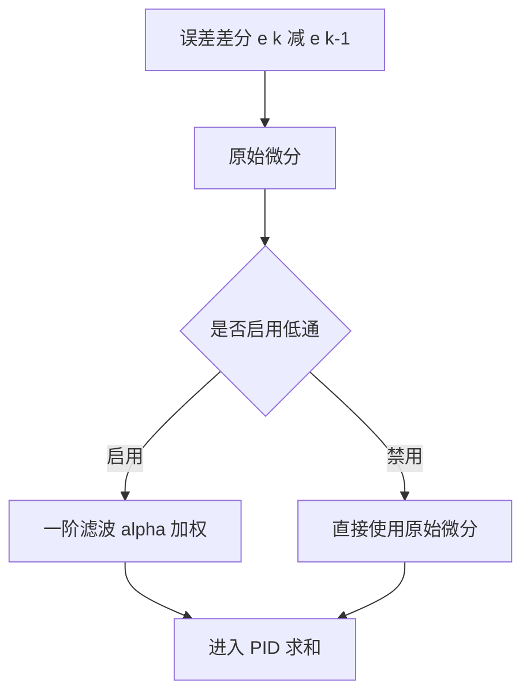
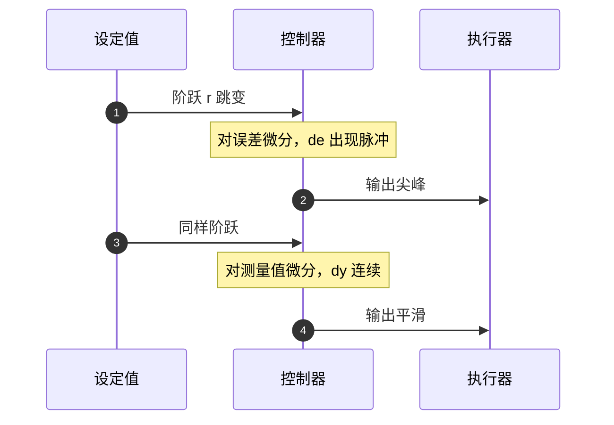

# 微分滤波与设定值处理

微分项给系统加阻尼，代价是把高频成分按频率线性放大。传感器噪声、编码器量化、测速差分都集中在高频段，理想微分在实机上不可用。另一个独立的问题是设定值阶跃：误差 $e = r - y$ 在阶跃瞬间跳变，理想的 $de/dt$ 是冲激，输出会出现一次与冲击等价的尖峰。

两类问题来自两个不同的源头，改法也不同：低通滤波压的是测量链路里的高频噪声，对测量值微分去掉的是设定值跳变引入的脉冲。云台固件里有四处微分写法，另有 `Clear()` 之后那一次异常微分，可用作对照。积分与饱和见 `03-抗积分饱和`，固件侧逐行推导见 `06-PID 控制/04-串级与积分限幅/03-PidBase实现逐行.md`。

> 本页对照 `01_control_theory/pid_control/README.md` 第 3.4、3.5 节（`:480-519`）与第 5 节（`:736-751`、`:862-866`）。

## 微分项在高频段的增益

理想微分的传递函数是一段随频率上升的直线：

$$
D_{ideal}(s) = K_d s
$$

在频率 $\omega$ 处的幅值是 $K_d \omega$，没有上限。若测量噪声在 $\omega_n$ 处有幅值 $A_n$ 的分量，经过微分后变成 $K_d \omega_n A_n$ 进入输出，频率越高放大越狠。传感器本底噪声通常覆盖很宽的频段，其中靠近采样率一半的部分被放大得最严重，所以纯微分的典型表现是输出高频抖动、执行器发热，而控制性能并没有变好。

离散实现把这个放大关系固定下来：后向差分给出 $(e[k] - e[k-1])/\Delta t$，差分对频率的增益是 $2\sin(\omega \Delta t/2)/\Delta t$，在 $\omega \Delta t \ll 1$ 时约为 $\omega$，与连续形式一致；接近奈奎斯特频率时不降反升到 $2/\Delta t$，量化噪声正好落在这一段。

## 不完全微分的一阶低通

工程做法是在微分项上串一阶低通，即不完全微分：

$$
D(s) = \frac{K_d s}{1 + \frac{T_d}{N} s} \cdot E(s)
$$

$N$ 是微分增益限制，通常取 $8 \sim 20$。把式子写成幅频形式：低频处分母近似为 1，增益回到 $K_d \omega$；频率超过 $N/T_d$ 之后分母由 $T_d s/N$ 主导，增益封顶在

$$
\lim_{\omega \to \infty} \left| \frac{K_d s}{1 + T_d s/N} \right| = K_d N
$$

$N$ 越小滤波越强，封顶越低，同时相位超前补偿的能力下降。这个折中关系是选 $N$ 的唯一依据：噪声重的编码器取小区间下端，惯量大、噪声小的对象可以取到 20。

按后向差分离散后的实现用一个滤波系数（`README.md:480-499`）：

```c
float alpha = N * Ts / (N * Ts + Td);
derivative_filtered = alpha * derivative_filtered_prev
                    + (1 - alpha) * (error - error_prev) / Ts;
```

$\alpha = N T_s/(N T_s + T_d)$ 是极点位置决定的系数，$\alpha$ 越接近 1 滤波越强；令 $\alpha = 0$ 就退回纯差分。注意 $\alpha$ 与 $N$、$T_s$ 都相关，改采样周期必须重算，不能沿用旧值。



## 对测量值微分去掉设定值冲击

标准 PID 对误差求微分。设定值阶跃时 $e$ 瞬时跳变，理想微分会给出理论上无穷大的脉冲。改法是把微分对象从误差换成测量值（`README.md:501-519`）：

$$
u(t) = K_p e(t) + K_i \int e(t) dt - K_d \frac{dy(t)}{dt}
$$

负号来自 $e = r - y$：对 $e$ 求导得到 $dr/dt - dy/dt$，去掉 $dr/dt$ 一项后只剩 $-dy/dt$。设定值恒定或缓慢变化时两种写法等价；设定值跳变时对测量值微分不会产生冲击。离散形式为

$$
u[k] = K_p e[k] + K_i T_s \sum_{j=0}^k e[j] - \frac{K_d}{T_s}(y[k] - y[k-1])
$$

实现上的代价是历史量保存的是测量值而不是误差，不能直接复用同一段差分代码。另一处细节是符号：对测量值差分后要乘 $-K_d$，符号弄反等于把阻尼变成了正反馈。



对测量值微分的改法从结构上消掉 $dr/dt$ 这一项，冲击因此不出现。只要设定值本身连续可导，输出就没有跳变；如果上位机把设定值也做成阶跃，测量值仍然会跟着缓慢变化，微分项照样有值，只是幅值受执行器能力限制。这个区别在轨迹跟踪里很重要：参考轨迹本身平滑时，对误差微分也能用，只有人工给阶跃指令时才必须换写法。

## 两种改法的分工

低通滤波与对测量值微分解决不同问题，作用点也不同：

| 改法 | 作用对象 | 解决的问题 | 副作用 |
| --- | --- | --- | --- |
| 一阶低通 | 微分输出 | 高频噪声放大 | 引入相位滞后 |
| 对测量值微分 | 微分输入 | 设定值跳变冲击 | 历史量含义改变，需多存一份状态 |

两者可以同时使用。叠加时的顺序是先对测量值差分、再低通，还是先低通测量值再差分，结果不同：前者压的是微分输出的高频，后者压的是测量信号的高频，后者的相位滞后更小但会削弱有效信号。素材第 5.1 节的示例结构体同时提供两个开关 `derivative_on_measurement` 与 `d_filter_alpha`（`README.md:736-751`），说明两者在设计上是独立选项。第 5.2 节的 SimpleFOC 风格实现用直接差分，注释承认滤波是隐含的（`README.md:862-866`）。

两种改法都没有解决微分项自身的相位问题。低通在高频段额外引入滞后，对测量值微分改变的是输入，闭环相位裕度需要重新核算，改完这两处后原来的 $K_d$ 不一定还合适。

## 固件里四处微分写法

云台固件的微分实现只有一种形态：

| 位置 | 写法 | 是否滤波 | 微分对象 | dt 保护 |
| --- | --- | --- | --- | --- |
| `PID/PidBase.h:38` | `(error - prevError) / dt` | 无 | 误差 | 无 |
| `PID/Src/speed_pid.cpp:76-78` | 先判 `dt > 0` 再差分 | 无 | 误差 | 有 |
| `PID/Src/temp_pid.cpp:14` | `(error - prevError) / dt` | 无 | 误差 | 无 |
| `PID/PID.cpp:129-132` | `kd_ * (error - prev_error_) / dt_` | 无 | 误差 | 有 |

四处都保留了对误差微分，没有一处启用低通或改用测量值。基类的微分行没有 `dt > 0` 保护，除零会直接产生非有限值；`SpeedPID` 与 `PID` 的位置式各补了保护，温控与基类没有。除零保护只在调用方可能传入 0 时起作用，本工程的任务调用点都传常数周期，所以这条暂时是潜在风险而不是现网故障。

`SpeedPID::Calculate` 在微分之前多了一步误差限幅（`PID/Src/speed_pid.cpp:63-67`）：误差超过 `error_max_` 时先被截断，微分与比例项都按截断后的值计算。这相当于在信号链前面加了一道限幅，效果与微分低通不同：它压的是大误差工况下的整体增益，小误差时完全不起作用。速度环的误差主要来自转子转速差，突加目标时误差容易超限，这一步拦的是那一段。

固件里唯一的低通出现在摩擦轮的差值信号上：`FireTask.cpp:45` 用 `filtered_diff = 0.2f * diff + 0.8f * filtered_diff` 对左右轮转速和做一阶滤波，再送进差值 PID。作用对象是反馈信号，不是微分输出，系数 0.8 对应时间常数约 5 个任务周期。这条代码说明工程里已经接受了滤波加在反馈上的做法，只是没有推广到微分项。

## 状态复位后第一次微分

`PidBase::Clear` 只清 `integral` 与 `prevError`（`PID/PidBase.h:23-26`）。清零后第一次调用时 `prevError = 0`，微分项变成

$$
derivative = \frac{error - 0}{\Delta t} = \frac{e}{\Delta t}
$$

误差不为零时这是一个与误差成正比的尖峰：$\Delta t = 1$ ms、$e = 10$ 时微分值为 10 000，乘以 $K_d$ 后直接进入输出。`Clear()` 用于控制器重新启用的场合，这个尖峰会出现在重新启用的第一个周期。要消掉它，需要把 `prevError` 预置成当前误差，或者加一个首次调用标志跳过这一周期。

`Clear()` 同样不清 `prevTarget`（`PID/PidBase.h:23-26`）。`Calculate` 用 `(prevTarget * target) < 0` 判断换向并清积分（`PID/PidBase.h:33-35`），清零后第一次调用仍会拿旧目标与新目标比较，换向判断可能比预期多触发一次。这一项与抗饱和单元里的外部清零是同一类问题：绕过了封装，状态之间不同步。

## 误用与边界情况

| # | 现象 | 成因 | 位置 |
| --- | --- | --- | --- |
| 1 | 输出高频抖动，执行器发热 | 用纯微分不做滤波 | `README.md:482` |
| 2 | 系统阻尼变差 | $N$ 取过小，相位超前补偿不足 | `README.md:490` |
| 3 | 设定值阶跃时必然出现冲击 | 对误差微分，又要求设定值平滑 | `README.md:503` |
| 4 | 改对测量值微分后微分值不对 | 历史量仍存误差，状态含义错位 | `README.md:513-517` |
| 5 | $dt = 0$ 时出现非有限值 | 基类微分缺 `dt > 0` 保护 | `PID/PidBase.h:38` |
| 6 | 重新启用后第一个周期输出尖峰 | `Clear()` 后第一次微分等于 $e/\Delta t$ | `PID/PidBase.h:23-26` |
| 7 | 改 `Ts` 后滤波强度变了 | $\alpha$ 没有跟着重算 | `README.md:496-498` |
| 8 | 微分符号接反 | 对测量值微分时漏掉负号 | `README.md:510` |

第 7 条常出现在把控制周期从 1 ms 改成 2 ms 的移植里。$\alpha = N T_s/(N T_s + T_d)$ 中 $T_s$ 在分子分母各出现一次，$T_s$ 增大时 $\alpha$ 单调上升，滤波变强，等效的相位补偿同时被削弱。如果只改了任务周期而没有重算 $\alpha$，滤波强度变化会与周期变化混在一起，整定时无法区分。

## 小结

### 核心概念

- 理想微分的增益随频率线性上升，实机必须滤波。
- 不完全微分用一阶低通把高频增益封顶在 $K_d N$，$N$ 取 $8 \sim 20$。
- 对测量值微分从结构上去掉 $dr/dt$，设定值跳变时没有冲击，代价是历史量保存测量值。
- 滤波与对测量值微分作用在不同位置，可以叠加，叠加后需要重新核算相位裕度。
- 云台固件的微分全部对误差、全部无滤波，`SpeedPID` 与 `PID` 有 `dt > 0` 保护，基类与温控没有。
- `Clear()` 不清 `prevError` 的初值，重新启用后第一周期微分等于 $e/\Delta t$。

### 设计权衡

| 权衡点 | 可选做法 | 收益与代价 |
| --- | --- | --- |
| 微分对象 | 误差 / 测量值 | 误差写法可复用差分；测量值写法无冲击但状态多一份 |
| 滤波强度 | $N$ 小 / $N$ 大 | $N$ 小抗噪好但相位补偿弱；$N$ 大反之 |
| 滤波位置 | 反馈信号 / 微分输出 | 反馈滤波相位滞后小；微分输出滤波直接压高频 |
| 微分开关 | 常开 / 按环路配置 | 常开实现简单；按环配置灵活但要逐环核对 |
| 状态复位 | 只清积分 / 连微分历史一起清 | 只清积分简单；不同步会引入尖峰 |

## 练习

基础题

1. 写出不完全微分的高频增益上限，并说明 $N = 8$、$K_d = 0.05$ 时这个上限是多少。
2. 说明对测量值微分时负号从哪里来，以及漏掉负号后闭环会出现什么行为。
3. $T_s = 1$ ms、$T_d = 0.02$ s、$N = 10$，计算 $\alpha$；把 $T_s$ 改成 2 ms 后重算 $\alpha$，判断滤波变强还是变弱。

挑战题

4. 基线微分 $K_d (e[k] - e[k-1])/\Delta t$ 在 $\Delta t = 1$ ms、$e = 10$ 时给出 10 000。若 $K_d = 0.01$，计算 `Clear()` 后第一周期的输出增量，并给出两种消除尖峰的改法。
5. `SpeedPID` 的误差限幅（`speed_pid.cpp:63-67`）与微分低通处理的是不同的量。设计一个实验，用同一组速度环参数分别打开两者，判断哪一个对输出抖动更有效。
6. 摩擦轮差值信号的低通（`FireTask.cpp:45`）系数是 0.8。把它换成 0.95 会改变差值 PID 看到的时间常数，估算变化倍数，并说明对左右轮转速差闭环的影响。

## 附：本页引用的路径

| 路径 | 用途 |
| --- | --- |
| `~/robot_control_simulation/01_control_theory/pid_control/README.md` | 素材仓库根，第 3.4、3.5 节与第 5 节（`:480-519`、`:736-751`、`:862-866`） |
| `PID/PidBase.h` | 对误差微分、无滤波、Clear 状态（`:23-26`、`:38`） |
| `PID/Src/speed_pid.cpp` | 误差限幅与 `dt > 0` 保护下的微分（`:63-67`、`:74-78`） |
| `PID/Src/temp_pid.cpp` | 温度环微分（`:13-14`） |
| `PID/PID.cpp` | 备选实现的位置式微分（`:129-132`） |
| `Task/Src/FireTask.cpp` | 差值信号的一阶低通（`:45`） |
| `docs/06-PID 控制/04-串级与积分限幅/03-PidBase实现逐行.md` | Clear 后微分尖峰的固件侧推导 |
| `/home/wyx/rm/2026SentriOmeniGimbal/2026OmniSentryGimbal` | 云台固件仓库根，正文路径相对该根 |


