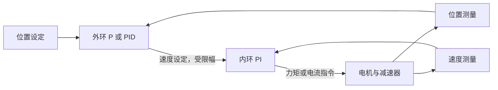
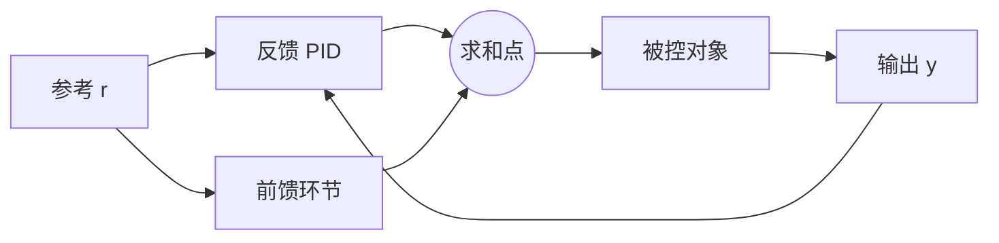
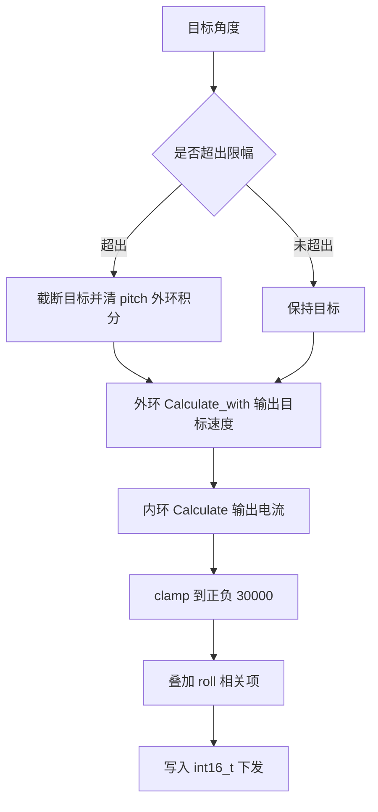

# 级联与前馈

串级把多个控制器串联，外环的输出作为内环的设定值；前馈把已知的参考或可测扰动提前变成控制量，不经过误差反馈。两者都是为了减轻反馈环的负担，但作用机制不同：串级靠带宽差把扰动挡在内环，前馈靠模型把已知量直接抵消。放在一起看，一个系统可以同时有外环反馈、内环反馈和前馈三条输入路径。

串级要求内外环带宽拉开倍数，整定必须从内环开始；前馈有五类形式，PD+G 重力补偿是其中在关节机器人上最常用的一种。云台实现了 yaw 与 pitch 双环，但两环的更新频率没有分离，pitch 轴还有一处不经过 PID 的叠加项，这两点都在后面对照代码展开。单环整定见 `02-整定方法`，微分与滤波见 `04-微分滤波与设定值`。

> 本页对照 `01_control_theory/pid_control/README.md` 第 3.1 节（`README.md:327-362`）、第 3.2 节（`README.md:364-407`）与第 4 节（`README.md:536-643`）。

## 串级靠带宽差把内外环解耦

串级的设计前提是内环足够快，在外环看来的时间尺度上近似为单位增益。设外环带宽 $\omega_o$、内环带宽 $\omega_i$，解耦要求

$$
\omega_i \ge (3 \sim 10)\,\omega_o
$$

满足这个条件后，外环设计时可以忽略内环的动态，把内环加被控对象当作一个等效对象来处理。带宽差不足时，外环输出的指令还没被执行完，下一周期的新指令已经下来，两环的动态互相纠缠，外环参数会随内环参数漂移。

从频域看，内环带宽是外环的 3 到 10 倍等价于要求内环闭环传函在外环穿越频率处接近 1 且相位接近 0。若两者带宽接近，内环在该频率处的相位已经明显滞后，等效对象多出一个极点，外环的相位裕度被吃掉。整定顺序因此固定为内环先、外环后：外环整定时内环必须已经稳定并锁定，否则无法判断外环参数是否合适。

内环通常不加微分，因为速度或电流信号的噪声比位置更重；每个回路要有独立的输出限幅，外环输出是内环设定值，限幅值决定下发指令的幅值上限。素材 `README.md:358-362` 把这四条列为级联的设计原则。



## 各环路的频率与控制器惯例

各环路的控制频率与控制器类型有惯例可循（`README.md:350-356`）：

| 环路 | 频率 | 反馈源 | 控制器 |
| --- | --- | --- | --- |
| 位置环（外） | 100 Hz ~ 1 kHz | 编码器位置 | P 或 PID |
| 速度环（中） | 1 kHz ~ 5 kHz | 编码器差分 | PI |
| 力矩环（内） | 10 kHz ~ 50 kHz | 电流传感器 | PI（FOC） |

三层之间的频率比刚好落在 3 到 10 倍区间内，这个安排不是巧合：频率比就是带宽比的实现手段。整定时从最内层开始逐层向外锁定，每锁定一层就把它当作外层的等效对象，这样每层面对的模型都简单。素材第 4 节的整定顺序是力矩环、速度环、位置环（`README.md:625`）。

控制器类型的选择表在 `README.md:627-643`，其中与机器人相关的几行是：电机速度控制用 PI，位置控制用 PID 或 P 位置加 PI 速度，机器人轨迹跟踪用 PID 加前馈，无人机姿态用 PD。这几条的共同点是反馈信号噪声越大、越靠内层，越倾向于去掉微分。

## 前馈的五类形式与数学位置

前馈把已知的参考或可测扰动量提前变成控制量，不经过误差反馈：

$$
u(t) = K_p e(t) + K_i \int e \, dt + K_d \frac{de}{dt} + u_{ff}(t)
$$

前馈项与反馈项在求和点相加，不在反馈环内，因此不改变闭环极点，只降低反馈环需要承担的模型误差。按补偿对象分几类（`README.md:396-402`）：

| 类型 | 公式 | 应用 |
| --- | --- | --- |
| 参考前馈 | $u_{ff} = K_{ff} r(t)$ | 轨迹跟踪 |
| 加速度前馈 | $u_{ff} = M(q) \ddot{q}_{des}$ | 关节惯量补偿 |
| 重力前馈 | $u_{ff} = G(q)$ | 静态重力补偿 |
| 摩擦力前馈 | $u_{ff} = F(\dot{q})$ | 低速摩擦补偿 |
| 扰动前馈 | $u_{ff} = -\hat{d}(t)$ | 可测扰动抵消 |

惯量与重力两类需要模型，参考与扰动两类只需要信号。模型不准时前馈会引入偏差，但因为它不在反馈环内，不会把系统推向不稳定，反馈环会把这部分偏差当作扰动再纠正一次。代价是模型误差大的时候前馈项可能长期顶在限幅上，把反馈环的输出预算占掉。



前馈与串级可以叠加：外环位置 PID 的输出作为内环速度设定，参考速度与参考加速度再通过前馈直接加到内环输出上，形成"反馈分层加前馈并联"的结构。素材第 4 节给出的三级级联架构就是这种组合（`README.md:590-625`）。

## PD+G 重力补偿

对多关节机械臂，重力力矩可以作为静态前馈，配合 PD 反馈：

$$
\tau = K_p (q_d - q) + K_d (\dot{q}_d - \dot{q}) + G(q)
$$

$G(q)$ 是与关节位置相关的重力项。重力是静态可计算的量，把它直接加进输出后，反馈的 PD 只需要处理动态误差，稳态误差因此大幅下降。素材给出的效果是相对纯 PD 把稳态误差降低 68% 到 84%，低速静态工况接近零静差（`README.md:529-532`）。这个数字来自素材的引述，未在云台固件上复现（未实测）。

重力补偿可以看作串级之外的第三条输入：反馈环负责把误差压小，前馈项负责把已知的静态负载从误差里拿走。PD+G 里没有积分项，因为静态误差已经被 $G(q)$ 承担，积分会与重力项争夺同一部分输出预算，参数没配好时两者相加会超过限幅。

## 云台 yaw 与 pitch 双环的实际结构

云台固件实现了双环串级，两环的更新频率没有分离：

| 轴 | 外环 | 内环 | 位置 |
| --- | --- | --- | --- |
| Yaw | `YawAnglePID.Calculate` 输出目标速度 | `YawSpeedPID.Calculate` 输出电流 | `GimbalTask.cpp:61-76` |
| Pitch | `PitchAnglePID.Calculate_with` 输出目标速度 | `PitchSpeedPID.Calculate` 输出电流 | `GimbalTask.cpp:84-96` |

两环都在同一个 `for` 循环里每周期各算一次（`GimbalTask.cpp:43-101`），没有 3 到 10 倍的频率差。四个环的反馈量也不同：yaw 外环用累计机械角，yaw 内环用 `imu_data.gyro[2]`，pitch 外环用 `imu_data.roll`，pitch 内环用 `imu_data.gyro[0]`（`GimbalTask.cpp:61-96`）。两个内环的反馈都直接取陀螺仪角速度，没有经过编码器差分，所以内环噪声主要来自陀螺仪本底。

外环输出直接作为内环设定值，中间没有显式限幅，只在内环输出端做了电流限幅（`GimbalTask.cpp:79`、`:98`）。按级联的设计原则，外环输出是内环设定值，它的幅值范围决定了内环能追到哪里，少了这一段限幅，外环积分在极端误差下可以把目标速度推到远超执行能力的量级。

循环周期声明为 `dt = 0.001f`（`GimbalTask.cpp:37`），循环尾是 `osDelay(2)`（`:100`），两者相差一倍。积分与微分都按 1 ms 计算，实际动作间隔约 2 ms，等效于把 $K_i$ 与 $K_d$ 同时放大约两倍（按代码推断，未实测）。这一项与整定单元里同一个缺陷是同一处代码。

yaw 与 pitch 的外环还用了不同的计算入口：yaw 走条件积分的 `Calculate`，pitch 走无条件积分的 `Calculate_with`。同一个任务里两个外环的积分策略不同，抗饱和行为也就不同，这一差别在 `03-抗积分饱和` 里已按判据展开。

## pitch 电流的限幅后叠加项

pitch 轴还有一处不经过 PID 的叠加项（`GimbalTask.cpp:98`）：

```c
pitch_current_out = (int16_t)clamp(pitch_current, -30000.0f, 30000.0f) + (-imu_data.roll) * 20;
```

这一项与姿态角成比例，形式上属于姿态相关的前馈或重力补偿（属推断，代码注释没有说明用途）。它加在限幅之后，因此可以突破 `clamp` 给出的电流上限，实际下发量由 `int16_t` 的表示范围决定：$|(-roll) \times 20|$ 在 roll 达到 30 度时约为 600，相比 30000 的量级很小，但在大角度工况下确实会把限幅后的值再推出去。若要保留这一项，正确做法是把它移到 `clamp` 之前，让限幅在最后一步统一生效。

同文件 `:40-41` 的角度限幅常量注释与数值不一致：注释写 +20 度与 -10 度，实际值是 30.0f 与 -20.0f（待现场确认，以代码数值为准）。这一对常量同时用于输入目标限幅与越限清积分（`:45-57`），注释里的范围偏保守，按注释理解会低估实际允许的俯仰角。



## 误用与边界情况

| # | 现象 | 成因 | 位置 |
| --- | --- | --- | --- |
| 1 | 内环来不及响应，外环设计失效 | 内外环同频更新 | `GimbalTask.cpp:43-101` |
| 2 | 内环设定值远超可执行范围 | 外环输出不限幅 | `GimbalTask.cpp:61-96` |
| 3 | 外环参数随内环改动失效 | 先调外环后调内环 | `README.md:360` |
| 4 | 速度噪声被进一步放大 | 内环加微分 | `README.md:361` |
| 5 | 最终输出突破限幅 | 前馈叠加放在限幅之后 | `GimbalTask.cpp:98` |
| 6 | 积分与微分的时间尺度错位 | 声明周期与实际循环不符 | `GimbalTask.cpp:37`、`:100` |
| 7 | 按注释理解俯仰角范围出错 | 限幅常量与注释不一致 | `GimbalTask.cpp:40-41` |
| 8 | 外环积分策略与预期不符 | yaw 用 `Calculate`、pitch 用 `Calculate_with` | `GimbalTask.cpp:61`、`:85` |

第 6 条对串级的影响比单环更大：外环与内环在同一周期内串行计算，两环的 dt 同时被放大同一倍数，等效于整条链路的积分与微分一起改了比例。整定时如果按 1 ms 设计参数再按 2 ms 运行，内环的相位裕度比预期低，外环的带宽差要求也就未必满足。

## 小结

### 核心概念

- 串级要求内环带宽为外环的 3 到 10 倍，整定顺序先内后外，每环独立限幅。
- 各环路的控制频率按位置、速度、力矩逐层提高，频率比就是带宽比的实现手段。
- 前馈不在反馈环内，不改变闭环稳定性，只降低反馈环需要承担的模型误差。
- 前馈分参考、加速度、重力、摩擦与扰动五类，前两类需要模型，后两类只要信号。
- PD+G 用静态重力项承担稳态负载，素材引述的稳态误差降幅为 68% 到 84%，未在本工程复现。
- 云台 yaw 与 pitch 双环同频更新，pitch 另有限幅后的姿态相关叠加项与一处注释数值不一致。

### 设计权衡

| 权衡点 | 可选做法 | 收益与代价 |
| --- | --- | --- |
| 环数 | 单环 / 双环 / 三环 | 环数多抑制扰动强；频率分离要求与实现成本上升 |
| 更新频率 | 同频 / 分层分频 | 同频实现简单；分层分频才能解耦 |
| 前馈来源 | 参考 / 模型 | 参考无需模型；模型前馈精度高但依赖辨识 |
| 前馈位置 | 限幅前 / 限幅后 | 限幅前受保护；限幅后可突破上限 |
| 外环积分 | 条件 / 无条件 | 条件积分抑制饱和；无条件积分响应快但依赖钳位 |

## 练习

基础题

1. 外环带宽取 20 Hz，按 3 到 10 倍的要求给出内环带宽区间，并换算成对应的控制频率下限。
2. 写出参考前馈与重力前馈的公式，指出哪一类需要被控对象模型，并说明模型误差是否会破坏稳定性。
3. 说明外环输出为什么需要单独限幅，以及少了这一段限幅后内环会发生什么。

挑战题

4. 云台俯仰轴的叠加项在 `clamp` 之后（`GimbalTask.cpp:98`）。写出把该项移到限幅之前的代码顺序，并分析 roll 在 ±30 度范围内时叠加项对最终输出的影响。
5. yaw 外环用 `Calculate`、pitch 外环用 `Calculate_with`。结合两个轴的反馈信号特点，说明这个不一致是否有工程理由；如果没有，给出统一的建议。
6. 若要给云台加上重力前馈，$G(q)$ 需要标定俯仰轴在重力作用下的等效电流与角度关系。设计一个只用现有接口、不改硬件的标定流程，并说明标定数据要写进哪一层。

## 附：本页引用的路径

| 路径 | 用途 |
| --- | --- |
| `~/robot_control_simulation/01_control_theory/pid_control/README.md` | 素材仓库根，第 3.1、3.2、4 节（`:327-407`、`:536-643`） |
| `Task/Src/GimbalTask.cpp` | yaw、pitch 双环、限幅、叠加项与周期（`:37`、`:40-41`、`:43-101`） |
| `PID/PidBase.h` | 外环调用的两个计算入口（`:29-91`） |
| `docs/06-PID 控制/04-串级与积分限幅/01-串级PID结构.md` | 固件侧串级结构 |
| `docs/06-PID 控制/04-串级与积分限幅/04-本项目串级实例.md` | 双环参数与整定顺序 |
| `/home/wyx/rm/2026SentriOmeniGimbal/2026OmniSentryGimbal` | 云台固件仓库根，正文路径相对该根 |


