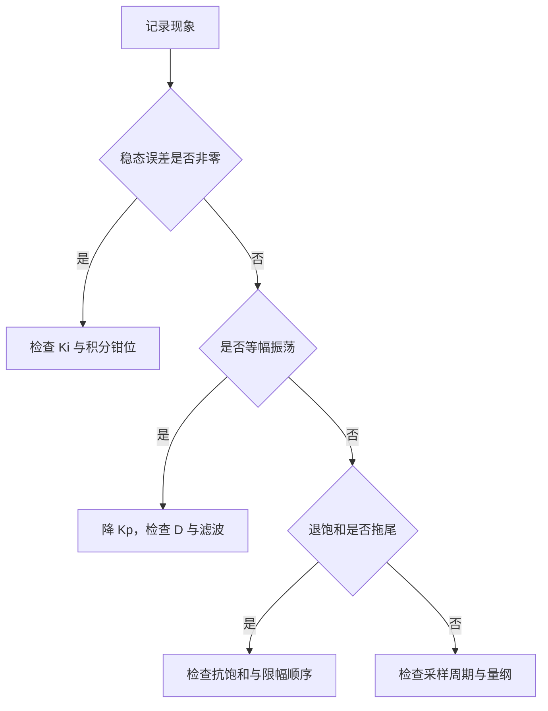

# 易错点与调试

PID 的问题很少能以参数直接命名。同一个现象可能出自参数、结构、实现或信号四个层面，先把现象落到层面，再缩小到具体环节，比直接调参数可靠得多。素材第 5.4、6 节把现象与成因成对列出；形式、整定、抗饱和、微分、串级分别在 `01-PID形式与离散化` 到 `05-级联与前馈`。

> 本页对照 `01_control_theory/pid_control/README.md` 第 5.4 节与第 6 节。

## 现象先落到参数、结构、实现、信号四个层面

| 层面 | 典型问题 | 观察手段 |
| --- | --- | --- |
| 参数 | 增益过大过小、积分过强 | 阶跃响应曲线 |
| 结构 | 内外环同频、缺少抗饱和 | 分环开环测试 |
| 实现 | 除零、限幅顺序、状态未复位 | 读源码与在线变量 |
| 信号 | 噪声、量纲、延迟 | 原始采样值 |

四个层面的排查成本差别很大。参数层只需要改数看响应；结构层要把环路拆开单独激励；实现层要对着代码逐行核；信号层要能拿到采样前的原始数据。顺序上应当从成本低的层面往下走，判断依据则取现象特征：稳态误差、超调、恢复时间这类指标性问题多半在参数层，输出跳变、尖峰、非有限值这类突变性问题多半在实现层，周期性抖动多半在信号层，两环互相干扰多半在结构层。

调试的基本顺序是先确认时间尺度，再加比例，再加积分，最后加微分。每一步只改一个量，改完记录响应与工况，否则无法归因，也回退不到上一组可用参数。

## 推荐做法与避免做法的对照

素材第 6.1 节给出一张对照表（`README.md`），按主题归并后如下：

| 主题 | 推荐 | 避免 | 理由 |
| --- | --- | --- | --- |
| 微分 | 对测量值微分并加低通 | 对误差微分且不滤波 | 避免冲击与噪声放大 |
| 抗饱和 | 条件积分加积分钳位 | 只做输出限幅 | 积分需独立上界 |
| 采样 | `vTaskDelayUntil` 固定周期 | 可变 `dt` 且不补偿 | 积分微分依赖 `dt` |
| 串级 | 先内环后外环 | 外环积分过强 | 内环不稳外环无法收敛 |
| 限幅 | 代码层限幅 | 依赖执行器保护 | 硬件保护不可控 |
| 滤波 | 编码器差分后低通 | 原始差分进微分 | 差分会放大噪声 |
| 启动 | 积分与输出从零开始 | 上电直接非零 | 避免瞬间冲击 |
| 整定 | 先 P 后 I 再 D | 一次上全套参数 | 无法定位问题来源 |

这张表里与云台固件直接相关的是采样与限幅两行。控制任务用的是 `osDelay` 而不是 `vTaskDelayUntil`，周期受任务调度抖动影响；限幅方面固件在代码层做了，但前馈叠加项放在了限幅之后，等于破坏了这一条。

## 现象到原因的检索表

素材第 6.2 节的排查表（`README.md`）可以按现象直接检索：

| 现象 | 可能原因 | 对策 |
| --- | --- | --- |
| 稳态误差不为零 | $K_i$ 太小或为 0 | 增大 $K_i$ 或加入积分 |
| 等幅振荡 | $K_p$ 或 $K_i$ 过大 | 降 $K_p$，或加 $K_d$ |
| 设定值阶跃时尖叫 | 对误差微分 | 改对测量值微分 |
| 饱和恢复后长时间超调 | 积分饱和 | 加条件积分或反计算 |
| 输出抖动 | 微分放大噪声 | 加微分滤波或降 $K_d$ |
| 响应慢 | $K_p$ 太小 | 增大 $K_p$，尝试 IMC |
| 高频时性能下降 | 离散化误差累积 | 改 Tustin 或提高采样率 |
| 多关节耦合明显 | 独立 PID 解耦不足 | 加重力补偿或前馈 |

检索表的用法是先把现象对到一行，再看那行的原因属于哪个层面。例如输出抖动这一行，原因写的是微分放大噪声，属于信号与实现两个层面的交界：先确认微分项有没有滤波（实现层），再确认原始采样噪声有多大（信号层），两步都排除之后才轮到调 $K_d$（参数层）。

## 四条整定经验法则

素材第 6.3 节（`README.md`）给出四条：

1. 先 P 后 I 再 D。先增大 $K_p$ 到轻微振荡，再降到振荡幅度的约一半，然后加 $K_i$ 消静差，最后加 $K_d$ 改善阻尼。
2. 积分时间取上升时间的 1.5 到 2 倍。$T_i$ 过大静差消除慢，过小则积分振荡。
3. 噪声重的传感器少用或不用微分，纯滞后大的过程微分作用有限。
4. 采样周期取主导时间常数的 1/20 以内，控制频率约取闭环带宽的 10 到 30 倍。

第一条的顺序来自可归因性：比例项对上升时间与超调的影响最直接，先把它定下来，再让积分去补静差，最后用微分收超调。反过来先加积分，积分会把比例项的效果掩盖，调 P 时看到的响应已经不是纯 P 的响应。第二条把积分时间与上升时间挂钩，是因为 $T_i$ 的物理含义就是积分作用累积到与比例项同量级所需的时间。

## 云台固件的十二处落点

素材第 5.4 节 `README.md` 列了实现注意点，其中固定采样周期、读算写同任务、超时跳帧重置积分对固件直接适用。云台固件的实际落点与问题汇总如下：

| # | 落点 | 事实 | 位置 |
| --- | --- | --- | --- |
| 1 | 条件积分判据 | 只看 P+D，不含积分 | `PID/PidBase.h` |
| 2 | 无条件积分入口 | `Calculate_with` 每周期累加 | `PID/PidBase.h` |
| 3 | 状态清零 | `Clear` 不清 `prevTarget`，清 `prevError` 引入尖峰 | `PID/PidBase.h` |
| 4 | 除零保护 | 基类无 `dt > 0`，`SpeedPID` 有 | `PID/PidBase.h`、`PID/Src/speed_pid.cpp` |
| 5 | 限幅量级 | 俯仰外环 `maxIntegral` 从 5000 改 1000，`maxOutput` 为 10000 | `Task/Src/GimbalTask.cpp` |
| 6 | 外部清零 | 角度越限直接写 `integral = 0` | `Task/Src/GimbalTask.cpp` |
| 7 | 周期不一致 | `dt = 0.001f` 对 `osDelay(2)` | `Task/Src/GimbalTask.cpp` |
| 8 | 双环同频 | 内外环每周期各算一次 | `Task/Src/GimbalTask.cpp` |
| 9 | 限幅后叠加 | pitch 电流限幅后又加姿态项 | `Task/Src/GimbalTask.cpp` |
| 10 | 温控单向积分 | 积分下限强制 0 | `PID/Src/temp_pid.cpp` |
| 11 | 角度限幅与注释不一致 | 常量 30.0f / -20.0f，注释写 +20 / -10 | `Task/Src/GimbalTask.cpp` |
| 12 | 外环积分策略不一致 | yaw 用 `Calculate`，pitch 用 `Calculate_with` | `Task/Src/GimbalTask.cpp` |

固定周期一项在固件里没有落实：控制任务用 `osDelay` 而不是 `vTaskDelayUntil`，周期受任务调度抖动影响。`README.md` 的建议与现状的差异属于未修正项，本工程没有记录修正计划。第 11 行属于代码注释与数值不一致，按指南的口径以代码数值为准，同时标注待现场确认。

十二处里只有第 10 行是设计选择而非缺陷：加热器没有制冷能力，积分下限取 0 与执行器的物理约束一致。其余各处要么是可改的实现细节，要么是需要在整定时一并考虑的约束。

## 反复出现的误用与调试次序

| # | 误用 | 现象 | 对应位置 |
| --- | --- | --- | --- |
| 1 | 一次改动多个参数 | 无法判断哪一项起作用 | 调试流程 |
| 2 | 把现象直接归到参数 | 实现层的除零、限幅错误被忽略 | `PID/PidBase.h` |
| 3 | 忽略采样周期一致性 | 积分与微分的时间尺度错位 | `Task/Src/GimbalTask.cpp` |
| 4 | 只看限幅值不看叠加顺序 | 限幅后被后续项突破 | `Task/Src/GimbalTask.cpp` |
| 5 | 内外环同时调 | 参数互相干扰 | `Task/Src/GimbalTask.cpp` |
| 6 | 不做响应记录 | 无法复现与回退 | 全流程 |

调试次序可以按本单元的顺序反推：先确认采样周期与量纲（01、05），再定单环参数（02），然后检查积分与微分的实现（03、04），最后处理结构问题（05）。反过来从结构开始调，每次改动都同时影响内外环与前后项，归因难度成倍上升。

## 跨篇事实的一致性检查

同一个数值会出现在本单元多篇里，改写或后续维护时需要一起改。下表列出交叉引用的口径，便于核对：

| 事实 | 出现在 | 统一口径 |
| --- | --- | --- |
| `dt = 0.001f` 对 `osDelay(2)` | 02、05、06 | 声明 1 ms，实际约 2 ms，属真实缺陷 |
| 俯仰外环 `maxIntegral` 被改成 1000 | 01、03、06 | 构造参数 5000，运行期覆盖为 1000 |
| 条件积分判据只看 P+D | 01、03、06 | 位置 `PID/PidBase.h` |
| `Clear()` 只清两个状态 | 04、06 | 不清 `prevTarget` |
| 限幅后叠加 roll 项 | 05、06 | 位置 `GimbalTask.cpp` |
| 角度限幅常量与注释不一致 | 05、06 | 代码 30.0f / -20.0f，注释 +20 / -10 |

这份清单本身也是调试入口：当某个现象与上述任一事实相关时，先确认改动是否已经同步到引用它的每一篇，避免文档里出现两套口径。

## 调试流程中的记录项

按素材 `README.md` 的注意点，要让一次整定可复现，记录至少要覆盖下面几项：

| 记录项 | 为什么需要 |
| --- | --- |
| 采样周期与实际循环周期 | 积分与微分都按它折算 |
| 输出限幅与积分限幅 | 饱和行为由两个量共同决定 |
| 输入阶跃幅值与响应曲线 | 复现工况与判断超调 |
| 反馈信号来源 | 量纲与噪声特性都由它决定 |
| 微分开关与滤波系数 | 决定高频段增益 |
| 参数改动前后的值 | 回退与归因 |

固件当前的状况是这些信息只以构造函数里的数字形式存在，工况与响应没有留下记录。`README.md` 关于固定周期的建议也没有落实，两者叠加的后果是换个工况重调时无法判断差异来自参数还是来自周期。

## 小结

### 核心概念

- 现象先落到参数、结构、实现、信号四个层面，再缩小到环节。
- 检索表把常见现象映射到原因，微分冲击、积分饱和、噪声放大各有对应项。
- 整定顺序是先 P、再 I、后 D，每步只改一个量并记录响应。
- 采样周期取主导时间常数的 1/20 以内，控制频率取闭环带宽的 10 到 30 倍。
- 云台固件的主要未修正项是双环同频、基类缺 `dt > 0` 保护、`osDelay` 不定周期与限幅后叠加。

### 设计权衡

| 权衡点 | 可选做法 | 收益与代价 |
| --- | --- | --- |
| 调试粒度 | 单参数逐改 / 批量调 | 逐改可归因；批量快但难定位 |
| 记录 | 只记参数 / 同时记响应 | 只记参数省事；记响应才能复现 |
| 保护位置 | 基类统一 / 派生类各写 | 统一一致；各写灵活但易漏 |
| 周期 | `osDelay` / `vTaskDelayUntil` | `osDelay` 简单；固定周期才可控 |
| 清零入口 | 封装函数 / 外部直写状态 | 封装保证同步；直写简单但会引入尖峰 |

## 练习

### 基础题

1. 写出积分发散的充要条件，并说明为什么只看总输出的条件积分比只看 P+D 的判据覆盖更全。
2. 给定上升时间 40 ms，按经验法则给出积分时间 $T_i$ 的取值区间，并换算成 $K_i$ 与 $K_p$ 的关系。
3. 说明对测量值微分为什么能消除设定值阶跃的微分冲击，代价是什么。

### 挑战题

4. 云台 pitch 轴同时存在双环同频与限幅后叠加两个问题。先写出当前的信号流，再给出一种把外环输出限幅、内环提高更新频率、叠加项移到限幅之前的改法，并分析改动对积分饱和与机械冲击的影响。
5. 本单元列出的十二处落点里，哪几处会在同一工况下互相放大后果？选一组写出因果链，并说明只修其中一处为什么不够。
6. 若要给固件补一份整定记录，需要记录哪些量才能让参数可复现？按素材第 5.4 节的注意点列出一张最小记录表。

## 附：本页引用的路径

| 路径 | 用途 |
| --- | --- |
| `~/robot_control_simulation/01_control_theory/pid_control/README.md` | 素材仓库根，第 5.4、6 节 |
| `PID/PidBase.h` | 条件积分、Clear、无 `dt` 保护 |
| `PID/Src/speed_pid.cpp` | `dt > 0` 保护 |
| `PID/Src/temp_pid.cpp` | 积分下限 0 |
| `Task/Src/GimbalTask.cpp` | 双环、周期、限幅后叠加、角度限幅常量 |
| `docs/06-PID 控制` | 固件侧逐环分析（角度环、速度环、温度环、串级与积分限幅） |
| `/home/wyx/rm/2026SentriOmeniGimbal/2026OmniSentryGimbal` | 云台固件仓库根，正文路径相对该根 |

