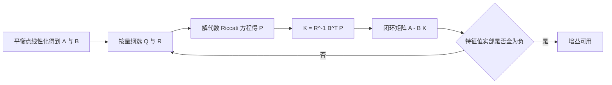
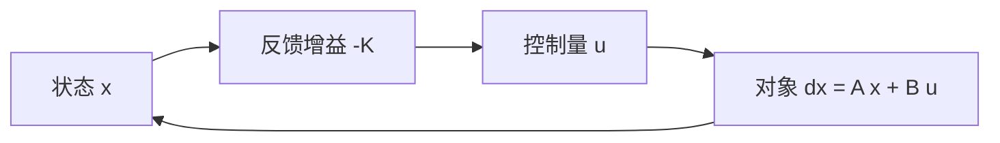

# LQR问题的构造与代价函数

PID 把误差按比例、积分、微分三项拼成控制量，参数与对象模型没有显式关系。当对象是多输入多输出、状态量之间互相耦合时，逐环整定的做法会撞到两个问题：不清楚某一组增益在数学上是否还有更好的取法，也无法说明当前增益与性能上限差多远。LQR 换了一条路：先把对象写成状态空间模型，再把性能要求写成对状态偏差与控制量的加权积分，让最小化这个积分的控制律唯一地由模型和权重决定。

这条路的代价是前提更强。线性模型必须来自平衡点附近的线性化，权重矩阵必须由设计者给出，解出来的增益只对当前模型最优。换来的是三点确定性：增益由一个矩阵方程唯一确定，闭环稳定性由方程解的性质保证，性能与权重的对应关系可以用量纲解释。Riccati 方程的数值解法、权重设计、状态不可测时的组合分别在后续三篇。

素材仓库 `01_control_theory/lqr_control/README.md` 给出了完整推导与两份可运行实现，本页的公式与它一致，引用处只给文件名与节名。固件侧没有 LQR 实现，正文不再牵连具体工程路径。

## 从一个二次型代价说起

线性时不变对象写成

$$
\dot{x} = A x + B u
$$

其中 $x \in \mathbb{R}^{n}$ 是状态，$u \in \mathbb{R}^{m}$ 是控制输入。目标是找一个状态反馈律 $u = -Kx$，让状态从任意初值回到原点，同时不让控制量过大。把两件事写进同一个标量指标，最方便的形式是二次型

$$
J = \int_{0}^{\infty} \left( x^{\mathsf T} Q x + u^{\mathsf T} R u \right) \, dt
$$

$Q$ 是 $n \times n$ 半正定矩阵，$R$ 是 $m \times m$ 正定矩阵，二者都由设计者选择，不属于对象的物理参数。代价是无穷时域积分，不带终端时刻约束，因此求出的反馈律是定常的：只要模型不变，$K$ 一次算好就能一直用。

## 为什么代价里出现状态与控制两项

两项各有明确职责。$x^{\mathsf T} Q x$ 惩罚状态偏离原点的程度，$u^{\mathsf T} R u$ 惩罚控制量的幅值。若只有第一项，最优解会把控制量推到任意大，因为约束里没有代价；若只有第二项，最优解是 $u \equiv 0$，系统自己回不回原点不在指标里。两项同时出现，最小化才意味着在响应速度与控制消耗之间做权衡。

二次型不是唯一选择，选它的原因有三个。第一，它的梯度是线性的：对 $u$ 求导得到 $2Ru + 2B^{\mathsf T}Px$，令其为零就是一组线性方程，最优解有闭式表达。第二，线性对象配上正定 $R$ 保证二阶项为正，驻点就是全局最小值点。第三，它的量纲可以逐项解释：$Q_{ii}$ 的量纲是状态量平方的倒数，$R_{jj}$ 的量纲是控制量平方的倒数，比值决定两者的相对权重。换成绝对值或高次型，前两条都不再成立，数值求解会退化成逐点优化。

权重矩阵的取值直接决定闭环行为。这一点在第一篇只建立结构，具体数值放到《Q 与 R 的权重设计》。当前只需要记住：$Q$ 越大状态收敛越快、控制量越大，$R$ 越大控制越保守。

## 用值函数把无穷时域问题降成代数方程

直接对无穷时域积分做变分，得到的是一个关于时间的矩阵微分方程。由于对象定常、时域无穷、代价不含时间，最优代价函数可以写成状态的二次型 $V(x) = x^{\mathsf T} P x$，$P$ 是待定的 $n \times n$ 对称矩阵，与时间无关。Hamilton-Jacobi-Bellman 方程给出

$$
\min_{u} \left[ x^{\mathsf T} Q x + u^{\mathsf T} R u + 2 x^{\mathsf T} P (A x + B u) \right] = 0
$$

方括号里是当前时刻的代价率加上值函数沿轨线的变化率。对 $u$ 求偏导并令其为零：

$$
2 R u + 2 B^{\mathsf T} P x = 0 \quad \Rightarrow \quad u^{*} = -R^{-1} B^{\mathsf T} P x
$$

$R$ 正定所以可逆，这个驻点就是最小值点。把 $u^{*}$ 代回方程，整理后得到关于 $P$ 的代数 Riccati 方程

$$
A^{\mathsf T} P + P A - P B R^{-1} B^{\mathsf T} P + Q = 0
$$

推导里用到 $x$ 任意，所以矩阵本身满足方程。这一步是整个方法的核心：时间维被消掉，求反馈增益变成解一个矩阵二次方程。方程的解 $P$ 同时给出最优代价函数值与增益，二者共用同一个矩阵。

## 最优控制律与闭环矩阵

比较 $u^{*} = -R^{-1}B^{\mathsf T}Px$ 与设定的形式 $u = -Kx$，得到

$$
K = R^{-1} B^{\mathsf T} P
$$

$P$ 取 Riccati 方程的对称正定解。代入对象得到闭环系统

$$
\dot{x} = (A - B K) x
$$

闭环矩阵记作 $A_{cl} = A - BK$。Riccati 方程的解有一个关键性质：若 $(A,B)$ 能控且 $(A, Q^{1/2})$ 能观，那么方程存在唯一对称正定解，且 $A - BK$ 的所有特征值都在左半平面。稳定性来自方程可解性，不需要额外验证；反过来，只要正定解存在，闭环一定稳定。

这条推理链有一个容易忽略的前提：Riccati 方程可能有多个对称解，只有正定解对应稳定闭环。数值求解时若迭代到一个负定或不定解，增益算出来闭环就是不稳定的，而方程残差仍然接近零。判别依据是 $A - BK$ 的特征值实部符号，残差接近零不能说明解可用。

## 稳定裕度从哪里来

LQR 的闭环不只是一个稳定系统，它自带两条裕度保证。开环传递矩阵在频域满足返回差关系

$$
\left| 1 + K (j\omega I - A)^{-1} B \right| \ge 1
$$

这条不等式意味着 Nyquist 曲线始终位于以 $-1$ 为圆心、半径为 1 的圆外。由它可以推出两个经典结论：任意方向上的相位裕度不小于 $60^{\circ}$；增益裕度在增大方向为无穷，在减小方向到 $1/2$（约 $-6$ dB）之前保持稳定。把环路增益整体缩小一半以内、或任意放大，闭环都不会失稳，而相位偏差要积累到 $60^{\circ}$ 才触界。

这两条是关于开环回路的裕度，不是关于单个环节的。实际系统里控制器输出要经过饱和、延时、采样保持，这些非线性环节不在这条推导里，所以裕度保证只在饱和与延时足够小的时候成立。工程上把它当作还有余量的依据，而不是免除限幅与时序检查的理由。素材仓库第 1 节的结论行（`01_control_theory/lqr_control/README.md`）列出的正是这三条性质。

## 解存在需要能控与能观

能控条件 $(A,B)$ 能控保证控制量能作用到每一个状态方向；若能控性缺失，Riccati 方程可能没有正定解，对应的是闭环里存在无法镇定的模态。能观条件 $(A, Q^{1/2})$ 能观保证被 $Q$ 惩罚的每一个状态方向都能从代价里被看见；若某个不稳定模态恰好落在 $Q$ 的零空间里，代价对它不敏感，最优解不会去镇定它。

两个条件是充分条件而不是必要条件。实际建模时如果某个状态没有可观测量，可以考虑把它并入噪声或降阶，而不是硬套公式。第三篇的 LQI 增广还会在系统矩阵上追加积分器，增广后的能控性需要用新的矩阵对重新检查，判据是

$$
\operatorname{rank} \begin{bmatrix} A & B \\ C & 0 \end{bmatrix} = n + p
$$

其中 $p$ 是输出维数（`01_control_theory/lqr_control/README.md`）。这个条件意味着系统在原点没有传输零点。

## 与 PID 在结构上的三点差别

第一，控制量是状态的线性组合而不是误差的函数。$u = -Kx$ 不区分目标值与当前值，跟踪问题要把目标值写成前馈项或增广状态，标准 LQR 只解决调节问题。第二，增益由矩阵方程解出而不是逐环试凑，权重改动后所有通道的增益同步变化，一个通道的响应速度不能单独拉高。第三，稳定性与裕度由方程性质给出而不是由经验判据给出，代价是模型误差不在保证范围内：模型不准时，同一组增益可能既没有 $60^{\circ}$ 裕度也没有标称性能。

三篇之后的实现把这条链落到数字上：采样要离散化、状态要测量或估计、控制量要限幅。离散化与求解放在第二篇，状态估计放在第四篇，嵌入式实现与排查放在第五篇。

## 小结

### 核心概念

- LQR 在无穷时域上最小化二次型代价 $J = \int_0^\infty (x^{\mathsf T}Qx + u^{\mathsf T}Ru)\,dt$，控制律限制为状态反馈 $u = -Kx$。
- 值函数 $V(x) = x^{\mathsf T}Px$ 把时间维消掉，最优控制律为 $u^{*} = -R^{-1}B^{\mathsf T}Px$，增益 $K = R^{-1}B^{\mathsf T}P$。
- $P$ 满足代数 Riccati 方程 $A^{\mathsf T}P + PA - PBR^{-1}B^{\mathsf T}P + Q = 0$，能控加能观时该方程有唯一对称正定解。
- 闭环矩阵 $A - BK$ 的所有特征值落在左半平面；返回差关系给出不小于 $60^{\circ}$ 的相位裕度与近乎无穷的增益裕度。
- $Q$ 与 $R$ 是设计量不是物理参数，它们的比值决定响应速度与控制消耗的权衡。

### 设计权衡

| 选择 | 带来的能力 | 付出的代价 |
| --- | --- | --- |
| 用二次型作代价 | 有闭式解、极值全局唯一、量纲可解释 | 对单项最大偏差没有直接约束 |
| 无穷时域定常反馈 | 增益一次算出、实现简单 | 不能处理时变模型与终端约束 |
| 由方程保证稳定性 | 不依赖经验判据 | 仅对建模所用模型成立 |
| 状态反馈而非输出反馈 | 结构简单、最优性有证明 | 状态不可测时必须加观测器 |
| 保留 $Q$ 半正定的自由度 | 可只惩罚关心的方向 | 不关心的不稳定模态不会被镇定 |

## 练习

### 基础题

1. 取标量对象 $\dot{x} = ax + bu$，$Q = q > 0$，$R = r > 0$，写出 Riccati 方程并解出 $P$ 与 $K$，说明 $a > 0$ 时闭环稳定的条件。
2. 从 $J = \int_0^\infty (x^{\mathsf T}Qx + u^{\mathsf T}Ru)\,dt$ 出发，说明为什么 $Q$ 只需半正定而 $R$ 必须正定。
3. 用返回差关系解释：把环路增益整体乘以 3 之后闭环为什么仍然稳定，而相位滞后 $70^{\circ}$ 时为什么不再有保证。

### 挑战题

4. 若 $(A, Q^{1/2})$ 不可观且不可观子空间包含一个不稳定模态，说明 Riccati 方程仍可能有半正定解，并解释闭环为什么不稳定。
5. 对同一个对象分别取 $Q = I$、$Q = 100I$ 且 $R$ 不变，比较两组 $K$ 的范数与闭环极点位置，说明状态权重整体放大与控制权重整体缩小在数学上是否等价。
6. 把值函数假设从 $x^{\mathsf T}Px$ 换成 $x^{\mathsf T}Px + 2p^{\mathsf T}x + c$，推导跟踪参考输入时的最优控制律，并指出 $p$ 满足的线性方程与 $P$ 满足的方程之间的关系。

## 附：本页引用的路径

| 路径 | 用途 |
| --- | --- |
| `01_control_theory/lqr_control/README.md` | 素材仓库 LQR 单元根：问题构造、连续推导、解的存在条件 |
| `docs/19-控制理论/01-PID整定与抗饱和` | 本站 PID 单元，用于对照误差反馈与状态反馈的结构差别 |
| `docs/20-状态估计与信号处理/01-卡尔曼滤波KF·EKF·UKF` | 本站状态估计单元，第四篇 LQG 用到其中的滤波 Riccati 方程 |
| `~/robot_control_simulation` | 素材仓库根，正文中素材路径均相对该根 |
