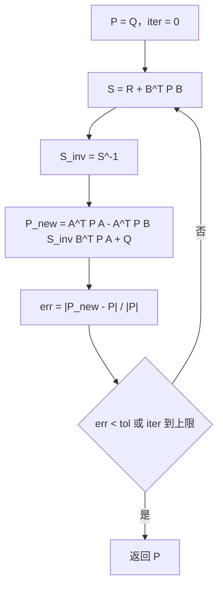
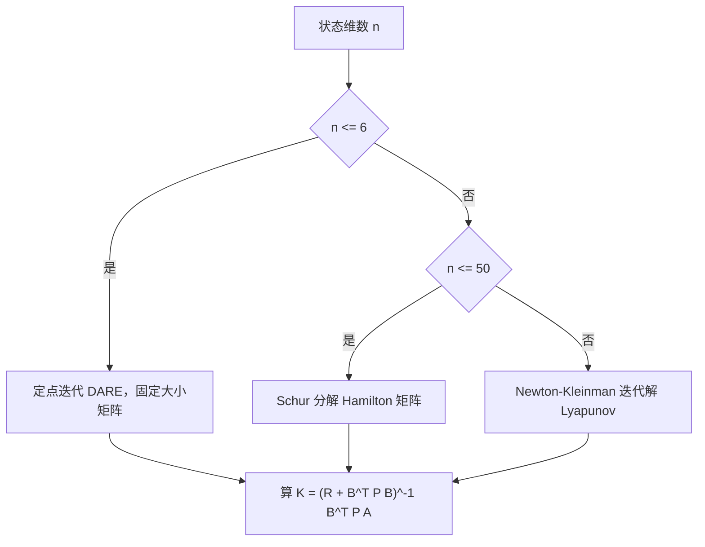

# Riccati方程与增益求解

第一篇把 LQR 的增益归结为解一个矩阵二次方程，稳定性、裕度、最优性都挂在这个方程的解上。接下来的问题是方程怎么解、解出来对不对、算到什么精度可以停。Riccati 方程没有初等公式解，工程上走的都是两条路：一条把它变成特征值问题，用不变子空间一次求出；另一条把它变成迭代，每步解一个线性方程，逐步逼近。

选择哪条路由两个数决定：状态维数 $n$ 和控制维数 $m$。$n$ 在十以内时定点迭代写起来最短，几行循环就能收敛；$n$ 到几十时特征值分解更稳；$n$ 上百时迭代解 Lyapunov 方程的方案才划算。连续与离散两种方程的结构不同，两条求解路径的原理与终止条件也不同；素材仓库的两份实现完成度不一，其中一部分只是示意。

## 代数 Riccati 方程的两种形态

连续形态（CARE）在第一篇已经出现：

$$
A^{\mathsf T} P + P A - P B R^{-1} B^{\mathsf T} P + Q = 0
$$

未知量是矩阵 $P$，方程里同时出现一次项与二次项 $PBR^{-1}B^{\mathsf T}P$，所以是非线性矩阵方程。$P$ 对称，独立未知量是 $n(n+1)/2$ 个。当 $(A,B)$ 能控、$(A,Q^{1/2})$ 能观时，方程存在唯一的对称正定解，且它对应对稳定闭环（`01_control_theory/lqr_control/README.md`）。

离散形态（DARE）来自对连续对象按周期采样后重新写代价。离散代价是 $\sum_{k=0}^{\infty}(x_k^{\mathsf T}Qx_k + u_k^{\mathsf T}Ru_k)$，最优增益为

$$
K = \left( R + B_d^{\mathsf T} P B_d \right)^{-1} B_d^{\mathsf T} P A_d
$$

对应的方程是

$$
P = A_d^{\mathsf T} P A_d - A_d^{\mathsf T} P B_d \left( R + B_d^{\mathsf T} P B_d \right)^{-1} B_d^{\mathsf T} P A_d + Q
$$

它与 CARE 的差别集中在二次项的分母：连续形态里是 $R^{-1}$，离散形态里是 $(R + B^{\mathsf T}PB)^{-1}$。$B^{\mathsf T}PB$ 这一项随 $P$ 变化，所以 DARE 每迭代一次都要重算一次求逆，代价比 CARE 的 Hamilton 方法高，但维数低时完全可接受（`README.md`）。

## Hamilton 矩阵与不变子空间

连续方程可以整体变成一个 $2n \times 2n$ 的特征值问题。构造 Hamilton 矩阵

$$
H = \begin{bmatrix} A & -B R^{-1} B^{\mathsf T} \\ -Q & -A^{\mathsf T} \end{bmatrix}
$$

它的特征值关于虚轴对称：若 $\lambda$ 是特征值，$-\lambda$ 也是。能控能观时没有纯虚特征值，于是恰好有 $n$ 个实部为负的稳定特征值。这 $n$ 个特征值对应的特征向量张成一个 $n$ 维不变子空间，把它按状态块写成 $\begin{bmatrix} X_1 \\ X_2 \end{bmatrix}$，只要 $X_1$ 可逆，就有

$$
P = X_2 X_1^{-1}
$$

求 $P$ 变成求子空间基。实现上先做 Schur 分解把 $H$ 化成准上三角，再取前 $n$ 列的稳定不变子空间，数值上比直接做特征向量分解稳定（`README.md`）。$X_1$ 是否可逆由子空间与状态方向的关系决定，病态时 $X_1$ 接近奇异，$P$ 的元素会放大到不可用；这时应当先检查能控性，而不是继续调求逆。

## Newton-Kleinman 迭代与 Lyapunov 方程

第二条路是把二次项固定住，每步解一个线性方程。取一个使 $A - SP_k$ 稳定的 $P_k$（$S = BR^{-1}B^{\mathsf T}$），解 Lyapunov 方程

$$
( A - S P_k )^{\mathsf T} P_{k+1} + P_{k+1} ( A - S P_k ) + Q + P_k S P_k = 0
$$

解出 $P_{k+1}$ 后继续下一轮。方法名里的 Newton 指它对 Riccati 方程的牛顿迭代形式，而每次牛顿步的线性子问题恰好是 Lyapunov 方程，因此实现只需要一个 Lyapunov 求解器。收敛是二次的：一旦迭代点进入解附近，误差每步大致平方缩小，通常几轮就够。

代价在初值。$P_0$ 必须让 $A - SP_0$ 稳定，否则 Lyapunov 方程解出来的 $P_1$ 可能不满足稳定条件，迭代发散。素材仓库的 Eigen 实现在第一轮把 $P$ 初始化为单位阵并在循环里构建闭环矩阵（`README.md`），这一行之后紧接的 Lyapunov 求解是注释掉的示意代码，函数体内没有实际实现迭代（`README.md`），所以那份实现只能当作接口模板读。可运行的最小实现是定点迭代。

## 离散化把 CARE 换成 DARE

连续模型要先变成离散模型。零阶保持（ZOH）假设采样周期 $T_s$ 内控制量不变，得到

$$
A_d = e^{A T_s}, \qquad B_d = \int_{0}^{T_s} e^{A \tau} \, d\tau \, B
$$

$A$ 的特征值模较大时矩阵指数的计算要用缩放平方或 Padé 逼近，直接做幂级数会掉精度。另一条离散化路径是双线性变换（Tustin），

$$
A_d = \left( I - \frac{A T_s}{2} \right)^{-1} \left( I + \frac{A T_s}{2} \right)
$$

它把左半平面映射到单位圆内，保稳性，但频段映射有畸变。素材仓库对平衡类对象推荐 ZOH 或 Tustin，两条路径都列了出来（`README.md`）。

离散化之后必须用 DARE 而不是 CARE：把连续增益直接搬到离散控制器上，闭环极点会随 $T_s$ 偏移，$T_s$ 越大偏差越大。判断方法很简单：把离散闭环矩阵 $A_d - B_d K_d$ 的特征值算出来，看它们是否落在单位圆内、以及模长分布是否与连续设计一致。

## 定点迭代的收敛与终止

DARE 的定点迭代把方程右端当成映射反复施加：

$$
P_{k+1} = A_d^{\mathsf T} P_k A_d - A_d^{\mathsf T} P_k B_d \left( R + B_d^{\mathsf T} P_k B_d \right)^{-1} B_d^{\mathsf T} P_k A_d + Q
$$

迭代一次要算三次矩阵乘和一次 $m \times m$ 求逆。素材仓库的嵌入式实现取 $P = Q$ 作初值，循环上限 10000 次，收敛判据是相邻两拍的相对变化量（`README.md`）：

$$
\frac{\sum_{i,j} \left| P_{k+1}(i,j) - P_k(i,j) \right|}{\sum_{i,j} \left| P_k(i,j) \right|} < \text{tol}
$$

分母加了一个 $10^{-30}$ 的偏移量，避免 $P$ 全零时除零（`README.md`）。默认容差 $10^{-10}$，对单精度浮点来说这个值比机器精度还小，实际循环会在浮点噪声不再下降时靠上限退出，因此嵌入式场景应当把容差放宽到 $10^{-6}$ 量级并按实际迭代次数定上限。

收敛性由能稳与能检条件保证：$(A,B)$ 能稳、$(A,Q^{1/2})$ 能检时 DARE 有唯一半正定镇定解，定点迭代从 $P=0$ 或 $P=Q$ 出发收敛到该解。初值离解越远迭代次数越多，$Q$ 与 $R$ 的量级相差很大时迭代次数也会增加。若迭代在上限处仍未收敛，先检查能控性，再检查 $R$ 是否过小导致 $S$ 接近奇异。

## 四种求解方法的规模与代价

| 方法 | 原理 | 适用规模 | 主要代价 |
| --- | --- | --- | --- |
| Schur 分解 | Hamilton 矩阵的稳定不变子空间 | 中小规模，$n$ 到几十 | 需要 $2n \times 2n$ 的特征值分解 |
| Newton-Kleinman | 每步解 Lyapunov 方程 | 大规模稀疏系统 | 需要稳定初值，每步一次线性解 |
| Riccati 逆迭代 | 符号函数型矩阵迭代 | 中等规模，收敛快 | 每步多次矩阵乘，实现复杂 |
| 定点迭代 | 直接迭代 DARE | 低维，$n \le 6$ 的嵌入式 | 收敛慢，求逆按 $m \times m$ 计 |

四行的取舍就是精度与实现量的取舍（`README.md`）。$n \le 6$ 的机器人关节或姿态模型用最后一行最省事：一个固定大小模板、一次循环、一处求逆，没有动态内存，也不用链接线性代数库。

## 数值实现里的对称性与病态

$P$ 在数学上对称，但迭代里的矩阵乘与求逆都会引入非对称误差。误差量级小时看不出来，量级大时会出现 $K$ 的两个本应对称的通道数值不一致。稳妥做法是每轮迭代后做一次对称化 $P \leftarrow (P + P^{\mathsf T})/2$，代价只有 $O(n^2)$，可以写进循环而不明显拖慢收敛（`README.md` 的循环结构留出了这个位置）。

病态主要来自三处。第一，$R$ 取得很小，$S = R + B^{\mathsf T}PB$ 的条件数变大，求逆放大误差；此时应把 $Q$ 与 $R$ 同时缩放，让二者量级接近，因为增益只与比值有关。第二，$Q$ 的某些对角元远大于其余项，$P$ 的元素跨度大到超过浮点有效位；应先用 Bryson 规则把量纲拉平，再做比例微调。第三，离散化时 $T_s$ 过大，$A_d$ 的特征值靠近单位圆边界，迭代收敛变慢且对舍入敏感；应减小 $T_s$ 或改用双线性变换。

## 素材里的两份实现各自做到了哪一步

素材仓库第 8.1 节的 Eigen 实现给出 Newton-Kleinman 的完整接口与 Lyapunov 方程展开式，但循环体内的求解被注释掉，返回的 $P$ 实际没有更新（`README.md`）；它列出的 Kronecker 积展开只用于说明规模，作者自己也标注了实际应调用专门的求解器。第 8.2 节的嵌入式实现可以直接用：一个固定大小矩阵模板（`README.md`），一个定点迭代求解器（`README.md`），外加一个 2 阶系统的调用示例（`README.md`）。第 8.3 节的 AutoLQR 接口只有伪代码，compute 的函数体直接返回 true（`README.md`）。

三段代码的完成度不同，引用时要区分。接口形态、迭代公式、终止判据可以直接对照；Eigen 版的 Lyapunov 步与 AutoLQR 的求解体都不能当作已验证实现。

## 小结

### 核心概念

- CARE 与 DARE 都是矩阵二次方程，连续形态的二次项系数是 $R^{-1}$，离散形态是 $(R + B^{\mathsf T}PB)^{-1}$。
- Hamilton 矩阵的特征值关于虚轴对称，取 $n$ 个稳定特征值张成的子空间即可得 $P = X_2X_1^{-1}$。
- Newton-Kleinman 用一系列 Lyapunov 方程逼近解，二次收敛，但要求初值使 $A - SP_0$ 稳定。
- 定点迭代按 DARE 右端反复施加，能稳能检时收敛到唯一半正定镇定解；嵌入式容差应放宽到单精度可分辨的范围。
- 求解方法按维数选：低维定点迭代，中等规模 Schur，大规模 Newton-Kleinman。

### 设计权衡

| 选择 | 带来的能力 | 付出的代价 |
| --- | --- | --- |
| Hamilton 矩阵加 Schur 分解 | 一次求出、数值稳定 | 需要 $2n \times 2n$ 分解，规模受限 |
| Newton-Kleinman 迭代 | 适合大规模与稀疏结构 | 依赖稳定初值，需外部 Lyapunov 求解器 |
| 定点迭代 DARE | 实现最短、无动态内存 | 收敛慢，求逆每步重算 |
| 每轮对称化 $P$ | 抑制非对称误差累积 | 增加少量运算，不改变收敛阶 |
| 提前缩放 $Q$ 与 $R$ | 改善求逆条件数 | 需要额外记录缩放比，便于回读增益 |

## 练习

### 基础题

1. 写出标量离散对象 $x_{k+1} = a x_k + b u_k$ 的 DARE，解出 $P$ 并用求根公式说明正根为什么对应镇定解。
2. 用 ZOH 公式计算 $A = \begin{bmatrix} 0 & 1 \\ 0 & 0 \end{bmatrix}$、$T_s = 10$ ms 时的 $A_d$ 与 $B_d$（$B = \begin{bmatrix} 0 \\ 1 \end{bmatrix}$）。
3. 说明为什么 Hamilton 矩阵没有纯虚特征值是能控能观条件的推论，并给出一个特征值落在虚轴上的矩阵对作为反例。

### 挑战题

4. 用同一个 DARE 分别以 $P_0 = 0$ 与 $P_0 = 10^3 Q$ 为初值迭代，记录收敛所需拍数，说明初值对迭代次数的量级影响。
5. 在定点迭代中把每步的 $P$ 对称化与不对称化各跑一遍，构造一个 $R$ 很小、$Q$ 量级跨度大的例子，比较两条路径的收敛轨迹与最终 $K$ 的差异。
6. 说明双线性变换与 ZOH 在同一个 $T_s$ 下给出的 $A_d$ 特征值差异，并解释为什么前者保稳性但不能保持频率响应形状。

## 附：本页引用的路径

| 路径 | 用途 |
| --- | --- |
| `01_control_theory/lqr_control/README.md` | 素材仓库 LQR 单元根：CARE 与求解方法、离散化与 DARE、Eigen 实现、嵌入式实现、AutoLQR |
| `docs/19-控制理论/02-LQR与LQG/01-LQR问题的构造与代价函数.md` | 本站第一篇，问题构造与闭环矩阵 |
| `docs/19-控制理论/01-PID整定与抗饱和` | 离散化与积分限幅的对照单元 |
| `~/robot_control_simulation` | 素材仓库根，正文中素材路径均相对该根 |
