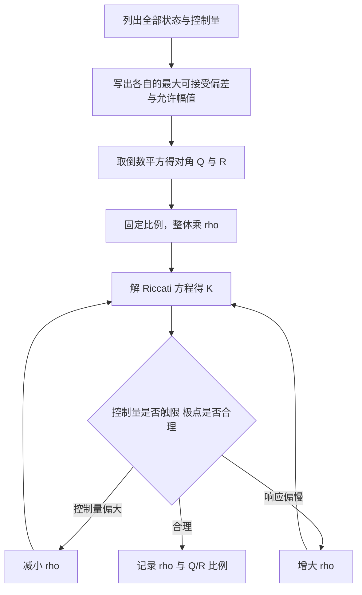
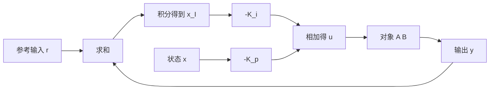

# Q与R的权重设计

Riccati 方程给定 $Q$ 与 $R$ 之后只负责算出唯一的 $K$，它不会判断这组权重合不合理。整个 LQR 设计里自由度最大的正是这两个矩阵：$n$ 个状态乘 $m$ 个控制，即使只取对角阵也有 $n+m$ 个参数。参数多了就难以复现，也难以解释改动一个数之后闭环为什么变快。

工程上把这个问题压缩成两步。先用一套量纲规则把对角元素的数量级定下来，让每个元素都有明确的物理含义；再引入一个整体缩放因子做单变量微调。这套规则就是 Bryson 规则，它不保证最优，但保证起点不荒谬。单参数缩放之所以够用，可以在一个四状态算例里看出来；引入积分状态之后，权重还要再扩一维。

## Bryson 规则的量纲含义

规则本身只有两行：

$$
Q_{ii} = \frac{1}{(\text{状态 } x_i \text{ 的最大可接受偏差})^2}, \qquad R_{jj} = \frac{1}{(\text{控制 } u_j \text{ 的最大可允许幅值})^2}
$$

它的解释要从代价的积分看。代价率里 $Q_{ii}x_i^2$ 是一个无量纲量，因为整个积分最终以同样的单位累加。若要求 $x_i$ 偏离不超过 $\bar{x}_i$ 时该通道的代价率不超过 1，就需要 $Q_{ii}\bar{x}_i^2 = 1$，即 $Q_{ii} = 1/\bar{x}_i^2$。$R$ 同理，只是参考量换成控制量的允许幅值。这样定出来的权重天然带量纲：$Q_{ii}$ 的单位是状态量平方的倒数，$R_{jj}$ 是控制量平方的倒数。

规则的价值在于它把“权重怎么给”变成“状态最多能偏多少、控制最多能给多大”这两个可以对着物理约束回答的问题。倾角最多偏 10 度、电机电压最多 12 伏，这些数字来自机械行程与电源电压，比抽象地猜一个 100 或 0.01 可靠得多（`01_control_theory/lqr_control/README.md:206-221`）。

## 两轮自平衡模型的权重起步值

素材仓库给出的算例是两轮自平衡机器人，状态取 $x = [\theta, \dot{\theta}, p, \dot{p}]^{\mathsf T}$，控制是电机电压。按 Bryson 规则填入最大可接受偏差后得到（`README.md:222-237`）：

| 状态 | 含义 | 最大可接受偏差 | $Q_{ii}$ |
| --- | --- | --- | --- |
| $\theta$ | 倾角 | 0.17 rad（约 $10^{\circ}$） | $1/0.17^2 \approx 34.6$ |
| $\dot{\theta}$ | 倾角速度 | 1.0 rad/s | 1.0 |
| $p$ | 位置偏差 | 0.1 m | 100 |
| $\dot{p}$ | 速度 | 0.5 m/s | 4.0 |
| $u$ | 电机电压 | 12 V | $1/144 \approx 0.0069$ |

对角线跨度约四个数量级，从 0.0069 到 100。这个跨度是有意义的而不是病态：位置偏差的容忍度比倾角小，控制量的物理上限又比状态大得多，量纲换算之后自然拉开。若不做 Bryson 换算直接给所有元素赋 1，等价于宣称“位置偏 1 米与倾角偏 1 弧度同样严重、12 伏与 1 伏同样贵”，闭环行为会与物理约束脱节。

## 单参数缩放为什么够用

把 $Q$ 整体乘一个正的标量 $\rho$、$R$ 保持不变，等价于把 $J$ 整体乘 $\rho$，最优解不变；也等价于保持 $Q$ 不变、把 $R$ 除以 $\rho$。所以

$$
\min \int \left( x^{\mathsf T} \rho Q x + u^{\mathsf T} R u \right) dt \;\Longleftrightarrow\; \min \int \left( x^{\mathsf T} Q x + u^{\mathsf T} \frac{R}{\rho} u \right) dt
$$

两支写法给出同一组 $K$，差别只在 $P$ 的尺度。这条等价关系说明：在对角元素相对比例固定之后，整体激进度只需要一个参数控制。增大 $\rho$ 使状态权重相对变大，闭环更强调把状态拉回原点，代价是控制量增大；减小 $\rho$ 反过来。

标准流程是先按 Bryson 规则定 $Q$、$R$，再只调 $\rho$。这样做有两个好处：调参过程可复现，只有一个数在动；权重的物理含义在缩放前后保持一致，$\rho = 1$ 就代表“各项代价大致按最大可接受偏差对齐”（`README.md:239-244`）。素材仓库把这条策略列在调参顺序的第一条，后面才是非对角项的引入与自动搜索。

## 非对角权重与状态耦合

对角 $Q$ 只能表达“某个状态自己偏了多少”，无法表达两个状态同时偏离时的额外惩罚。若系统里位置偏差总是伴随倾角偏差出现，可以在 $Q$ 的非对角位置填负值或正值来改变两者的相关性。二次型 $x^{\mathsf T}Qx$ 里，非对角元 $Q_{ij}$ 的贡献是 $2Q_{ij}x_ix_j$，正值让两个状态同号时付出更大代价，负值让它们同号时代价减小。

加入非对角元之后必须保持 $Q$ 半正定，否则代价不再凸，最小值点可能落在 $u$ 的边界上。检查方法是算 $Q$ 的全部特征值，出现负值就调整幅值。实践上更稳的做法是不直接改 $Q$，而是在状态定义上做线性组合：把要惩罚的方向写成新的状态 $z = x_1 + \alpha x_2$，对 $z$ 给权重，这样得到的 $Q$ 自动半正定（`README.md:244-245`）。

## LQI 增广与积分项权重

标准 LQR 是比例型状态反馈，存在常值扰动或模型误差时输出会留下稳态偏差。消除偏差的办法是把误差的积分作为新状态并入，得到

$$
\dot{\bar{x}} = \begin{bmatrix} \dot{x} \\ \dot{x}_I \end{bmatrix} = \begin{bmatrix} A & 0 \\ -C & 0 \end{bmatrix}\begin{bmatrix} x \\ x_I \end{bmatrix} + \begin{bmatrix} B \\ 0 \end{bmatrix} u + \begin{bmatrix} 0 \\ I \end{bmatrix} r
$$

其中 $x_I = \int (r - y)\,dt$。对增广系统重新解 LQR，得到的控制律分成两部分：

$$
u = -K_p x - K_i x_I
$$

$K_i$ 由增广系统自动解出，不需要另设积分增益。$Q_I$ 的取法沿用 Bryson 规则，参考量是稳态误差的最大可接受值：允许的稳态误差越小，$Q_I$ 越大，积分作用越强（`README.md:256-295`）。

增广会改变能控性结构，检查判据是

$$
\operatorname{rank}\begin{bmatrix} A & B \\ C & 0 \end{bmatrix} = n + p
$$

$p$ 是积分器个数。满秩意味着系统在原点没有传输零点；若某个传递函数在原点的零点正好被积分器抵消，增广后的状态不可控，解出的 $K_i$ 不能消除该通道的偏差（`README.md:297-305`）。

## 权重改动对闭环极点的迁移

权重变化对极点的影响是可以定性的。把某个状态的 $Q_{ii}$ 增大，对应模态的闭环极点向左移动，该状态收敛更快；把某个控制的 $R_{jj}$ 增大，该控制通道的极点向虚轴方向回退，动作变慢。若权重改动跨过某个量级，极点会成对从实轴分叉进入复平面，响应出现超调而不再是单调衰减。

观察极点比观察曲线更早发现问题。求解之后先把 $A - BK$ 的特征值算出来，看最右极点的实部与阻尼比；若最右极点非常靠近虚轴，说明整体权重偏保守；若某个复极点的阻尼比低于 0.3，说明该模态会在阶跃后振荡。曲线层面的检查放在极点之后，顺序不能颠倒（`README.md:816-827` 的第 1、7 条分别对应权重起点与控制频率）。

## 自动搜索权重的适用场合

当状态维数超过四五个、对角比例也不再显然时，可以把手调的 $\rho$ 扩展成一组参数，用 CMA-ES 或贝叶斯优化在仿真里搜索。搜索的代价函数通常是上升时间、超调、控制能量与最大电流的加权组合，评价一次要跑一遍仿真，因此适合已经有可信模型的场合（`README.md:246-250`）。

自动搜索不改变权重与性能之间的结构关系，它只是把试凑过程交给优化器。若仿真模型与实物偏差大，搜出来的权重在实物上可能比 Bryson 起点还差。稳妥用法是把搜索结果当作新的起点，再在实物上做一次单参数缩放，并保留原始 Bryson 权重作为回退。

## 小结

### 核心概念

- Bryson 规则取 $Q_{ii} = 1/\bar{x}_i^2$、$R_{jj} = 1/\bar{u}_j^2$，把权重设计转成最大可接受偏差与允许控制幅值两个物理问题。
- $Q$ 整体乘 $\rho$ 与 $R$ 除以 $\rho$ 给出同一组增益，激进度可以用单一参数控制。
- 非对角权重表达状态耦合，但必须保持 $Q$ 半正定；用状态线性组合构造惩罚方向更稳。
- LQI 把误差积分并入状态，$\dot{x}_I = r - y$，控制律变成 $u = -K_px - K_ix_I$，增广能控性判据是 $\operatorname{rank}\begin{bmatrix} A & B \\ C & 0\end{bmatrix} = n+p$。
- $Q_{ii}$ 增大使对应极点左移，$R_{jj}$ 增大使其右移；先看极点再评曲线。

### 设计权衡

| 选择 | 带来的能力 | 付出的代价 |
| --- | --- | --- |
| 用 Bryson 规则起步 | 起点带物理含义、可复现 | 不保证性能最优 |
| 只调缩放因子 $\rho$ | 单变量、改动方向明确 | 无法单独调整某个通道的响应 |
| 引入非对角权重 | 能表达状态之间的相关性 | 需检查半正定性，量纲解释变弱 |
| LQI 积分增广 | 消除常值扰动下的稳态误差 | 增广维数上升，需检查能控性 |
| 用优化器搜索权重 | 高维权重下省人工 | 依赖仿真模型，结果不可解释 |

## 练习

### 基础题

1. 按 Bryson 规则为状态 $x = [\theta, \dot\theta]^{\mathsf T}$、控制为力矩的系统给出 $Q$ 与 $R$，允许倾角偏差 $5^{\circ}$、允许力矩 $3$ N·m。
2. 说明为什么把 $Q$ 整体乘 4 与把 $R$ 整体除以 4 得到同一组 $K$，并写出对应的 $P$ 之间的关系。
3. 取 $Q_{12} = Q_{21} = 5$，其余对角为 10，判断 $Q$ 是否半正定，并给出一个使 $Q$ 不再半正定的非对角取值。

### 挑战题

4. 为位置环设计 LQI，写出增广矩阵并验证 $\operatorname{rank}\begin{bmatrix} A & B \\ C & 0\end{bmatrix} = n+1$；若系统在原点有一个传输零点，说明增广后哪一部分不可控。
5. 在同一个对象上把 $Q_{ii}$ 逐个增大十倍，记录最右极点实部与阻尼比的变化，说明为什么存在一个继续增大收益递减的区间。
6. 设计一个仅用上升时间与控制能量两项的搜索代价函数，说明它可能选出什么样的一组权重，以及如何构造惩罚项避免控制器长期在限幅边界工作。

## 附：本页引用的路径

| 路径 | 用途 |
| --- | --- |
| `01_control_theory/lqr_control/README.md` | 素材仓库 LQR 单元根：Bryson 规则与算例（:206-244）、搜索方法（:246-250）、LQI 增广（:256-305）、应用与技巧（:387-434）、实用结论（:816-827） |
| `docs/19-控制理论/02-LQR与LQG/01-LQR问题的构造与代价函数.md` | 本站第一篇，代价函数与闭环矩阵 |
| `docs/19-控制理论/02-LQR与LQG/02-Riccati方程与增益求解.md` | 本站第二篇，增益求解与定点迭代 |
| `~/robot_control_simulation` | 素材仓库根，正文中素材路径均相对该根 |
