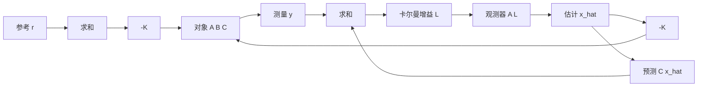
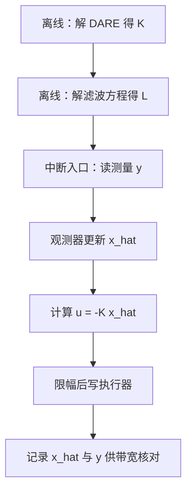

# LQG与分离原理

前三篇都假设状态可以直接读出。实际系统里能测的往往只有一部分：编码器给关节角与转速，IMU 给角速度与加速度，位置与速度要靠积分或差分重建；有些量根本没有传感器，只能从其他量推断。此时 $u = -Kx$ 里只有可测部分能直接代入，不可测部分必须换成估计值，控制律变成 $u = -K\hat{x}$。

这一步替换会不会破坏 LQR 的最优性，是 LQG 要回答的问题。结论是：对线性高斯系统，控制器与观测器可以分别设计，串起来之后整体仍然最优，闭环极点正好是两部分极点的并集。结论成立的前提是噪声确实是高斯白噪声、模型准确，这两个前提在实物上很少完全满足，由此带来 LQG 特有的鲁棒性缺口。分离原理让两个 Riccati 方程各管一段：一个算控制增益，一个算观测器增益；缺口来自两个前提在实物上不成立，LTR 尝试把回路的鲁棒性补回来。

## 状态不可测时的两条路

第一条路是把估计器当作控制器的一部分，直接把 $K$ 与观测器增益一起优化。对线性二次高斯指标，这条路的最优解与分开设计的结果相同，所以工程上没有必要联立。第二条路是先做全状态反馈设计，再用观测器替换状态，两条设计流程各自独立，验证也各自独立。

选第二条路的代价是必须给出噪声统计量。$W$ 是过程噪声协方差，反映模型误差与被忽略的扰动；$V$ 是测量噪声协方差，反映传感器的噪声水平。这两个矩阵的量纲分别是状态量平方与输出量平方，取值不对时观测器要么太慢、要么把噪声放大进控制量。第三篇的 $Q$ 与 $R$ 是设计者的性能偏好，这里的 $W$ 与 $V$ 应当尽量反映真实统计量，两类矩阵的取法有本质区别。

## 分离原理为什么成立

考虑带噪声的对象

$$
\dot{x} = A x + B u + w, \quad w \sim \mathcal{N}(0, W)
$$

$$
y = C x + v, \quad v \sim \mathcal{N}(0, V)
$$

控制器用状态估计 $\hat{x}$ 替代真实状态，观测器写成

$$
\dot{\hat{x}} = A \hat{x} + B u + L ( y - C \hat{x} )
$$

$$
u = -K \hat{x}
$$

把真实状态与估计状态拼成 $2n$ 维向量 $\begin{bmatrix} x \\ \hat{x} \end{bmatrix}$，代入 $u = -K\hat{x}$ 后得到的状态矩阵是块三角的：

$$
\begin{bmatrix} A & -BK \\ LC & A - BK - LC \end{bmatrix}
$$

块三角矩阵的特征值是两个对角块的并集。把估计误差 $e = x - \hat{x}$ 单独看，它的动力学是

$$
\dot{e} = (A - LC) e + w - L v
$$

与 $K$ 无关。两个结论合起来就是分离原理：闭环极点等于 $\operatorname{eig}(A - BK)$ 与 $\operatorname{eig}(A - LC)$ 的并集，$K$ 与 $L$ 可以各自按自己的指标设计，互不影响（`01_control_theory/lqr_control/README.md`）。

## 滤波 Riccati 方程与卡尔曼增益

控制器侧沿用第一至三篇：由 $Q$、$R$ 解 CARE 得 $K = R^{-1}B^{\mathsf T}P$。观测器侧由 $W$、$V$ 解一个结构对称的方程

$$
A P_f + P_f A^{\mathsf T} - P_f C^{\mathsf T} V^{-1} C P_f + W = 0
$$

它与 CARE 的差别是把 $A$ 换成 $A^{\mathsf T}$、$B$ 换成 $C^{\mathsf T}$、$Q$ 换成 $W$、$R$ 换成 $V$。这个对应关系叫对偶性：滤波 Riccati 方程就是原系统的“转置 LQR”方程。解出 $P_f$ 后，卡尔曼增益是

$$
L = P_f C^{\mathsf T} V^{-1}
$$

$P_f$ 同时是稳态估计误差协方差，它的对角元直接给出每个状态估计的方差量级，是判断观测器是否合理的现成指标（`README.md`）。$V$ 越大（测量越不可信），$L$ 越小，观测器越依赖模型；$W$ 越大（模型越不可信），$L$ 越大，观测器越依赖测量。

## 观测器误差的独立极点

$\operatorname{eig}(A - LC)$ 决定估计误差的收敛速度。极点越靠左，估计越快跟上真实状态，但增益 $L$ 越大，测量噪声被搬进估计的程度越高。这两者不能同时改善，取法与观测器的用途有关：控制用的观测器只需要比闭环带宽快几倍，不必追到传感器噪声带宽；用于监测或故障检测的观测器需要更快，但要额外做滤波。

一个常用的经验是让观测器带宽是控制器带宽的 3 到 10 倍。带宽定得过高时，$\hat{x}$ 的高频分量主要由测量噪声构成，再乘 $K$ 进入控制量，执行器会持续收到抖动指令。判断方法是把 $\hat{x}$ 与 $y$ 同时记录下来，比较两者在控制带宽以上频段的功率，若估计的功率明显更高，说明 $L$ 偏大。

## LQG 的鲁棒性缺口

LQR 有 $60^{\circ}$ 相位裕度与近乎无穷的增益裕度，把状态换成估计值之后这两条保证都不再自动成立。原因是裕度推导针对的是全状态反馈回路，加入观测器之后回路里多了一条“估计—控制—对象—测量—估计”的路径，两条路径的相位在高频段叠加，可能把原本的安全余量吃掉。极端情况下 LQG 的相位裕度可以小到接近零，系统在标称模型上稳定、在稍有偏差的实物上振荡（`README.md`）。

缺口的根源是控制器的设计目标里没有测量环节。$K$ 只按 $Q$ 与 $R$ 优化，$L$ 只按 $W$ 与 $V$ 优化，两者串联后形成的回路传函不在任何一项指标里。模型越接近真实、噪声越接近白噪声，缺口越小；模型有高频未建模动态时最危险，因为观测器会在高频段放大这些动态。

## LTR 恢复鲁棒性的做法

回路传函恢复（LTR）的思路是把观测器设计成“全状态反馈的近似”。在控制器输入端注入一条与真实过程噪声无关的虚拟噪声，让它沿 $B$ 的方向进入模型：

$$
W_{\text{design}} = W_0 + q^2 B B^{\mathsf T}
$$

把 $q$ 逐步增大，卡尔曼增益在高频段随之抬升，观测器对测量误差的抑制变弱，回路传函逐渐逼近全状态反馈的传函。$q$ 足够大时，LQR 的裕度在频域上被恢复（`README.md`）。这是通用做法，具体到每个对象的 $q$ 上限要由测量噪声容忍度决定，不能无限增大。

这条路有两个限制。第一，它恢复的是对象输入端的回路传函，输出端的恢复需要改注入方向；第二，$q$ 增大会把测量噪声直接放大到控制量，执行器电流纹波变大。工程上通常取一个折中值，用频域测量确认关键频段的裕度，而不是追求理论上的完全恢复。

## 三个机器人场景的噪声口径

素材仓库列了三类应用，可测状态、待估计状态与噪声来源各不相同（`README.md`）：

| 场景 | 可测状态 | 待估计状态 | 噪声来源 |
| --- | --- | --- | --- |
| 四旋翼姿态 | IMU 的角速度与加速度 | 姿态角、风扰 | 传感器噪声、阵风 |
| 机械臂 | 编码器位置 | 关节速度、末端接触力 | 量化噪声、柔性振动 |
| 移动机器人 | 里程计 | 全局位姿、滑移量 | 轮子打滑、IMU 零偏漂移 |

三类场景对 $W$ 与 $V$ 的取法不同。四旋翼的风扰是过程噪声，IMU 噪声是测量噪声，两者都容易在线估计；机械臂的柔性振动既不是白噪声也不完全是测量噪声，通常要先把高频模态滤掉再设计观测器；移动机器人的滑移是过程噪声，但它的统计量与地面相关，只能按最坏情况给一个上限。本站状态估计单元《卡尔曼滤波 KF·EKF·UKF》给出了这三类模型的噪声建模细节。

## 离散 LQG 的实现顺序

数字控制器上要按固定顺序做三件事。第一步离线解 DARE 得 $K_d$，解离散滤波方程得 $L_d$：

$$
M = A M A^{\mathsf T} - A M C^{\mathsf T} \left( C M C^{\mathsf T} + V \right)^{-1} C M A^{\mathsf T} + W, \qquad L = M C^{\mathsf T} \left( C M C^{\mathsf T} + V \right)^{-1}
$$

第二步在中断里按拍执行观测器更新，得到 $\hat{x}$；第三步计算 $u = -K_d\hat{x}$ 并限幅。顺序不能颠倒：先算控制再更新观测器，控制量用的就是上一拍的估计，多引入一拍延时。

拍长选择与观测器带宽的对应关系由离散特征值决定：$\operatorname{eig}(A_d - L_d C)$ 的模长越接近单位圆，估计收敛越慢。把目标带宽换算成离散极点后反推 $W$ 与 $V$ 的比例，比直接猜两个协方差矩阵可控。若中断周期抖动大，观测器等效带宽会随拍长变化，此时应把拍长实测值代入离散化，而不是沿用标称值。

## 小结

### 核心概念

- LQG 用 $u = -K\hat{x}$ 替代全状态反馈，$\hat{x}$ 由卡尔曼滤波器提供。
- 分离原理说明闭环极点等于 $\operatorname{eig}(A-BK)$ 与 $\operatorname{eig}(A-LC)$ 的并集，控制器与观测器可以独立设计。
- 滤波 Riccati 方程与 CARE 呈对偶关系，$L = P_fC^{\mathsf T}V^{-1}$，$P_f$ 是稳态估计误差协方差。
- LQG 不继承 LQR 的 $60^{\circ}$ 相位裕度与无穷增益裕度，裕度缺口来自回路里多出的估计路径。
- LTR 沿 $B$ 注入虚拟过程噪声 $W_0 + q^2BB^{\mathsf T}$，增大 $q$ 使回路传函逼近全状态反馈，代价是测量噪声被放大。

### 设计权衡

| 选择 | 带来的能力 | 付出的代价 |
| --- | --- | --- |
| 控制器与观测器分开设计 | 两个 Riccati 方程独立、可分别验证 | 需给出 $W$ 与 $V$ 的统计口径 |
| 提高观测器带宽 | 估计更快、相位滞后更小 | 测量噪声进入控制量 |
| 降低观测器带宽 | 控制量平滑 | 估计滞后，闭环有效相位裕度下降 |
| 用 LTR 抬升增益 $q$ | 恢复输入端的裕度 | 高频噪声放大，执行器负担加重 |
| 按拍长实测值离散化 | 带宽与设计值一致 | 需要一个可信的周期测量手段 |

## 练习

### 基础题

1. 写出分离原理给出的闭环特征值表达式，并说明 $K$ 改动后哪一组极点变化、哪一组不变。
2. 推导估计误差动力学 $\dot{e} = (A-LC)e + w - Lv$，说明其中 $K$ 为什么没有出现。
3. 说明 $W$ 与 $V$ 同时放大十倍时卡尔曼增益是否变化，并给出理由。

### 挑战题

4. 取一个二阶对象，分别把 $L$ 取为慢速与快速两组值，画出观测器带宽与 $u$ 中噪声功率的关系，说明经验带宽比 3 到 10 的来源。
5. 在 LTR 框架里说明 $q \to \infty$ 时回路传函的极限，并解释为什么实际取值要受测量噪声容忍度限制。
6. 对比连续与离散滤波 Riccati 方程在同一个 $W$、$V$ 下的解，说明 $T_s$ 增大时 $L_d$ 的变化方向。

## 附：本页引用的路径

| 路径 | 用途 |
| --- | --- |
| `01_control_theory/lqr_control/README.md` | 素材仓库 LQR 单元根：LQG 问题与分离原理、两个 Riccati 方程与组合、鲁棒性与 LTR、应用场景 |
| `docs/20-状态估计与信号处理/01-卡尔曼滤波KF·EKF·UKF` | 本站状态估计单元，KF 预测更新与噪声建模 |
| `docs/19-控制理论/02-LQR与LQG/02-Riccati方程与增益求解.md` | 本站第二篇，CARE 与 DARE 的求解方法 |
| `docs/19-控制理论/02-LQR与LQG/03-Q与R的权重设计.md` | 本站第三篇，控制器权重的量纲取法 |
| `~/robot_control_simulation` | 素材仓库根，正文中素材路径均相对该根 |
