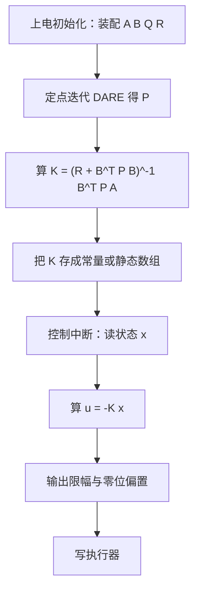
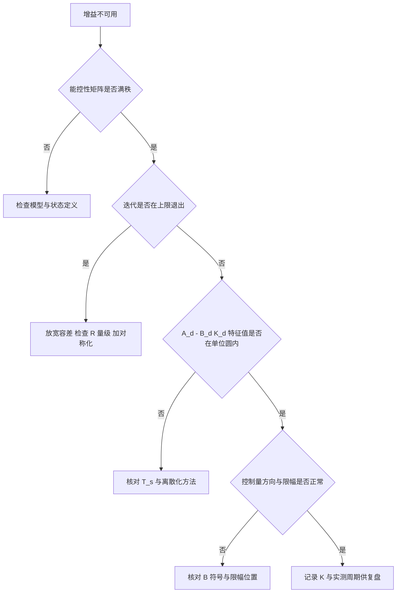

# 嵌入式LQR实现与调试

前四篇都在连续域的公式里推演，落到底盘、云台或机械臂的控制器上还要回答几个实现问题：矩阵放在栈上还是堆上、迭代多久停、单精度够不够、求解放在上电时还是每个周期都做。这几个问题的答案由两条约束决定：单片机没有动态内存与线性代数库，且控制中断里的时间预算通常以几十微秒计。

LQR 的结构天然适合这种环境。增益矩阵 $K$ 只与模型和权重有关，与当前状态无关，因此可以离线算好或上电时算一次，中断里只做 $m \times n$ 次乘加。运算量集中在求解那一步，而它不在实时路径上。素材仓库那份定点迭代实现可以按这个分工逐部分读；数值类型与终止条件的取舍决定了从增益算不出来到控制量抖动这一类问题的排查顺序。

## 定点迭代 DARE 的代码结构

素材仓库的嵌入式实现由三块组成：一个固定大小矩阵模板、一个 DARE 求解器、一个二阶系统调用示例（`01_control_theory/lqr_control/README.md:544-715`）。求解器的循环结构如下：

```cpp
Mat<N,N> P = Q;                       // 初值取 Q
for (int iter = 0; iter < maxIter; ++iter) {
    Mat<M,M> S = Bt * P * B + R;      // B^T P B + R
    Mat<M,M> S_inv = S.inverse();     // m x m 求逆
    Mat<M,N> T = Bt * P * A;          // B^T P A
    Mat<N,N> P_new = At * P * A - At * (P * B) * S_inv * T + Q;
    if (err / (normP + 1e-30) < tol) break;
    P = P_new;
}
```

循环体里每拍算两次 $n \times n$ 乘 $n \times n$、两次 $n \times n$ 乘 $n \times m$、一次 $m \times m$ 求逆。$n = 2$、$m = 1$ 时单拍几十次浮点运算，几十拍到几百拍收敛，总耗时在微秒量级；$n$ 到 6 时求逆是主要开销，单拍运算量上升一到两个数量级，仍可放在上电初始化里（`README.md:645-676`）。

求逆用带部分主元的高斯-约当消元，在模板里对 $N \times 2N$ 的增广矩阵做归一化与消去（`README.md:601-637`）。它对 $R + B^{\mathsf T}PB$ 这类小矩阵足够稳，主元选取按列内绝对值最大行交换，避免了零主元导致的除零。规模再大时这个方法不再是瓶颈，因为状态维数已经超出定点迭代的适用范围。

## 无动态内存的矩阵模板

模板把数据放在 `double data[N][M]` 的二维数组里，尺寸由模板参数在编译期固定，构造时用 `memset` 清零（`README.md:549-556`）。这样每个矩阵都是值类型，可以放在栈上，也可以作为结构体成员随对象一起分配，不涉及堆。

模板提供转置、矩阵乘、加减、标量乘与方阵求逆六种运算（`README.md:558-638`）。矩阵乘用三层循环实现，没有分块也没有向量化；在 $n \le 6$ 时循环开销可以忽略，编译器的常量展开还能把边界消掉。转置返回新矩阵而不是原地修改，所以表达式 `At * P * A` 里每个中间结果都会产生一个临时对象，栈占用按表达式深度线性增长；$n = 6$ 时一个 $6 \times 6$ 的 double 矩阵是 288 字节，几个临时对象合起来仍在 1 到 2 KB 量级。

栈用量的估算方式是数表达式里同时存在的最大矩阵数。素材代码的 `P_new` 一行同时涉及 `At`、`P`、`A`、`B`、`S_inv`、`T`、`Q` 七个矩阵，其中四个是持久对象，其余临时结果按求值顺序复用。把这个表达式拆成两行赋值可以在精度不变的前提下压低峰值栈占用，代价是多一次全矩阵赋值。

## 迭代终止与对称性维护

终止判据是相邻两拍 $P$ 的逐元素绝对差之和除以 $P$ 的逐元素绝对值之和（`README.md:665-673`）。分母加 $10^{-30}$ 防止 $P$ 全零时除零。这个判据对尺度不敏感：$P$ 的元素整体放大或缩小不影响判据值，因此不必随权重缩放调整容差。

默认容差 $10^{-10}$ 是按双精度给的。单精度浮点只有约 7 位有效数字，迭代到误差进入 $10^{-7}$ 量级后相邻两拍的差就由舍入主导，继续迭代只是空转。单精度实现应当把容差取在 $10^{-6}$ 到 $10^{-5}$ 之间，并把迭代上限从 10000 压到几百，同时记录实际退出时的拍数；退出拍数贴着上限说明没有收敛，而不是精度足够。

对称性维护是素材代码没有做的一步。$P$ 理论上对称，但矩阵乘与高斯-约当消元的舍入误差会让 $P_{ij}$ 与 $P_{ji}$ 出现微小差异，几百拍累积后可能影响 $K$ 的对称通道。每拍末尾加一次 $P_{ij} \leftarrow (P_{ij}+P_{ji})/2$ 即可压制，代价是 $O(n^2)$，相对 $O(n^3)$ 的循环体可以忽略。

## float 与 double 的取舍

素材代码用 `double`，模板也以 `double` 为元素类型（`README.md:549-553`）。带浮点单元的 Cortex-M4 上 `double` 由软件模拟或半速指令完成，单次运算比 `float` 慢数倍；求解放在上电初始化时这个差别可以接受，放在运行时则要慎重。

把元素类型换成 `float` 之前要先看 $P$ 的元素跨度。若 $Q$ 的对角元跨了三四个数量级（Bryson 规则的常见结果），$P$ 的元素跨度大致相同，单精度能分辨的相对差异仍在有效位内；若跨度超过六个数量级，$P$ 的小元素会被舍入吃掉，$K$ 的对应通道随迭代拍数跳动。稳妥做法是先把 $Q$ 与 $R$ 同时缩放，使二者量级接近，再决定用不用单精度，而不是直接换成 `float` 后调容差掩盖。

## 求解与控制律分工放在哪里

求解放上电初始化，控制律放中断。二阶示例的调用方式是在 `setup` 里算一次 $K$，在 `loop` 里只用 $K$ 乘状态向量（`README.md:690-714`、`:764-790`）。这样中断里的实时开销是 $m \times n$ 次乘加，$m = 1$、$n = 2$ 时只有两次乘加，可以忽略。

若模型或权重需要在线切换，可以把几组 $(A,B,Q,R)$ 的求解结果预先算好存成数组，运行时按工况查表选 $K$，而不是在线解 Riccati 方程。在线求解只有在模型参数连续变化时才有必要，此时应把求解放进低优先级任务并检查它是否能在模型切换周期内完成，不能放进中断。



## 采样周期与离散参数的校核

离线求解用的 $T_s$ 必须等于实际控制周期。校核方法是同时记录三样东西：中断入口的时间戳、控制周期的实测值、以及 $A_d - B_dK_d$ 特征值的模长。若实测周期比标称值大 20% 以上，离散模型已经偏离设计点，闭环等效阻尼会下降，应在实测周期上重新离散化并重算增益。

周期抖动同样影响结果。定周期任务的抖动通常在几十微秒量级，相对 1 ms 周期是几个百分点，影响有限；若抖动接近周期的十分之一，等效采样率下降，此时应优先修任务调度而不是继续调权重（`README.md:816-827` 的第 7 条给出控制频率应为系统带宽 5 到 10 倍的依据）。

## 典型误用与排查顺序

从“算不出 $K$”到“控制量抖动”，按下面的顺序核对（`README.md:819-827`）：

| 现象 | 优先核对项 | 判据 |
| --- | --- | --- |
| 迭代到上限仍未收敛 | 能控性能检性、$R$ 是否过小 | 能控性矩阵满秩；$R+B^{\mathsf T}PB$ 条件数在 $10^6$ 以内 |
| $K$ 算出来但闭环发散 | $A_d$、$B_d$ 是否与 $T_s$ 匹配 | $A_d - B_dK_d$ 特征值模长全小于 1 |
| 控制方向反了 | $B$ 的符号与执行器增益符号 | 开环阶跃响应的方向与 $u$ 同号 |
| 控制量长期触限 | $R$ 是否偏小、$u = -Kx$ 是否带积分 | 限幅占空比与 $K$ 的范数 |
| 状态估计噪声大 | 观测器带宽与滤波器 | 见 LQG 篇的带宽判据 |
| 稳态有偏差 | 是否用了纯比例形式 | 需要 LQI 增广或前馈 |

第一行与第二行是求解问题，第三行之后是实现问题。先在离线环境用成熟工具（例如 Python 的 `scipy.linalg` 求解器）算出同一组 $(A,B,Q,R)$ 的 $K$ 作为参考值，再与嵌入式结果逐元素比较，可以把公式写错与数值精度不足分开。这一步是通用做法，素材仓库没有现成脚本。



## 与 PID 单元的交界问题

本站《PID 整定与抗饱和》单元讨论的积分限幅与微分滤波在这里仍然适用，但触发条件不同。LQR 本体是静态状态反馈，没有积分状态，因此不存在积分饱和；一旦加上 LQI 增广，$x_I$ 就是一个会累积的状态，输出限幅时必须对 $x_I$ 做限幅或条件积分，否则偏差持续存在时积分项会一直增长，退出限幅后出现大超调。微分滤波在 LQR 里没有对应环节，状态反馈的相位裕度已由 LQR 本身保证，额外加低通滤波只会吃掉相位。

另一个交界是输出限幅后的行为。LQR 增益是按无约束最优算出的，一旦执行器触限，实际控制量不再等于 $-Kx$，闭环退化为带饱和的非线性系统，标称极点不再描述行为。此时应限制参考轨迹的变化率，或在设计阶段就把 $R$ 取大一些让控制量留出余量，而不是事后加抗饱和逻辑，因为 LQR 没有可回退的积分状态。

## 小结

### 核心概念

- 固定大小矩阵模板用编译期尺寸的二维数组保存数据，无动态内存，适合 $n \le 6$ 的嵌入式场景。
- 定点迭代每拍一次 $m \times m$ 求逆，终止判据是 $P$ 的相对变化量，分母加 $10^{-30}$ 防零除。
- 容差要与数值类型匹配：双精度取 $10^{-10}$，单精度取 $10^{-6}$ 量级，并记录实际退出拍数。
- 每拍对称化 $P$ 可以压制舍入误差引起的非对称增长。
- 求解放在上电或低优先级任务，中断里只做 $u = -Kx$ 的乘加与限幅。

### 设计权衡

| 选择 | 带来的能力 | 付出的代价 |
| --- | --- | --- |
| 固定尺寸栈上矩阵 | 无动态内存、无碎片 | 维数上限在编译期锁定 |
| 每拍重新求逆 | 迭代结构简单、代码短 | $m$ 较大时运算量上升快 |
| 用单精度代替双精度 | 运算快数倍 | $P$ 元素跨度大时精度不足 |
| 求解放上电初始化 | 实时路径几乎零开销 | 模型在线变化时无法跟随 |
| 预先算好多组 $K$ 查表 | 切换工况无需在线求解 | 存储占用随工况数线性增长 |

## 练习

### 基础题

1. 数出二阶示例一次迭代里的乘法次数，并说明 $n$ 增大到 6 时哪一部分增长最快。
2. 解释终止判据为什么要除以 $\lVert P \rVert$ 而不是用绝对误差，并给出一个绝对误差判据失效的权重组合。
3. 说明为什么 `P = Q` 可以作为定点迭代的初值，而 Newton-Kleinman 的初值必须使闭环稳定。

### 挑战题

4. 为单精度实现设计一组缩放方案，使 $Q$ 与 $R$ 量级接近，并估算缩放后 $P$ 的元素跨度。
5. 写出带对称化与不带对称化的两份迭代，用同一组权重比较退出拍数与 $K$ 的差异，说明对称化是否改变了收敛速度。
6. 设计一个在线切换 $K$ 的方案，要求切换瞬间控制量不跳变，给出过渡策略与其对闭环极点的影响。

## 附：本页引用的路径

| 路径 | 用途 |
| --- | --- |
| `01_control_theory/lqr_control/README.md` | 素材仓库 LQR 单元根：矩阵模板（:549-638）、定点迭代求解器（:640-688）、二阶示例（:690-714）、AutoLQR 接口（:717-791）、实用结论（:816-827） |
| `docs/19-控制理论/01-PID整定与抗饱和` | 本站 PID 单元，积分限幅、条件积分与微分滤波的对照 |
| `docs/19-控制理论/02-LQR与LQG/02-Riccati方程与增益求解.md` | 本站第二篇，DARE 迭代的收敛性与终止条件 |
| `docs/19-控制理论/02-LQR与LQG/04-LQG与分离原理.md` | 本站第四篇，观测器带宽与离散滤波方程 |
| `~/robot_control_simulation` | 素材仓库根，正文中素材路径均相对该根 |
