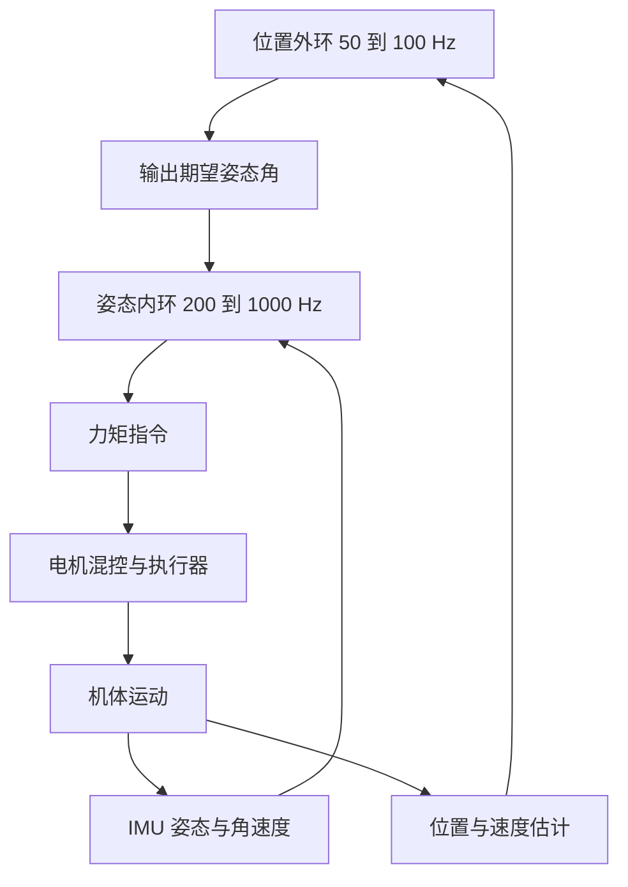
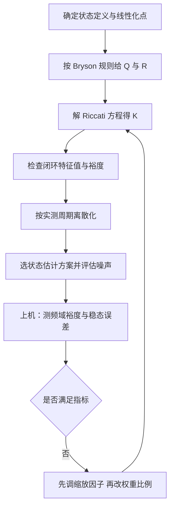

# LQR的机器人落地口径

前五篇把 LQR 从问题构造推到嵌入式实现，公式与代码都可以独立验证。把方法落到具体平台上时，还有一批与对象无关、与平台相关的选择：状态怎么定义、在哪个点线性化、滤波器用哪一套、控制频率定多少、离散化用哪种变换。这些选择不改变 LQR 的数学结构，但它们决定实际闭环是否与设计一致。

素材仓库专门列了一节机器人应用（`01_control_theory/lqr_control/README.md:387-434`）与一节实用要点（`:816-827`），四类平台的配置口径与从建模到上机的验证顺序在素材的两节里都有落点。站内《MPC 与 NMPC》单元讨论带约束的规划层，与这里的反馈层是配合关系。

## 两轮自平衡平台

状态取 $x = [\theta, \dot{\theta}, p, \dot{p}]^{\mathsf T}$，$\theta$ 是车身倾角，$p$ 是位置，模型在直立平衡点附近线性化（`README.md:389-396`）。控制器用 LQI 形式，位置积分项消除摩擦与斜坡造成的稳态偏差（`:398`）。

实施要点有四条（`:400-405`）。倾角由 IMU 的加速度与角速度经互补滤波或 Mahony 滤波器融合得到，单靠加速度计在运动时会被平动加速度污染，单靠陀螺仪会随时间漂移。倾角速度可以直接取陀螺仪读数，也可以用状态观测器估计，前者噪声大但无相位滞后，后者平滑但需要模型准确。控制频率通常需要 100 到 1000 Hz，低于 100 Hz 时内环阻尼不足。离散化用零阶保持或 Tustin 变换，Tustin 保稳性但频段映射有畸变，零阶保持与数字实现的语义一致。

第三篇的权重表就来自这个平台：倾角 0.17 rad 对应 $Q_{11} \approx 34.6$，位置 0.1 m 对应 $Q_{33} = 100$，电压 12 V 对应 $R = 0.0069$。这组数字可以直接作为起步值，再按单车实测调缩放因子。

## 四旋翼的级联结构

四旋翼状态取 $x = [\phi, \dot{\phi}, \theta, \dot{\theta}, \psi, \dot{\psi}, z, \dot{z}]^{\mathsf T}$，LQR 常用在级联结构里（`README.md:407-414`）：内环控制三个姿态角，频率 200 到 1000 Hz；外环控制位置，频率 50 到 100 Hz。

分环的依据是时间尺度分离。姿态环的动态比位置环快一个数量级，外环输出的期望姿态作为内环参考，内环带宽足够高时外环可以把内环近似成比例环节。分开设计之后，每个子系统的状态维数降到 2 到 4，Riccati 方程的求解规模很小，可以放在飞控的初始化阶段。

需要额外处理的是姿态表示。在悬停附近用欧拉角线性化即可，做大角度机动时欧拉角有奇异点，且绕轴旋转顺序会引入耦合误差。工程上把姿态环放在四元数或旋转矩阵上，用误差四元数的向量部分作为状态，这样线性化只在小角度修正量上进行，奇异问题被绕开（通用做法，素材仓库只给出欧拉角形式的状态定义）。

## 机械臂的三种用法

机械臂状态取 $x = [q, \dot{q}]^{\mathsf T}$，$q$ 是关节角度向量（`README.md:416-424`）。素材给出的三种用法是独立关节 LQR、全状态 LQR 与计算力矩加 LQR。

独立关节设计忽略关节间耦合，每个关节按二阶模型单独算增益，实现最简单，代价是高速运动时耦合力矩被当作扰动，稳态与动态误差都随速度上升。全状态设计把耦合动力学一次纳入，需要完整的 $M(q)$、$C(q,\dot{q})$、$g(q)$ 模型，且模型随位形变化，严格来说要在线更新增益。计算力矩加 LQR 走第三种路线：用模型算出补偿力矩 $M(q)\ddot{q}_d + C\dot{q} + g$，再对补偿后的近似解耦系统用一组固定 LQR 增益调节误差。

第三种用法在工程上最常见，因为它把非线性部分交给前馈模型，把 LQR 留给误差调节，模型误差由反馈吸收。素材仓库的实用要点里也把状态估计与鲁棒性列在权重之后（`:816-827`），机械臂的关节速度通常由编码器差分加低通滤波得到，滤波器的相位滞后要算进环路裕度。

## 移动机器人的轨迹跟踪

移动机器人（AGV 与 AMR）的用法与前三种不同：LQR 的调节对象是相对参考轨迹的位姿误差，而不是状态本身（`README.md:426-434`）：

$$
\dot{e} = A(t) e + B(t) u
$$

$e$ 是位姿误差，$A(t)$ 与 $B(t)$ 随参考轨迹上的位置变化。这是时变系统，严格做法是每个时间步重新求解 Riccati 方程，得到时变增益（时变 LQR）。在线解 Riccati 方程的代价随状态维数增长，实践中常用两条替代路径：把轨迹分成若干段，每段用小范围线性化得到的定常模型，切换时对增益做插值；或者把速度作为调度变量，对若干典型速度预先算好增益表，运行时按当前速度查表。

误差状态的定义决定跟踪效果。以横向误差、航向误差与速度误差为状态的模型在直线段表现良好，曲率大的路段需要加入前馈项把参考角速度直接送进控制量，否则纯反馈会留下与曲率成正比的稳态横向偏差。这一条与第四篇 LQG 里前馈补偿的思路一致。

## 线性化点与有效范围

四类平台的模型都来自某个工作点的线性化：两轮平台在直立平衡点（«01_control_theory/lqr_control/README.md:396»），四旋翼在悬停点，机械臂在某个工作位形，移动机器人在参考轨迹上的若干点。线性化点选得离实际工作范围越远，模型误差越大，同一组增益的实际表现越差。

有效范围的估计方法是通用做法：把线性化模型与真实非线性模型从同一初值各积分一个控制周期，比较状态偏差；再把偏差沿预测的时间尺度累积，若累积值超过允许控制精度的三分之一，就说明该工作点不适用。这个判据不需要额外工具，只需要一个能积分的非线性模型。

超出有效范围时有三种处置：缩小工作范围，让控制器只在近平衡点区域工作；引入增益调度，把工作范围分段并各自线性化；把非线性部分前馈补偿掉，只对补偿后的近似线性系统用固定增益。机械臂的计算力矩法与移动机器人的增益调度分别对应后两种，选择依据是模型是否可得以及调度变量的可测量性。

## 一组可复用的实施要点

素材仓库把实用要点总结成七条（`README.md:816-827`），按上机顺序排列如下：

| 顺序 | 要点 | 判据 |
| --- | --- | --- |
| 1 | 权重先按 Bryson 规则起步 | 各元素有物理含义 |
| 2 | 跟踪问题加积分作用 | 常值扰动下稳态误差归零 |
| 3 | 离散化与采样周期匹配 | 离散闭环特征值在单位圆内 |
| 4 | 求解器按维数选 | 低维定点迭代、中等规模 Schur |
| 5 | 状态估计误差要评估 | 观测器带宽与噪声水平 |
| 6 | 鲁棒性要做频域核对 | 相位裕度不小于 45 度留有余量 |
| 7 | 控制频率取带宽的 5 到 10 倍 | 常用 200 到 1000 Hz |

第 7 条给出的频率范围与两轮平台的实施要点一致：100 到 1000 Hz 是这类系统的实际区间，具体值由闭环带宽与执行器响应决定。频率选得过高时，量化噪声与采样抖动会进入控制量；过低时离散化误差与相位滞后吃掉裕度。

第 4 条与第 5 条是两类不同的误差来源：求解器给出的是数值误差，观测器给出的是估计误差，两者的排查方法不同。把两者混在一起调参会让问题定位困难，正确顺序是先确认求解结果与参考值一致，再评估估计误差对闭环的影响。

## 与 MPC 单元的交界

LQR 与本单元后面要讲的 MPC 在机器人上常组成分工：MPC 以较低频率生成参考状态或参考轨迹，LQR 以内环形式高频跟踪。选 LQR 的场合是约束不硬、模型在平衡点附近可用、频率需求高；选 MPC 的场合是约束必须显式处理、需要预测未来的参考变化。

两条路线的公共部分是权重设计。Bryson 规则同时适用于 LQR 的 $Q$、$R$ 与 MPC 的 $Q$、$R$、$S$，量纲解释也一致，因此同一套权重口径可以在两层之间复用。站内《MPC 与 NMPC》单元与《LQR 与 LQG》前三篇共用这一口径。

## 小结

### 核心概念

- 两轮平衡平台的 LQR 用 LQI 形式，倾角由互补滤波或 Mahony 滤波获得，频率 100 到 1000 Hz，离散化用 ZOH 或 Tustin。
- 四旋翼用姿态内环与位置外环的级联结构，内环 200 到 1000 Hz、外环 50 到 100 Hz，分环依据是时间尺度分离。
- 机械臂有独立关节、全状态、计算力矩加 LQR 三种用法，第三种把非线性前馈与误差反馈分开。
- 移动机器人的轨迹跟踪是时变系统，可用在线求解、分段定常或增益调度三条路径近似。
- 实施要点按权重、积分、离散化、求解器、估计、鲁棒性、控制频率七项顺序核对。

### 设计权衡

| 选择 | 带来的能力 | 付出的代价 |
| --- | --- | --- |
| 互补滤波或 Mahony 融合倾角 | 兼顾动态与零偏 | 需要整定融合系数 |
| 姿态内环与外环分离 | 每环维数低、求解便宜 | 内环带宽不足时外环近似失效 |
| 计算力矩加 LQR | 非线性前馈加线性调节 | 需要完整动力学模型 |
| 增益调度 | 避免在线解 Riccati | 调度点之间需要插值与验证 |
| 控制频率取带宽 5 到 10 倍 | 相位滞后小、量化噪声可控 | 计算与功耗上升 |

## 练习

### 基础题

1. 写出四旋翼姿态内环的状态定义与外环的输出关系，说明为什么内环带宽要高于外环。
2. 说明独立关节 LQR 在什么速度范围内可用，以及速度上升后误差的主要来源。
3. 解释移动机器人轨迹跟踪为什么是时变系统，并列出两条避免在线求解 Riccati 方程的路径。

### 挑战题

4. 为两轮平衡车设计一组 LQI 权重，位置积分权重按 Bryson 规则给出，并说明积分权重增大后超调的变化趋势。
5. 设计一个增益调度方案，覆盖三档速度的移动机器人轨迹跟踪，说明调度变量选择与切换时的平滑措施。
6. 对比计算力矩加 LQR 与全状态 LQR 在模型误差 20% 下的闭环表现，说明前馈误差由哪一环吸收。

## 附：本页引用的路径

| 路径 | 用途 |
| --- | --- |
| `01_control_theory/lqr_control/README.md` | 素材仓库 LQR 单元根：LQI 增广（:256-305）、机器人应用（:387-434）、实用要点（:816-827） |
| `docs/19-控制理论/02-LQR与LQG/03-Q与R的权重设计.md` | 本站 LQR 第三篇，Bryson 规则与两轮算例 |
| `docs/19-控制理论/02-LQR与LQG/04-LQG与分离原理.md` | 本站 LQR 第四篇，状态估计与前馈补偿 |
| `docs/19-控制理论/03-MPC与NMPC/01-MPC的问题构造与滚动时域.md` | 本站 MPC 第一篇，约束处理与两层分工 |
| `~/robot_control_simulation` | 素材仓库根，正文中素材路径均相对该根 |
