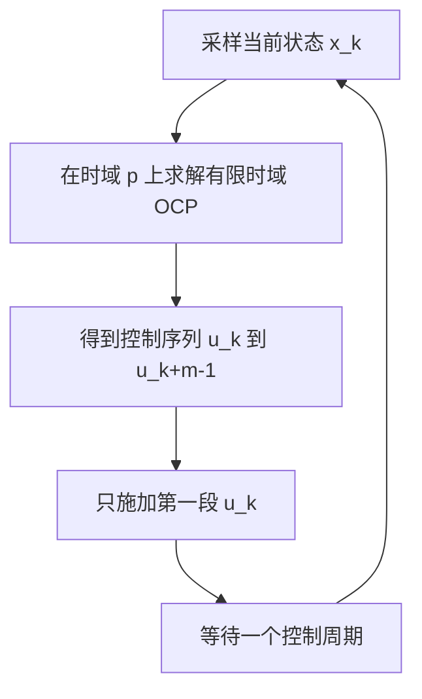
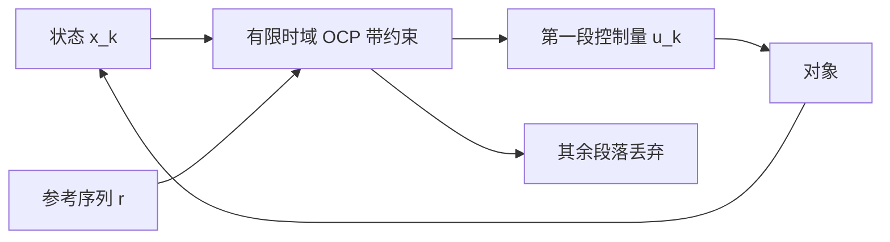

# MPC的问题构造与滚动时域

PID 与 LQR 都用一个固定结构把当前状态映射成控制量：前者是误差的三项组合，后者是状态的一次反馈。两者的共同点是只看当前时刻，约束只能事后靠限幅处理。当系统必须始终满足某些硬性条件（关节角度不越限、足端接触力落在摩擦锥内、电机电流不超过额定值）时，事后限幅就不够了，因为它无法提前知道这一步的动作会不会把下一步逼进死角。

MPC 的做法是在每个控制周期里显式求解一个有限时域的最优控制问题，把约束直接写进优化，只把最优序列的第一段施加到系统，下一周期拿到新状态后重算。这个滚动结构让约束在预测范围内被提前考虑，代价是每个周期都要解一次优化问题，实时性与实现复杂度随之上升。求解器与稀疏结构、约束与可行性、线性与非线性模型的分工、嵌入式部署分别在后续四篇。

素材仓库 `01_control_theory/mpc_control/README.md` 给出了完整推导与求解器数据，本页引用它时写成相对路径加行号。

## 每个周期解一个有限时域问题

滚动时域的执行顺序是固定的：读入当前状态 $x_k$，在预测时域 $N$ 上求解一个从 $k$ 到 $k+N$ 的最优控制问题，把求得的最优序列的第一段 $u_k^{*}$ 写进执行器，然后令 $k \leftarrow k+1$ 重复。素材仓库用一张流程图把这个循环列了出来（`01_control_theory/mpc_control/README.md:28-39`）。

这个循环带来两个性质。第一，优化在约束下给出未来若干步的动作计划，相当于前馈；第二，每周期都根据实测状态重算，相当于反馈。两者叠加之后，MPC 对模型误差的敏感度低于纯前馈轨迹跟踪，对约束的处理能力强于纯反馈。

需要区分的是“解出的最优序列”与“实际施加的控制”。序列的长度是 $m$，只有第一段被使用，其余段落的作用是让第一段知道后续还有调整空间。这也解释了为什么预测时域 $p$ 比控制时域 $m$ 长：$m$ 之后控制量保持常数，$p$ 决定优化能看到多远的未来（`README.md:68-74`）。

素材仓库给出的典型取值是：预测时域 $p$ 取 10 到 20 拍，控制时域 $m$ 取 $p$ 的 10% 到 20%，采样周期 1 到 100 ms。

| 参数 | 典型范围 | 说明 |
| --- | --- | --- |
| 预测时域 $p$ | 10 到 20 拍 | 优化能看到多远的未来 |
| 控制时域 $m$ | $p$ 的 10% 到 20% | 决策变量个数由此决定 |
| 采样周期 $T_s$ | 1 到 100 ms | 与闭环带宽匹配 |
| $Q$ | 设计者给定 | 输出跟踪加权，半正定 |
| $R$ | 设计者给定 | 控制幅值加权，正定 |

$m$ 取得这么短的原因是决策变量数由 $m$ 决定，而预测精度由 $p$ 决定：$m$ 之后控制量保持常数，仍然提供预测信息，但不增加优化维数。$m = p$ 时问题规模最大而信息增量有限，因此很少这样取。预测矩阵的维数是 $\Psi \in \mathbb{R}^{N n_x \times n_x}$、$\Gamma \in \mathbb{R}^{N n_x \times N n_u}$，$\Gamma^{\mathsf T}\bar{Q}\Gamma$ 的规模由 $n_u N$ 决定，这是第二篇里求解时间随时域放大的来源。

## 预测模型怎么写成等式约束

线性时不变模型取离散状态空间形式

$$
x(k+1) = A x(k) + B u(k), \qquad y(k) = C x(k)
$$

预测就是把模型沿时域展开。把 $x(k+1)$ 到 $x(k+N)$ 叠成一个列向量 $X$，把 $u(k)$ 到 $u(k+N-1)$ 叠成 $U$，展开后得到

$$
X = \Psi x(k) + \Gamma U
$$

$\Psi$ 由 $A$ 的幂次堆叠而成，$\Gamma$ 是一个下三角块矩阵，第 $i$ 行第 $j$ 列是 $A^{i-j-1}B$（$j < i$），其余为零（`README.md:174-194`）。$\Gamma$ 的下三角结构来自因果性：$u(k+j)$ 只影响 $x(k+j+1)$ 及其之后的时刻，不影响更早的状态。

把预测写成 $\Psi x + \Gamma U$ 之后，初始状态作为已知量进入常数项，决策变量只剩控制序列 $U$。这一步把动态系统的多步预测问题变成了一个以 $U$ 为变量的静态优化问题，模型的所有动态都被吸收进 $\Psi$ 与 $\Gamma$ 两个矩阵。

## 代价函数里的四类项

标准代价由四部分组成（`README.md:53-64`）：

$$
J = \sum_{i=1}^{p} \lVert y(k+i) - r(k+i) \rVert_Q^2 + \sum_{i=0}^{m-1} \lVert u(k+i) \rVert_R^2 + \sum_{i=0}^{m-1} \lVert \Delta u(k+i) \rVert_S^2 + \rho_\varepsilon \varepsilon^2
$$

第一项是输出跟踪误差，把预测输出拉向参考轨迹，权重 $Q$ 与 LQR 里的状态权重作用类似但作用在输出上。第二项惩罚控制量幅值，防止稳态占用过大。第三项惩罚控制量的变化率 $\Delta u = u(k+j) - u(k+j-1)$，作用是抑制控制抖动；没有这一项时，两个等价的控制序列可能交替出现，执行器会持续抖动。第四项是松弛变量的二次惩罚，只在约束软化时出现，具体用法放在第三篇。

四项的量纲需要分别对齐。$Q$、$R$、$S$ 的取法与 Bryson 规则同源：先定各量的最大可接受偏差与允许幅值，取倒数平方作为对角元素，再整体缩放。$S$ 的量纲是控制量平方的倒数，它相对 $R$ 的比值决定平滑程度，$S$ 过大时控制动作被压得过慢，跟踪误差上升。

## 标准 QP 的 H 与 f 怎么来

把 $X = \Psi x(k) + \Gamma U$ 代入代价并展开，$X_{ref}$ 作为参考序列是已知量。整理后二次项只出现在 $U$ 里：

$$
H = 2\left( \Gamma^{\mathsf T} \bar{Q} \Gamma + \bar{R} \right)
$$

$$
f = 2 \Gamma^{\mathsf T} \bar{Q} \left( \Psi x(k) - X_{ref} \right)
$$

$\bar{Q}$ 与 $\bar{R}$ 是把各拍权重按块对角拼成的矩阵（`README.md:196-202`）。$H$ 与初始状态无关，可以在离线阶段算好；$f$ 随 $x(k)$ 变化，每周期重算一次。这个分工是 MPC 实现里最重要的结构性质：占用计算量最大的矩阵乘 $\Gamma^{\mathsf T}\bar{Q}\Gamma$ 只做一次，实时路径上只剩向量与矩阵的乘法。

得到 $H$ 与 $f$ 之后，问题写成

$$
\min_U \quad \frac{1}{2} U^{\mathsf T} H U + f^{\mathsf T} U \qquad \text{s.t.} \quad lb \leq A_{con} U \leq ub
$$

$H$ 正定，问题严格凸，因此最优解唯一，任何满足 KKT 条件的点都是全局最优解（`README.md:76-82`）。这一点与 NMPC 的非凸问题有本质区别，也是线性 MPC 在嵌入式上更可控的原因。

## 滚动时域为什么同时有前馈与反馈

把控制序列的第一段写成对当前状态的函数，可以看出反馈是如何进入的。$f$ 里含有 $\Psi x(k)$ 项，$x(k)$ 变化会改变 $f$，进而改变最优解 $U^{*}$。因此同一个优化问题在状态不同时给出不同动作，闭环里就带了状态反馈。

前馈来自参考序列 $X_{ref}$ 与模型。若参考轨迹未来会转弯，$X_{ref}$ 里对应拍的目标位置会提前变化，最优解在还没到转弯点之前就开始动作。纯反馈控制器只能在误差出现后纠正，MPC 可以提前响应，差别就来自预测模型。

这个结构也说明模型误差的后果。若 $\Psi$ 与 $\Gamma$ 使用的模型与真实对象不符，预测轨迹会偏离真实轨迹，优化是在错误的预测上求最优，闭环性能下降。滚动重算只能部分补偿：模型误差造成的前馈偏差会在下一周期的测得状态里体现出来，但一个周期内的偏差无法消除。

## 与 LQR 的分工

两者都用二次代价与线性模型，差别在约束和时域。LQR 的代价是无穷时域积分、无约束、有闭式解，增益一次算好；MPC 的代价是有限时域求和、带约束、每周期解一次 QP。把约束去掉、时域拉到无穷，MPC 解出的第一段控制律会收敛到 LQR 的 $u = -Kx$，$K$ 由相应的 Riccati 方程给出，这条联系可以当作两者的交叉验证手段。

实际系统里常用的分工是：外层 MPC 以较慢频率生成参考轨迹或参考状态，内层 LQR 或 PD 以较高频率跟踪。频率需求超过 1 kHz 时通常不直接跑 MPC，而让它只做轨迹生成（`README.md:673-677`）。本站《LQR 与 LQG》单元给出了内层反馈的完整设计流程，两篇的权重取法可以共用一套 Bryson 规则。

## 小结

### 核心概念

- MPC 每周期在预测时域上求解一次有限时域最优控制问题，只施加最优序列的第一段，下一周期用新状态重算。
- 线性模型展开后得到 $X = \Psi x(k) + \Gamma U$，动态被吸收进 $\Psi$ 与 $\Gamma$，决策变量只剩控制序列 $U$。
- 代价由输出跟踪、控制幅值、控制变化率与松弛变量四项组成，权重取法与 Bryson 规则同源。
- 标准 QP 的 $H = 2(\Gamma^{\mathsf T}\bar{Q}\Gamma + \bar{R})$ 与状态无关可离线计算，$f$ 含 $\Psi x(k)$ 需每周期重算，$H$ 正定保证全局最优。
- 前馈来自模型与参考序列，反馈来自每周期用实测状态重算 $f$；与 LQR 在无约束无穷时域极限下一致。

### 设计权衡

| 选择 | 带来的能力 | 付出的代价 |
| --- | --- | --- |
| 显式求解有限时域约束问题 | 约束在预测范围内被提前处理 | 每周期一次优化，实时性压力大 |
| 预测时域 $p$ 取长 | 看得更远、约束考虑更充分 | 求解时间按多项式增长 |
| 控制时域 $m$ 取短 | 决策变量少、求解快 | 后续控制自由度受限 |
| 加入 $\Delta u$ 惩罚 | 控制平滑、执行器寿命好 | 阶跃响应变慢 |
| 与 LQR 分工 | 内层高频稳定、外层处理约束 | 两层频率要协调，接口需定义 |

## 练习

### 基础题

1. 对二阶系统 $A = \begin{bmatrix} 1 & T_s \\ 0 & 1 \end{bmatrix}$、$B = \begin{bmatrix} T_s^2/2 \\ T_s \end{bmatrix}$，写出 $N = 3$ 时的 $\Psi$ 与 $\Gamma$。
2. 说明为什么 $H$ 与初始状态无关，而 $f$ 与初始状态线性相关。
3. 列出代价四项各自的量纲，并说明 $S$ 相对 $R$ 的比值如何影响控制平滑度。

### 挑战题

4. 取一个二阶对象，分别用 $p = 10$ 与 $p = 20$、$m$ 固定为 2 求解同一组跟踪问题，比较前几步的控制量差异并解释时域的影响。
5. 推导把 $\Delta u$ 惩罚改写为对 $U$ 的二次型时 $H$ 与 $f$ 的修正项，说明差分矩阵的秩亏如何处理。
6. 说明若把预测模型换成与真实对象不同的参数，闭环为什么会保留一个小稳态偏差，以及积分状态能否消除它。

## 附：本页引用的路径

| 路径 | 用途 |
| --- | --- |
| `01_control_theory/mpc_control/README.md` | 素材仓库 MPC 单元根：滚动时域与 QP 形式（:22-82）、时域长度影响（:84-94）、密集 QP 推导（:168-206）、控制器选择（:657-699） |
| `docs/19-控制理论/02-LQR与LQG/01-LQR问题的构造与代价函数.md` | 本站 LQR 第一篇，用于对照无穷时域与有限时域的差别 |
| `docs/19-控制理论/01-PID整定与抗饱和` | 本站 PID 单元，事后限幅与显式约束的对照 |
| `~/robot_control_simulation` | 素材仓库根，正文中素材路径均相对该根 |
