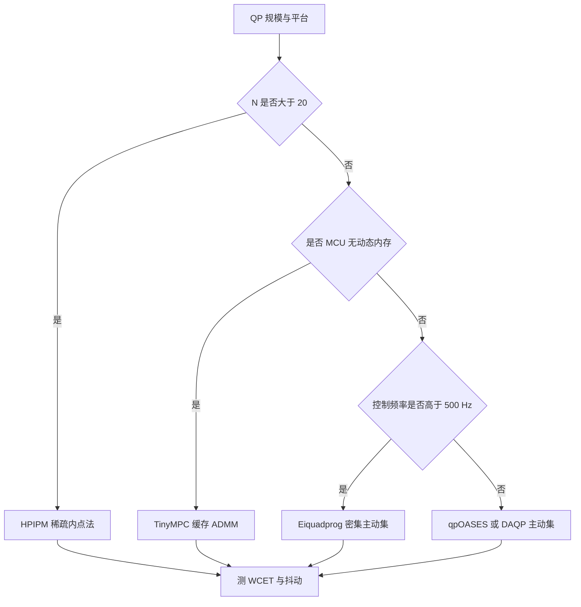
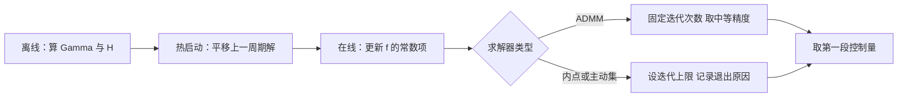

# 最优控制问题与QP求解

第一篇把 MPC 的在线任务归约成一个每周期求解的凸二次规划。问题的规模由预测时域与状态维数决定，结构由预测矩阵决定，而求解时间决定这套控制能不能塞进一个控制周期。同一个 QP，交给不同算法的求解器，耗时可以差一个数量级；同一个求解器，时域从 10 加到 20，耗时也会涨到七倍以上。

这一篇关心三件事：系数矩阵怎么组装、算法路线怎么选、时间从哪里省出来。组装部分的结论是离线在线分工；算法部分按稀疏与密集、一阶与二阶分三路线；省时间的手段按收益排序是热启动、稀疏结构、固定迭代次数。素材仓库给出了八种求解器的特性表与 Jetson Orin 上的基准数据，本页的数据都取自它。

## 密集 QP 的系数矩阵怎么组装

第一篇给出了 $H$ 与 $f$ 的表达式。组装过程分成两步：先把各拍权重按块对角拼成 $\bar{Q}$ 与 $\bar{R}$，再算 $\Gamma^{\mathsf T}\bar{Q}\Gamma$ 与 $\Gamma^{\mathsf T}\bar{Q}\Psi$。前者只与模型和权重有关，可以在初始化阶段算好存起来；后者乘上当前状态与参考序列得到 $f$（`01_control_theory/mpc_control/README.md`）。

约束矩阵 $A_{con}$ 的组装同样有固定结构。控制幅值约束只作用在 $U$ 上，对应单位矩阵的堆叠；状态约束通过 $X = \Psi x + \Gamma U$ 转写成对 $U$ 的不等式，初始状态项 $-X_{\min} + \Psi x$ 与 $X_{\max} - \Psi x$ 进入上下界（`README.md`）。约束矩阵本身与状态无关，可以预先算好。

这样组装出来的 $H$ 是密集的：$\Gamma$ 是下三角块矩阵，$\Gamma^{\mathsf T}\bar{Q}\Gamma$ 一般没有可用的稀疏结构。$N = 30$、$n_u = 4$ 时决策变量 120 个，$H$ 是 $120 \times 120$ 的密集矩阵，元素数一万四千余个。密集存储与分解的代价随时域平方到三次增长，这是第二篇要面对的规模问题。

## 时域长度对求解时间的放大

素材仓库给出的经验缩放规律是（`README.md`）：

| 求解器 | 复杂度缩放 | $N$ 翻倍时增长 |
| --- | --- | --- |
| OSQP（ADMM） | $\sim O(N^{2.87})$ | 约 7.3 倍 |
| qpOASES（Active Set） | $\sim O(N^{3.12})$ | 约 8.7 倍 |
| Gurobi（高阶内点法） | $\sim O(N^{2.74})$ | 约 6.7 倍 |

三条指数都在三点上下，意味着时域翻倍要付出约七到九倍的时间。这个规律对设计的影响是直接的：预测时域不能按“看得越远越好”来取，而要按周期预算倒推。10 到 20 拍的时域在多数机器人场景够用，控制时域取 $p$ 的 10% 到 20% 可以显著压小决策变量数，因为约束与二次项只作用在 $m$ 段上（`README.md`）。

若确实需要长时域，办法是换用能利用稀疏结构的求解器，而不是继续用密集 ADMM。稀疏结构来自把状态也当作决策变量，保留块三对角形式，代价是决策变量数从 $m$ 段增到 $N$ 段，但每段的耦合只到相邻拍。

## 在线路径上实际要算的是什么

每个控制周期执行的只有三段运算。第一段更新 $f$，展开是 $\Gamma^{\mathsf T}\bar{Q}(\Psi x(k) - X_{ref})$，可以离线拆成两个常量矩阵乘上向量；$n_x = 12$、$N = 20$、$n_u = 4$ 时这一步约几千次乘加。第二段组装约束上下界，把 $\Psi x(k)$ 乘出来再与常数列向量相减，量级与第一段相当。第三段是求解器迭代，占总耗时的大头。

| 阶段 | 运算量级 | 是否随状态变化 | 可否离线 |
| --- | --- | --- | --- |
| 更新 $f$ | $O(n_x^2N + n_xn_uN)$ | 是 | 常量部分可离线 |
| 组装约束界 | $O(n_xN)$ | 是 | 否 |
| 求解器迭代 | 由算法与迭代次数决定 | 是 | 否 |
| 组装 $H$ 与约束矩阵 | $O((n_x+n_u)^3N^3)$ 一次 | 否 | 全部可离线 |

最后一行说明把组装放到初始化阶段为什么划算：它的量级比实时路径上的前两条高几个数量级，放在控制中断里会直接吃掉周期预算。素材仓库的基准数据测的就是第三段的耗时（«01_control_theory/mpc_control/README.md»），前三行的量级是本页的估算，素材仓库没有对应实测。

## 求解器的三种算法路线

素材仓库的求解器表（`README.md`）可以按算法归成三类：

| 算法 | 代表 | 迭代性质 | 适合的规模 |
| --- | --- | --- | --- |
| 内点法 | HPIPM、Gurobi、ProxQP | 二阶收敛，迭代次数少但每步贵 | 长时域、高精度 |
| ADMM | OSQP、TinyMPC | 一阶收敛，迭代次数多但每步便宜 | 大规模稀疏、嵌入式 |
| 主动集 | qpOASES、Eiquadprog、DAQP | 有限步精确，迭代次数随约束变化 | 小规模、高频 |

内点法的每次迭代要分解一个随规模增长的矩阵，$N$ 大时单步代价高，但迭代次数稳定；ADMM 的单步只做稀疏矩阵向量乘，代价低，但要 50 到 200 次迭代才能达到中高精度（`README.md`）；主动集在可行集顶点之间跳转，小问题上步数很少，规模一大迭代次数就不可控，且抖动明显。

选择时可以先用规模过滤：$N$ 超过 20 用 HPIPM 一类稀疏内点法；$N$ 小于 15 的小问题用主动集；目标是 MCU 且无动态内存时用缓存 ADMM；需要 500 Hz 以上的全身控制则用密集主动集（`README.md`）。

## 各求解器的适用边界

素材仓库把八种实现的特性与适用场景列在一张表里（`README.md`）：

| 求解器 | 算法 | 特性 | 适合场景 |
| --- | --- | --- | --- |
| HPIPM | 稀疏内点法 | 长时域、稀疏结构、Jetson 优化 | 长时域 MPC |
| OSQP | ADMM | 大规模稀疏、中等精度 | 一般用途 |
| qpOASES | 主动集 | 密集、小规模、冷启动快 | 短时域 MPC |
| TinyMPC | 缓存 ADMM | MCU 优化、无动态内存 | 嵌入式系统 |
| Eiquadprog | 密集主动集 | 极快、Goldfarb-Idnani | 高频全身控制 |
| ProxQP | 增广拉格朗日加近端 | 安全关键、高精度 | 安全关键系统 |
| DAQP | 对偶主动集 | 数据驱动热启动、STM32 验证 | 嵌入式实时 |
| Gurobi | 高阶内点法 | 最高精度、商业授权 | 离线与仿真 |

两条边界需要单独记录。HPIPM 的线性复杂度来自块三对角结构的 Riccati 递推，因子化阶段仍随时域线性增长，优势来自结构利用而不是近似；一旦问题缺少这种结构，优势就消失。OSQP 的一阶收敛在精度要求提高时会明显变慢，典型需要 50 到 200 次迭代，且线性收敛意味着残差每轮只按固定比例下降，把精度目标定在 $10^{-8}$ 以下通常不划算（`README.md`）。

## 稀疏结构与 Riccati 递推

把状态也放进决策变量后，KKT 矩阵呈块三对角：每拍只与相邻两拍耦合。对这种结构做分解可以用 Riccati 递推，把整体分解化成沿时域的一次前向扫描加一次后向扫描，内存与单次扫描的计算量都随时域线性增长（`README.md`）。HPIPM 走的就是这条路线，也是 acados 的默认后端。

ADMM 也能用上这层结构。稀疏 ADMM 的每次迭代只做块三对角上的乘加，单步代价线性，因此时域扩展性好；代价是迭代次数多，精度与迭代次数要权衡。ADMM 配合预缓存的 Riccati 分解就是 TinyMPC 的思路：把分解在初始化时做完并缓存，运行时只做固定次数的乘加（`README.md`）。

稀疏与密集的选择还与约束类型有关。只含输入约束时，消去状态后的密集形式反而更小更快；含状态约束或终端约束时，稀疏形式才能保持线性增长的分解代价。素材仓库的选择表把长时域一律导向稀疏内点法，正是因为长时域通常伴随状态约束。

## 热启动能省下多少时间

热启动是把上一周期的解处理后作为本周期迭代初值。因为相邻周期的状态变化不大，最优解也接近，好的初值能把迭代次数压下来。素材仓库给出的经验是热启动可减少 50% 到 80% 的求解时间（`README.md`）。

最常用的处理方法叫平移：把上一周期的 $U^{*}$ 整体前移一拍，丢弃第一段，末尾用稳态值或零补齐。对持续运动的系统效果最好，因为解的形状变化缓慢。零初值或不处理只适合冷启动或状态突变后；轨迹库方法把离线算好的解按工况存表，效果好但存储开销大，嵌入式上要评估 Flash 预算。

热启动不改变问题本身，只改变迭代路径，因此它不影响最优解的性质，也不会破坏可行性判断。需要注意的是主动集求解器对初值敏感：初值对应的主动集与最优主动集差异大时，步数反而可能增加，这也是主动集抖动偏高的原因之一。

## 精度与固定迭代次数的取舍

实时控制对求解精度没有离线优化那么高的要求，因为下一个周期会重算，且闭环本身对小幅控制误差不敏感。ADMM 的线性收敛特性意味着精度每提高一个数量级要多花若干次迭代，把迭代次数固定在一个中等精度上，比追求高精度更符合周期预算。

固定迭代次数还有一个附带好处：求解时间变成常数，抖动可以压到很低。素材仓库给出的抖动数据里，固定迭代次数的 TinyMPC 约 2%，OSQP 约 5%，而迭代次数不定的 qpOASES 约 30%，HPIPM 约 15%（`README.md`）。对硬实时系统来说，稳定耗时的价值常常高于绝对精度。

## 小结

### 核心概念

- 系数矩阵可以离线组装，在线只剩用当前状态更新 $f$ 与约束界。
- 求解时间随时域按 $O(N^{2.7})$ 到 $O(N^{3.1})$ 放大，时域翻倍约七到九倍。
- 求解器分内点法、ADMM、主动集三类，分别对应长时域高精度、大规模稀疏与嵌入式、小规模高频。
- 块三对角结构可以用 Riccati 递推换到线性内存与线性单步代价，HPIPM 与 TinyMPC 都利用这一点。
- 热启动减少 50% 到 80% 求解时间；固定迭代次数把抖动从 30% 压到 2% 量级。

### 设计权衡

| 选择 | 带来的能力 | 付出的代价 |
| --- | --- | --- |
| 密集 QP 形式 | 决策变量少、组装直观 | 时域扩展性差、内存随 $N$ 平方增长 |
| 稀疏 QP 形式 | 分解代价随时域线性 | 决策变量数增到 $N$ 段 |
| 内点法 | 迭代次数少、精度高 | 单步分解贵、抖动约 15% |
| ADMM 固定迭代 | 单步便宜、抖动最低 | 精度中等，靠迭代次数换 |
| 主动集 | 小问题极快且精确 | 抖动约 30%，规模一大不可控 |

## 练习

### 基础题

1. 取 $n_u = 2$、$N = 20$，估算 $H$ 的维数与元素数，并说明 $N$ 翻倍后元素数变为几倍。
2. 说明为什么 $\Gamma$ 是下三角块矩阵，并指出这个结构对矩阵乘复杂度的影响。
3. 按素材的缩放规律估算 $N$ 从 8 增到 32 时 OSQP 的耗时倍数。

### 挑战题

4. 用同一个 QP 分别取零初值与平移热启动，记录迭代次数与耗时，说明状态变化率对热启动收益的影响。
5. 构造一个只含输入约束与含状态约束的同一对象问题，比较密集形式与稀疏形式的分解代价随时域的增长趋势。
6. 设计一个固定迭代次数的 ADMM 求解流程，说明如何选择迭代次数使精度与周期预算同时满足，并给出验证方法。

## 附：本页引用的路径

| 路径 | 用途 |
| --- | --- |
| `01_control_theory/mpc_control/README.md` | 素材仓库 MPC 单元根：时域缩放、密集组装、求解器特性与基准、热启动、抖动数据 |
| `docs/19-控制理论/03-MPC与NMPC/01-MPC的问题构造与滚动时域.md` | 本站第一篇，$H$ 与 $f$ 的推导 |
| `docs/19-控制理论/02-LQR与LQG/02-Riccati方程与增益求解.md` | 本站 LQR 第二篇，Riccati 递推与数值实现 |
| `~/robot_control_simulation` | 素材仓库根，正文中素材路径均相对该根 |
