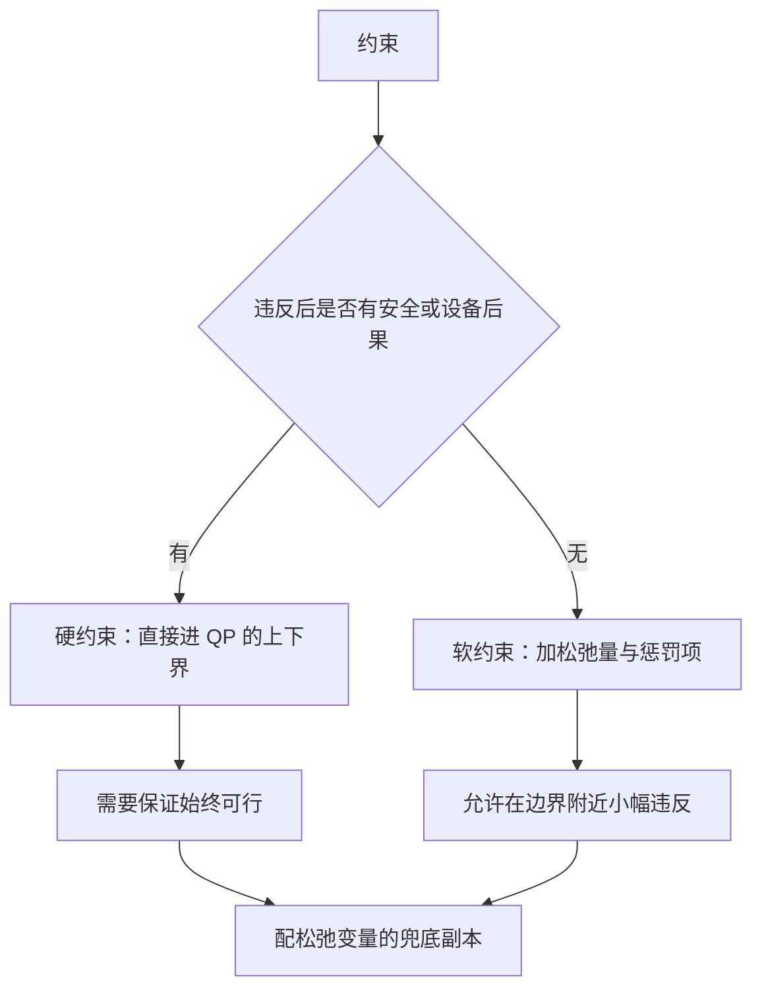
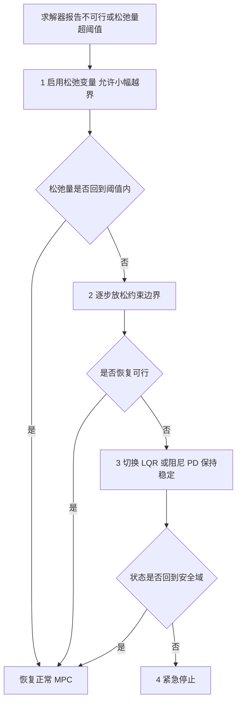

# 约束处理与可行性

前两篇把 MPC 当作一个无约束二次规划来组装，约束只作为上下界出现。约束才是 MPC 相对 LQR 的核心增量：关节限位、电流上限、足端摩擦锥、支撑多边形，这些条件在纯反馈结构里只能事后裁剪，在 MPC 里可以写进优化，让控制量在动作之前就把未来的边界考虑进去。

把约束写进优化会带来一个新问题：约束之间可能互相冲突，导致问题无解。无解比解错更危险，因为求解器返回失败时控制器没有可用的输出，必须有一套确定的降级路径。硬约束与软约束的分工决定了松弛变量怎么用，状态约束与接触约束的转写方式不同，不可行时需要有四级降级路径，终端集条件是让可行性可证明的关键。

## 硬约束与软约束各自适用什么位置

判断一条约束该用硬还是软，看它被违反时后果的性质。物理极限与安全边界必须硬：电机电流超过额定值会烧毁，关节越过机械限位会撞坏结构，这些量不允许越界。跟踪目标与舒适性指标适合软：末端位置有微小偏差不构成危险，姿态角偏差超过阈值也不立即损坏设备，这类约束的边界本身带有余量。

素材仓库的代价函数把松弛变量与二次惩罚写在同一式里（`01_control_theory/mpc_control/README.md`）：

$$
J = \dots + \rho_\varepsilon \varepsilon^2
$$

$\varepsilon$ 是松弛量，非负，代表该条约束被违反的幅度；$\rho_\varepsilon$ 是惩罚系数，取足够大时优化只在没有其他出路时才会动用它。素材仓库给出的完整软约束形式区分了两类松弛量（`README.md`）：

$
\min_z \quad \frac{1}{2} z^{\mathsf T} H z + f^{\mathsf T} z + \rho_\varepsilon \varepsilon^2 + \rho_d \varepsilon_d^2
$

$
\text{s.t.} \quad g(z) \leq \varepsilon, \quad \varepsilon \geq 0
$

两个松弛量对应两类约束：$\varepsilon$ 用于可以放宽的跟踪类约束，$\rho_\varepsilon$ 取中等量级；$\varepsilon_d$ 用于接近硬性的安全类约束，$\rho_d$ 取得比 $\rho_\varepsilon$ 高出几个数量级，让它只在极端情况下被触发。分级惩罚比单一松弛量的好处是安全性约束与舒适性约束不再共用同一预算，前者的违反量可以被单独监控与告警。

## 松弛变量的引入与惩罚权重

加入松弛后，约束写成 $g(z) \leq \varepsilon$ 且 $\varepsilon \geq 0$（`README.md`）。求解器返回 $\varepsilon$ 的值，可以直接读出哪条约束被违反、违反多少：$\varepsilon = 0$ 表示没有用到松弛，$\varepsilon > 0$ 表示该条约束在最优解处无法满足。这个信息比“求解失败”更有价值，因为它指向的是具体哪条边界太紧。

惩罚权重 $\rho_\varepsilon$ 的取法有一个数量级规则：它应当远大于代价里其他权重的量级，否则优化会倾向于用松弛换取更好的跟踪性能。常见取法是 $Q$ 与 $R$ 最大对角元的 $10^3$ 到 $10^6$ 倍。取太大的代价是数值条件变差，$H$ 的特征值跨度增大，ADMM 一类一阶方法收敛变慢；实际取值要在这两端之间试。

松弛变量的个数也需要控制。每条可违反的约束配一个松弛量会让决策变量维数上升，$H$ 的规模随之变大；常见做法是按约束组共用一个标量松弛量，例如全部摩擦锥约束共用一个 $\varepsilon$，代价是某一条锥被放松时同组其他锥也跟着放宽。分组粒度按物理耦合程度决定，同一个足端的切向与法向约束适合共用，不同足端之间不适合。

松弛变量还改变了可行性判断。带松弛的问题几乎总有可行解（只要 $\varepsilon$ 可以任意大），因此求解器不会失败，安全性由 $\varepsilon$ 的上限与后处理保证：如果 $\varepsilon$ 超过预设阈值，说明该条硬约束实际上已无法满足，控制器应当转入降级流程而不是继续输出。

## 状态约束怎么转成决策变量约束

第一篇给出了状态预测 $X = \Psi x(k) + \Gamma U$。状态约束 $X_{\min} \leq X \leq X_{\max}$ 代入后变成

$$
X_{\min} - \Psi x(k) \leq \Gamma U \leq X_{\max} - \Psi x(k)
$$

左右两端都含当前状态项，每周期要重算一次；$\Gamma$ 本身不变（`README.md`）。控制幅值约束 $u_{\min} \leq u \leq u_{\max}$ 直接作用在决策变量的对应分量上，不需要经过预测矩阵。

转写之后有一个容易忽略的细节：状态约束的拍数必须与预测时域一致，只约束前几拍会让时域尾部无约束，最后几拍的预测状态可能越界，虽然当前动作不受影响，但终端附近的处理会失真。若只在 $i = 1 \dots p-1$ 上加状态约束，第 $p$ 拍的终端状态就是自由的，这在长时域上会造成“优化把越界推到看不见的地方”。

## 摩擦锥与 ZMP 的线性化

足式机器人常用的质心动力学模型把动量变化写成接触力之和（`README.md`）：

$$
\dot{\mathbf{h}} = \sum_{i=1}^{n_c} (\mathbf{f}_i + m \mathbf{g})
$$

$\mathbf{h} \in \mathbb{R}^6$ 是质心动量，$\mathbf{f}_i$ 是第 $i$ 个接触点的地面反力。约束写在接触力上，包括摩擦力锥、ZMP 落在支撑多边形内、关节极限经运动学传递到质心层、足端只能推不能拉四类。

摩擦力锥的原始形式是二阶锥，常用的线性化是

$$
| f_{i,t} | \leq \mu_i f_{i,n}
$$

把切向分量绝对值展开成两条不等式，就把圆锥近似成内接的棱锥。内接会保守：真实能用的力被裁掉一部分，摩擦系数估计偏小时更明显。外接则不安全。素材仓库给出的形式就是这组线性不等式（`README.md`），它在 QP 里只是几行上下界。

ZMP 约束的转写与状态约束同源。ZMP 的位置由接触力与质心加速度算出，落在支撑多边形内意味着对决策变量的线性不等式；支撑多边形在行走过程中随时切换，因此约束矩阵每周期要按当前支撑状态重排。这一步是足式 MPC 实现里最容易出错的地方，支撑状态与约束矩阵不同步会产生看起来合规但物理上不可行的解。

## 不可行时的四级降级

素材仓库给出的降级顺序是四级（`README.md`）：启用松弛变量；逐步放松约束边界（例如扩大摩擦锥）；退化为纯反馈控制器（LQR 或阻尼 PD）；紧急停止。

这四级对应四种不同性质的问题。第一级处理边界太紧造成的边缘不可行，代价是轻微越界；第二级处理模型误差或状态估计偏差造成的持续不可行，放松幅度要有限度；第三级在优化层完全失效时维持基本稳定，切换控制器后闭环性质改变，需要有确定的过渡；第四级是最后手段，触发后系统进入安全状态。

降级路径必须在设计阶段写成确定逻辑，不能留给运行时判断。切换点要防抖：约束边界在阈值附近来回抖动会让控制器频繁切换，每次切换都带来一次瞬态。常用做法是给恢复条件设一个滞环，或要求连续若干周期满足恢复条件才切回。

## 终端集与递归可行性

上面讨论的都是单周期可行性：本周期的问题有解。控制性能还依赖一个更强的问题：本周期有解，下一周期是否必然有解。这个性质叫递归可行性，它的成立需要额外条件。

标准做法是在代价里加入终端代价与终端约束集，让预测时域末尾的状态落在一个不变集里，该集合内的任意状态在局部反馈下仍留在集合内（通用做法，素材仓库未展开终端集的设计，只给出时域长度经验值）。加入终端集之后，上一周期最优解平移后可以作为下一周期的可行解，从而保证有解。

没有终端集时，有限时域 MPC 不保证递归可行。工程上的替代方案是让约束留出余量、把时域取足够长、并用松弛变量兜底。这三条都不能给出证明，只是把不可行的概率压低；对安全关键系统，终端集与递归可行性的论证仍然需要补上。

## 小结

### 核心概念

- 约束按违反后果分硬软：物理极限用硬约束，跟踪与舒适性用软约束加松弛变量。
- 软约束形式为 $g(z) \leq \varepsilon$、$\varepsilon \geq 0$，惩罚权重 $\rho_\varepsilon$ 取 $Q$、$R$ 最大元的 $10^3$ 到 $10^6$ 倍量级。
- 状态约束经 $X = \Psi x + \Gamma U$ 转成对决策变量的上下界，两端含状态项需每周期重算。
- 摩擦锥用 $|f_t| \leq \mu f_n$ 线性化，ZMP 与支撑多边形约束随支撑状态逐周期重排。
- 不可行时按松弛、放松边界、切换反馈控制器、紧急停止四级降级；递归可行性需要终端集保证。

### 设计权衡

| 选择 | 带来的能力 | 付出的代价 |
| --- | --- | --- |
| 硬约束 | 严格不越界 | 冲突时无解，需要兜底路径 |
| 软约束加松弛 | 求解器几乎不会失败 | 允许越界，安全性依赖阈值后处理 |
| 惩罚权重取大 | 松弛只在必要时动用 | $H$ 条件数变差，迭代变慢 |
| 摩擦锥线性化 | 保持 QP 结构、求解快 | 内接近似保守，可用力域被裁 |
| 加终端集 | 递归可行性可证明 | 需要离线构造不变集，时域通常要加长 |

## 练习

### 基础题

1. 说明为什么带松弛变量的问题比原问题更容易可行，并给出松弛量为零时两个问题解的关系。
2. 写出把 $|f_t| \leq \mu f_n$ 展开成两条线性不等式的形式，并说明内接近似相对真实圆锥的保守方向。
3. 解释为什么状态约束要对预测时域的每一拍都写，只写前几拍会有什么后果。

### 挑战题

4. 取一个二阶对象，把位置约束设为硬约束并在初始状态接近边界时求解，记录四次连续周期的可行性与控制量变化。
5. 为摩擦锥设计一组软约束，比较两个不同 $\rho_\varepsilon$ 下松弛量的大小与控制精度，说明权重选择的取舍。
6. 说明为什么没有终端集时有限时域 MPC 不能保证递归可行，并构造一个状态接近约束边界、单周期可行但下周期不可行的例子。

## 附：本页引用的路径

| 路径 | 用途 |
| --- | --- |
| `01_control_theory/mpc_control/README.md` | 素材仓库 MPC 单元根：代价中的松弛项、状态约束转写、质心动力学与接触约束、软约束形式、不可行降级 |
| `docs/19-控制理论/03-MPC与NMPC/01-MPC的问题构造与滚动时域.md` | 本站第一篇，预测矩阵与代价项 |
| `docs/19-控制理论/01-PID整定与抗饱和` | 本站 PID 单元，限幅与积分饱和的对照 |
| `~/robot_control_simulation` | 素材仓库根，正文中素材路径均相对该根 |
