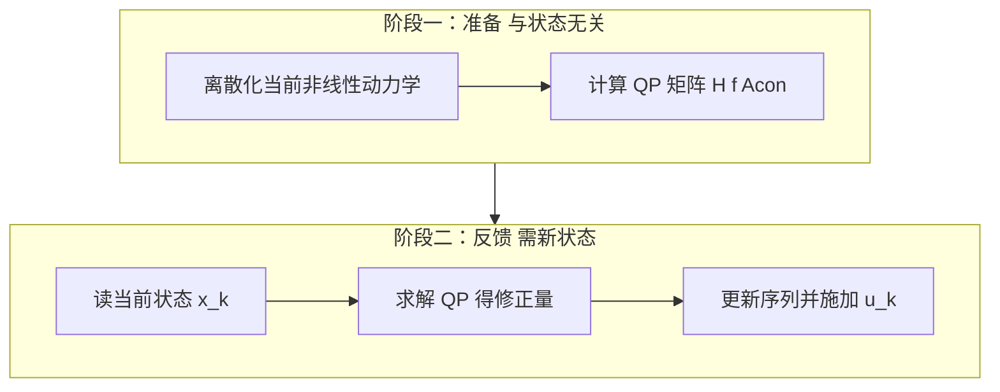
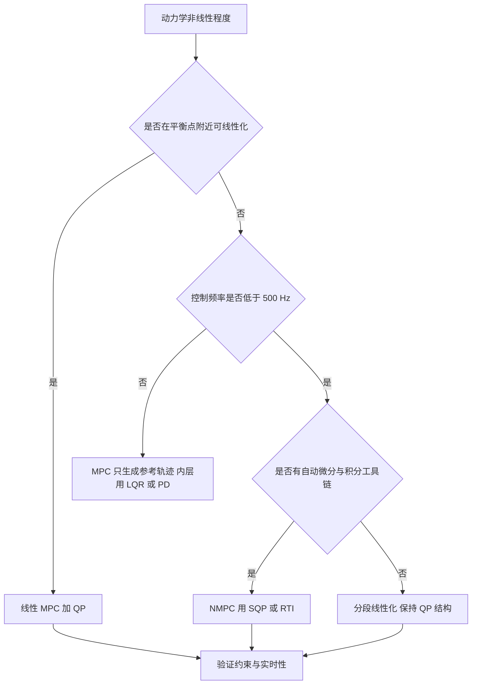

# 线性MPC与非线性MPC的分工

前两篇的推导都建立在线性模型上：预测矩阵由常量 $A$、$B$ 拼成，代价是二次型，问题严格凸，求解器保证全局最优。这套流程快、可预测、实现简单，代价是模型只在一个工作点附近有效。云台在零位附近、底盘在中低速直线行驶、机械臂关节角变化不大时，线性模型够用；人形机器人迈步、飞行器做大机动时，状态离开工作点很远，线性预测的误差会把 MPC 的前馈优势抵消掉。

非线性 MPC 保留真实动力学，把优化问题从凸 QP 变成非凸 NLP，代价是最优性从全局降到局部、求解时间从毫秒级升到十毫秒级、代码链从矩阵组装变成自动微分与数值积分工具链。四条非线性求解路线之间存在取舍，实时迭代把计算拆成离线与在线两段，选型依据取决于对最优性与求解时间的要求。

## 线性模型在平衡点附近够用到哪

线性 MPC 的四个特征在素材仓库里列得很清楚：线性状态空间模型、线性约束加二次代价构成凸 QP、有全局最优解、求解时间在 0.1 到 2 ms（`01_control_theory/mpc_control/README.md`）。这套性质让它适合高频控制，也让它对模型误差的处理方式与 LQR 类似：模型偏差直接体现在闭环性能上。

线性模型的适用范围可以用一个具体判据来估计：把工作轨迹上若干点的线性化模型与真实非线性模型各积分一步，比较状态偏差。若在一个预测时域累积后的偏差小于控制精度的三分之一，线性模型可用；否则需要分段线性化或直接上 NMPC。分段线性化得到的模型是时变的，$A_k$、$B_k$ 每拍不同，预测矩阵要在线重算，$H$ 不能再离线算好，这会吃掉一部分实时预算。

在线性化点上还要加一个常数项。非线性模型在参考轨迹附近展开得到

$$
x_{k+1} = A_k x_k + B_k u_k + c_k
$$

$c_k$ 补偿参考点处模型与真实动态的差。忽略 $c_k$ 时，预测轨迹会相对真实轨迹整体漂移，跟踪误差在时域末端被放大。很多实现把 $c_k$ 归入 $f$ 的常数项，组装方式与第一篇一致。

## NMPC 的四种求解方法

素材仓库列出了四条路线（`README.md`）：

| 方法 | 原理 | 特点 |
| --- | --- | --- |
| SQP | 每次迭代把 NLP 线性化成 QP | 收敛快，广泛使用 |
| RTI | 每步只做一次 SQP 迭代 | 固定计算时间，适合硬实时 |
| DDP / iLQR | 动态规划沿轨迹反向传播 | 适合轨迹优化，不需求解 QP |
| 多重打靶 | 时域分段，每段独立决策变量 | 数值稳定性好，支持长时域 |

SQP 把非线性约束在当前迭代点线性化，解一个小 QP 得到步长，再沿步长更新。它的收敛速度在解附近是超线性的，通常三到十次迭代收敛；每次迭代都要求解一个 QP，总耗时是线性 MPC 的数倍到数十倍。

DDP 与 iLQR 走另一条路：把代价沿轨迹做二阶展开，用反向 Riccati 递推求控制修正量，不需要外层 QP。它对无约束或只有简单约束的问题很高效，对不等式约束的处理要借助投影或增广拉格朗日，因此常见于轨迹优化而不是带硬约束的闭环控制。

## RTI 把一次迭代拆成两个阶段

RTI 的核心观察是：SQP 的一次迭代里，大部分计算只依赖模型与当前迭代点，不依赖最新的状态测量。把一次迭代拆成两段，第一段在状态到达之前做，第二段拿到状态后只做剩下的部分（`README.md`）。

第一段包含离散化当前非线性动力学与计算 QP 矩阵，第二段包含获取当前状态、求解 QP 得到修正量、更新控制序列并施加。第一段可以在测量完成之前开始，因此从状态到控制输出的延迟被压到只剩第二段的耗时。这个结构把“求解时间必须小于周期”减弱成“第二段必须小于周期”，是硬实时系统上跑 NMPC 的关键。

RTI 每周期只做一次迭代，因此不保证收敛到最优解，它保证的是计算时间上界。当相邻周期的解变化不大时，一次迭代足以跟踪上移动的最优解；状态突变或约束主动集切换时，单次迭代的修正量可能不足，闭环会出现滞后。处理办法是在切换点插一次完整 SQP，或把迭代次数按可用时间动态调整。

## 多重打靶为什么数值上更稳

直接法离散化有两种写法。单打靶只把控制序列作为决策变量，状态由模型从初始状态积分得到；多重打靶把每段的状态也作为决策变量，另加连续性约束 $x_{i+1} = F(x_i, u_i)$（`README.md`）。

单打靶的缺点是误差沿时域累积：模型在某一段的不准确会被积分放大，长时域上梯度计算不稳定。多重打靶把时域切成若干段，每段从自己的状态出发积分，误差只在本段内累积，段与段之间由连续性约束连接。决策变量变多，但 Hessian 与 Jacobian 变成带状，稀疏求解器可以利用这个结构。

素材仓库给出的 NLP 形式正是多重打靶写法，$F(x_i,u_i)$ 由 RK4、RK45 或隐式欧拉等积分器得到（`README.md`）。积分器阶数与步长决定离散化精度，也决定每次迭代里的函数求值次数；隐式方法对刚性系统更稳但每步要解方程，显式方法便宜但对刚性系统要缩小步长。

## NMPC 的导数从哪里来

每次 SQP 迭代都要在当前点线性化动力学，导数矩阵的来源决定实现路线与运行开销，通常有三条：

| 来源 | 精度 | 运行时开销 | 适用 |
| --- | --- | --- | --- |
| 自动微分 | 接近符号导数 | 中等，需编译后的 AD 代码 | 通用建模，CasADi 一类框架 |
| 解析导数 | 符号导数 | 最低 | 刚体动力学，Pinocchio 或 RBDL |
| 有限差分 | 与步长耦合 | 最高，函数求值次数倍增 | 快速验证 |

素材仓库的库对比表把自动微分单列成一列（`README.md`），原因就在这里：足式与机械臂的动力学维数高，用有限差分求导会让每次迭代的函数求值次数按状态维数倍增，自动微分或解析导数才是可行选择。OCS2 内置 Pinocchio 接口、CrocoDDL 用 Pinocchio 计算完整动力学，都是把导数这一环交给专用刚体库。

RTI 的固定计算时间依赖导数在阶段一算完。若导数在阶段二才发现需要更新，整个两阶段拆分就失效。因此 RTI 实现里导数与离散化都放在阶段一，阶段二只做一次 QP 求解与序列更新（`README.md`）。

## 两种方法的求解时间与代码量对照

素材仓库的对比表给出了两列关键数字（`README.md`）：线性 MPC 典型求解时间 0.1 到 2 ms，NMPC 是 2 到 20 ms；线性 MPC 解全局最优，NMPC 解局部最优，结果依赖初始猜测。

| 特性 | 线性 MPC | 非线性 MPC |
| --- | --- | --- |
| 模型形式 | $x_{k+1} = Ax_k + Bu_k$ | $x_{k+1} = f(x_k, u_k)$ |
| 问题类型 | 凸 QP | 非凸 NLP |
| 最优性 | 全局最优 | 局部最优 |
| 求解时间 | 0.1 到 2 ms | 2 到 20 ms |
| 非线性处理 | 需在线线性化 | 直接处理 |
| 代码复杂度 | 低 | 高，需自动微分与离散化工具链 |

代码量的差别经常被低估。线性 MPC 的实现是矩阵组装加一个 QP 求解器，几百行代码就能跑通；NMPC 需要自动微分、积分器、稀疏线性代数与 SQP 或 DDP 迭代，依赖 CasADi 或 acados 这类框架，部署时还要走代码生成流程。选择 NMPC 意味着接受这条工具链的维护成本。

## 什么时候必须上 NMPC

判断依据分三层。第一层看动力学非线性程度：系统在平衡点附近运行或可以足够近似为线性，用线性 MPC；经历大范围运动、强非线性动力学，用 NMPC（`README.md`）。第二层看控制频率：小于 100 Hz 时 NMPC 各类方法都可行；100 到 500 Hz 用线性 MPC 或 RTI；500 Hz 以上用全身控制加密集主动集求解器，超过 1 kHz 时 MPC 只做参考轨迹生成（`README.md`）。第三层看硬件：桌面级平台可任选，Jetson 上用 acados 加 HPIPM，STM32 上用 TinyMPC 或代码生成（`README.md`）。

三层过滤之外还有一个常被忽略的接口问题：NMPC 的输出是控制序列，交给底层执行前要经过限幅与零位偏置，而中间层的 LQR 或 PD 通常以状态误差为输入。两种接口混用时，NMPC 生成的参考状态要转换成内环能接收的设定值，转换精度直接决定外层优化的效果。若内环跟踪存在稳态偏差，NMPC 会在每一周期重新修正，修正量又会被内环的偏差抵消一部分，表现为外环积分作用缺失。

三层都通过之后还要看安全要求。素材仓库的控制器总表里，NMPC-SQP 的鲁棒性标为很高但计算要求也很高，WBC 加 MPC 的建模难度最高（`README.md`）。安全关键场景宁可用保守的线性 MPC 加终端集与多层降级，也不一定要为强非线性上完整 NMPC。

## 小结

### 核心概念

- 线性 MPC 用常量 $A$、$B$ 与二次代价构成凸 QP，解全局最优，典型求解时间 0.1 到 2 ms。
- 非线性 MPC 直接使用 $\dot{x} = f(x,u)$，问题为非凸 NLP，解局部最优，典型求解时间 2 到 20 ms。
- 非线性求解分 SQP、RTI、DDP 或 iLQR、多重打靶四条路线；RTI 每周期只做一次 SQP 迭代，换取固定计算时间。
- 多重打靶把状态也作为决策变量并加入连续性约束，段内误差不跨段累积，稀疏结构更好。
- 选择按非线性程度、控制频率、硬件平台三层过滤，安全关键场景优先保守方案。

### 设计权衡

| 选择 | 带来的能力 | 付出的代价 |
| --- | --- | --- |
| 线性模型加在线线性化 | 保持凸 QP 与全局最优 | $H$ 需在线重算，工作点外失真 |
| NMPC 用 SQP | 精度高、收敛快 | 每周期多次迭代，耗时不可预测 |
| NMPC 用 RTI | 计算时间有上界 | 单次迭代不保证最优，切换点滞后 |
| DDP 或 iLQR | 不需要外层 QP | 不等式约束处理困难 |
| 多重打靶 | 长时域数值稳定 | 决策变量与 Jacobian 维数上升 |

## 练习

### 基础题

1. 写出把一个非线性模型在参考轨迹附近线性化后得到 $A_k$、$B_k$、$c_k$ 的表达式，并说明 $c_k$ 的作用。
2. 说明 RTI 的两个阶段分别包含哪些计算，以及为什么阶段一可以在状态到达之前执行。
3. 比较单打靶与多重打靶在误差累积与决策变量维数上的差别。

### 挑战题

4. 取一个倒立摆模型，在倾角 5 度与 45 度两个工作点分别线性化，比较预测 10 步后的状态偏差，给出线性模型可用的角度范围估计。
5. 设计一个 RTI 循环，要求阶段二耗时不超过 2 ms，分析当 QP 求解超时时可以采取的三条措施及其后果。
6. 为同一个人形机器人迈步任务分别设计线性 MPC 与 NMPC 的方案，比较两者的建模工作量、求解器选择与实时性验证方式。

## 附：本页引用的路径

| 路径 | 用途 |
| --- | --- |
| `01_control_theory/mpc_control/README.md` | 素材仓库 MPC 单元根：线性与非线性对比、NMPC 的 NLP 形式、控制器选择框架 |
| `docs/19-控制理论/03-MPC与NMPC/01-MPC的问题构造与滚动时域.md` | 本站第一篇，预测矩阵与 QP 组装 |
| `docs/19-控制理论/03-MPC与NMPC/02-最优控制问题与QP求解.md` | 本站第二篇，求解器与稀疏结构 |
| `docs/19-控制理论/02-LQR与LQG/01-LQR问题的构造与代价函数.md` | 本站 LQR 第一篇，内层反馈与频域裕度 |
| `~/robot_control_simulation` | 素材仓库根，正文中素材路径均相对该根 |
