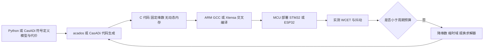
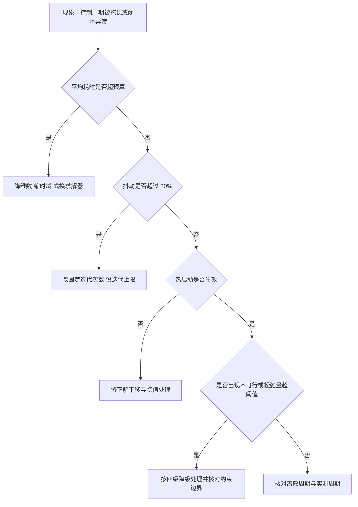

# 嵌入式MPC部署与调试

把 MPC 放到单片机上，问题立刻从“算法对不对”变成“能不能在周期内算完”。桌面环境下 1.2 ms 的 QP 求解看起来很宽裕，放到 1 kHz 的控制回路上就占满了整个预算；512 KB 的 RAM 在仿真里不算少，装上 16 个状态的稀疏求解器就爆了。数据取自素材仓库的基准表，量级按 1 kHz 控制回路与 512 KB RAM 两条约束核对。

要说明的是，本站固件侧没有 MPC 实现：底盘与云台的固件走的是 PID 与 LQR 路线，MPC 相关代码只出现在素材仓库与外部库。因此本页的工程流程按通用做法与素材数据写，涉及具体固件文件的地方不做引用。

## 计算与内存的硬约束

素材仓库把嵌入式 MPC 的约束列成四条（`01_control_theory/mpc_control/README.md:585-594`）：

| 约束 | 描述 | 影响 |
| --- | --- | --- |
| 实时性 | 求解时间必须小于控制周期 | 需要固定迭代次数的算法 |
| 内存 | MCU 通常小于 512 KB RAM | 限制问题规模，OSQP 在 $n = 16$ 时超过 512 KB |
| 浮点单元 | 低端 MCU 没有 FPU | 需要定点数实现 |
| 功耗 | 散热与电池限制 | 每瓦性能成为关键指标 |

四条约束里最硬的是内存。$N = 30$、$n_u = 4$ 的密集 $H$ 是 $120 \times 120$ 的双精度矩阵，单这一个矩阵就 115 KB，加上求解器的工作区很快超出预算。素材仓库的基准表给出的内存占用是 HPIPM 约 200 KB、OSQP 约 512 KB、qpOASES 约 300 KB、TinyMPC 约 80 KB（`README.md:371-378`），同一问题相差六倍以上，选型对内存的影响大于算法优化。

实时性约束的严格程度取决于是否有操作系统。无操作系统的主循环里超时意味着下一个周期的采样被推迟，等效采样率下降；有实时操作系统时超时会挤占同优先级的其他任务。两种情况下都需要给出最坏执行时间（WCET）的测量值，而不只是平均值。

## 求解时间抖动怎么量化

抖动是求解时间的标准差相对均值的比例。素材仓库给出的数据是（`README.md:596-608`）：

| 求解器 | 抖动 | 原因 |
| --- | --- | --- |
| OSQP（ADMM） | 约 5% | 固定迭代次数 |
| qpOASES | 约 30% | 迭代次数随主动集变化 |
| HPIPM | 约 15% | 牛顿迭代次数不定 |
| TinyMPC | 约 2% | 固定 ADMM 迭代加缓存分解 |
| Eiquadprog | 约 20% | 主动集随约束变化 |

抖动比平均耗时更能决定控制回路能不能用。平均 0.8 ms、抖动 30% 的求解器，最坏情况接近 1.1 ms，加上采样与执行器写入，1 kHz 周期就被吃掉。缓解手段有四条（`README.md:610-614`）：用 RTI 固定每阶段运算量、设置最大迭代次数、换用固定计算时间的求解器、把 MPC 放到非实时核上并通过共享内存传控制量。

第三条与第一条最常用。固定迭代次数的代价是精度下降，但闭环控制每个周期都会重算，一次求解的精度不足会在下个周期被修正。第四条适合 Jetson 一类多核平台，代价是核间通信延迟要算进周期预算。

## 代码生成流水线

从算法描述到 MCU 上运行的代码，素材仓库给出的流水线是五段（`README.md:638-648`）：在 Python 或 CasADi 里做符号定义，用 acados 或 CasADi 的代码生成器导出 C 代码，得到固定维数、无动态内存、预计算导数的源文件，用 ARM GCC 或 Xtensa 交叉编译，最后烧录到 STM32、ESP32 或 Jetson 上。

代码生成的价值有三点（`README.md:650-653`）：消除运行时反射与解释开销；内存布局固定，可以静态分析 WCET；支持 MISRA-C 一类安全编码标准。这三点对应嵌入式开发的三个实际要求：时间可预测、内存可审计、代码可过审。

## 定点数与 FPU 缺失的处理

没有浮点单元的 MCU 上，浮点运算由软件库完成，一次乘法要几十个周期。定点化是唯一可行的方向，但它引入三个新问题：定标选择、溢出保护、精度损失。定标按问题里各量的动态范围分配小数位，$H$ 的元素量级跨度大时需要逐块定标，而不是全局一个 $Q$ 格式。

定点化的另一个后果是求解器的收敛行为改变。ADMM 一类迭代算法在定点数下的收敛判据不能沿用浮点的相对误差，因为它会在地板值处停滞；判据要改成固定迭代次数，或按定标后的最小可分辨增量设定阈值。素材仓库提到低端 MCU 需要定点数实现（`README.md:593`），但给出的库（TinyMPC、DAQP）都以浮点为主，定点实现属于自行改造的范畴，本页标注为通用做法。

TinyMPC 在无 FPU 平台上仍被列为可选方案（`README.md:671-672`），前提是把缓存好的分解与矩阵乘改成定点实现。这一步的工作量与重新实现一个小型求解器相当，需要评估。

## TinyMPC 的缓存策略

TinyMPC 的思路是把 ADMM 里与状态无关的部分全部预先算好并缓存（`README.md:417-421`）：ADMM 迭代中的 Riccati 分解矩阵、约束投影所需的因子、以及各步的乘加顺序都在初始化阶段确定，运行时不再分配内存。

效果可以从两个数看出来。在 STM32F405 上，TinyMPC 实现 167 Hz，比同一平台上的 OSQP 快 8 倍；内存占用在 $n = 30$ 的问题上约 80 KB，是表中最低的（`README.md:371-378`、`:417-421`）。同类思路的 DAQP 用对偶主动集加数据驱动的热启动，在 STM32F405 上做到 500 Hz 的 12 状态四旋翼控制（`README.md:423-426`），代价是需要离线训练主动集选择。

两个库的共同点是把在线计算量压到固定次数的乘加，把复杂度转移到初始化与离线阶段。这也是嵌入式 MPC 的通用模式：实时路径上只留固定形状的运算，所有与状态无关的计算都前置。

素材仓库还给出了每瓦性能数据，用来比较同一平台上不同求解器的能效（`README.md:380-390`）：

| 求解器 | Hz/W（$n = 15$） | Hz/W（$n = 30$） |
| --- | --- | --- |
| HPIPM | 201.2 | 159.4 |
| OSQP | 89.5 | 62.1 |
| qpOASES | 152.3 | 74.8 |
| TinyMPC | 412.6 | 298.3 |
| Eiquadprog | 1259.3 | 无法处理（密集退化） |

Eiquadprog 在小问题上能效最高，$n = 30$ 时因密集分解退化到无法处理，与它只适合高频小问题的定位一致。TinyMPC 的能效数据与它最低的内存占用相互印证。功耗受限的平台选型时，这张表比单看求解时间更有参考价值。

TinyMPC 在 MCU 上的完整平台数据是 $n = 12$、$N = 8$ 的问题：STM32F405 上 0.6 ms，STM32H743 上 0.15 ms，Teensy 4.0 上 0.08 ms（`README.md:557-561`）。同一份代码在不同主频上的比例接近线性，说明耗时主要由乘加次数决定，没有明显的访存瓶颈。

## 从超时到不可行的排查顺序

排查按现象分五步。第一步看单周期耗时分布，区分平均超时与偶发超时：平均超时说明问题规模或求解器选型不对，偶发超时通常是迭代次数波动或内存分配。第二步看抖动数据，抖动超过 20% 时换固定迭代次数的求解器，或设迭代上限。第三步看热启动质量，检查上一周期的解平移后是否被正确使用，热启动失效会让迭代次数回升。第四步看不可行，读取松弛量判断是哪条约束越界，对照第三篇的四级降级。第五步看模型与采样，检查离散化用的周期与实测周期是否一致。

## 控制器选择清单

素材仓库给出了六步选择流程（`README.md:692-699`）：确定控制频率需求，评估计算硬件，选择模型复杂度，选择求解器，选择部署框架，验证实时性。每一步的输出是下一步的输入，跳过其中任何一步都会在后面返工。

| 步骤 | 决策依据 | 本站相关单元 |
| --- | --- | --- |
| 控制频率 | 系统带宽的 5 到 10 倍 | PID 与 LQR 单元的带宽讨论 |
| 硬件平台 | 桌面 / Jetson / MCU / 无 FPU | 本页内存与抖动数据 |
| 模型复杂度 | 线性化误差是否可接受 | 第四篇的三层过滤 |
| 求解器 | 时域长度、问题尺寸、精度 | 第二篇的三类算法 |
| 部署框架 | acados / OCS2 / TinyMPC / CasADi | 本页代码生成流水线 |
| 实时性验证 | WCET 加抖动是否满足周期 | 本页排查顺序 |

频率需求是最先要定的一项，因为它决定后面所有选择的上界。超过 1 kHz 时 MPC 不再直接闭环，转而生成参考轨迹，由内层 LQR 或 PD 执行，这条分工在前几篇反复出现（`README.md:673-677`）。

## 小结

### 核心概念

- 嵌入式 MPC 的四条约束是实时性、内存、浮点单元与功耗；同一问题不同求解器的内存占用可以相差六倍以上。
- 抖动比平均耗时更能决定可用性，固定迭代次数可把抖动从 30% 压到 2% 量级。
- 代码生成流水线把符号模型导出为固定维数、无动态内存的 C 代码，优势是可静态分析 WCET 与支持 MISRA-C。
- 无 FPU 平台需要定点化，定标、溢出与收敛判据都要重新处理，素材的库以浮点为主。
- TinyMPC 把与状态无关的计算全部前置缓存，STM32F405 上 167 Hz、内存约 80 KB；DAQP 用数据驱动热启动做到 500 Hz。

### 设计权衡

| 选择 | 带来的能力 | 付出的代价 |
| --- | --- | --- |
| 固定迭代次数 | 抖动最低、时间可预测 | 精度中等，需靠重规划补偿 |
| 用稀疏求解器 | 长时域下内存与时间可控 | 决策变量维数上升，实现复杂 |
| 代码生成 | WCET 可分析、无动态内存 | 工具链依赖强，改模型需重新生成 |
| 定点实现 | 无 FPU 平台可运行 | 定标复杂，收敛判据要重设 |
| MPC 放非实时核 | 主控周期不受影响 | 核间通信延迟进入回路 |

## 练习

### 基础题

1. 取 $N = 30$、$n_u = 4$，估算双精度密集 $H$ 的字节数与内存占用，并与素材表里的求解器工作区比较。
2. 说明抖动 30% 与 2% 在 1 kHz 周期下分别留下多少余量，并计算加入 0.2 ms 采样与执行开销后的可用性。
3. 列出代码生成相比在 MCU 上手写求解器的三个优势，并各举一个对应的工程要求。

### 挑战题

4. 为一个 $n = 12$、$N = 20$、$n_u = 4$ 的四旋翼 MPC 设计内存预算表，逐项列出矩阵、工作区与缓存占用，说明是否能在 512 KB 内完成。
5. 设计一个定点化方案，说明 $H$ 的元素量级跨度为 $10^5$ 时如何分块定标，并给出溢出保护策略。
6. 说明把 MPC 放到非实时核并通过共享内存传输控制量的完整时序，指出哪些延迟必须计入周期预算，以及如何验证。

## 附：本页引用的路径

| 路径 | 用途 |
| --- | --- |
| `01_control_theory/mpc_control/README.md` | 素材仓库 MPC 单元根：求解器基准与内存（:352-429）、嵌入式约束（:583-594）、抖动（:596-615）、热启动（:616-626）、代码生成（:638-656）、选择流程（:657-699） |
| `docs/19-控制理论/03-MPC与NMPC/02-最优控制问题与QP求解.md` | 本站第二篇，求解器算法与规模 |
| `docs/19-控制理论/03-MPC与NMPC/03-约束处理与可行性.md` | 本站第三篇，不可行时的四级降级 |
| `docs/19-控制理论/02-LQR与LQG/05-嵌入式LQR实现与调试.md` | 本站 LQR 第五篇，嵌入式数值类型与栈占用 |
| `~/robot_control_simulation` | 素材仓库根，正文中素材路径均相对该根 |
