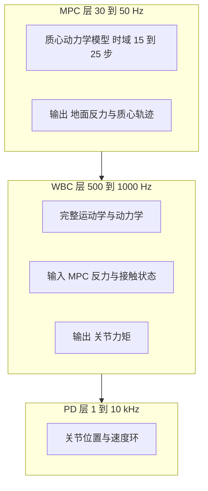
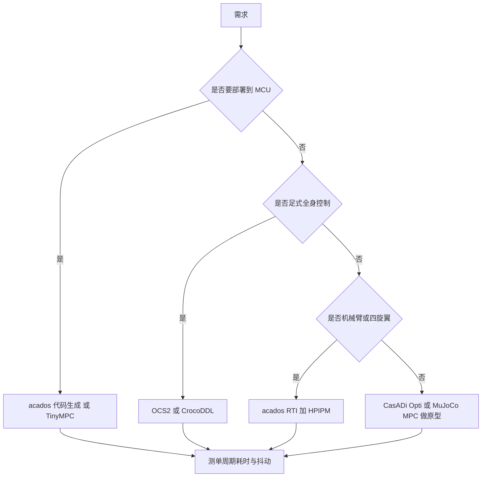

# 机器人应用架构与库选型

前五篇把 MPC 的问题构造、求解、约束、模型与部署拆开讲完，剩下的问题是这些部件在真实机器人上如何组合，以及用什么库把它们拼起来。足式机器人、轮腿平台与机械臂对 MPC 的要求差别很大：接触力约束、步态时序、关节动力学、频率预算各不相同，分层结构也不同。

这一篇分两部分。第一部分看三层控制架构与三类平台的配置差异，重点在 MPC 层与高频层之间的接口；第二部分看七个常用库的能力矩阵，它们分别覆盖从符号建模到 MCU 部署的不同环节。素材仓库的应用与库两节内容最密集，本页的数据与配置都取自它，涉及商业平台与论文的具体编号不做转述。

## MPC 加 WBC 的三层分层架构

现代足式机器人最常见的结构是三层（`01_control_theory/mpc_control/README.md`）：

| 层 | 频率 | 模型复杂度 | 输出 |
| --- | --- | --- | --- |
| MPC | 30 到 50 Hz | 简化模型（质心级） | 地面反力 $f$、动量变化 $\dot{h}$ |
| WBC | 500 到 1000 Hz | 完整运动学与动力学 | 关节力矩 $\tau$ |
| 低层 PD | 1 到 10 kHz | 无模型，仅反馈 | 关节电流 |

分层的依据是模型的保真度与计算量成反比。MPC 层用质心动力学做长时域规划，模型简单因此可以解 15 到 25 步的约束优化；WBC 层用完整模型做高频跟踪，把 MPC 给的反力与接触状态分配成关节力矩；最底层用 PD 环压住关节柔性、摩擦与电流环动态。

两层之间的连接条件叫优化一致性：MPC 输出的反力要在 WBC 的可行域内，否则 WBC 无法精确实现 MPC 的规划，反力的积分误差会累积成质心轨迹偏差。实现上通常在 WBC 的约束里把 MPC 的反力作为软约束，允许小幅偏离并回传给 MPC 作为下一周期的参考修正。

## 双足人形机器人的配置与挑战

双足平台的典型配置是单刚体或质心动力学模型，状态取质心位置 $p_c \in \mathbb{R}^3$、姿态 $R \in SO(3)$、动量 $h \in \mathbb{R}^6$，控制量是足端接触力 $f_i \in \mathbb{R}^3$，约束包括摩擦力锥与支撑多边形，控制频率 30 到 50 Hz，时域 15 到 25 步（`README.md`）。

三个主要难点（`README.md`）。第一是接触调度：步态时序是离散变量，MPC 本身处理的是连续优化，必须与步态规划器配合，把当前步的接触状态作为已知量传入，或者用混合整数规划把时序也纳入决策，后者的求解量在实时场景下不可接受。第二是模型简化误差：单刚体模型忽略腿部动力学，快速行走时摆动腿的惯性反作用被忽略，误差显著。第三是计算瓶颈：人形自由度更多，同样的时域下决策变量比四足多。

素材仓库给出的近期方向包括多保真度分级 MPC（粗模型做长时域、细模型做短时域）、把 ZMP 约束集成进 iLQR 框架、以及在 MPC 与 WBC 之间加入梯度修正提高模型匹配度（`README.md`）。这三条都围绕同一个目标：在不显著增加在线计算量的前提下缩小简化模型与真实系统的差距。

## 轮腿机器人的模式切换

轮腿平台同时具备轮式与足式能力，在轮式模式下是非完整约束系统，接触状态与运动模式都可能切换（`README.md`）。典型配置把质心动力学与轮子滚动动力学合并建模，时域取 20 到 30 步，频率 50 到 100 Hz，关键约束是滚动无滑动与轮端力矩限制。

MPC 在这里要处理两类离散事件：轮子离地与触地、以及轮式与足式模式的切换。处理方式与双足类似，把模式作为已知量传入，只优化连续量。模式切换时刻的约束矩阵会跳变，若求解器使用热启动，跳变后的初值可能违反新约束，需要重置滑移或把初值投影到可行域。

频率比纯足式高是因为模型更简单且约束更少，但轮式模式下滚动约束把自由度耦合起来，约束矩阵的条件数变差，求解时间反而可能上升。选型时不能只按频率数字判断，要在两种模式下分别测求解时间。

## 机械臂的求解配置

机械臂直接用全阶动力学 $M(q)\ddot{q} + C(q,\dot{q})\dot{q} + g(q) = \tau$，在关节空间求解，频率 100 到 500 Hz，时域 10 到 20 步（`README.md`）。与足式不同，机械臂没有接触时序问题，但有更强的非线性与非对角惯性矩阵。

四类应用的配置差别明显（`README.md`）：工业机器人轨迹跟踪用线性 MPC，模型在工作段内线性化即可满足精度；协作机器人力控用 NMPC，需要把接触力纳入代价或约束；移动操作同时控制基座与机械臂，属于全身 MPC；软体机器人高度非线性，只能用 NMPC 且模型辨识误差大。

机械臂上跑 NMPC 的主要瓶颈是自动微分的开销。全阶动力学的导数矩阵计算量与自由度平方成正比，$n = 7$ 时每次迭代的导数计算已经超过求解本身。工程上通常用 Pinocchio 或 RBDL 的解析导数替代自动微分，或者用简化模型加扰动观测器，把未建模部分交给估计环节。

## 七个 C++ 库的能力矩阵

素材仓库对比了七个库（`README.md`）：

| 库 | 语言 | 核心算法 | 自动微分 | 代码生成 | 嵌入式 |
| --- | --- | --- | --- | --- | --- |
| acados | C | SQP 与 RTI，HPIPM | CasADi 接口 | 支持 | 支持 |
| CasADi | C++ | NLP、SQP、IPOPT | 符号自动微分 | 支持 | 部分 |
| OCS2 | C++ | DDP、iLQR、SQP | Pinocchio 或 RBDL | 不支持 | 仅 Linux |
| MuJoCo MPC | C/C++ | iLQR、TV-LQR | 引擎内置 | 不支持 | 不支持 |
| TinyMPC | C++ | ADMM 加缓存 Riccati | 手写导数 | 不支持 | 支持 MCU |
| CrocoDDL | C++ | DDP、可行性驱动 | 支持 | 支持 | 不支持 |
| MRSlQR | C++ | iLQR、接触隐式 | 不支持 | 不支持 | 不支持 |

能力矩阵的读法是先看自动微分与代码生成两列，它们决定建模工作量与部署路径。足式全身控制需要接触调度与完整动力学，只有 OCS2 与 CrocoDDL 覆盖；要落到 STM32 上，只有 acados 的代码生成与 TinyMPC 两条路。

## acados 的架构与参数

acados 是目前最成熟的嵌入式 NMPC 库之一，架构分四段（`README.md`）：CasADi 接口在 Python 或 MATLAB 里做符号定义，代码生成器把模型、代价与约束导出为 C 代码，QP 后端用 HPIPM（默认）或 qpOASES、OSQP，运行时无动态内存且时间步固定。

配置参数的关键项是维度与 RTI 开关（`README.md`）：状态维数、控制维数、状态边界约束条数、控制边界约束条数分别设置，RTI 模式下用 SQP_RTI 求解器并分别给等式与互补松弛的容差。素材给出的性能参考是 18 状态、12 控制、30 时域的 ANYmal NMPC 在 Intel i7 上约 3 到 5 ms（`README.md`），对应 50 Hz 级别，与三层架构里 MPC 层的频率一致。

这个数据也说明嵌入式 MPC 的频率天花板：桌面级处理器上跑 30 步、18 状态的 NMPC 已经是毫秒级，MCU 上要么缩时域与状态数，要么换用简化模型。

## CasADi 与 OCS2 的分工

CasADi 是符号自动微分框架，本身不属于 MPC 库，它是构建求解器的工具链（`README.md`）。它支持前向与反向自动微分、支持把符号表达式编译成 C 函数、可以与 acados、IPOPT、SNOPT 等后端配合。典型流程是在 Python 里用符号变量定义 12 维状态与 4 维控制，构造动力学函数与 NLP，原型验证通过后导出 C 代码部署（`README.md`）。

OCS2 面向切换系统与足式机器人，提供 DDP、iLQR、SQP 三种算法，内置 Pinocchio 接口与接触调度处理，做集中式全身控制（`README.md`）。素材给出的 ANYmal 典型配置是质心动量加完整腿部运动学、SQP 加高斯牛顿 Hessian、时域 20 到 30 步约 50 ms、频率 50 Hz、QP 后端为稀疏 HPIPM（`README.md`）。

两者的分工可以概括为：CasADi 解决“模型怎么变成代码”，OCS2 解决“足式全身控制的问题怎么建”。前者通用，后者专用。

## MuJoCo MPC 与 TinyMPC

MuJoCo MPC 把物理引擎同时当作模拟器与规划器，模型直接从引擎取，用 iLQR 求解并利用引擎的内置导数，另有 TV-LQR 用于轨迹跟踪，支持基于 SDF 的全身碰撞检测（`README.md`）。它的优势是仿真与规划一致，适合快速验证；局限是不能部署到嵌入式平台，且接触处理依赖引擎的软接触模型。

TinyMPC 的思路在前一篇讲过，这里补它的平台数据（`README.md`）：$n = 12$、$N = 8$ 的问题在 STM32F405 上 0.6 ms，在 STM32H743 上 0.15 ms，在 Teensy 4.0 上 0.08 ms；代码量小于 2000 行，支持定点算术，所有内存在初始化时预分配。

| 硬件 | 求解时间 | 折算频率 |
| --- | --- | --- |
| STM32F405 | 0.6 ms | 约 1670 Hz 多段 |
| STM32H743 | 0.15 ms | 约 6700 Hz |
| Teensy 4.0 | 0.08 ms | 约 12500 Hz |

「多段」指同一求解器在一个采样周期内被多次调用完成多段问题，折算频率是调用频率而非闭环频率。实际闭环频率还要扣除采样、状态估计与执行器写入的时间。

## 工具链选择与对应关系

素材仓库给出了六条对应关系（`README.md`）：原型开发用 Python 加 CasADi 与 acados 的 Python 接口；嵌入式部署用 acados 代码生成或 TinyMPC；足式全身控制用 OCS2 或 CrocoDDL；机械臂轨迹跟踪用 acados 的 RTI 或 MuJoCo MPC；四旋翼用 acados 加 HPIPM；教学与学习用 CasADi 的 Opti 接口或 TinyMPC。

这张表的用途是缩小选型范围，最终决定仍要回到前两篇的规模数据与实时性验证。选库的三个判据按顺序是：是否支持所需的约束类型、是否有代码生成路径、在目标硬件上的单周期耗时与抖动是否满足预算。

## 小结

### 核心概念

- 足式机器人常用 MPC、WBC、PD 三层架构，频率分别是 30 到 50 Hz、500 到 1000 Hz、1 到 10 kHz，层间靠优化一致性连接。
- 双足平台用单刚体或质心动力学，难点在接触调度、简化模型误差与计算量；轮腿平台增加模式切换、滚动约束使条件数变差。
- 机械臂用全阶动力学配合解析导数，轨迹跟踪可用线性 MPC，力控与软体场景需要 NMPC。
- 七个库按自动微分与代码生成两列区分：acados 与 TinyMPC 覆盖嵌入式，OCS2 与 CrocoDDL 覆盖足式全身控制，CasADi 是通用建模工具链。
- 性能参考：18 状态 12 控制 30 时域的 NMPC 在 Intel i7 上 3 到 5 ms；TinyMPC 在 STM32F405 上 0.6 ms 对应约 1670 Hz 的分段调用。

### 设计权衡

| 选择 | 带来的能力 | 付出的代价 |
| --- | --- | --- |
| 三层分层架构 | 各层用合适模型与频率 | 层间一致性需专门处理 |
| 用简化质心模型 | 可解长时域约束问题 | 快速运动时误差显著 |
| 用解析导数 | 避开自动微分的高开销 | 需要额外动力学库与接口 |
| acados 代码生成 | 无动态内存、WCET 可分析 | 工具链依赖强，改模型要重新生成 |
| 直接部署 TinyMPC | MCU 上毫秒以内求解 | 约束类型与问题规模受限 |

## 练习

### 基础题

1. 说明三层架构中 MPC 与 WBC 的频率为什么相差一个数量级，并指出层间接口需要传哪些量。
2. 双足与轮腿平台在模型与约束上各多了什么，分别带来什么计算代价。
3. 按能力矩阵判断：要把一个 12 状态四旋翼 MPC 部署到 STM32 上，有哪两条技术路线。

### 挑战题

4. 为一个 18 状态、12 控制、时域 20 的四足 NMPC 设计分层方案，给出各层频率、模型与接口，并说明如何在 MCU 上验证实时性。
5. 对比 acados 代码生成与 TinyMPC 两条部署路线在改模型、改约束、改时域三种变更下的工作量。
6. 说明优化一致性被违反时误差如何累积，并设计一种把 WBC 的反力偏差回传给 MPC 下一周期参考的机制。

## 附：本页引用的路径

| 路径 | 用途 |
| --- | --- |
| `01_control_theory/mpc_control/README.md` | 素材仓库 MPC 单元根：应用架构、C/C++ 库对比与详解 |
| `docs/19-控制理论/03-MPC与NMPC/02-最优控制问题与QP求解.md` | 本站第二篇，求解器与稀疏结构 |
| `docs/19-控制理论/03-MPC与NMPC/05-嵌入式MPC部署与调试.md` | 本站第五篇，代码生成与实时性验证 |
| `docs/19-控制理论/04-ADRC自抗扰` | 本站 ADRC 单元，另一条不依赖精确模型的扰动补偿路线（通用做法，素材未给出与 MPC 的对比） |
| `~/robot_control_simulation` | 素材仓库根，正文中素材路径均相对该根 |
