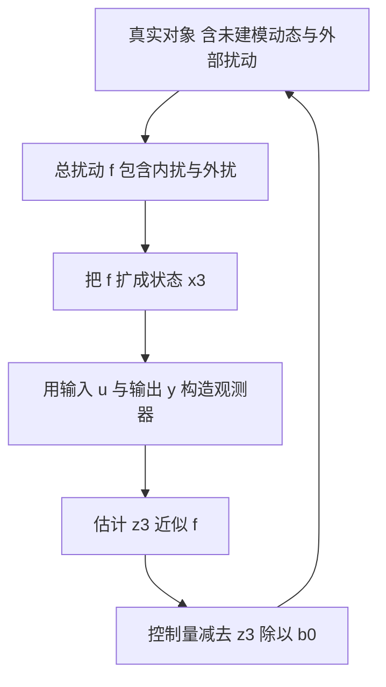
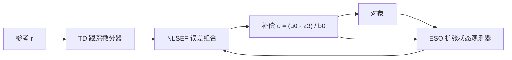

# ADRC的问题设定与Han框架

负载突变时，PID 的积分项要若干拍才能把控制量补到新的水平，这几拍里误差持续存在；摩擦的粘滞段、负载引起的重力变化、电池电压波动、阵风这类难以建模的项，逐项辨识的成本很高，而且辨识结果随工况变化。

PID 把误差的现在、过去与未来三项组合，LQR 假设模型大致准确并把偏差归因于初始条件，MPC 需要完整模型做预测，三者的共同假设都是模型已知或误差可控。自抗扰控制（Active Disturbance Rejection Control，ADRC）换了一个问法：不去分辨扰动来自哪里，而是把所有不确定项打包成一个信号，用观测器实时估计它，再在控制量里减去。韩京清在 1990 年代提出这套结构，它的核心表述是估计扰动并实时补偿，而不是逐项建模再抵消（`01_control_theory/adrc_control/README.md`）。三个模块的分工是问题设定的核心；观测器的数学形式、带宽参数化、实现与整定分别在后续三篇。

## 从误差反馈到扰动估计

PID 的作用路径是误差经比例、积分、微分三路合成控制量。积分项负责消除稳态偏差，它的工作机制是累积误差直到控制量足够大；这个过程是被动的，偏差必须先出现并且持续一段时间，积分项才会把控制量推到需要的水平。微分项负责提前动作，但它对噪声敏感，实际可用的微分增益受到测量噪声的限制。

ADRC 的作用路径多了一个前馈分支：观测器把系统的输入与输出作为已知量，实时重构出当前的总扰动值，控制量里直接减去它。偏差不需要先积累，扰动被估计到之后立刻被补偿。这个差别在负载突变与电压跌落时最明显：PID 的积分项要用若干拍把偏差消掉，ADRC 在一到两个观测器时间常数内就能把扰动项减掉（`README.md` 给出的电机速度环对比正是这个现象）。

代价是引入了观测器，它的动态成为闭环的一部分。观测器带宽决定扰动估计的速度，也决定测量噪声被放大多少。整套设计因此变成三个量的选择：控制增益 $b_0$、观测器带宽 $\omega_o$、控制器带宽 $\omega_c$。

## 总扰动把未知项装进一个状态

考虑一个二阶非线性对象

$$
\ddot{y} = f(y, \dot{y}, w(t), t) + b u
$$

$f$ 里包含未建模动力学、参数不确定性、外部扰动与外扰，$b$ 是控制输入的实际增益（`README.md`）。把 $f$ 定义为总扰动，并把它的值扩成一个新状态 $x_3 = f$，系统写成

$$
\begin{cases}
\dot{x}_1 = x_2 \\
\dot{x}_2 = x_3 + b u \\
\dot{x}_3 = \dot{f} \\
y = x_1
\end{cases}
$$

第三步 $\dot{x}_3 = \dot{f}$ 表示总扰动的变化率未知但有界，这是 ADRC 的基本假设（`README.md`）。扩张之后系统变成三阶线性结构，原系统的全部非线性都挪进了 $x_3$ 的输入，观测器因此不需要知道 $f$ 的具体形式。

这个假设的适用范围由 $\dot{f}$ 的有界性决定。$f$ 里包含的参数在工况切换时可能跳变，跳变时刻的 $\dot{f}$ 在数学上无界，实际观测器只能以有限带宽跟随，因此跳变后必然有一段估计误差。工程上关心的是误差的峰值与恢复时间，而不是绝对有界性。

## 三个模块的分工与信号流

ADRC 把控制器拆成三个独立模块（`README.md`）：

| 模块 | 输入 | 输出 | 职责 |
| --- | --- | --- | --- |
| 跟踪微分器 TD | 参考信号 $r$ | $r_1$、$r_2$ | 安排过渡过程并给出微分 |
| 扩张状态观测器 ESO | 控制量 $u$、输出 $y$ | $z_1$、$z_2$、$z_3$ | 估计输出、输出的导数、总扰动 |
| 非线性状态误差反馈 NLSEF | $r_1, r_2, z_1, z_2$ | $u_0$ | 按误差组合出初始控制量 |

补偿关系是最后一步（`README.md`）：

$$
u = \frac{u_0 - z_3}{b_0}
$$

$z_3$ 的量纲是加速度（对二阶对象），除以 $b_0$ 后转换成控制量量纲，从 $u$ 中减去就实现了扰动抵消。三个模块之间只有信号连线，没有交叉参数，因此可以分别设计与分别测试：TD 单独看参考过渡是否平滑，ESO 单独看扰动估计是否及时，NLSEF 单独看误差组合是否合适。

模块化的好处是排查简单。闭环振荡时先看 ESO 的估计是否抖动，再看 NLSEF 的增益是否过大；参考突变的超调则先看 TD 的滤波因子。素材仓库的调参速查表就是按这个思路组织的（`README.md`）。

## 控制增益 b0 的角色

$b_0$ 是控制量到最高阶导数的实际增益估计值。物理上它来自模型，例如直流电机的 $b_0 = K_t / J$，四旋翼某个轴的 $b_0$ 与转动惯量成反比。设计时只需要一个近似值：素材给出的误差允许范围是实际值的 0.5 到 2 倍，剩余偏差由 ESO 补偿（`README.md`）。

$b_0$ 的符号必须正确。它出现在补偿式的分母上，符号错了等价于把扰动补偿变成正反馈，闭环会立刻发散（`README.md`）。$b_0$ 的大小影响控制激进度：$b_0$ 取得比实际小，控制量按比例放大，等效提高控制增益，容易饱和；取得偏大则相反，控制变保守。调参时若发现控制量持续饱和，先检查 $b_0$ 是否偏小（`README.md`）。

$b_0$ 的辨识用开环阶跃：给一个控制输入阶跃 $\Delta u$，测量加速度响应 $\Delta \ddot{y}$，两者之比就是估计值（`README.md`）。高阶对象与一阶对象的高阶导数量纲不同，辨识方法随之改变，但比值关系一致。

## 标准型与串联积分器

补偿之后，对象的输入输出关系变成

$$
y^{(n)} = u_0
$$

这是 $n$ 重串联积分器，$n$ 是对象的相对阶。ADRC 的设计全部在这个标准型上进行：NLSEF 对串联积分器做极点配置，ESO 对串联积分器加扩张状态做观测器设计。原系统的非线性被 $z_3$ 抵消之后不再出现在设计方程里。

把对象化为标准型的能力是 ADRC 的核心价值，也是它的边界。若控制量对最高阶导数的增益随状态变化剧烈，$b_0$ 无法用一个常数近似，补偿会留下与增益偏差成正比的残差；若对象存在纯时滞，输出对控制的响应要延迟若干拍，观测器无法在延迟窗口内估计扰动，闭环性能会显著下降（`README.md`）。素材明确把时滞系统列为需要特殊处理的情形。

## 与PID在结构上的差别

| 维度 | PID | ADRC |
| --- | --- | --- |
| 扰动处理 | 被动，积分项累积消除 | 主动，观测器估计后前馈补偿 |
| 模型依赖 | 不需要模型 | 需要 $b_0$ 的近似值 |
| 积分饱和 | 存在，需要抗饱和 | 无积分项，由 ESO 承担 |
| 微分提取 | 差分放大噪声 | TD 给出平滑微分 |
| 参数 | $K_p, K_i, K_d$ | $\omega_c, \omega_o, b_0$ |
| 计算量 | 每周期 5 到 10 次浮点 | 每周期 20 到 50 次浮点 |

两边的参数个数相同，差别在参数的物理含义（`README.md`）。PID 的三个增益需要试凑，量纲与对象相关；ADRC 的三个参数分别是带宽与增益估计，可以按带宽换算成响应时间，也可以用极点配置公式直接算出来。这个差别在第四篇展开。

## 小结

### 核心概念

- ADRC 把未建模动力学、参数不确定性与外部扰动合并为总扰动 $f$，用观测器估计并补偿，而不是逐项建模。
- 把 $f$ 扩成状态 $x_3$ 后系统成为三阶线性结构，观测器不需要知道 $f$ 的具体形式，只要求 $\dot{f}$ 有界。
- 三个模块分工明确：TD 安排过渡过程并给出微分，ESO 估计输出与导数和总扰动，NLSEF 组合误差并做补偿 $u = (u_0 - z_3)/b_0$。
- $b_0$ 是控制输入增益的估计，允许 0.5 到 2 倍误差，符号错误会导致发散，偏小会使控制量饱和。
- 补偿后对象化为四重串联积分器标准型；时滞系统与增益剧烈变化的系统超出适用范围。

### 设计权衡

| 选择 | 带来的能力 | 付出的代价 |
| --- | --- | --- |
| 把未知项打包为总扰动 | 不需要精确模型 | 对 $\dot{f}$ 的有界性有要求 |
| 引入 ESO | 扰动被前馈补偿 | 观测器动态进入闭环，噪声放大 |
| 用 TD 给出微分 | 噪声远小于差分 | 增加速度因子 $r$ 与滤波因子 $h_0$ 两个参数 |
| 模块化结构 | 可分别设计与排查 | 三个模块的带宽需要协调 |
| 只辨识 $b_0$ | 建模工作量小 | 增益随工况变化大时补偿残差上升 |

## 练习

### 基础题

1. 写出把 $\ddot{y} = f + bu$ 扩成三阶系统的过程，说明为什么观测器不需要知道 $f$ 的形式。
2. 推导 $u = (u_0 - z_3)/b_0$ 的量纲关系，说明 $b_0$ 对一阶对象与二阶对象分别是什么量纲。
3. 比较 PID 的积分项与 ESO 的 $z_3$ 在消除稳态偏差上的机制差异。

### 挑战题

4. 取一个含库仑摩擦与重力的单关节模型，把两项合并成总扰动，说明 $\dot{f}$ 在关节换向时刻的行为以及观测器会出现的估计误差。
5. 说明 $b_0$ 取实际值一半时闭环等效增益与饱和风险的变化，并给出一个用开环阶跃确定 $b_0$ 的实验步骤。
6. 构造一个含 5 拍纯时滞的对象，说明 ESO 为什么无法及时估计扰动，并给出两种缓解思路。

## 附：本页引用的路径

| 路径 | 用途 |
| --- | --- |
| `01_control_theory/adrc_control/README.md` | 素材仓库 ADRC 单元根：起源与 Han 框架、总扰动与扩张状态、补偿关系、应用对比、与 PID 对比、常见错误 |
| `docs/19-控制理论/01-PID整定与抗饱和` | 本站 PID 单元，用于对照误差反馈与扰动补偿 |
| `docs/19-控制理论/02-LQR与LQG/01-LQR问题的构造与代价函数.md` | 本站 LQR 第一篇，模型已知条件下的最优反馈 |
| `~/robot_control_simulation` | 素材仓库根，正文中素材路径均相对该根 |
