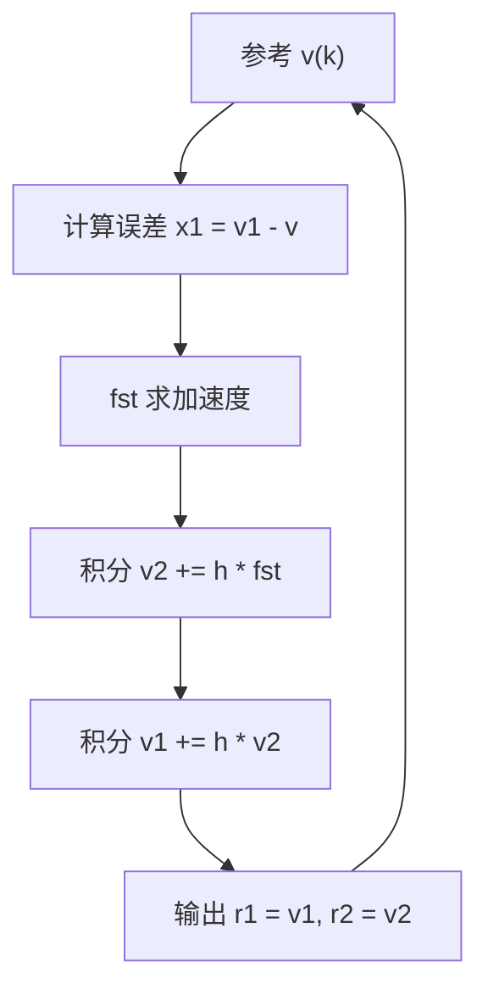
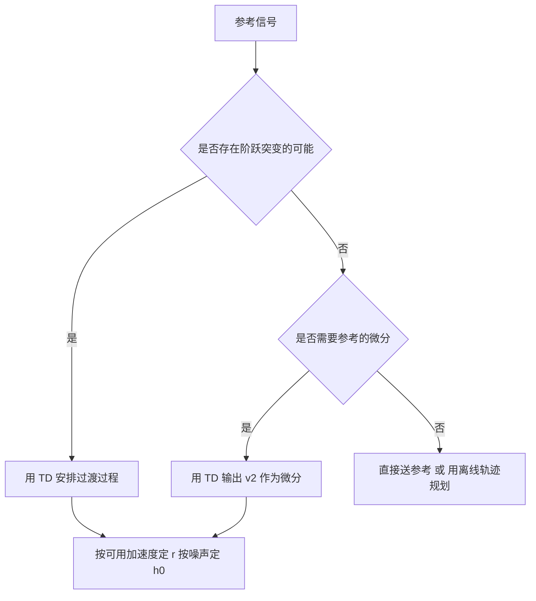

# 跟踪微分器与过渡过程

把阶跃参考直接送进控制器，是很多振荡问题的来源。误差在跳变瞬间最大，控制器输出按比例跟着跳，执行器被推到限幅，之后系统带着过冲回落，往复几次才稳定。PID 用微分项抑制过冲，但参考的跳变在数学上导数无穷，微分项在这一瞬间没有可用信息，能做的只是把增益调小。

跟踪微分器（Tracking Differentiator，TD）的做法是先给参考信号安排一条可行的过渡轨迹，再由控制器跟踪这条轨迹。过渡轨迹由二阶最速控制问题解出，在给定速度约束下用最短时间从当前值走到目标值，因此它的形状由速度因子决定，与控制器的增益无关。同一模块还给出参考的微分，供误差组合里的速度通道使用。最速控制综合函数 $fst$ 的推导给出离散迭代形式，其中的三个参数决定过渡轨迹的快慢与超调。

## 安排过渡过程解决什么问题

参考信号从 $r_0$ 跳到 $r_1$ 时，误差的初始值就是跳变幅度，控制器输出与跳变幅度成正比。若执行器能承受这个输出，系统会以最大加速度冲向目标并冲过头；若不能，执行器停在限幅上，误差在限幅期间持续存在，退出限幅时系统已经积累了速度，过冲更大。两条路径都指向同一个结论：参考的跳变幅度与系统的可用加速度不匹配。

TD 的作用是把参考换成一条满足加速度约束的轨迹。轨迹的加速度由速度因子 $r$ 给出，$r$ 越大过渡越快，加速度需求越高。控制器不再跟踪阶跃，而是跟踪一条连续可微的曲线，误差从零开始缓慢增长再回落，执行器始终工作在可达范围内（`01_control_theory/adrc_control/README.md:79-85`）。

这个做法与前馈轨迹规划的目标相同，差别在生成方式。轨迹规划通常离线算好或用多项式插值，需要知道总行程与期望时长；TD 是一个在线因果系统，只依赖当前参考值，参考在运行中变化时自动重新规划，不需要提前知道行程。代价是过渡时间由 $r$ 与当前距离共同决定，不是一个可以先指定的量。

## 最速控制综合函数的推导

最速控制问题的表述是：给定二阶积分器

$$
\dot{v}_1 = v_2, \qquad \dot{v}_2 = u, \qquad |u| \leq r
$$

求使 $v_1$ 最快到达目标 $v$、且 $v_2$ 同时归零的控制律。这个问题的解是一个开关函数：先在加速度上限加速，到达临界点后切换到减速段。临界点由当前误差 $v_1 - v$ 与当前速度 $v_2$ 共同决定。

离散实现把它写成一个综合函数 $fst(x_1, x_2, r, h)$（`README.md:87-116`）。先定义

$$
d = r h, \qquad d_0 = d h, \qquad y = x_1 + h x_2
$$

$$
a_0 = \sqrt{d^2 + 8 r |y|}
$$

中间量 $a$ 分两段：

$$
a = \begin{cases}
x_2 + \dfrac{a_0 - d}{2} \operatorname{sign}(y), & |y| > d_0 \\
x_2 + \dfrac{y}{h}, & |y| \leq d_0
\end{cases}
$$

最后 $fst$ 也分两段：

$$
fst = \begin{cases}
-r \operatorname{sign}(a), & |a| > d \\
-r \dfrac{a}{d}, & |a| \leq d
\end{cases}
$$

第一段的物理含义是状态离临界点较远，控制量取加速度上限；第二段是进入临界点附近的线性区，控制量按比例收小，避免在临界点附近来回切换。$d$ 与 $d_0$ 定义的就是这两个区的边界，它们随 $r$ 与 $h$ 变化。

## 离散迭代与三个参数

TD 的离散迭代是（`README.md:118-125`）：

$$
v_1(k+1) = v_1(k) + h \, v_2(k)
$$

$$
v_2(k+1) = v_2(k) + h \, fst(v_1(k) - v(k), \, v_2(k), \, r, \, h_0)
$$

三个参数的分工如下（`README.md:127-133`）：

| 参数 | 含义 | 取值建议 |
| --- | --- | --- |
| $r$ | 速度因子，越大跟踪越快 | 由系统可用加速度与期望过渡时间决定 |
| $h$ | 迭代步长 | 取采样周期 |
| $h_0$ | 滤波因子，$h_0$ 大于 $h$ | 增大 $h_0$ 增强滤波，跟踪变慢 |

$h_0$ 与 $h$ 分离是这套做法的关键。$h$ 出现在积分里，必须等于实际步长才能保证积分正确；$h_0$ 只出现在 $fst$ 的边界计算里，把它取得比 $h$ 大相当于放宽线性区，抑制参考信号里的高频抖动被当作真实运动。素材给出的量级是 $h_0$ 取 $h$ 的整数倍，具体倍数按参考噪声水平试（「增大 $h_0$ 增强滤波效果」一句对应 `README.md:133`）。

## 微分提取的噪声取舍

经典差分 $v_2(k) = (v_1(k) - v_1(k-1))/T_s$ 对噪声的放大倍数与 $1/T_s$ 成正比。$T_s$ 取 1 ms 时噪声被放大一千倍，微分量基本不可用；若先低通再差分，滤波器引入的相位滞后会把提前量吃掉，微分作用名存实亡。

TD 的输出 $v_2$ 由积分产生，输入里虽然有噪声，但它经过 $fst$ 的分段线性区后被限幅：线性区内输出与输入成比例，比例系数是 $r/d = 1/h$，与差分相当；分段之外输出饱和在 $\pm r$，噪声尖峰的影响被截断。这个饱和特性是 TD 微分比差分平滑的直接原因（`README.md:83-85` 把「噪声放大远小于经典差分方法」列为 TD 的功能之一）。

用 TD 的微分需要付出相位代价。$r$ 越小过渡越平缓，微分信号越平滑，但它跟踪参考变化的速度也越慢；参考在运行中频繁变化时，$v_1$ 会滞后于 $v$，误差组合里的位置通道实际上在跟踪一条落后的轨迹。参考变化频率高的场合应当增大 $r$ 并接受更大的噪声，或者不用 TD 而改用其他微分估计方法。

## 在参考突变与轨迹跟踪里的用法

TD 的典型用法有两种。第一种是参考突变：手动设定值切换、模式切换、上位机下发新目标时，参考从旧值跳到新值，用 TD 平滑。此时 $r$ 按执行器的最大容许加速度取，$h_0$ 按参考信号噪声取。

第二种是轨迹跟踪：参考本身是一条连续轨迹，TD 用来给出可用的微分。此时 $r$ 要取得足够大，使 $v_1$ 能跟上参考而不产生明显滞后；$h_0$ 主要承担滤波功能。若轨迹的阶次高于二阶，可以把两到三个 TD 级联，用前一级的微分作为后一级的输入，得到高阶导数估计（通用做法，素材仓库给出的是二阶 TD 形式，未展开级联用法）。

## 与参考前馈的分工

TD 给出的 $r_1$ 与 $r_2$ 可以有两种接法。接进 NLSEF 时，$r_1$ 与 $z_1$ 比较、$r_2$ 与 $z_2$ 比较，TD 的作用是让误差从零开始，等价于把阶跃软化成斜坡；接进前馈通道时，$r_2$ 乘以相应系数后加在控制量上，TD 的作用是提供速度前馈。两种接法可以同时使用。

需要区分的是 TD 与前馈补偿的位置。TD 处理的是参考信号，与对象模型无关；前馈补偿处理的是对象的已知动态，需要模型。ADRC 的补偿项 $z_3$ 是估计出来的，因此不要求模型，但 TD 的 $r$ 与 $h_0$ 仍需要按执行器能力与噪声水平设定，这两个量来自硬件而不是模型。

## 小结

### 核心概念

- TD 把阶跃参考换成满足加速度约束的二阶过渡轨迹，避免执行器饱和与过冲。
- 最速控制综合函数 $fst$ 分两段：远离临界点时输出加速度上限，进入线性区后按比例收小。
- 离散迭代用 $h$ 作积分步长、用 $h_0$ 作滤波因子，两者分离是滤波能力与积分精度得以兼顾的原因。
- TD 的微分由积分产生并经饱和截断，噪声放大远小于经典差分，代价是过渡平缓时存在相位滞后。
- 参考突变的场合按可用加速度定 $r$，连续轨迹的场合取较大的 $r$ 并用 $h_0$ 滤波。

### 设计权衡

| 选择 | 带来的能力 | 付出的代价 |
| --- | --- | --- |
| 用 TD 安排过渡过程 | 无过冲、执行器不饱和 | 过渡时间由 $r$ 与距离共同决定 |
| $r$ 取大 | 过渡快、跟踪滞后小 | 加速度需求高、微分噪声大 |
| $h_0$ 取大于 $h$ | 抑噪 | 线性区放宽，跟踪变慢 |
| 用 TD 微分代替差分 | 噪声放大被截断 | 存在相位滞后 |
| 级联 TD 求高阶导数 | 得到高阶微分估计 | 结构复杂，参数增多 |

## 练习

### 基础题

1. 写出 $fst$ 的两段表达式，并说明 $d$ 与 $d_0$ 在分段中的位置。
2. 解释 $h_0$ 为什么可以取大于 $h$，而 $h$ 必须等于采样周期。
3. 比较 TD 的 $v_2$ 与一阶差分在噪声放大上的差别，说明饱和截断起的作用。

### 挑战题

4. 取 $r$ 分别为 10 与 100、$T_s = 1$ ms，计算阶跃距离为 1 时两条过渡轨迹的峰值加速度与大致过渡时间。
5. 设计一个两段级联 TD 求二阶导数，说明两级参数如何分配，并分析噪声放大。
6. 说明参考在运行中频繁变化时 TD 的滞后如何影响误差组合，并给出两种补偿方法。

## 附：本页引用的路径

| 路径 | 用途 |
| --- | --- |
| `01_control_theory/adrc_control/README.md` | 素材仓库 ADRC 单元根：TD 功能（:79-85）、$fst$ 推导（:87-116）、离散迭代与参数（:118-133） |
| `docs/19-控制理论/04-ADRC自抗扰/01-ADRC的问题设定与Han框架.md` | 本站第一篇，三个模块的分工与补偿关系 |
| `docs/19-控制理论/01-PID整定与抗饱和` | 本站 PID 单元，微分滤波与设定值加权的对照 |
| `~/robot_control_simulation` | 素材仓库根，正文中素材路径均相对该根 |
