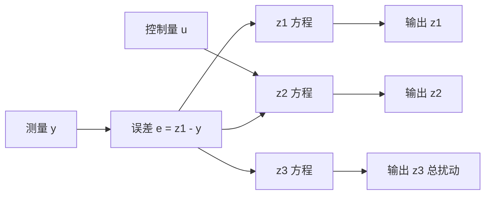
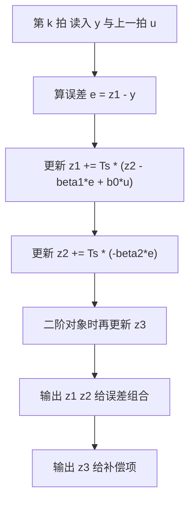

# 扩张状态观测器

第一篇把总扰动打包成一个状态，观测器的任务就是把这个状态实时重构出来。它与标准 Luenberger 观测器的结构相同，区别在扩张出来的那一维没有对应的测量方程：总扰动既不能直接测，也没有已知的动力学模型，只有一条假设，即它的变化率有界。观测器靠输出 $y$ 与输入 $u$ 的组合来间接推断它，因此观测器带宽成了唯一的调节手段。

非线性 $fal$ 组合与线性 LESO 是三阶观测器的两条路线，误差只能做到有界；带宽抬高时测量噪声会被搬进控制量。素材仓库的公式与参数建议都取自它，其中一处公式的 $b_0u$ 位置存在前后不一致，按后文的三阶形式取用并在正文里标注。

## 把总扰动扩成一个状态

第一篇的扩张系统在二阶对象上写成

$$
\begin{cases}
\dot{x}_1 = x_2 \\
\dot{x}_2 = x_3 + b u \\
\dot{x}_3 = \dot{f} \\
y = x_1
\end{cases}
$$

前两个方程是对象本身，第三个方程是人为加上去的：把 $f$ 当作状态，它的动力学就是自己的变化率。观测器对这三个状态各建一路估计，用输出误差 $e = z_1 - y$ 分别修正（`01_control_theory/adrc_control/README.md:135-154`）。

关键在于 $x_3$ 没有对应的输出方程：$y = x_1$ 只约束第一维。观测器能估计 $x_3$，靠的是 $x_3$ 通过第二个方程影响 $x_2$，再通过第一个方程影响 $x_1$，即输出里含有 $x_3$ 的积分信息。这个间接路径的强度由观测器增益决定，增益不足时 $z_3$ 跟不上 $f$，增益过大时测量噪声被放大。

## 二阶对象的三阶观测器

标准的扩张状态观测器形式是（`README.md:156-166`）：

$$
\begin{cases}
\dot{z}_1 = z_2 - \beta_1 g_1(e) \\
\dot{z}_2 = z_3 - \beta_2 g_2(e) + b_0 u \\
\dot{z}_3 = -\beta_3 g_3(e)
\end{cases}
$$

其中 $e = z_1 - y$，$g_i(e)$ 是误差的非线性或线性函数，$b_0$ 是控制增益的估计值。注意 $b_0u$ 出现在第二个方程上，它代表控制量对加速度的贡献；第一、第三个方程不含控制量。

素材仓库第 3 节给出二阶 LESO 时把 $b_0u$ 写在了 $\dot{z}_1$ 上（`README.md:186-192`），与本节以及第 3.2 节的三阶形式（`README.md:283-289`）不一致。按 $z_2$ 含 $b_0u$ 的形式引用，与一阶 LESO 代码（`README.md:554-567`）一致。引用该节公式时需要留意这一点。

$z_1$ 跟踪输出，$z_2$ 跟踪输出的一阶导数，$z_3$ 跟踪总扰动。取 $g_i(e) = e$ 时三个增益按带宽参数化：$\beta_1 = 3\omega_o$、$\beta_2 = 3\omega_o^2$、$\beta_3 = \omega_o^3$（`README.md:293-297`）。

## 非线性fal形式与线性LESO

把 $g_i(e)$ 换成 $fal$ 函数就得到非线性 ESO（`README.md:168-180`）：

$$
\begin{cases}
\dot{z}_1 = z_2 - \beta_1 e \\
\dot{z}_2 = z_3 - \beta_2 fal(e, \alpha_2, \delta) + b_0 u \\
\dot{z}_3 = -\beta_3 fal(e, \alpha_3, \delta)
\end{cases}
$$

$fal(e, \alpha, \delta)$ 的形状是：在 $|e| \le \delta$ 的线性区内按 $e/\delta^{1-\alpha}$ 成比例，区外按 $|e|^\alpha \operatorname{sign}(e)$ 变化。取 $\alpha < 1$ 时，小误差对应的增益反而更大，大误差对应更小的增益，这就是「小误差高增益、大误差低增益」的来源。素材给出的典型参数是 $\alpha_2 = 0.5$、$\alpha_3 = 0.25$，$\delta$ 取 $h$ 的整数倍（`README.md:180`）。

令 $g_i(e) = e$ 退化为线性 LESO，结构就是 Luenberger 观测器（`README.md:182-192`）。两条路线的差别在计算量与性能：$fal$ 含幂运算，每次更新要做两次幂，MCU 上开销明显；线性形式只有乘加，参数按带宽公式直接算出。素材的对比表把非线性 ADRC 的收敛速度列为「小误差时更快」，把计算量列为「较高」（`README.md:422-433`）。

| 维度 | 非线性 ESO | 线性 LESO |
| --- | --- | --- |
| 误差函数 | $fal$，含幂运算 | 恒等函数，纯乘加 |
| 小误差增益 | 高 | 恒定 |
| 参数 | $\beta_i$、$\alpha_i$、$\delta$ | 只需 $\omega_o$ |
| 计算量 | 较高 | 低 |
| 调参难度 | 高，参数耦合 | 低，带宽公式直接给出 |

## 误差有界性与收敛条件

记三个估计误差为 $\tilde{z}_1 = z_1 - y$、$\tilde{z}_2 = z_2 - \dot{y}$、$\tilde{z}_3 = z_3 - f$（`README.md:194-202`）。把观测器方程与扩张系统相减，得到误差动力学

$$
\dot{\tilde{z}} = (A - LC) \tilde{z} + E \dot{f}
$$

$(A-LC)$ 的极点按 $-\omega_o$ 配置，$\dot{f}$ 是外部输入。若 $\dot{f}$ 有界，则误差有界；界的大小与 $\|\dot{f}\|_\infty / \omega_o^n$ 同阶。两个结论可以直接读出：$\dot{f}$ 越小、$\omega_o$ 越大，稳态误差越小。

误差收敛到零需要 $\dot{f} = 0$，即总扰动是常值。实际系统里摩擦换向、负载突变都会让 $\dot{f}$ 出现尖峰，误差在这些时刻会明显上升，再由观测器极点决定的速率回落。素材把收敛性证明归到 2011 年的 ESO 收敛性工作（`README.md:993`），本页只用到「有界且可调」这个结论。

## 观测器带宽与噪声放大

$\omega_o$ 增大时 $z_3$ 跟随 $f$ 更快，但观测器把测量噪声看作误差，也会更快地把它搬进 $z_2$ 与 $z_3$。噪声进入 $z_3$ 后经补偿项 $u = (u_0 - z_3)/b_0$ 直接进控制量，表现为控制输出抖动（`README.md:976` 把这一点列为常见错误）。

定量的取舍关系可以用两条经验规则表达（`README.md:929-959`）：观测器带宽取控制器带宽的 3 到 10 倍，先取 5 倍起步；采样频率至少是观测器带宽的 5 到 10 倍，

$$
T_s \leq \frac{1}{5 \sim 10} \cdot \frac{2\pi}{\omega_o}
$$

第二条比第一条更硬。$\omega_o$ 提高到采样频率的十分之一以上时，离散化误差开始影响观测器极点位置，欧拉离散的近似失效（`README.md:978`）。素材给出的判据是 $\omega_o > 0.2/T_s$ 时欧拉离散不再准确，需要换用更高阶的离散方法。

## 离散实现与欧拉法误差

一阶 LESO 的离散实现只有两行积分（`README.md:554-562`）：

$$
z_1 \mathrel{+}= T_s \left( z_2 - \beta_1 e + b_0 u \right)
$$

$$
z_2 \mathrel{+}= T_s \left( -\beta_2 e \right)
$$

欧拉法的截断误差是 $O(T_s^2)$ 每步，累积到观测器时间常数上表现为极点位置的偏移。$\omega_o T_s$ 小于 0.2 时偏移可以忽略；接近 0.5 时极点已经明显偏离设计值，闭环响应会比设计更快或更慢，用极点公式反推的带宽不再准确。修法有三种：减小 $T_s$、改用梯形或龙格库塔离散、或把 $\omega_o$ 设计值按实测响应重新标定。

初值的选择影响启动阶段。$z_1$ 初始化到第一个测量值、$z_2$ 与 $z_3$ 初始化为零，可以让启动瞬间的误差最小；全部初始化为零时，观测器要用若干时间常数把 $z_1$ 拉到实际输出，这段时间内控制器输出会偏大。素材的代码把两个状态都初始化为零（`README.md:542-544`），工程实现里建议按上面的方式初始化。

## 小结

### 核心概念

- ESO 在原系统上增加一维扩张状态 $x_3 = f$，靠输出误差 $e = z_1 - y$ 同时修正三路估计。
- 三阶观测器中 $b_0u$ 属于 $\dot{z}_2$，素材第 3 节把它写在 $\dot{z}_1$ 上存在不一致，引用时按三阶形式取用。
- 非线性 ESO 用 $fal$ 实现小误差高增益、大误差低增益，代价是幂运算与更多参数；线性 LESO 按带宽公式配置，计算量低。
- 误差有界的界与 $\|\dot{f}\|_\infty / \omega_o^n$ 同阶，收敛到零要求 $\dot{f} = 0$。
- 观测器带宽取控制器带宽的 3 到 10 倍，且采样频率至少是其 5 到 10 倍，$\omega_o T_s$ 超过 0.2 后欧拉离散不再准确。

### 设计权衡

| 选择 | 带来的能力 | 付出的代价 |
| --- | --- | --- |
| 用非线性 $fal$ | 小误差收敛更快 | 幂运算开销，参数增多 |
| 用线性 LESO | 纯乘加、参数少 | 全误差区增益恒定 |
| 提高 $\omega_o$ | 扰动估计更快 | 测量噪声进入控制量 |
| 降低 $\omega_o$ | 控制量平滑 | 扰动恢复慢，闭环有效裕度下降 |
| 用欧拉离散 | 实现最短 | $\omega_o$ 受 $T_s$ 限制 |

## 练习

### 基础题

1. 写出二阶对象的三阶 ESO 方程，指出 $b_0u$ 在哪一路上，并说明理由。
2. 推导误差动力学 $\dot{\tilde{z}} = (A-LC)\tilde{z} + E\dot{f}$，说明 $\dot{f}$ 有界时误差界与 $\omega_o$ 的关系。
3. 计算 $\omega_o = 100$ rad/s 时允许的最大采样周期，并按素材的判据说明欧拉离散是否仍然准确。

### 挑战题

4. 取一个常值扰动加一次阶跃扰动的对象，仿真比较 $\omega_o$ 取控制器带宽 3 倍与 10 倍时 $z_3$ 的估计误差与控制量抖动。
5. 说明 $fal$ 的 $\delta$ 取不同值时线性区的宽度如何变化，并分析 $\delta$ 过小与过大各带来什么问题。
6. 把欧拉离散换成梯形离散，比较同一个 $\omega_o$ 下观测器极点的偏移量，说明为什么高阶离散能放宽 $T_s$ 限制。

## 附：本页引用的路径

| 路径 | 用途 |
| --- | --- |
| `01_control_theory/adrc_control/README.md` | 素材仓库 ADRC 单元根：ESO 结构与扩张状态（:135-166）、非线性与线性形式（:168-192）、误差分析（:194-202）、带宽参数化（:338-380）、调参规则（:929-959）、常见错误（:973-979） |
| `docs/19-控制理论/04-ADRC自抗扰/01-ADRC的问题设定与Han框架.md` | 本站第一篇，总扰动与补偿关系 |
| `docs/19-控制理论/04-ADRC自抗扰/04-线性ADRC与带宽参数化.md` | 本站第四篇，$\beta$ 与 $k$ 的极点配置推导 |
| `docs/20-状态估计与信号处理/01-卡尔曼滤波KF·EKF·UKF` | 本站状态估计单元，观测器增益与噪声协方差的对照 |
| `~/robot_control_simulation` | 素材仓库根，正文中素材路径均相对该根 |
