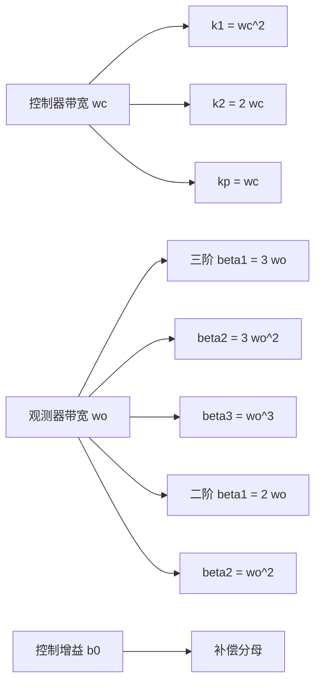
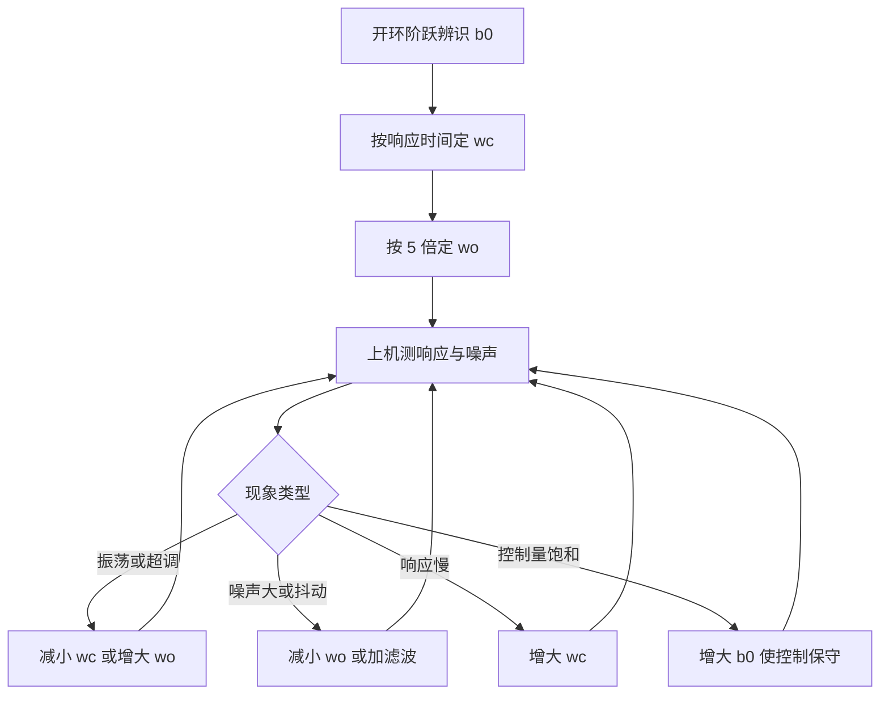

# 线性ADRC与带宽参数化

非线性 ADRC 的性能优势来自 $fal$ 函数的非线性形状，代价是参数多、耦合强、需要经验。韩京清版本的参数列表包含 $\beta_1$ 到 $\beta_3$、$\alpha_1$ 到 $\alpha_3$、$\delta$、$b_0$ 等六到十个量，整定者要同时理解观测器、非线性增益与误差组合三套规律，工程推广因此受限。

高志强在 2003 年提出把 ADRC 线性化并引入带宽参数化：观测器与控制器都按多重极点配置，所有增益由两个带宽直接算出，参数从六到十个降到三个（`01_control_theory/adrc_control/README.md`）。这一改动让 LADRC 的调参过程与 PID 一样简单，也让它成为工程上最常用的形式。一阶与二阶 LADRC 的增益都由两个带宽直接算出，两个带宽之比的取法决定了等效传递函数的形状。

## 参数从六个压到三个

Gao 方法把设计自由度归结为三个量（`README.md`）：

| 参数 | 符号 | 含义 | 确定方式 |
| --- | --- | --- | --- |
| 控制器带宽 | $\omega_c$ | 闭环期望带宽 | 由期望响应时间定 |
| 观测器带宽 | $\omega_o$ | ESO 的响应带宽 | 取 $\omega_c$ 的 3 到 10 倍 |
| 控制增益 | $b_0$ | 控制输入增益估计 | 由模型或阶跃实验辨识 |

参数减少的原因是增益不再独立设计。三个观测器增益被约束成同一个带宽的三次多项式系数，两个控制器增益被约束成同一带宽的二次多项式系数，独立自由度只剩带宽本身。带宽是有物理含义的量，与响应时间之间可以换算（`README.md` 给出 $t_r \approx 1.8/\omega_c$），因此设计者不再面对一组没有量纲含义的增益。

## 一阶对象的LADRC

一阶对象写成

$$
\dot{y} = f(y, w, t) + b u
$$

把 $f$ 扩成第二个状态，一阶 LESO 的两路方程是（`README.md`）：

$$
\begin{cases}
\dot{z}_1 = z_2 + \beta_1 (y - z_1) + b_0 u \\
\dot{z}_2 = \beta_2 (y - z_1)
\end{cases}
$$

$z_1$ 跟踪输出，$z_2$ 跟踪总扰动。注意这里 $b_0u$ 加在 $\dot{z}_1$ 上，与一阶对象的物理结构一致：控制量直接影响一阶导数，也就是 $z_1$ 的导数。这一点与二阶对象的三阶观测器不同，那里的 $b_0u$ 加在 $\dot{z}_2$ 上（见第三篇）。

控制律是比例项加扰动补偿（`README.md`）：

$$
u = \frac{k_p (r - z_1) - z_2}{b_0}, \qquad k_p = \omega_c
$$

分子里 $k_p(r - z_1)$ 是误差的比例作用，$-z_2$ 是扰动补偿。分母的 $b_0$ 把两者的量纲换算成控制量。

## 二阶对象的LADRC

二阶对象写成

$$
\ddot{y} = f(y, \dot{y}, w, t) + b u
$$

三阶 LESO 的三路方程是（`README.md`）：

$$
\begin{cases}
\dot{z}_1 = z_2 + \beta_1 (y - z_1) \\
\dot{z}_2 = z_3 + \beta_2 (y - z_1) + b_0 u \\
\dot{z}_3 = \beta_3 (y - z_1)
\end{cases}
$$

控制律与一阶形式结构相同，只是误差组合多一路（`README.md`）：

$$
u_0 = k_1 (r - z_1) + k_2 (\dot{r} - z_2), \qquad u = \frac{u_0 - z_3}{b_0}
$$

$k_1$ 对应位置误差通道，$k_2$ 对应速度误差通道，形式上就是 PD 控制。$\dot{r}$ 由跟踪微分器给出，没有 TD 时取零。

## 极点配置推出增益公式

两个增益组都来自极点配置。观测器误差动力学矩阵的特征多项式配置成三重极点 $-\omega_o$（`README.md`）：

$$
s^3 + \beta_1 s^2 + \beta_2 s + \beta_3 = (s + \omega_o)^3
$$

右边展开是 $s^3 + 3\omega_o s^2 + 3\omega_o^2 s + \omega_o^3$，比较系数得到

$$
\beta_1 = 3\omega_o, \qquad \beta_2 = 3\omega_o^2, \qquad \beta_3 = \omega_o^3
$$

闭环特征多项式配置成二重极点 $-\omega_c$（`README.md`）：

$$
s^2 + k_2 s + k_1 = (s + \omega_c)^2
$$

展开得到

$$
k_1 = \omega_c^2, \qquad k_2 = 2\omega_c
$$

一阶对象的对应公式是 $\beta_1 = 2\omega_o$、$\beta_2 = \omega_o^2$、$k_p = \omega_c$（`README.md`），同样由 $(s+\omega_o)^2$ 与一阶闭环多项式比较得到。

## 等效传递函数与二自由度PID

把 $z$ 消掉之后，二阶 LADRC 的控制器可以用 $y$ 到 $u$ 的传递函数表示。素材给出的等效形式是（`README.md`）：

$$
C(s) = \frac{k_1 k_2 s + k_1}{s^2 + (\beta_1 + k_2) s + \beta_1 k_2 + k_1}
$$

这个形式的分子含一阶微分项，分母含二阶项。代入 $\beta_1 = 3\omega_o$、$k_1 = \omega_c^2$、$k_2 = 2\omega_c$ 可以看出：分母的阻尼由 $\omega_o$ 与 $\omega_c$ 共同决定，$\omega_o$ 越大分母的一次项越大，等效阻尼越高。

素材把这种结构称为带前置滤波的二自由度 PID（`README.md`）。二自由度的含义是参考通道与扰动通道的形状可以不同：TD 在参考通道上安排过渡过程，观测器在扰动通道上提供快速补偿，两者独立调节。经典 PID 只有一个回路，设定值加权是唯一可用的二自由度手段，自由度不如这里。

这个等效关系还有一个实用价值：可以在频域上核对 LADRC 的回路形状，看相位裕度与带宽是否与设计一致。观测器带宽抬高时，高频段的控制器幅值上升，相位裕度下降，等效传递函数的极点位置可以解释这个现象。

## 两个带宽之比的选取

$\omega_o / \omega_c$ 是 LADRC 里唯一需要判断的比例。素材给出的范围是 3 到 10，建议从 5 起步（`README.md`）。

比例偏小的后果是观测器跟不上控制器：控制器按 $\omega_c$ 的速率要求状态，观测器给出的估计有滞后，闭环的有效相位裕度下降，表现为振荡或响应比设计慢。比例偏大则让测量噪声更快进入控制量，同时提高控制量的高频幅值，执行器发热与噪声上升（`README.md`）。

| 比例 | 扰动估计 | 噪声放大 | 适用 |
| --- | --- | --- | --- |
| 3 倍 | 较慢，相位滞后明显 | 小 | 测量噪声大、扰动变化慢 |
| 5 倍 | 中等 | 中等 | 通用起点 |
| 10 倍 | 快 | 明显 | 低噪声传感器、强扰动 |

选取顺序是先按噪声水平定 $\omega_o$ 的上限，再按扰动响应要求确认这个上限足够高，两者冲突时先改硬件（提高采样率、加模拟滤波）再折中。素材把「减小 $\omega_o$、增加采样频率、在前向通道加低通滤波」列为噪声过大时的三条处理（`README.md`）。

## 整定的实际顺序

素材给出的整定顺序是四步（`README.md`）：先确定 $b_0$，再确定 $\omega_c$，再按比例确定 $\omega_o$，最后按现象微调。

$b_0$ 用开环阶跃辨识，允许 30% 到 50% 的误差（`README.md`）。$\omega_c$ 由期望闭环响应时间换算，$\omega_c \approx 4/t_s$ 对应 2% 稳态（`README.md`）。$\omega_o$ 先按 5 倍取，然后按两类现象微调：系统振荡时减小 $\omega_c$ 或增大 $\omega_o$，噪声过大时减小 $\omega_o$（`README.md`）。

第四步的判据要按现象归类，不能同时动三个参数。素材的速查表把七种现象与处理对应起来（`README.md`），其中「响应太慢」对应增大 $\omega_c$、「控制量饱和」对应增大 $b_0$（即让控制更保守）、「稳态误差」对应增大 $\omega_o$ 并检查 $b_0$。这套对应关系与第一篇的模块化排查思路一致。

## 小结

### 核心概念

- LADRC 把观测器与控制器都按多重极点配置，参数从六到十个降到 $\omega_c$、$\omega_o$、$b_0$ 三个。
- 一阶 LADRC 的两路 LESO 中 $b_0u$ 加在 $\dot{z}_1$ 上，控制律为 $u = (k_p(r-z_1) - z_2)/b_0$，$k_p = \omega_c$。
- 二阶 LADRC 的三路 LESO 中 $b_0u$ 加在 $\dot{z}_2$ 上，控制律为 $u = (k_1(r-z_1) + k_2(\dot{r}-z_2) - z_3)/b_0$。
- 增益由极点配置直接给出：$\beta_1 = 3\omega_o$、$\beta_2 = 3\omega_o^2$、$\beta_3 = \omega_o^3$、$k_1 = \omega_c^2$、$k_2 = 2\omega_c$。
- 等效传递函数呈带前置滤波的二自由度 PID 形式；$\omega_o/\omega_c$ 取 3 到 10，先取 5，按噪声与扰动响应折中。

### 设计权衡

| 选择 | 带来的能力 | 付出的代价 |
| --- | --- | --- |
| 多重极点配置 | 增益有闭式解、调参数少 | 极点重根，对离散化误差敏感 |
| $\omega_o$ 取大 | 扰动补偿快 | 噪声放大，控制量高频幅值上升 |
| $\omega_o$ 取小 | 控制量平滑 | 相位滞后，闭环裕度下降 |
| 用 TD 提供 $\dot{r}$ | 误差组合含速度通道 | 增加一个模块与两个参数 |
| 按二自由度频域核对 | 可以量化裕度 | 需要额外的频响测量 |

## 练习

### 基础题

1. 由 $(s+\omega_o)^3$ 展开比较系数，推导二阶 LADRC 的三个观测器增益。
2. 写出二阶 LADRC 的等效控制传递函数，并说明分母一次项随 $\omega_o$ 的变化。
3. 说明为什么一阶对象与二阶对象的 $b_0u$ 位置不同，分别对应物理模型里的哪一项。

### 挑战题

4. 取 $\omega_c = 10$ rad/s，分别按 3 倍、5 倍、10 倍算三组 $\beta$ 与 $k$，比较观测器极点的实部与噪声放大倍数。
5. 用开环阶跃数据辨识 $b_0$，构造一个误差 40% 的估计，分析闭环响应的变化并说明 ESO 补偿了多少。
6. 在频域上画出 LADRC 的等效传递函数，比较 $\omega_o/\omega_c$ 取 5 与 10 时的相位裕度，说明比例上限的来源。

## 附：本页引用的路径

| 路径 | 用途 |
| --- | --- |
| `01_control_theory/adrc_control/README.md` | 素材仓库 ADRC 单元根：Gao 线性化、一阶与二阶 LADRC、等效传递函数、带宽参数化、整定步骤、调参速查 |
| `docs/19-控制理论/04-ADRC自抗扰/03-扩张状态观测器.md` | 本站第三篇，$fal$ 与线性 LESO 的对比 |
| `docs/19-控制理论/02-LQR与LQG/03-Q与R的权重设计.md` | 本站 LQR 第三篇，极点配置与权重的关系 |
| `~/robot_control_simulation` | 素材仓库根，正文中素材路径均相对该根 |
