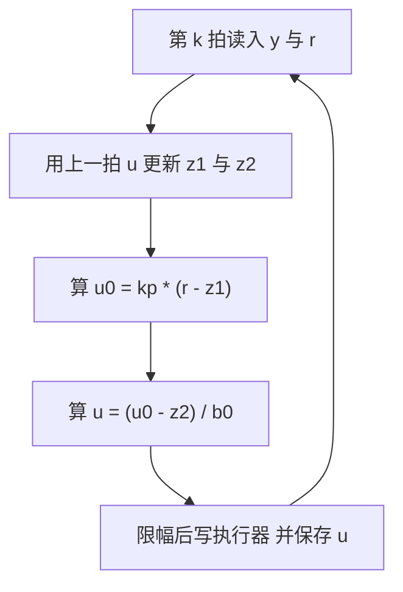
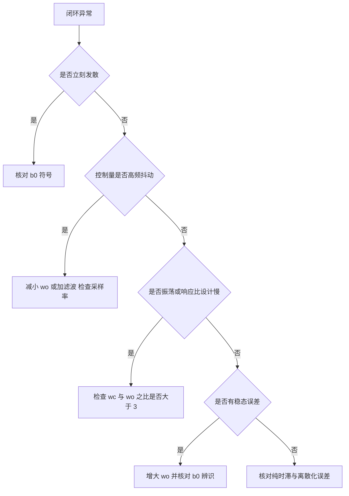

# 离散实现与工程整定

LADRC 的公式只有几行，落到嵌入式代码上有两个容易踩的细节：更新的先后顺序、以及非线性函数的数值代价。前者决定控制量是当前拍还是上一拍参与扰动估计，后者决定同一套公式用线性还是非线性形式。整定阶段还有一套由现象反推参数的经验规则，它们把第四篇的三个带宽参数与具体故障现象对应起来。

素材仓库的 C 实现与调参指南是本节的主要依据。代码片段只摘与更新顺序和参数计算相关的部分，完整的结构体与示例见素材第 7 节。

## 一阶LADRC的结构体与更新

一阶实现的结构体保存四类数据（`01_control_theory/adrc_control/README.md`）：设计参数 $b_0$、$\omega_o$、$\omega_c$、$T_s$；由带宽算出的观测器增益 $\beta_1$、$\beta_2$ 与控制器增益 $k_p$；观测器状态 $z_1$、$z_2$。初始化函数按带宽参数化一次算好所有增益（`README.md`）：

$$
\beta_1 = 2 \omega_o, \qquad \beta_2 = \omega_o^2, \qquad k_p = \omega_c
$$

这三个式子在初始化时执行一次，运行时不再计算，因此可以放在上电阶段。

逐拍更新分两步（`README.md`）。第一步用当前测量与上一拍控制量更新观测器，第二步算控制量：

$$
e = z_1 - y
$$

$$
\dot{z}_1 = z_2 - \beta_1 e + b_0 u, \qquad \dot{z}_2 = -\beta_2 e
$$

$$
z_1 \mathrel{+}= T_s \dot{z}_1, \qquad z_2 \mathrel{+}= T_s \dot{z}_2
$$

$$
u_0 = k_p (r - z_1), \qquad u = \frac{u_0 - z_2}{b_0}
$$

注意第一行里的 $u$ 是上一拍的控制量，因为观测器更新在控制律计算之前，指针指向的值还没有被覆盖。这个顺序是刻意的：观测器需要用实际施加过的控制量而不是即将施加的量，否则扰动估计会与控制量形成代数环。代价是观测器有一个采样周期的滞后，在 $\omega_o T_s$ 较小时可以忽略。

## 二阶LADRC与增益计算

二阶实现的结构体多一组状态与两个控制器增益（`README.md`）：$\beta_1$、$\beta_2$、$\beta_3$ 对应三阶观测器，$k_1$、$k_2$ 对应位置与速度通道，状态含 $z_1$、$z_2$、$z_3$，另有中间量 $u_0$。

初始化按 $(s+\omega_o)^3$ 与 $(s+\omega_c)^2$ 展开（`README.md`）：

$$
\beta_1 = 3\omega_o, \qquad \beta_2 = 3\omega_o^2, \qquad \beta_3 = \omega_o^3
$$

$$
k_1 = \omega_c^2, \qquad k_2 = 2\omega_c
$$

更新函数的签名比一阶多一个参考速度参数，用于误差组合里的 $\dot{r}$，没有 TD 时传零（`README.md`）。这一步的设计选择需要注意：把 $\dot{r}$ 作为入参而不是在模块内部由 TD 生成，使 LADRC 模块与 TD 解耦，两者可以独立替换。

三阶结构体的栈占用是一个 $3 \times 3$ 量级的浮点数组规模，单精度下约 32 字节，加上参数与中间量不超过 64 字节。一阶版本约 32 字节。这个规模可以按对象数量在栈上分配，不涉及动态内存。

## 两种非线性函数的实现

$fal$ 的实现在两个区间用不同公式（`README.md`）：

$$
fal(e, \alpha, \delta) = \begin{cases}
| e | ^{\alpha} \operatorname{sign}(e), & | e | > \delta \\
e / \delta^{1-\alpha}, & |e| \le \delta
\end{cases}
$$

两区的等效增益可以分别写出来：线性区的增益是 $\delta^{\alpha-1}$，非线性区的增益是 $\alpha |e|^{\alpha-1}$。$\alpha = 0.5$、$\delta = 0.01$ 时线性区增益为 10，误差 $|e| = 0.1$ 时非线性区增益约 1.58，误差 $|e| = 1$ 时降到 0.5。这就是小误差高增益、大误差低增益的定量来源。线性区的作用是避免零点附近增益趋于无穷引起的高频震颤（`README.md`）。

代价在 $powf$：非线性区每次调用要做一次幂运算，线性区要做一次幂算 $\delta^{1-\alpha}$（可以预计算）。对二阶非线性 ESO 来说，每拍至少两次幂调用，MCU 上单次 $powf$ 可能达到几十到上百个周期。若控制周期是 1 ms、主频 168 MHz，两次幂运算的占比通常仍可接受；周期压到 100 µs 以下时应当改用线性 LESO 或查表近似。

$fst$ 的实现与公式块一一对应（`README.md`）：先算 $d = r h$、$d_0 = d h$、$y = x_1 + h x_2$、$a_0 = \sqrt{d^2 + 8r|y|}$，再按 $|y|$ 与 $d_0$ 的大小关系分段求 $a$，最后按 $|a|$ 与 $d$ 的大小关系分段求输出。整个函数含一次开方与若干乘加，没有幂运算，开销低于 $fal$。素材代码里 $d$ 的注释写成「$r \cdot h^2$ 的变体」，与公式块的 $d = rh$、$d_0 = dh$ 是同一组定义，读代码时按公式块为准（`README.md` 与源码里的对应位置）。

## 生产级接口的形态

素材列出的 ESPP 库把 LADRC 封装成模板类（`README.md`）：配置结构体含 $b_0$、$\omega_o$、$\omega_c$、$T_s$ 四项，构造函数接收配置，提供重置状态与单步更新两个方法，单步更新的签名是「参考值与测量值进、控制量出」。这个接口形态与上文的 C 结构体等价，区别是把状态封装在对象里、把更新收敛成一个返回值。

库的特性列表给出四条（`README.md`）：模板化配置与零动态内存、支持单精度与双精度、与 ESP32 的 PWM 与 ADC 与编码器外设集成、典型控制周期 50 到 1000 µs。这四条正好覆盖嵌入式实现的四个关心点：内存、数值类型、外设接口、周期范围。

## 调参速查表与经验公式

素材给出的现象与处理对应关系如下（`README.md`）：

| 现象 | 可能原因 | 处理 |
| --- | --- | --- |
| 响应太慢 | $\omega_c$ 过小 | 增大 $\omega_c$ |
| 系统振荡 | $\omega_c$ 过大或 $\omega_o$ 过小 | 减小 $\omega_c$ 或增大 $\omega_o$ |
| 扰动恢复慢 | $\omega_o$ 过小 | 增大 $\omega_o$，注意噪声 |
| 测量噪声大 | $\omega_o$ 过大或采样率低 | 减小 $\omega_o$ 或增加滤波 |
| 控制量饱和 | $b_0$ 偏小 | 增大 $b_0$，控制变保守 |
| 稳态误差 | ESO 未收敛或 $b_0$ 误差大 | 增大 $\omega_o$ 并检查 $b_0$ |
| 加速性能差 | TD 速度因子 $r$ 过小 | 增大 $r$，同时防超调 |

四条经验公式把参数与可测量量连起来（`README.md`）：观测器带宽取控制器带宽的 3 到 10 倍，先取 5 倍；上升时间与带宽的换算是 $t_r \approx 1.8/\omega_c$；$b_0$ 用开环阶跃辨识，允许 0.5 到 2 倍误差；采样周期满足 $T_s \leq (1/5 \sim 1/10) \cdot 2\pi/\omega_o$。

这四条里约束最强的是采样周期。以 $\omega_o = 500$ rad/s 为例，$2\pi/\omega_o \approx 12.6$ ms，除以 5 得到 2.5 ms，即采样频率至少 400 Hz。若控制器带宽需要 100 rad/s，则 $\omega_o$ 取 500 到 1000 rad/s，采样周期相应压到 1 到 2.5 ms 以下。

## 五类常见错误

素材列出五条（`README.md`），按后果的严重程度排列如下：

| 错误 | 后果 | 检查方法 |
| --- | --- | --- |
| $b_0$ 符号错误 | 正反馈，立刻发散 | 核对 $b_0$ 与执行器增益符号 |
| $\omega_o$ 过高 | 观测器跟踪噪声，控制量抖动 | 看 $z_3$ 的频谱与幅值 |
| $\omega_c$ 接近 $\omega_o$ | 控制器与观测器相互干扰 | 检查两个带宽之比是否大于 3 |
| 忽视离散化误差 | 快速系统极点偏移 | 检查 $\omega_o T_s$ 是否小于 0.2 |
| 对时滞系统直接套用 | 补偿失效，振荡 | 测输入到输出的纯延迟拍数 |

第一条的后果最严重且最容易发生，因为 $b_0$ 的符号来自执行器方向的定义，改动硬件接线或电机极对数时就可能反号。第二条与第三条都属于带宽选择问题，判断方法在第四篇已经给出。第四条给出一个可以直接计算的判据：$\omega_o T_s$ 是观测器每拍推进的相位（弧度），超过 0.2 后欧拉离散的极点位置明显偏离设计值。

## 计算量与平台开销

素材给出的对比是每周期 20 到 50 次浮点运算，PID 是每周期 5 到 10 次（`README.md`）。一阶 LADRC 的两路观测器加一路比例控制，确实在这个量级；二阶 LADRC 加 $fal$ 后每拍多两次幂运算，实际开销偏向区间上限。

这个量级对多数 Cortex-M 平台不构成压力。按 1 kHz 周期计算，50 次浮点运算每秒五万次，主频 100 MHz 以上的 MCU 占用率低于千分之一。开销的瓶颈不在运算次数而在 $powf$、开方与除法：$b_0$ 的除法每拍一次，可以用预先算好的 $1/b_0$ 换成乘法；$fal$ 的幂在周期紧张时可以查表插值。

## 小结

### 核心概念

- 一阶与二阶 LADRC 的结构体都在初始化时按带宽算好全部增益，运行时只做观测器积分与控制律乘加。
- 观测器更新在控制律之前，用的是上一拍控制量，避免代数环，代价是一拍滞后。
- $fal$ 线性区增益为 $\delta^{\alpha-1}$、非线性区为 $\alpha|e|^{\alpha-1}$，前者高、后者随误差增大下降；代价是幂运算。
- 调参速查表把七类现象映射到三个参数，经验公式给出带宽比、上升时间、$b_0$ 辨识与采样周期四条约束。
- 五类常见错误里符号错误后果最重，$\omega_o T_s$ 小于 0.2 是离散化可靠的判据。

### 设计权衡

| 选择 | 带来的能力 | 付出的代价 |
| --- | --- | --- |
| 观测器用上一拍 $u$ | 避免代数环、实现简单 | 一拍滞后 |
| 用 $fal$ 非线性 | 小误差收敛快 | 幂运算开销 |
| 用线性 LESO | 纯乘加、参数少 | 增益恒定 |
| 预先算 $1/b_0$ | 省去每拍除法 | 需要保证 $b_0$ 不为零 |
| 提高采样率 | 放宽 $\omega_o$ 上限 | 中断负担与量化噪声上升 |

## 练习

### 基础题

1. 写出一阶 LADRC 的逐拍更新步骤，说明观测器为什么使用上一拍控制量。
2. 计算 $fal$ 在 $\alpha = 0.5$、$\delta = 0.01$、$|e| = 0.001$ 与 $|e| = 1$ 时的等效增益。
3. 按采样周期公式计算 $\omega_o = 200$ rad/s 时的最大 $T_s$，并换算成最低采样频率。

### 挑战题

4. 把 $fal$ 的线性区改为查表插值，估算在 1 kHz 周期下节省的运算量，并分析插值误差对观测器的影响。
5. 设计一组实验分别测 $b_0$、$\omega_c$、$\omega_o$ 的敏感性：给出实验步骤、记录量与判断标准。
6. 针对一个含 3 拍纯时滞的速度环，说明 ADRC 的补偿为什么失效，并给出结合 Smith 预估器的改造方案。

## 附：本页引用的路径

| 路径 | 用途 |
| --- | --- |
| `01_control_theory/adrc_control/README.md` | 素材仓库 ADRC 单元根：一阶 LADRC 代码、二阶 LADRC 代码、$fst$、$fal$、ESPP 接口、调参指南、计算量对比 |
| `docs/19-控制理论/04-ADRC自抗扰/03-扩张状态观测器.md` | 本站第三篇，ESO 的连续形式与误差分析 |
| `docs/19-控制理论/04-ADRC自抗扰/04-线性ADRC与带宽参数化.md` | 本站第四篇，增益公式与整定顺序 |
| `docs/19-控制理论/02-LQR与LQG/05-嵌入式LQR实现与调试.md` | 本站 LQR 第五篇，嵌入式数值类型与栈占用 |
| `~/robot_control_simulation` | 素材仓库根，正文中素材路径均相对该根 |
