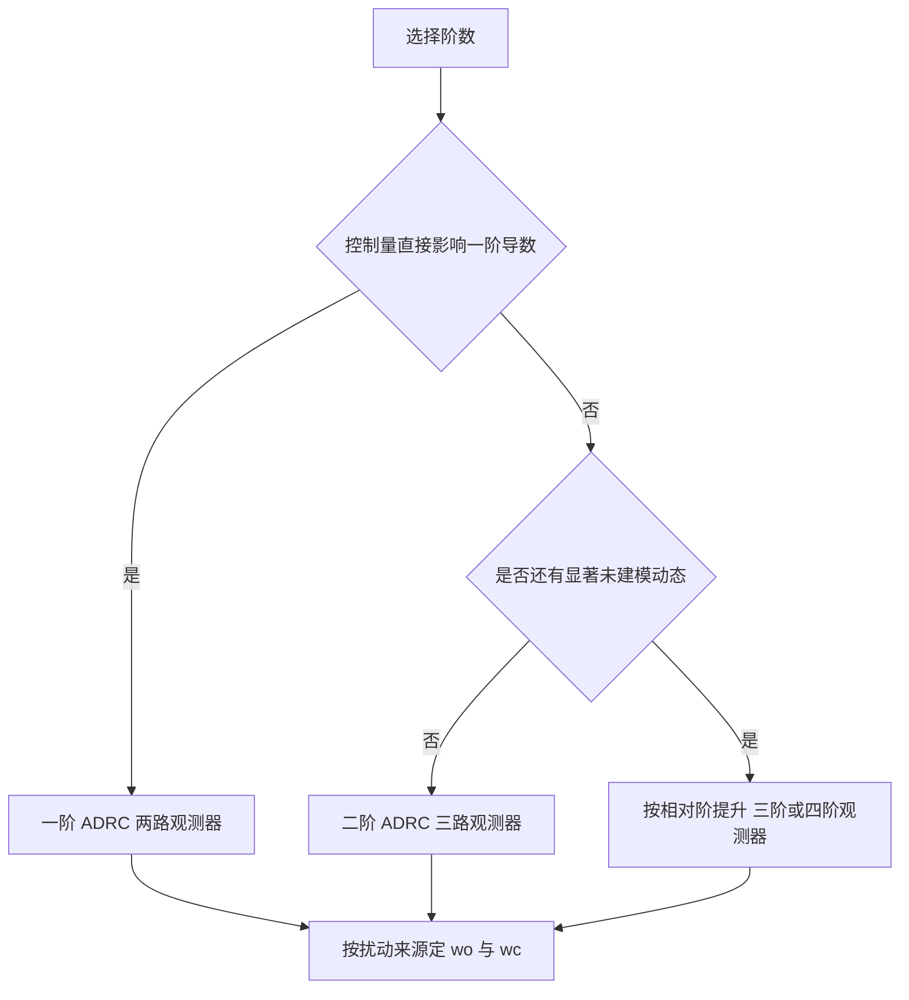
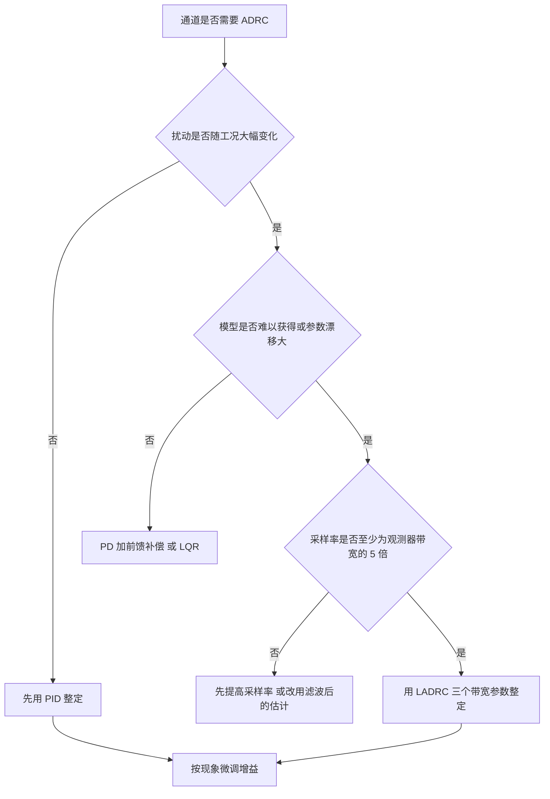

# 应用场景与PID对比

前五篇把 ADRC 的结构、观测器、参数化与实现讲完，剩下的问题是它该用在什么地方。ADRC 不是通用替代品：它比 PID 多一套观测器，多一份计算与调参成本，只有在扰动难以建模或随工况大幅变化时这笔成本才收得回来。判断某个通道是否需要 ADRC，要先看扰动来源与模型可得性，而不是先看性能指标。

素材仓库列出了八类机器人场景与它们的阶数选择（`01_control_theory/adrc_control/README.md:437-450`），并给出电机速度环、机械臂关节、四旋翼姿态三个实例的建模细节（`:452-493`）。八类场景的阶数选择与三个实例的建模细节是判断依据，逐项对比 ADRC 与 PID 之后才能划出选型边界。

## 八类场景的阶数与扰动来源

素材表格按被控量、执行器、扰动来源与 ADRC 阶数四列给出八类应用（`README.md:439-450`）：

| 应用 | 被控量 | 执行器 | 扰动来源 | 阶数 |
| --- | --- | --- | --- | --- |
| 电机速度环 | 转速 | PWM 电压 | 负载转矩、摩擦、反电势 | 一阶 |
| 机械臂关节位置 | 关节角 | 力矩电机 | 重力、科氏力、负载变化 | 二阶 |
| 四旋翼姿态 | 滚转与俯仰角 | 电机推力差 | 阵风、旋翼耦合、重心偏移 | 二阶 |
| 四旋翼高度 | 高度 | 总推力 | 地面效应、气流扰动 | 二阶 |
| 平衡机器人 | 倾角 | 轮子力矩 | 地面不平、负载变化、摩擦 | 二阶 |
| 移动机器人路径跟踪 | 横向误差 | 转向角 | 地面摩擦变化、轮胎滑移 | 二阶 |
| 伺服压机 | 力或位置 | 伺服电机 | 材料刚度变化、粘滞 | 一阶或二阶 |
| 柔性关节 | 末端位置 | 电机 | 柔性振动、非线性摩擦 | 二阶或三阶 |

阶数的选择依据是控制量到被控量的相对阶：控制量直接影响一阶导数就是一阶对象，影响二阶导数就是二阶对象。电机速度环里电压经电磁时间常数影响转速，电磁动态通常远快于机械动态，可以忽略，因此是一阶；关节位置由力矩经转动惯量影响角加速度，是二阶。柔性关节把弹性变形也当作动态时阶数上升到三阶，扩张状态要多一维。

「一阶或二阶」与「二阶或三阶」两类模糊项取决于建模粒度。伺服压机把电机电流环闭合后，控制量到力的关系可以近似成一阶；把材料刚度也纳入则成为二阶。判断方法是比较两个时间常数：若内环时间常数是被控动态的十分之一以下，就可以把内环当作比例环节，阶数取一。

## 电机速度环的一阶建模

直流电机的速度动态可以写成（`README.md:454-466`）：

$$
\dot{\omega} = -\frac{B}{J}\omega + \frac{K_t}{J} u - \frac{T_L}{J}
$$

$B$ 是粘滞摩擦系数，$J$ 是转动惯量，$K_t$ 是转矩常数，$T_L$ 是负载转矩。一阶 ADRC 把 $f = -(B/J)\omega - T_L/J$ 整体当作总扰动，由两路观测器估计并补偿。

素材给出的效果是：相比 PI 速度环，跟踪无超调且抗负载扰动能力强，负载突变时转速跌落小、恢复快；电池电压波动被观测器当作扰动自动补偿（`README.md:464-465`）。这两条对应 ADRC 的两个特点：扰动补偿是前馈的，不需要误差积累；电压波动对控制增益的影响被归入总扰动，不需要单独测量电压。

$b_0$ 在这里取 $K_t / J$，可以用开环阶跃辨识。电压波动会改变实际增益，偏离 $b_0$ 的部分由观测器补偿，这也是 $b_0$ 允许 0.5 到 2 倍误差的来源。

## 机械臂关节的二阶建模

关节动力学写成（`README.md:467-479`）：

$$
J \ddot{q} + \tau_{\text{friction}} + \tau_{\text{gravity}}(q) + \tau_{\text{coriolis}}(q, \dot{q}) = \tau_{\text{motor}}
$$

ADRC 把摩擦、重力与科氏力三项全部当作总扰动。素材给出的三条效果是：不需要辨识惯量与摩擦参数；不同负载下跟踪性能一致；比 PD 加重力补偿的鲁棒性更强（`README.md:475-479`）。

第三条的机制需要展开。PD 加重力补偿的鲁棒性取决于重力模型的准确度，负载变化时重力项按已知公式补偿，误差进入反馈回路，只能靠比例增益压住；ADRC 的观测器直接把总扰动测出来，负载变化在若干观测器时间常数内被补偿，比例增益不需要为最坏负载留裕量。代价是观测器带宽要高到能跟上负载变化的速率，负载在运动中快速变化时估计误差仍然存在。

关节低速运动时摩擦的粘滞段与库仑段切换会让 $\dot{f}$ 出现尖峰，这正是第一篇里「误差有界而非收敛到零」的具体场景。观测器带宽不足时表现为换向处的跟踪误差尖峰。

## 四旋翼姿态与高度的分工

姿态动力学写成（`README.md:481-493`）：

$$
\ddot{\phi} = \frac{\tau_\phi}{I_{xx}} + d(t)
$$

$d(t)$ 包含陀螺效应、旋翼耦合与阵风。$b_0$ 取 $1/I_{xx}$，量纲是角加速度对力矩的比。素材给出的方案是内环用 LADRC 控制姿态角、外环用 PID 或 LADRC 控制位置，观测器自动补偿阵风与模型误差（`README.md:489-493`）。

内外环的组合与 LQR 单元里的级联结构相同，区别在内环的扰动处理方式。四旋翼的阵风是典型的外扰，PID 的积分项要用若干拍消掉它造成的姿态偏差；观测器在一到两个观测器时间常数内就把风扰估计出来并从控制量里减掉。代价是观测器把旋翼振动与加速度计噪声也当作扰动估计，$\omega_o$ 取得过高时控制量会带上振动成分，实际工程里通常要给陀螺仪数据先做低通滤波。

## ADRC与PID的逐项对比

素材给出的对比覆盖十一个维度（`README.md:884-897`），关键几项整理如下：

| 维度 | ADRC | PID |
| --- | --- | --- |
| 扰动处理 | 主动估计后前馈补偿 | 被动累积消除 |
| 模型依赖 | 只需 $b_0$ | 不需要模型 |
| 积分饱和 | 无积分项，由观测器承担 | 存在，需要抗饱和 |
| 超调控制 | TD 安排过渡过程可无超调 | 需要权衡超调与快速性 |
| 噪声敏感度 | 取决于 $\omega_o$，可由滤波因子调 | 微分项放大噪声 |
| 参数个数 | 3（$\omega_c$、$\omega_o$、$b_0$） | 3（$K_p$、$K_i$、$K_d$） |
| 变负载适应 | 强，观测器自动补偿 | 弱，需要重调 |
| 计算负载 | 每周期 20 到 50 次浮点 | 每周期 5 到 10 次浮点 |

两边参数个数相同，差别在参数的可解释性与自适应能力。PID 的积分项在功能上等价于 ADRC 的 $z_3$ 估计，但机制不同：积分项是误差的历史积累，$z_3$ 是模型与外扰的在线估计（`README.md:886-887`）。前者必然滞后于扰动出现，后者可以做到几乎同步。

## 什么时候该用PID

素材给出的七条选型建议（`README.md:899-909`）可以归成三类：

| 场景 | 推荐 | 原因 |
| --- | --- | --- |
| 负载大范围变化、执行器饱和或电压波动、摩擦显著、高精度轨迹、强外扰 | ADRC | 观测器主动补偿 |
| 常规电机速度环且负载恒定 | PID | 简单有效，ADRC 能力用不上 |
| 8 位 MCU 且资源极度受限 | PID | ADRC 的浮点运算可能超负荷 |

判断的核心是扰动是否主导。若负载基本恒定、电压稳定、摩擦可忽略，PID 的不足之处不会显现，ADRC 的观测器只是增加计算量与调参项。反过来，若系统在大部分工况下参数会变、或扰动幅度与信号同量级，ADRC 的前馈补偿带来的收益通常超过它的成本。

还有一类情况两边都不合适：纯时滞系统与强非最小相位系统。素材把时滞系统列为需要结合 Smith 预估器处理，把非最小相位系统列为 PID 通常不适用（`README.md:895`、`:979`）。这类对象应当先检查结构上是否需要其他控制律，而不是在 PID 与 ADRC 之间选。

## 开源实现与参考

素材列出了四个可参考的实现（`README.md:1004-1011`）：

| 库 | 语言 | 平台 | 特点 |
| --- | --- | --- | --- |
| ESPP ADRC | C++ | ESP32 | 生产级、模板化、与硬件集成 |
| SimpleFOC ADRC | C++ | Arduino | 磁场定向控制中的速度环 |
| ROS control ADRC | Python 与 C++ | ROS | ROS 集成 |
| OpenADRC | C | 嵌入式通用 | 纯 C、无依赖 |

ESPP 的接口形态在第五篇已经介绍。SimpleFOC 的用法说明 ADRC 与磁场定向控制的结合点：FOC 负责把电流分解成转矩分量与励磁分量，ADRC 接管速度环，接收速度反馈并输出转矩电流指令。这一类集成方式可以直接搬到本站的电机控制场景上。

理论参考方面，素材把韩京清的专著与 Gao 的三篇论文列为 LADRC 的源头（`README.md:985-993`），ESO 的收敛性证明归到 2011 年的工作。这些文献不在本站仓库内，正文只用其中的结论与公式。

## 小结

### 核心概念

- ADRC 的阶数等于控制量到被控量的相对阶：速度环一阶、关节位置与姿态二阶、柔性关节三阶。
- 电机速度环把粘滞摩擦与负载转矩合并为总扰动，$b_0 = K_t/J$，电压波动由观测器自动补偿。
- 机械臂关节把摩擦、重力与科氏力全部作为总扰动，不同负载下的性能一致性来自前馈补偿。
- 四旋翼内环用 LADRC 控制姿态、外环用 PID 或 LADRC 控制位置，观测器补偿阵风与模型误差。
- 选型看扰动是否主导：扰动主导且模型难以获得时用 ADRC，负载恒定的常规速度环 PID 已足够，纯时滞与非最小相位系统需要其他结构。

### 设计权衡

| 选择 | 带来的能力 | 付出的代价 |
| --- | --- | --- |
| 速度环用 ADRC | 抗负载扰动、无超调 | 每周期运算量增加数倍 |
| 关节用二阶 ADRC | 免辨识重力与摩擦 | 需较高观测器带宽跟踪负载变化 |
| 姿态内环用 ADRC | 阵风被快速补偿 | 旋翼振动进入控制量 |
| 恒负载场合用 PID | 实现与维护简单 | 参数随工况变化时需重调 |
| 强扰动场合升级 ADRC | 扰动主导时收益显著 | 需要理解观测器与带宽 |

## 练习

### 基础题

1. 判断以下对象是几阶 ADRC：电机电流环、关节速度环、四旋翼高度、柔性关节末端位置，并说明依据。
2. 写出电机速度环的总扰动表达式，说明电压波动为什么可以被观测器补偿而不需要单独测量。
3. 比较 PID 的积分项与 ESO 的 $z_3$ 在补偿常值扰动上的时序差别。

### 挑战题

4. 为一个负载在 0 到 5 kg 之间变化的关节设计二阶 LADRC，给出 $\omega_c$、$\omega_o$ 与 $b_0$ 的初始值，并说明负载变化速率对 $\omega_o$ 的要求。
5. 分析四旋翼在阵风下的闭环表现：给出阵风模型、观测器估计误差的时间尺度，并说明陀螺仪滤波对补偿的影响。
6. 对同一个速度环分别实现 PI 与一阶 LADRC，设计一组包含负载突变与电压跌落的实验，比较两条路径的恢复时间与控制量峰值。

## 附：本页引用的路径

| 路径 | 用途 |
| --- | --- |
| `01_control_theory/adrc_control/README.md` | 素材仓库 ADRC 单元根：应用场景表（:437-450）、三个实例（:452-493）、与 PID 对比（:880-909）、理论参考（:985-993）、开源实现（:1004-1011） |
| `docs/19-控制理论/04-ADRC自抗扰/05-离散实现与工程整定.md` | 本站第五篇，调参速查与常见错误 |
| `docs/19-控制理论/01-PID整定与抗饱和` | 本站 PID 单元，积分饱和与微分滤波的处理 |
| `docs/19-控制理论/02-LQR与LQG/04-LQG与分离原理.md` | 本站 LQR 第四篇，观测器与扰动抑制的对照 |
| `~/robot_control_simulation` | 素材仓库根，正文中素材路径均相对该根 |
