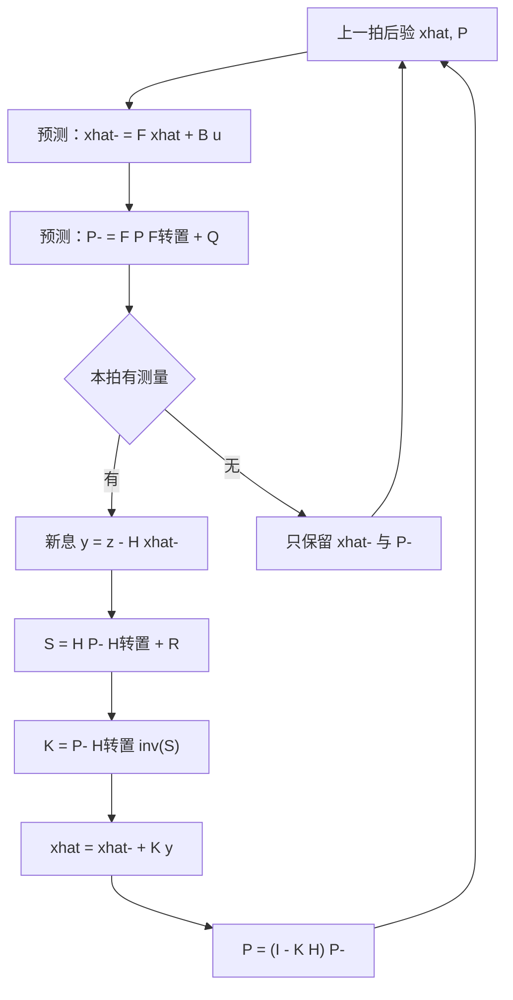
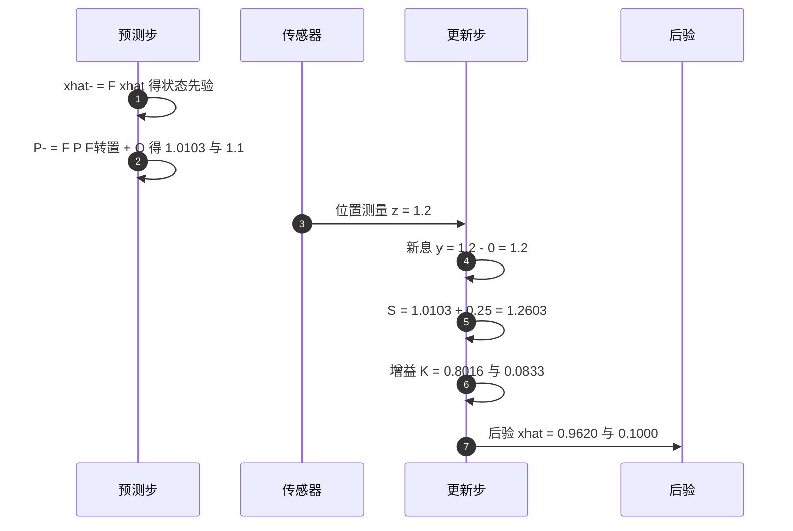

# 卡尔曼滤波的预测与更新

递推估计器每一拍都要回答同一个问题：模型说状态在这里，传感器说状态在那里，两者矛盾时按什么比例采纳。卡尔曼滤波给出的答案是按不确定度分配权重，预测协方差大的时候更信测量，观测噪声大的时候更信模型。整套算法只有两对方程，预测一对，更新一对，外加一个由协方差算出来的增益。

状态方程与观测方程里的 $F$、$B$、$H$、$Q$、$R$ 各有明确含义，预测与更新五式由它们推出，增益则是使后验协方差迹最小的解。两状态匀速模型的手算可以逐项验证这套推导。素材来源是 `03_sensor_algorithms/kalman_filter/README.md:3-65`，云台板实例见 `Algorithm/Src/FusionAHRS.cpp:30-41`。

## 递推估计器与其它滤波的差别

协方差是这套算法的核心状态量。它有两个作用：表达当前估计的不确定度，以及决定下一次更新时模型与测量的相对权重。互补滤波用固定系数完成同样的加权，滑动平均对所有样本等权，批处理最小二乘把全部历史放在一个大矩阵里一次求解。四者比较如下。

| 方法 | 融合权重来源 | 输出不确定度 | 适用系统 |
| --- | --- | --- | --- |
| 卡尔曼滤波 | 由 $Q$、$R$ 与协方差递推 | 输出 $P$ | 线性高斯 |
| 互补滤波 | 固定系数 | 不输出 | 线性与非线性 |
| 滑动平均 | 等权 | 不输出 | 平稳信号 |
| 批处理最小二乘 | 全历史等权或按先验加权 | 输出 | 线性 |

固定系数的滤波器在噪声统计变化时无法自适应：陀螺噪声随温度变化、里程计在打滑时方差突增，这些情况下互补滤波的权重就不再合适，而卡尔曼滤波的增益下一拍会自动变化。代价是必须给出 $F$、$H$、$Q$、$R$ 四个量，其中任何一个量纲写错都会让增益朝错误方向走。

## 状态方程与观测方程的五个量

状态方程描述状态如何随时间和控制输入演化，观测方程描述传感器看到的是状态的什么函数：

$$x_k = F_k x_{k-1} + B_k u_k + w_k,\qquad w_k \sim N(0, Q_k)$$

$$z_k = H_k x_k + v_k,\qquad v_k \sim N(0, R_k)$$

| 符号 | 维数 | 含义 |
| --- | --- | --- |
| $F_k$ | $n \times n$ | 状态转移矩阵，本拍状态到下一拍状态的线性映射 |
| $B_k$ | $n \times p$ | 控制输入矩阵，把 $u_k$ 映射进状态空间 |
| $H_k$ | $m \times n$ | 观测矩阵，从状态里取出传感器能看到的分量 |
| $Q_k$ | $n \times n$ | 过程噪声协方差，描述模型每拍偏离真实状态的方差 |
| $R_k$ | $m \times m$ | 观测噪声协方差，描述单次测量的噪声方差 |

$w_k$ 与 $v_k$ 互相独立，也与初始状态独立。五个量里 $F$、$B$、$H$ 由模型决定，$Q$、$R$ 由噪声统计决定，后者只能估计，这也是本单元第 5 篇专门处理调参的原因。

## 预测步：协方差为什么被 F 放大

预测把上一拍的后验按模型外推一拍：

$$\hat{x}_{k|k-1} = F_k \hat{x}_{k-1|k-1} + B_k u_k$$

$$P_{k|k-1} = F_k P_{k-1|k-1} F_k^T + Q_k$$

状态是线性映射，均值直接跟着映射走。协方差的传递多一层：$P$ 描述的是状态在多个方向上的散布，经过 $F$ 之后每个方向的散布被拉伸或压缩，拉伸比例由 $F$ 的奇异值决定，所以传递式里 $F$ 出现两次，写作 $F P F^T$。这一步说明即使当前估计的误差为零，只要模型本身在移动状态，不确定度就会带到下一拍。

$Q$ 叠加在传播之后，表示模型没写进 $F$ 的那部分动态。以恒定速度模型为例，真实系统存在加速度，模型里没有，加速度在 $\Delta t$ 内造成的位置偏差就是过程噪声。$Q$ 的取值必须与 $\Delta t$ 匹配：把采样率提高一倍，每拍积累的模型误差变小，但注入次数增多，等效噪声率不变的条件是 $Q$ 按时间尺度缩放（`README.md:36`、`:41`）。

## 更新步：增益是后验迹最小的解

更新步先算测量相对预测的偏离，即新息：

$$y_k = z_k - H_k \hat{x}_{k|k-1}$$

新息的含义是测量里预测模型没有解释的部分。它的协方差由预测协方差经过观测矩阵投影后再叠加观测噪声：

$$S_k = H_k P_{k|k-1} H_k^T + R_k$$

增益、后验状态与后验协方差依次为

$$K_k = P_{k|k-1} H_k^T S_k^{-1}$$

$$\hat{x}_{k|k} = \hat{x}_{k|k-1} + K_k y_k$$

$$P_{k|k} = (I - K_k H_k) P_{k|k-1}$$

增益的来历可以说清楚。设后验协方差的一般形式为 $P = (I-KH)P^-(I-KH)^T + KRK^T$，对 $K$ 求迹的导数并令其为零：

$$\frac{\partial\,\mathrm{tr}(P)}{\partial K} = -2(I-KH)P^-H^T + 2KR = 0 \;\Longrightarrow\; K = P^-H^T(HP^-H^T+R)^{-1}$$

结果与上面的 $K_k$ 一致，所以增益是使后验协方差迹最小的权重，也就是把三个方向的方差总和压到最小的折中。标量情形 $H=1$ 时 $K = P^-/(P^-+R)$：$P^-$ 远小于 $R$ 时增益接近 0，估计几乎不动；$P^-$ 远大于 $R$ 时增益接近 1，估计直接跳到测量。多维情形下 $K$ 是一个矩阵，把 $m$ 维新息映射为 $n$ 维状态修正量。

推导里用到的一般形式就是 Joseph 形式。简单式 $P=(I-KH)P^-$ 只在 $K$ 精确取到最优值时与 Joseph 形式等价，浮点误差下 $K$ 偏离最优解，简单式可能失去对称正定性，Joseph 形式的正定性由 $KRK^T$ 保证。代价是两次矩阵乘，本单元第 5 篇会把这三种防发散手段放在一起比较（`README.md:522`）。

## 两状态匀速模型的一拍手算

取状态 $x=[p,v]^T$，采样周期 $\Delta t=0.1$ s，状态转移矩阵只保留位置对速度的耦合：

$$F = \begin{bmatrix}1 & \Delta t\\ 0 & 1\end{bmatrix},\qquad H = \begin{bmatrix}1 & 0\end{bmatrix}$$

过程噪声按连续白噪声加速度积分取值，$q$ 是加速度噪声功率谱密度：

$$Q = q\begin{bmatrix}\Delta t^3/3 & \Delta t^2/2\\ \Delta t^2/2 & \Delta t\end{bmatrix},\qquad q=1$$

矩阵里的四项分别对应位置方差、位置速度协方差与速度方差，时间幂次越高，位置项越小：$\Delta t^3/3 = 3.33\times10^{-4}$，$\Delta t^2/2 = 5\times10^{-3}$，$\Delta t = 0.1$。观测噪声 $R=0.25$，对应位置测量标准差 0.5 m。初值 $\hat{x}_0=[0,0]^T$，$P_0=I$。

预测一步先做协方差传播：

$$F P_0 F^T = \begin{bmatrix}1.01 & 0.1\\ 0.1 & 1\end{bmatrix},\qquad P^- = \begin{bmatrix}1.0103 & 0.105\\ 0.105 & 1.1\end{bmatrix}$$

设本拍位置测量 $z=1.2$：新息 $y=1.2-0=1.2$，$S=1.0103+0.25=1.2603$，增益

$$K = \frac{1}{1.2603}\begin{bmatrix}1.0103\\ 0.105\end{bmatrix} = \begin{bmatrix}0.8016\\ 0.0833\end{bmatrix}$$

后验 $\hat{x}=[0.9620,\,0.1000]^T$。位置修正了 0.96 m，速度只被连带修正了 0.1 m/s，比例正好是 $F$ 中位置对速度的 $\Delta t = 0.1$：当前速度估计在预测中只贡献了 0.1 s 的位置分量，所以它对位置残差的解释能力有限。该组数字为公式手算，未在仿真中回放。

## 素材与云台固件里的落点

素材库 `~/robot_control_simulation` 的 `03_sensor_algorithms/kalman_filter/README.md` 是本单元的正文来源，按 KF、EKF、UKF、融合架构、调参、算法选择、C 实现模式、工程注意事项八节展开。仓库里没有可直接编译的滤波器源文件，全部是公式与示例片段。

| README 行号 | 内容 |
| --- | --- |
| `:3-65` | 标准 KF：模型、预测、更新、适用条件 |
| `:68-243` | EKF：雅可比线性化、TinyEKF 结构体与代码、性能表 |
| `:246-314` | UKF：sigma points、权重、预测更新、与 EKF 的取舍 |
| `:317-344` | 传感器融合架构与松紧耦合 |
| `:347-434` | Q/R 调参、马氏距离门控、防发散 |
| `:437-451` | 算法选择表 |
| `:454-514` | 结构体式 C 实现模式 |
| `:518-536` | 数值稳定性、初始化、时间同步、低更新率 |

仓库入口 `README.md:30` 用一行描述了这个目录的覆盖范围是 KF/EKF/UKF、TinyEKF、IMU+GPS 融合、调参与发散预防。

云台板固件的 `Algorithm/Src/FusionAHRS.cpp:30-41` 是仓库之外的一维实例：状态是 Z 轴陀螺零偏，$F=1$、$H=1$，预测步为 `P_ += Q_`，静止时按 $K=P/(P+R)$ 更新。它与本页的预测、更新五式一一对应，只是把矩阵退化为标量，$H P^- H^T$ 变成 $P^-$，$S^{-1}$ 变成除以标量。两板差异与参数整定见本站 07-姿态解算与 IMU 的相关页面。

五式里的 $P^-=FPF^T+Q$ 在标量下写成 `P_ += Q_`，看起来不像预测，实际是把 $F=1$ 代入后的结果；标量 EKF 的 `F`、`H` 都是 1，所以代码里看不见矩阵乘。这一点在读固件时容易误以为公式被简化掉了，实为退化。

## 常见误用与边界情况

| # | 误用 | 现象 | 位置 |
| --- | --- | --- | --- |
| 1 | 把 $P$ 当成误差量值 | $P$ 是协方差，量纲是状态量的平方 | `README.md:36`、`:41` |
| 2 | 只比较 $Q$、$R$ 的绝对值 | 决定增益的是两者之比与 $P$ 的尺度 | `README.md:50`、`:351-357` |
| 3 | $Q$ 未随 $\Delta t$ 缩放 | 改变采样率后等效带宽随之变化 | `README.md:36`、`:41` |
| 4 | 预测与更新顺序颠倒 | 用后验协方差外推，增益偏小 | `README.md:32-58` |
| 5 | 认为 $K$ 是常数 | 每拍随 $P$ 变化，只在稳态附近稳定 | `README.md:50` |
| 6 | 观测维数 $m$ 与 $H$、$R$ 不一致 | 矩阵维度对不上或静默越界 | `README.md:46`、`:53` |
| 7 | 长期运行后 $P$ 不对称 | 浮点累积使 $P$ 偏离对称正定 | `README.md:522` |
| 8 | 新息恒为零却继续更新 | 测量被重复使用或时间戳未推进 | `README.md:42` |

第 8 行的判据是 $y_k = z_k - H\hat{x}^-$。若连续多拍新息完全为零而测量值确实在变化，通常说明 $H$ 把某个状态分量取错，或先验状态被上一拍直接赋值成了测量。正常运行时新息是零均值白噪声，幅值随 $S$ 变化，不可能长期精确为零。

## 小结

### 核心概念

- 卡尔曼滤波在线性高斯假设下递推最小均方误差估计，状态估计与协方差同步演化。
- 预测步 $\hat{x}^-=F\hat{x}+Bu$、$P^-=FPF^T+Q$，$F$ 出现两次是因为协方差在状态空间里被线性映射拉伸。
- 更新步用新息 $y=z-H\hat{x}^-$ 与增益 $K=P^-H^TS^{-1}$ 修正，增益是使后验协方差迹最小的解。
- 标量情形 $H=1$ 时 $K=P^-/(P^-+R)$，增益在 0 与 1 之间随预测不确定度变化。
- 后验协方差简单式在浮点下会失去对称正定性，Joseph 形式更稳。
- 两状态匀速模型的一拍手算说明：位置测量主要修正位置，速度通过 $F$ 的耦合被间接修正。

### 设计权衡

| 权衡点 | 可选做法 | 收益与代价 |
| --- | --- | --- |
| 递推形式 | 只存上一拍状态与协方差 | 内存恒定，适合嵌入式；舍弃历史信息，对模型误差无回溯能力 |
| 协方差更新 | 简单式 $P=(I-KH)P^-$ / Joseph 形式 | 简单式一次矩阵乘；Joseph 形式多两次矩阵乘换数值正定 |
| 控制输入 | 保留 $Bu$ 项 / 并入过程噪声 | 保留更准；并入省一次建模，代价是等效 $Q$ 变大 |
| 观测缺失 | 跳过更新 / 用旧测量补 | 跳过让 $P$ 增长；补测会压缩协方差并引入偏差 |

## 练习

基础题

1. 推导协方差预测式 $P^-=FPF^T+Q$ 中 $F$ 出现两次的原因，用一个二维例子说明。
2. 标量情形 $P^-=4$、$R=1$，求 $K$ 与后验 $P$；再把 $R$ 改成 4，观察 $K$ 的变化方向。
3. 用本页手算的 $P^-$ 与 $R$ 复算 $S$、$K$ 与后验状态，验证 $K$ 的两个分量之比等于 $P^-$ 第一列的两个元素之比。

挑战题

4. 从 $P=(I-KH)P^-(I-KH)^T+KRK^T$ 出发，对 $K$ 求迹的导数并解出最优增益，说明为什么简单式在 $K$ 非最优时会失去正定性。
5. 观测矩阵改成 $H=[0\;1]$ 只测速度，重做本页的一拍手算，比较位置与速度的修正幅度，并解释差别。
6. 云台板 `FusionAHRS.cpp:30-41` 的标量实现里 $F=1$。说明这种情况下预测步的 `P_ += Q_` 是否等价于 $P^-=FPF^T+Q$，以及它与 $Q$ 的物理含义有什么关系。

## 附：本页引用的路径

| 路径 | 用途 |
| --- | --- |
| `03_sensor_algorithms/kalman_filter/README.md:3-65` | 标准 KF 模型、预测、更新与适用条件 |
| `03_sensor_algorithms/kalman_filter/README.md:351-357` | $Q$、$R$ 的物理解释 |
| `03_sensor_algorithms/kalman_filter/README.md:518-536` | 数值稳定性、初始化与低更新率 |
| `README.md:30` | 素材库目录索引中对该目录的一行描述 |
| `Algorithm/Src/FusionAHRS.cpp:30-41` | 云台板一维 EKF 实例，本站 07 领域已拆解 |
| 仓库根路径 `~/robot_control_simulation` | 本页所有相对路径的基准 |
| 固件根路径 `/home/wyx/rm/2026SentriOmeniGimbal/2026OmniSentryGimbal` | 云台板实例的基准 |

