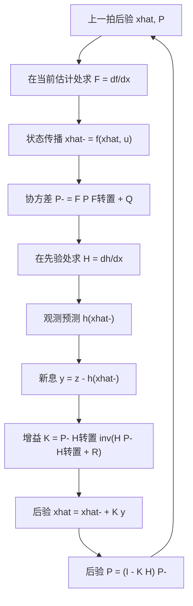
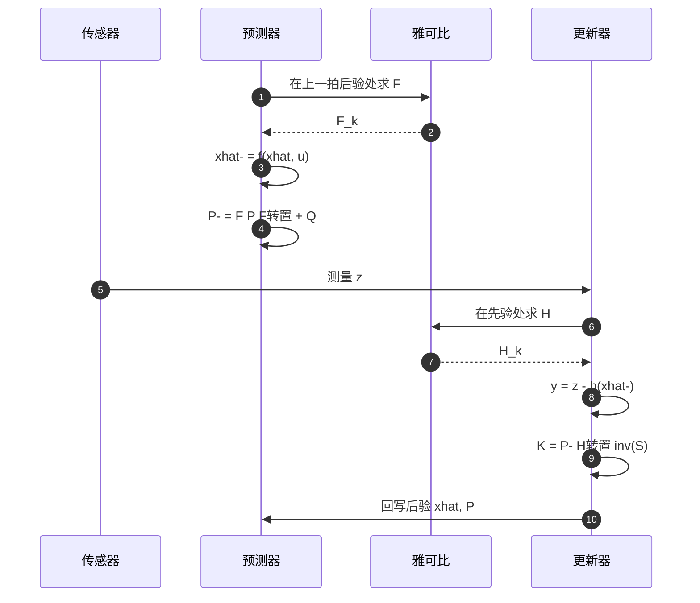

# EKF 与雅可比线性化

非线性系统里状态传播与观测都不是矩阵乘法，卡尔曼滤波那套递推公式无法直接使用。扩展卡尔曼滤波的做法是保留递推结构，把非线性函数在每一拍的工作点做一阶泰勒展开，用展开得到的雅可比矩阵代替固定的 $F$、$H$。均值仍走非线性函数，只有协方差走线性化后的矩阵。

本页说明两个雅可比各自在哪个点求值、为什么不能互换，再用素材里那个七维位置速度偏置模型说明耦合块缺失的后果，最后核对 README 代码段的结构问题与标称性能数据。素材来源是 `03_sensor_algorithms/kalman_filter/README.md:68-243`，一维落地实例见本站 07-姿态解算与 IMU 的相关页面。

## 一阶泰勒展开把非线性拉回矩阵形式

线性卡尔曼滤波要求状态传播写成 $x_k=Fx_{k-1}+Bu$、观测写成 $z_k=Hx$。真实模型更常见的是

$$x_k = f(x_{k-1}, u_k) + w_k$$

$$z_k = h(x_k) + v_k$$

$f$、$h$ 可以是任意可微函数，$w_k$、$v_k$ 仍假设为零均值高斯白噪声，协方差分别为 $Q_k$、$R_k$。EKF 在上一拍后验处求 $f$ 对 $x$ 的偏导作为 $F_k$，在当前先验处求 $h$ 对 $x$ 的偏导作为 $H_k$，两个矩阵随工作点逐拍变化。

| 项 | 线性 KF | EKF |
| --- | --- | --- |
| 状态传播 | $Fx+Bu$ | 直接算 $f(x,u)$ |
| 观测预测 | $Hx$ | 直接算 $h(x)$ |
| 转移矩阵 | 固定或已知时变 | 每拍在估计点重新求雅可比 |
| 精度 | 线性系统下最优 | 非线性系统下一阶近似 |
| 额外代价 | 无 | 推导或计算雅可比 |

线性化只在展开点附近成立。展开式是 $f(x) \approx f(\hat{x}) + F(x-\hat{x})$，被丢掉的是二阶项 $\tfrac12 (x-\hat{x})^T \nabla^2 f (x-\hat{x})$。估计误差大、$f$ 曲率高时这一项不可忽略，协方差被估小，更新量随之变小，累积后可能发散（`README.md:82-86`）。

## 两个雅可比的展开点

$$F_k = \left.\frac{\partial f}{\partial x}\right|_{\hat{x}_{k-1|k-1},\, u_k}$$

$$H_k = \left.\frac{\partial h}{\partial x}\right|_{\hat{x}_{k|k-1}}$$

两个展开点不同。$F_k$ 描述上一拍后验附近的动态，用上一拍的后验估计求值；$H_k$ 描述本拍观测在状态附近的敏感度，用本拍的先验估计求值。更新步在预测之后才执行，所以 $H_k$ 依赖本拍预测结果，不能离线算好（`README.md:84-86`）。

把两个点用反了不会立刻报错，矩阵维度依然合法，但线性化的参考点偏了一拍。$F_k$ 用先验求值相当于把这一拍的状态变化又算了一遍，$H_k$ 用后验求值则在协方差已经缩小之后才线性化观测，两者都会让增益偏离最优值，属于难查的一类偏差。

## 预测与更新的七式

预测按非线性函数传播均值，按雅可比传播协方差：

$$\hat{x}_{k|k-1} = f(\hat{x}_{k-1|k-1}, u_k)$$

$$P_{k|k-1} = F_k P_{k-1|k-1} F_k^T + Q_k$$

更新步与线性 KF 完全同形，只有观测预测换成 $h$ 的求值：

$$y_k = z_k - h(\hat{x}_{k|k-1})$$

$$S_k = H_k P_{k|k-1} H_k^T + R_k$$

$$K_k = P_{k|k-1} H_k^T S_k^{-1}$$

$$\hat{x}_{k|k} = \hat{x}_{k|k-1} + K_k y_k$$

$$P_{k|k} = (I - K_k H_k) P_{k|k-1}$$

与线性 KF 的差别集中在前两式与 $H_k$ 的求值方式。均值必须走 $f$，若图省事写成 $F_k \hat{x}$，预测均值会丢掉 $f$ 里的常数项与高阶项，位置速度模型里表现为丢掉了 $\tfrac12 a \Delta t^2$ 这一块（`README.md:90`）。

把上面的一圈流程按角色展开，雅可比在预测与更新之间各被求值一次：

## 七维状态里的偏置耦合

素材 README 用的状态是位置、速度与加速度计偏置共 7 维，输入为加速度 $a$。若扣除偏置，函数为

$$p^+ = p + v\Delta t + \tfrac{1}{2}(a-b)\Delta t^2$$

$$v^+ = v + (a-b)\Delta t,\qquad b^+ = b$$

对状态 $[p, v, b]$ 求偏导，雅可比在单位阵基础上多出两块：

$$\frac{\partial p^+}{\partial b} = -\tfrac12 \Delta t^2 I_3,\qquad \frac{\partial v^+}{\partial b} = -\Delta t I_3$$

这两块是偏置被观测的唯一通路。位置残差通过 $\partial p^+/\partial b$ 影响偏置，速度残差通过 $\partial v^+/\partial b$ 影响偏置。缺了这两块，偏置状态在预测里不动、在更新里也收不到任何修正，等于被排除在滤波之外（`README.md:124`、`:158-165`）。

## README 代码段的结构问题

该段在素材库 `~/robot_control_simulation` 的 `03_sensor_algorithms/kalman_filter/README.md:106-243`，标题写 TinyEKF，代码却是自定义结构体。

| README 行号 | 内容 |
| --- | --- |
| `:110` | `#include "tinyekf.h"` |
| `:114-124` | 维度宏 N_STATE=7、N_MEAS=3 与七个状态索引 |
| `:126-142` | 自定义 `KalmanFilter` 结构体，含 x、P、Q、R、F、H、K、S 与临时矩阵 |
| `:150-179` | `ekf_predict`：状态传播、F 装配、`P = F P F转置 + Q` |
| `:186-230` | `ekf_update`：新息、H、S、K、状态与协方差 |
| `:233` | 注释建议缓存 $S^{-1}$，3x3 用解析逆 |
| `:237-242` | 四种 MCU 的单步耗时与栈占用 |

`IDX_BA` 在 `:124` 声明为加速度计偏置，但 `:150-157` 的状态传播直接使用输入 `acc`，`:158-165` 的 F 只写入位置对速度的 $\Delta t$ 与单位阵，没有偏置对位置、速度的耦合块。该状态在预测与更新中都不出现，滤波器实际是 6 维有效状态。这属代码阅读结论，未运行验证。

`:229` 把矩阵乘结果写回右操作数 `kf->P` 所在的内存，输出与输入混叠。结果是否正确取决于 `mat_mul` 内部有没有临时缓冲；README 没有给出 `mat_mul`、`mat_trans`、`mat_inv_3x3`、`mat_vec_mul` 四个辅助函数的实现，该代码段不能单独编译。属推断。

$S$ 的求逆固定调用 `mat_inv_3x3`（`:212`），观测维数被写死为 3。这一处限制来自代码而不是模型：N_MEAS 宏虽然可改，求逆函数只支持三阶，换成 1 维或 6 维观测都要另写。

## 四种 MCU 的标称耗时

性能表如下，数值来自 `README.md:237-242`，属手册标称，未在板上复测。

| MCU | 主频 | 单步耗时（N=7, M=3） | 栈占用 |
| --- | --- | --- | --- |
| STM32F103 (Cortex-M3) | 72 MHz | 37.7 us | 1.2 KB |
| STM32F411 (Cortex-M4F) | 100 MHz | 18.2 us | 1.2 KB |
| STM32H743 (Cortex-M7) | 480 MHz | 4.1 us | 1.2 KB |
| ESP32 (Xtensa LX6) | 240 MHz | 8.5 us | 1.2 KB |

把耗时换算成可用的更新率：F103 上单步 37.7 us 对应约 26 kHz 的理论上限，F411 约 55 kHz。7 维状态的一次预测加一次更新要算 $F P F^T$、$H P^- H^T$ 与一次 3x3 求逆，矩阵乘的复杂度是 $O(n^3)$，维数再往上加耗时增长很快。这几组数字只能作为量级参考，未包含求逆函数的具体实现差异。

云台板固件的 `Algorithm/Src/FusionAHRS.cpp:30-41` 是 EKF 在 $n=1$ 的退化：没有雅可比，$F=1$、$H=1$，观测更新由 `:14-16` 的静止判据门控。标量情形下 $f$ 与 $h$ 都是恒等映射，雅可比恒为 1，所以代码里看不到求导这一步。这个退化说明 EKF 的结构成本主要随状态维数增长，单状态时与一阶低通加权相差不大。

## 常见误用与边界情况

| # | 误用 | 现象 | 位置 |
| --- | --- | --- | --- |
| 1 | 在错误的点求雅可比 | $F$ 应在上一拍后验处，$H$ 应在当前先验处 | `README.md:84-86` |
| 2 | 用 $F x$ 代替 $f(x)$ | 预测均值丢掉非线性项 | `README.md:90` |
| 3 | 认为 $H$ 可离线算好 | $h$ 非线性时每拍都要重算 | `README.md:86`、`:192-196` |
| 4 | 状态含偏置却没有耦合项 | 偏置状态永远不被修正 | `README.md:124`、`:158-165` |
| 5 | 用一阶线性化的 $S$ 做门控 | 强非线性下 $S$ 偏小，异常测量更易被拒 | `README.md:98` |
| 6 | 原地矩阵乘结果回写输入 | 结果依赖实现是否先存临时量 | `README.md:229` |
| 7 | 只在小幅运动下验证 | 远离展开点后退化，协方差越跑越小 | `README.md:82-86` |
| 8 | 观测维数改动后未改求逆 | 仍调用 3x3 解析逆，维度不匹配 | `README.md:212` |

第 5 行需要单独说明判断方法：$S$ 是门控判据 $y^T S^{-1} y$ 的尺度，线性化把 $H$ 估小会使 $S$ 偏小，同一个新息算出的马氏距离偏大，本该接受的测量被拒。强非线性工况下如果发现门控拒测比例明显上升，先核对 $H$ 的求值点与展开阶数，再动卡方阈值。

## 小结

### 核心概念

- EKF 在每拍工作点对 $f$、$h$ 做一阶泰勒展开，得到时变的 $F$、$H$，再套线性 KF 的七式。
- 均值按非线性函数传播，协方差按雅可比传播，两者不能混用。
- $F$ 取自上一拍后验，$H$ 取自当前先验，两个展开点用反了不会报错但会偏。
- 线性化误差随工作点距离增大，强非线性系统可能发散。
- 状态含偏置时，偏置必须通过 $\partial p^+/\partial b$ 与 $\partial v^+/\partial b$ 进入雅可比，否则不可观。
- README 代码段的偏置状态没有耦合项，实际有效状态为 6 维，且四个矩阵辅助函数缺失。

### 设计权衡

| 权衡点 | 可选做法 | 收益与代价 |
| --- | --- | --- |
| 线性化方式 | 解析雅可比 / 数值差分 | 解析每拍一次函数评价，计算量小；差分无需推导但要多算 $2n$ 次函数 |
| 状态扩维加偏置 | 偏置进状态 / 偏置离线标定 | 在线估计省一次标定；需要耦合项与可观测量，否则不可观 |
| 求逆实现 | 3x3 解析逆 / 通用分解 | 解析逆快且代码短；通用分解支持任意观测维数 |
| 代码复用 | 结构体加函数指针 / 静态标量 | 结构体支持多滤波器复用；标量无分配但每维手写 |

## 练习

基础题

1. 写出位置速度偏置模型的 $f$ 与 $F$，标出偏置对位置、速度的两个耦合块，并说明量纲。
2. 说明 $H_k$ 为什么不能离线算好，举一个 $h$ 随工作点变化的例子。
3. 用 $\Delta t=0.01$ s 计算偏置对位置的耦合块数值，判断它相对单位阵元素是否可忽略。

挑战题

4. 对 $n=7$、$m=3$ 的一次完整 EKF 步，估算矩阵乘的浮点运算次数，并用 README 的 F411 标称耗时反推有效算力，判断与同主频 Cortex-M4F 的实际能力差多少。
5. README 的 F 装配只写入位置对速度的 $\Delta t$。补全偏置耦合后，用可观测性矩阵判断只有位置观测时偏置是否可观；若不可观，给出一种让偏置可观的观测组合。
6. `:229` 的原地矩阵乘如果实现里没有临时缓冲，会导致什么具体错误？写出一个最小复现步骤与一个不改接口的修法。

## 附：本页引用的路径

| 路径 | 用途 |
| --- | --- |
| `03_sensor_algorithms/kalman_filter/README.md:68-243` | EKF 公式、代码段与性能表 |
| `03_sensor_algorithms/kalman_filter/README.md:110-230` | `KalmanFilter` 结构体与预测、更新函数 |
| `03_sensor_algorithms/kalman_filter/README.md:233` | $S$ 逆的缓存建议 |
| `03_sensor_algorithms/kalman_filter/README.md:237-242` | 单步耗时与栈占用标称值 |
| `Algorithm/Src/FusionAHRS.cpp:14-16` | 云台板静止判据阈值 |
| `Algorithm/Src/FusionAHRS.cpp:30-41` | 一维 EKF 的退化形式 |
| 仓库根路径 `~/robot_control_simulation` | 本页所有相对路径的基准 |
| 固件根路径 `/home/wyx/rm/2026SentriOmeniGimbal/2026OmniSentryGimbal` | 云台板实例的基准 |

