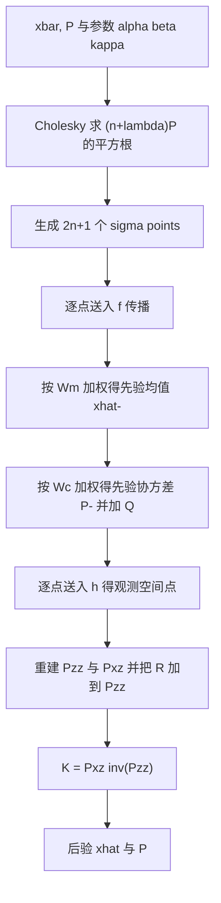
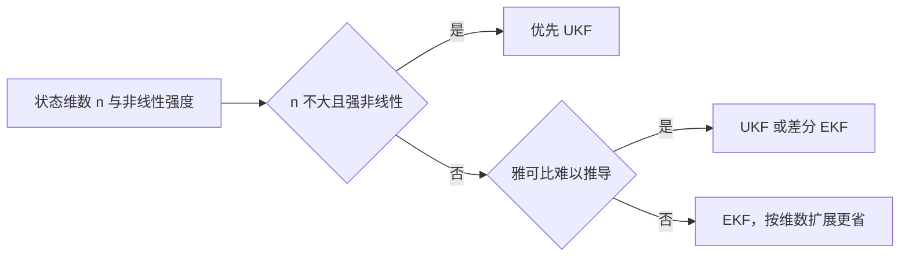

# UKF 与无迹变换

EKF 的做法是把非线性函数线性化，用雅可比把分布压成一个椭球传播。无迹卡尔曼滤波换了一条路：不推导导数，而是按当前协方差挑出一组确定性的采样点，让每个点各自穿过非线性函数，再用加权和重建变换后的均值与协方差。这个变换称为无迹变换，它对均值与协方差的近似精度可以到二阶。

本页说明采样点的取法、三组权重各自的作用、预测与更新里如何用加权重建统计量，再用一个平方观测的例子比较 UKF 与 EKF 的数值结果，最后解释散布参数取到 0.001 时为什么会出现大负权。素材来源是 `03_sensor_algorithms/kalman_filter/README.md:246-314`。

## 用确定性采样点代替求导

EKF 用一个工作点附近的一阶展开近似整个分布，UKF 用有限个点近似分布。点的位置由协方差的矩阵平方根决定，点的权重由散布参数决定，函数只被逐点求值，不需要导数。

| 方式 | 近似精度 | 需要雅可比 | 每拍函数评价 |
| --- | --- | --- | --- |
| EKF 一阶泰勒 | 一阶 | 需要 | 1 |
| UKF 无迹变换 | 二阶，部分三阶 | 不需要 | $2n+1$ |
| 差分 EKF | 取决于差分步长 | 差分近似 | $2n+1$ |

当 $f$ 或 $h$ 含平方、三角函数、四元数归一化这类曲率明显的项时，一阶近似偏差大，无迹变换更合适。状态维数升高时每个点都要做一次 $n$ 维函数求值，加上一次 $O(n^3)$ 的矩阵分解，优势被计算量抵消。

## sigma points 从协方差的矩阵平方根生成

对 $x \sim N(\bar{x}, P)$，取 $2n+1$ 个点：

$$x^{(0)} = \bar{x}$$

$$x^{(i)} = \bar{x} + \left(\sqrt{(n + \lambda)P}\right)_{i},\qquad i = 1,\dots,n$$

$$x^{(i)} = \bar{x} - \left(\sqrt{(n + \lambda)P}\right)_{i-n},\qquad i = n+1,\dots,2n$$

中心点取均值本身，其余 $2n$ 个点沿协方差的主轴方向对称分布，间距由 $(n+\lambda)P$ 的矩阵平方根决定。下标 $i$ 指矩阵平方根的第 $i$ 列，通常用 Cholesky 分解得到下三角 $L$，使 $LL^T=(n+\lambda)P$。这里的开方是矩阵平方根，不能逐元素开方（`README.md:256-258`）。

间距的物理含义是散布半径：协方差越大，采样点离均值越远，重建出的方差越大。$\lambda$ 决定这个半径相对状态维数的缩放，取值为

$$\lambda = \alpha^2(n + \kappa) - n$$

矩阵平方根要求 $(n+\lambda)P$ 对称正定，$P$ 数值上不对称或含负特征值时 Cholesky 会失败，这也是本单元第 6 篇把协方差对称化列为检查项的原因。

## 三组权重各自的作用

$$W_m^{(0)} = \frac{\lambda}{n + \lambda}$$

$$W_c^{(0)} = \frac{\lambda}{n + \lambda} + (1 - \alpha^2 + \beta)$$

$$W_m^{(i)} = W_c^{(i)} = \frac{1}{2(n + \lambda)},\qquad i = 1,\dots,2n$$

三组权重里有两组是独立的：均值权重 $W_m$ 与协方差权重 $W_c$。除中心点外两者相等，中心点的 $W_c^{(0)}$ 比 $W_m^{(0)}$ 多出 $1-\alpha^2+\beta$ 一项。$\beta$ 只进入中心点的协方差权重，不进入均值权重（`README.md:262-266`）；$\beta=2$ 是高斯分布下的常用取值，表示对先验的高斯假设。

中心点权重 $\lambda/(n+\lambda)$ 可以取负值。$\lambda$ 小于 0 时中心点被赋予负权，其余点正权更大，加权和仍然还原出均值与协方差。这个设计是为了让采样点更贴近均值，但负权在浮点下会带来相消误差，$\alpha$ 越小越明显。

README 给的建议是 $\alpha = 0.001$、$\beta = 2$、$\kappa = 0$（`README.md:260-271`）。

## 预测与更新里的加权重建

预测把每个点送入 $f$，加权求和得到先验均值与协方差：

$$\mathcal{X}_{k|k-1}^{(i)} = f(\mathcal{X}_{k-1}^{(i)}, u_k)$$

$$\hat{x}_{k|k-1} = \sum_{i=0}^{2n} W_m^{(i)} \mathcal{X}_{k|k-1}^{(i)}$$

$$P_{k|k-1} = \sum_{i=0}^{2n} W_c^{(i)} [\mathcal{X}_{k|k-1}^{(i)} - \hat{x}_{k|k-1}][\mathcal{X}_{k|k-1}^{(i)} - \hat{x}_{k|k-1}]^T + Q_k$$

更新把点送入 $h$，在观测空间重建统计量，再由互协方差求增益：

$$\mathcal{Z}_{k}^{(i)} = h(\mathcal{X}_{k|k-1}^{(i)})$$

$$P_{zz} = \sum_{i=0}^{2n} W_c^{(i)} [\mathcal{Z}_{k}^{(i)} - \hat{z}_k][\mathcal{Z}_{k}^{(i)} - \hat{z}_k]^T + R_k$$

$$P_{xz} = \sum_{i=0}^{2n} W_c^{(i)} [\mathcal{X}_{k|k-1}^{(i)} - \hat{x}_{k|k-1}][\mathcal{Z}_{k}^{(i)} - \hat{z}_k]^T$$

$$K_k = P_{xz} P_{zz}^{-1},\qquad \hat{x}_{k|k} = \hat{x}_{k|k-1} + K_k (z_k - \hat{z}_k)$$

$$P_{k|k} = P_{k|k-1} - K_k P_{zz} K_k^T$$

与 EKF 的差别在于增益的来源：EKF 用 $H$ 把 $P^-$ 投影到观测空间，UKF 用互协方差 $P_{xz}$ 直接描述状态与观测的相关性。$R_k$ 加在 $P_{zz}$ 上，漏掉这一项会让增益偏大（`README.md:289`）。

## 平方观测上 UKF 与 EKF 的对照

取 $n=1$、$\alpha=0.001$、$\kappa=0$、$P=1$，则 $\lambda = 10^{-6}-1 = -0.999999$，$n+\lambda = 10^{-6}$。矩阵平方根为 $\sqrt{10^{-6}} = 10^{-3}$，三个点为 $0$、$+10^{-3}$、$-10^{-3}$。权重为 $W_m^{(0)}=-999999$、$W_c^{(0)}=-999996.000001$、$W_m^{(1)}=W_m^{(2)}=W_c^{(1)}=W_c^{(2)}=500000$。

设 $\bar{x}=0$，观测函数 $h(x)=x^2$。无迹变换给出的均值与方差为

$$\hat{z} = -999999\cdot 0 + 500000(10^{-6}+10^{-6}) = 1$$

$$P_{zz} = -999996.000001(0-1)^2 + 2\cdot 500000(10^{-6}-1)^2 \approx 2.0$$

真值 $E[x^2]=1$、$\operatorname{Var}(x^2)=2$（$x\sim N(0,1)$）。EKF 在同一工作点取导数 $dh/dx=2x=0$，于是观测预测为 $0$，$P_{zz}=R$，与真值 1 和 2 相差很大。该组数字为手算，未实测。

这个例子把两种方法的差别放在同一个工作点上。EKF 的问题出在展开点：$x=0$ 处 $h$ 的导数为零，线性化后的观测对状态完全不敏感，增益也接近零，滤波器学不到任何信息；UKF 的三个点分别落在 $x^2=0$ 与 $x^2=10^{-6}$ 上，重建出的均值直接给出 1，捕捉到了二阶项。曲率越明显、展开点越靠近极值点，这个差距越大。

## α 取到 0.001 的数值代价

$\alpha=0.001$ 使 $n+\lambda$ 在 $n=1$、$\kappa=0$ 时只有 $10^{-6}$，权重达到 $10^6$ 量级。中心点的负权与周围点的正权相消，浮点下有效位数损失严重。以上面的均值重建为例，$-999999\cdot 0 + 500000\cdot 10^{-6} + 500000\cdot 10^{-6}$ 三个数里前一项为零，后两项各自是 0.5，结果 1 由两个量级 500000 的权乘以量级 $10^{-6}$ 的点得到，中间每一步都在做大数乘小数。

单精度 float 有约 7 位十进制有效数字，$10^6$ 级的权重已经吃掉大部分余量；维数升高后中心点权重按 $\lambda/(n+\lambda)$ 变化，负权可能更大。这是把 $\alpha$ 取到接近零的后果，工程上多取 $10^{-3}$ 到 $1$ 之间的折中（`README.md:268-271`）。该结论属推导，未在仿真中验证。

## 维数升高后的取舍

README 在 `:301-313` 给出 UKF 与 EKF 的指标对照与按维数选择的经验法则。取舍的两个维度是状态维数与非线性强度：

| 条件 | 选择 | 理由 |
| --- | --- | --- |
| $n$ 不大且非线性强 | UKF | 二阶精度收益超过函数评价开销 |
| 雅可比难以推导 | UKF 或差分 EKF | 省去手工求导 |
| $n$ 很大 | EKF | $2n+1$ 次评价加 $O(n^3)$ 分解的开销过大 |
| 非线性弱 | EKF | 一阶近似已够，无需额外评价 |

经验法则只能给出方向，具体阈值取决于算力与精度要求。README 里给的边界是 $n$ 不超过 6 左右优先 UKF（`README.md:310-313`），这个数与矩阵分解 $O(n^3)$ 的增长率有关：$n=6$ 时一次 Cholesky 与一次 6x6 矩阵乘仍在微秒量级，$n$ 再大一档开销就翻倍。

## 素材里的 UKF 与云台板的取舍

素材库 `~/robot_control_simulation` 的 `03_sensor_algorithms/kalman_filter/README.md:246-314` 给出 UKF 的公式、参数与选择法则，仓库里没有可运行的 UKF 实现。README 中与本工程相关的部分：

| README 行号 | 内容 |
| --- | --- |
| `:250-258` | sigma points 的生成与矩阵平方根说明 |
| `:260-271` | 三组权重与 $\alpha$、$\beta$、$\kappa$ 的默认值 |
| `:275-297` | 预测与更新里的加权重建 |
| `:301-308` | UKF 与 EKF 的指标对照 |
| `:310-313` | 按维数的选择法则 |

README 没有给出矩阵平方根的实现，也没有说明 $P$ 在浮点下失去正定性时的处理方式。Cholesky 失败时通常的做法是增加抖动、改用 LDL 分解或每拍做一次对称化，这些都不在素材范围内，属待补内容。

云台板固件的 `Algorithm/Src/FusionAHRS.cpp:30-41` 是一维 EKF，不是 UKF。$n=1$ 时无迹变换只需三个点，函数评价开销与一次求导相当，换成 UKF 没有明显收益；该实现选择 EKF 的另一个原因是状态量单一、$f$ 与 $h$ 都是恒等映射，雅可比为常数 1，不存在线性化误差（`Algorithm/Src/FusionAHRS.cpp:14-16` 的静止判据负责控制更新时机）。本工程没有需要二阶精度的非线性观测，UKF 停留在参考设计层面，未落地。

## 常见误用与边界情况

| # | 误用 | 现象 | 位置 |
| --- | --- | --- | --- |
| 1 | 对矩阵逐元素开方 | 采样点分布错误，协方差重建失败 | `README.md:256-258` |
| 2 | $\beta$ 加到均值权重上 | 均值有偏，协方差正常 | `README.md:262-266` |
| 3 | $\alpha$ 取到 0.001 | 权重达 $10^6$，浮点相消 | `README.md:268-271` |
| 4 | $P_{zz}$ 漏加 $R$ | 增益偏大，测量噪声被当成信息 | `README.md:289` |
| 5 | $P$ 不对称仍做 Cholesky | 分解失败或得到错误的下三角 | `README.md:256` |
| 6 | 强非线性下仍选 EKF | 展开点处导数接近零时学不到信息 | `README.md:303` |
| 7 | 状态维数大仍坚持 UKF | 每拍 $2n+1$ 次评价，实时性不达标 | `README.md:307-313` |

第 6 行的判据可以用本页的平方观测例子直接检查：在候选工作点上算 $\partial h/\partial x$，如果它在大部分工况下接近零或符号频繁变化，一阶近似不可靠。把工作点代入数值而不是凭函数形式判断，能避免把一个实际可用的 EKF 误换成计算量更大的 UKF。

## 小结

### 核心概念

- UKF 用 $2n+1$ 个确定性采样点代替线性化，函数只求值不求导。
- sigma points 由 $(n+\lambda)P$ 的矩阵平方根生成，$\lambda=\alpha^2(n+\kappa)-n$。
- 三组权重里均值权重与协方差权重只在中心点不同，$\beta$ 只影响后者。
- 无迹变换对均值与协方差达二阶精度，平方观测例子中 UKF 给出 1 与 2，EKF 在极值点给出 0 与 $R$。
- $\alpha$ 取到 0.001 时权重达 $10^6$，浮点相消风险高。
- 维数升高后计算量按 $2n+1$ 次函数评价与 $O(n^3)$ 分解增长，UKF 的收益递减。

### 设计权衡

| 权衡点 | 可选做法 | 收益与代价 |
| --- | --- | --- |
| 用采样代替求导 | 无迹变换 | 无需推导雅可比，二阶精度 | 每拍 $2n+1$ 次函数评价 |
| 散布参数 $\alpha$ | 取小值 | 中心点权重占优，贴近线性化 | 权重过大引起数值相消 |
| 维数选择 | $n$ 大时退回 EKF | 计算量可控 | 放弃二阶精度 |
| 协方差分解 | Cholesky / LDL / 加抖动 | Cholesky 快；LDL 与抖动可容忍非正定 |

## 练习

基础题

1. 对 $n=1$、$\alpha=0.001$、$\kappa=0$，算出 $\lambda$、$n+\lambda$ 与三个 sigma points，并解释 $W_m^{(0)}$ 出现大负值的原因。
2. 写出三组权重，指出 $\beta$ 出现在哪一组、为什么不出现在均值权重里。
3. 说明 $P_{zz}$ 为什么必须加 $R$，漏加后增益朝哪个方向变化。

挑战题

4. 用本页的平方观测例子重算 $P_{xz}$ 与增益 $K$，并与 EKF 的 $K$ 比较，说明两者在 $x=0$ 附近的差别。
5. 取 $n=1$、$\alpha=0.5$、$\kappa=0$，重算三个权重，比较与 $\alpha=0.001$ 时的数值条件，说明选择 $\alpha$ 时应权衡什么。
6. 若要把 UKF 用到七维位置速度偏置模型，估算每拍的函数评价次数与矩阵分解开销，并说明相对 README 的 EKF 标称耗时是否仍满足实时要求。

## 附：本页引用的路径

| 路径 | 用途 |
| --- | --- |
| `03_sensor_algorithms/kalman_filter/README.md:246-314` | UKF 公式、参数与选择法则 |
| `03_sensor_algorithms/kalman_filter/README.md:250-271` | sigma points 与权重 |
| `03_sensor_algorithms/kalman_filter/README.md:301-313` | 与 EKF 的指标对照与经验法则 |
| `Algorithm/Src/FusionAHRS.cpp:30-41` | 本工程姿态侧采用的一维 EKF |
| `Algorithm/Src/FusionAHRS.cpp:14-16` | 观测更新的静止门控阈值 |
| 仓库根路径 `~/robot_control_simulation` | 本页所有相对路径的基准 |
| 固件根路径 `/home/wyx/rm/2026SentriOmeniGimbal/2026OmniSentryGimbal` | 云台板实例的基准 |

