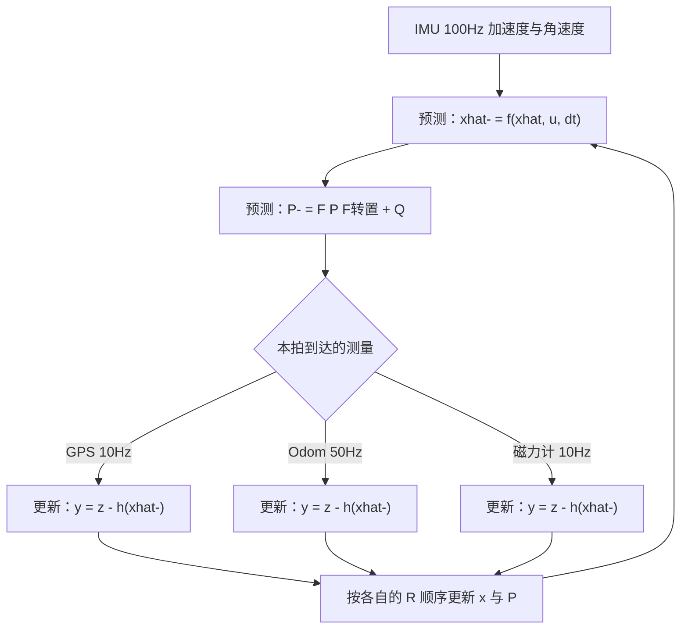
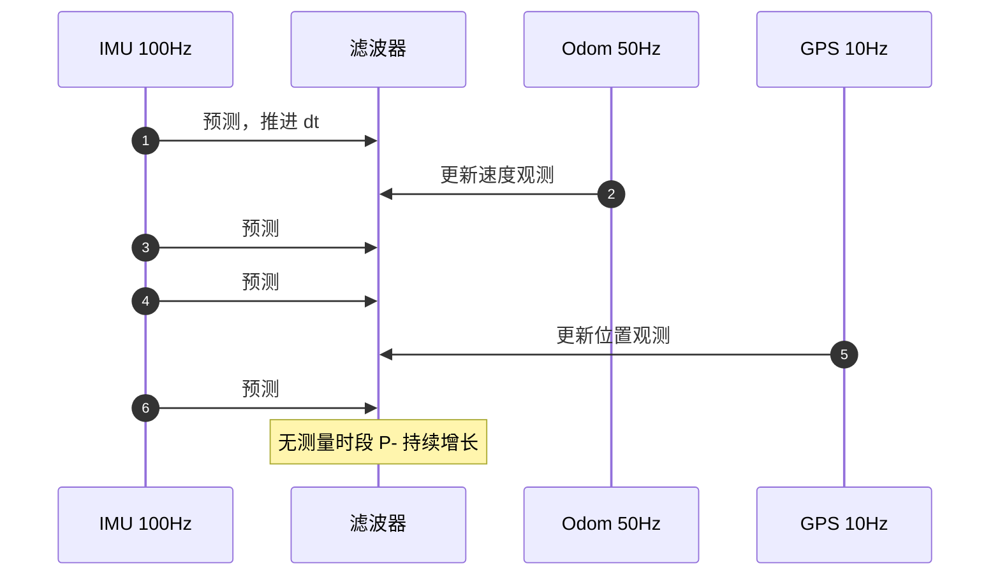

# 多传感器融合架构

真实系统里几个传感器的频率、延迟与噪声水平都不一样：IMU 一百赫兹以上，里程计几十赫兹，GPS 与磁力计十赫兹量级。把它们塞进同一个滤波器，先要决定谁负责推动时间、谁负责提供绝对参考。通行做法是把高频惯性测量用于预测，把低频绝对测量用于更新，每个传感器带自己的观测矩阵与噪声协方差。

预测驱动与事件驱动共同组成一个滤波循环；各传感器进入滤波器的位置与量纲不同，顺序更新、缺失测量、时间戳对齐与冗余方差下降是四处需要分别处理的细节。素材来源是 `03_sensor_algorithms/kalman_filter/README.md` 与算法选择表 。

## 高频预测与事件驱动更新的分工

滤波循环由两部分组成：惯性测量每到达一帧就执行一次预测，把状态推进 $\Delta t$；绝对测量到达时才执行更新，用测量修正预测。传感器之间不需要对齐到同一个节拍，各自按自己的到达时刻触发。

| 传感器 | 频率 | 观测量 | 对应状态分量 | 进入方式 |
| --- | --- | --- | --- | --- |
| IMU | 100 Hz | 比力与角速度 | 全部状态 | 只用于预测，不直接更新 |
| 里程计 | 50 Hz | 线速度、角速度 | 速度、航向 | 选择速度分量的行 |
| GPS | 10 Hz | 位置 | 位置 | 选择位置分量的行 |
| 磁力计 | 10 Hz | 航向角 | 偏航 | 对四元数的非线性行 |

四个传感器里只有 IMU 不参与更新，原因是它的观测量（加速度、角速度）本身就是状态传播的输入，再用它做更新会把同一份信息用两次，等效于把 $R$ 重复计入。里程计、GPS、磁力计提供的是状态的直接或间接观测，彼此独立，适合各占一组观测行。

## 松耦合、紧耦合与不使用融合

按原始测量是否被预先解算，融合架构分三档：

| 架构 | 输入 | 信息取舍 | 计算量 |
| --- | --- | --- | --- |
| 松耦合 | 各传感器自行解算后的位置、速度、姿态 | 原始测量已被预处理，存在信息损失 | 小 |
| 紧耦合 | 原始测量，如伪距、载波相位、视觉重投影 | 保留原始信息，遮挡时仍可用 | 大，状态维数高 |
| 直接使用 | 不做融合 | 无冗余，单传感器噪声直接进系统 | 最小 |

松耦合把每个传感器当作一个独立的位置或速度源，接口简单、故障隔离好，代价是传感器内部解算已经丢掉了部分原始信息，且解算过程可能引入自己的延迟。紧耦合把原始测量直接写进观测方程，状态维数、可观性分析与标定复杂度都上一个台阶。素材给出的对比在 `README.md`，两档之间没有中间形态，选择取决于是否需要利用单传感器内部的冗余。



## 每个传感器各带一组观测方程

预测用惯性输入推进状态与协方差：

$$\hat{x}^- = f(\hat{x}, u, \Delta t),\qquad P^- = F P F^T + Q(\Delta t)$$

第 $i$ 个传感器的更新为

$$y_i = z_i - h_i(\hat{x}^-),\qquad S_i = H_i P^- H_i^T + R_i$$

$$K_i = P^- H_i^T S_i^{-1},\qquad \hat{x} = \hat{x}^- + K_i y_i,\qquad P = (I - K_i H_i) P^-$$

每个传感器有自己的 $h_i$、$H_i$、$R_i$。$H_i$ 的作用是从状态里取出该传感器能看到的分量，里程计取速度行，GPS 取位置行，磁力计取航向行；$R_i$ 反映各自的噪声水平，GPS 定位方差与陀螺零偏方差不在一个量级（`README.md`）。

同一拍内到达多个测量时，更新按顺序执行，后一个用前一个的结果作为先验。顺序更新的每一步都把协方差缩小一次，后续更新看到的先验已经吸收了前一个测量的信息。



## 顺序更新与批量更新的差别

多个传感器到来时有两种做法，示意如下：

```python
# 示意：顺序更新与批量更新的等价条件
for z_i, H_i, R_i in measurements:      # 顺序：逐个更新
    x, P = update(x, P, z_i, H_i, R_i)

# 批量：把同一次采样的多路观测堆叠成一个更大的 z / H / R
z = np.concatenate([z_1, z_2]); H = np.vstack([H_1, H_2])
R = block_diag(R_1, R_2)                # R 必须是对角块，即各路观测噪声互不相关
x, P = update(x, P, z, H, R)
```

两者在观测噪声互不相关时给出完全相同的结果，但适用场景不同：顺序更新可以随时插入一路到达的测量，实现简单、便于分别做门控；批量更新一次解一个更大的方程，次数少但要求把`R`拼成块对角矩阵。若两路观测的误差实际上相关（例如来自同一块 IMU 的不同通道），块对角假设不成立，顺序更新会低估协方差。

把同一拍内的多个测量合成一个大观测向量一次更新，与逐个更新，在线性高斯、噪声互不相关的条件下给出相同结果；观测函数非线性时两者不再等价。

差别来自 $H_i$ 的求值点。顺序更新时，第二个测量的 $h_2$ 在第一个测量更新后的状态处线性化；批量更新时，所有 $h_i$ 都在同一个先验处线性化。工作点不同，雅可比不同，后验也就不一样。差异的大小取决于两个测量之间的相关性以及 $h$ 的曲率，测量之间强相关或曲率明显时差异不可忽略（`README.md`）。

顺序更新的工程好处是灵活：某个传感器数据缺失时直接跳过对应步骤，状态与协方差仍保持自洽。批量更新的好处是只有一次矩阵求逆，$S$ 的维数是 $\sum m_i$，在大观测向量的场合更快。

## 预测频率如何影响等效过程噪声

README 给出的频率分配是 IMU 100 Hz、里程计 50 Hz、GPS 10 Hz、磁力计 10 Hz（`README.md`），预测由 IMU 驱动，频率可到 100 到 400 Hz（`README.md`）。预测每执行一次，$Q(\Delta t)$ 就注入一次，频率越高注入次数越多。

若 $Q$ 按每拍固定取值，把预测频率从 100 Hz 提到 400 Hz 会让过程噪声的注入速率变为四倍，滤波器变得更信测量。$Q$ 与 $\Delta t$ 的匹配关系是：连续时间噪声功率谱密度 $q$ 对应的离散协方差近似为 $q \Delta t$，频率提高时 $\Delta t$ 缩小，每拍注入量应同步缩小。只改频率不改 $Q$ 属于第 5 篇的调参问题，在多传感器架构里会表现为慢传感器的影响被削弱。

## 测量缺失期间协方差持续增长

某传感器长时间没有数据时，滤波器继续预测但不更新，$P$ 按 $P^- = FPF^T + Q$ 逐拍增长，表示对状态越来越不确定（`README.md`）。增长是单调的，因为 $FPF^T$ 对稳定系统通常不缩小协方差，$Q$ 又只加不减。

协方差增长带来一个自适应的副作用：测量恢复后，$P^-$ 比正常运行时大，增益 $K$ 随之增大，状态被更快地拉向新测量。这个特性让滤波器在中断后能快速收敛，但如果中断期间状态已经发散，过大的增益会把一个可能异常的新测量直接采信，所以恢复后的前几次测量常配合门控使用（`README.md`）。

反向的错误做法是在没有新测量时仍执行更新，例如重复使用上一帧测量。这会在没有新信息的情况下压缩 $P$，滤波器表现得越来越自信，实际误差却在增长。

## 时间戳对齐与延迟

不同传感器有各自的采样与传输延迟，测量对应的真实时刻与到达时刻不一致。README 建议按时间戳对齐，必要时把时间偏移扩维成状态一起估计（`README.md`）。未对齐时的后果是用错时刻的测量修正当前状态：慢传感器的一次更新带着几十毫秒前的信息，与高频预测的最新状态不在同一时刻，等效于给系统引入了一个时间滞后，滞后量等于该传感器的总延迟。

对齐的两种实现：

| 做法 | 机制 | 代价 |
| --- | --- | --- |
| 缓冲回放 | 保存一段时间内的状态历史，测量到达时回到对应时刻更新再重放预测 | 需要状态历史缓冲，实现复杂 |
| 时间偏移扩维 | 把每个传感器的偏移量当作状态分量一起估计 | 状态维数增加，可观性要求提高 |
| 忽略对齐 | 直接用当前状态更新 | 延迟小的传感器可接受，延迟大时引入偏差 |

延迟小于一个预测周期时可以忽略，延迟远大于预测周期时必须处理。云台板的传感器都在板内，延迟小，属于第一种情形。

## 冗余观测带来的方差下降

同一个状态被多个传感器观测时，后验方差按测量方差的倒数叠加。标量情形下两路独立测量给出

$$\frac{1}{P_{k|k}} = \frac{1}{P^-} + \frac{1}{R_1} + \frac{1}{R_2}$$

精度提升来自冗余，但提升幅度小于测量数目的线性增长：$R$ 最小的那一路主导后验方差，其余测量的边际贡献递减。两路精度相同的测量最多把方差减半，四路最多减到四分之一，收益按倒数增长。

可观测性方面，只有位置观测时速度靠 $F$ 的位置速度耦合间接可观；只有速度观测时位置需要积分，长时间会累积漂移。这个区别决定了两类传感器的分工：GPS 提供绝对位置，把长期漂移压住；里程计提供速度，让短时间的位置估计更准。README 的架构把两者都保留，正是为了让位置与速度各自有直接观测。

## 云台固件只有一路单传感器 EKF

底盘板的 yaw 补偿走的是滑动平均（素材 07 领域已记录），云台板的 `Algorithm/Src/FusionAHRS.cpp` 每拍先做静止检测，再把 $g_z$ 交给 `GyroBiasEKF::update`，最后进 Mahony。它对应本页的退化情形：$h$ 是一维，更新由静止标志门控，不由频率驱动，也没有第二个传感器参与。

| 本页架构要素 | 云台板实现 |
| --- | --- |
| 预测驱动 | EKF 内部按 `P_ += Q_` 自增 |
| 事件驱动更新 | 静止判据触发 |
| 多传感器 | 只有陀螺 $g_z$ 一路 |
| 松紧耦合 | 不适用，无需要融合的两路绝对测量 |

两块板没有共用同一套融合架构。多传感器部分目前只存在于素材 README，属于可迁移的参考设计，未在本工程落地。

## 按系统类型选滤波器

README 的算法选择表在 `README.md`，按系统类型、状态方程与观测方程给出选择。与本工程相关的几行：

| 系统 | 状态方程 | 观测方程 | 选择 |
| --- | --- | --- | --- |
| 足式机器人关节 | 线性或弱非线性 | 位置、速度 | 线性 KF |
| 四旋翼姿态 | 非线性 | 陀螺与加速度 | EKF，强非线性下 UKF |
| VIO | 非线性，状态维数高 | 视觉重投影 | MSCKF 类 EKF |
| 仅姿态、无位置需求 | 非线性 | 陀螺与加速度 | Mahony 或 Madgwick |

选择的依据是状态维数与非线性强度两项。四旋翼姿态只有少数几个状态且观测含三角函数，适合二阶方法；VIO 的状态维数几十上百，$2n+1$ 次函数评价不可接受，只能在 EKF 框架里做降维技巧。仅姿态场景对绝对位置没有需求，互补滤波类的轻量方法就够，卡尔曼滤波的协方差与调参成本换不来额外精度。

## 常见误用与边界情况

| # | 误用 | 现象 | 位置 |
| --- | --- | --- | --- |
| 1 | 未做预测就直接更新 | 用上一拍协方差更新当前测量，增益失真 | `README.md` |
| 2 | 多测量并行更新同一先验 | 顺序与批量结果在非线性下不同 | `README.md` |
| 3 | 所有传感器共用同一个 $R$ | 忽略噪声水平差异，高噪声传感器权重过大 | `README.md` |
| 4 | 时间戳错乱 | 用未来测量修正过去状态 | `README.md` |
| 5 | 测量缺失时仍强行更新 | 没有新息却压缩协方差 | `README.md` |
| 6 | 把紧耦合当松耦合的扩展 | 状态维数与可观性分析都要重做 | `README.md` |
| 7 | 认为不同预测频率等价 | $Q$ 按拍施加，等效噪声率随频率变 | `README.md` |
| 8 | 用惯性测量再做更新 | 同一份信息用两次，$R$ 被重复计入 | `README.md` |

第 8 行是架构层面的错误，不会立刻表现为发散。用加速度计同时做预测输入与姿态观测，等于把同一份比力信息通过两条路径送进状态，滤波器对该信息的信任度被放大一倍，等效于把 $R$ 减半。判断方法是检查每个传感器的观测量是否已经在状态传播里出现过。

## 小结

### 核心概念

- 高频惯性测量驱动预测，低频绝对测量触发更新，每个传感器有独立的 $h_i$、$H_i$、$R_i$。
- 同一拍内多个测量按顺序更新，观测非线性时与批量更新不等价。
- 松耦合融合各传感器解算结果，计算量小但有信息损失；紧耦合直接融合原始测量，精度高但状态维数大。
- 测量缺失期间只预测，协方差持续增长；恢复更新后增益自动放大。
- 预测频率改变时必须同步调整 $Q$，否则等效过程噪声率随之变化。
- README 的频率分配是 IMU 100 Hz、Odom 50 Hz、GPS 10 Hz、磁力计 10 Hz。

### 设计权衡

| 权衡点 | 选择 | 收益 | 代价 |
| --- | --- | --- | --- |
| 松耦合 | 融合预处理后的位置速度姿态 | 实现简单，模块解耦 | 原始信息在预处理中损失 |
| 顺序更新 | 每个测量单独更新 | 实现直接，随时插入传感器 | 顺序依赖，非线性下有偏差 |
| 仅用惯性加绝对位置 | 不做紧耦合 | 状态维数低 | GNSS 遮挡时无绝对约束 |
| 预测频率 | 尽量高 | 延迟小、更新及时 | $Q$ 注入频繁，需要按 $\Delta t$ 缩放 |

## 练习

基础题

1. 说明为什么 IMU 只用于预测而不用于更新，若强行用于更新会对 $R$ 产生什么等效影响。
2. 两路独立测量的方差分别为 $R_1=1$、$R_2=4$，先验 $P^-=10$，求后验方差并说明哪一路主导。
3. 预测频率从 100 Hz 提到 200 Hz、$Q$ 不变，说明等效过程噪声率的变化倍数，并给出修正方式。

挑战题

4. 顺序更新与批量更新在线性条件下等价。写出两路标量观测的两次顺序更新过程，并证明与一次批量更新的结果一致。
5. 某传感器延迟 30 ms，预测周期 10 ms。说明不对齐时引入的等效滞后，并给出两种对齐方案的实现代价。
6. 若要把云台板的一维 EKF 扩展成陀螺零偏加加速度计偏置的两状态模型，说明需要新增哪几行观测、各自的可观性条件，以及 $H$ 的维数变化。

## 附：本页引用的路径

| 路径 | 用途 |
| --- | --- |
| `03_sensor_algorithms/kalman_filter/README.md` | 融合架构、频率分配与松紧耦合 |
| `03_sensor_algorithms/kalman_filter/README.md` | 按系统类型选算法的对照表 |
| `03_sensor_algorithms/kalman_filter/README.md` | 时间对齐与低更新率处理 |
| `Algorithm/Src/FusionAHRS.cpp` | 本工程的一维 EKF 更新 |
| `Algorithm/Src/FusionAHRS.cpp` | 单传感器预测与门控更新链路 |
| 仓库根路径 `~/robot_control_simulation` | 本页所有相对路径的基准 |
| 固件根路径 `/home/wyx/rm/2026SentriOmeniGimbal/2026OmniSentryGimbal` | 云台板实例的基准 |


