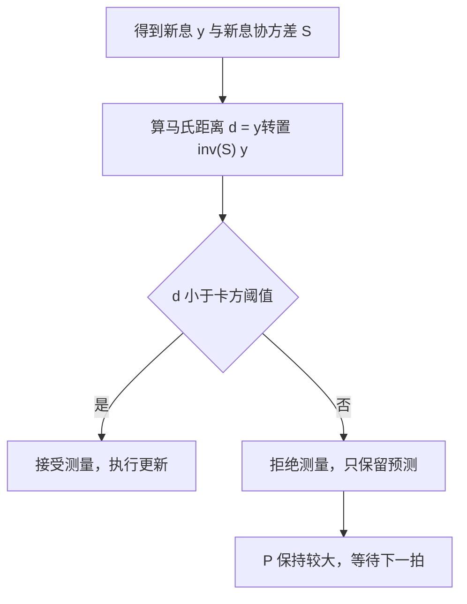
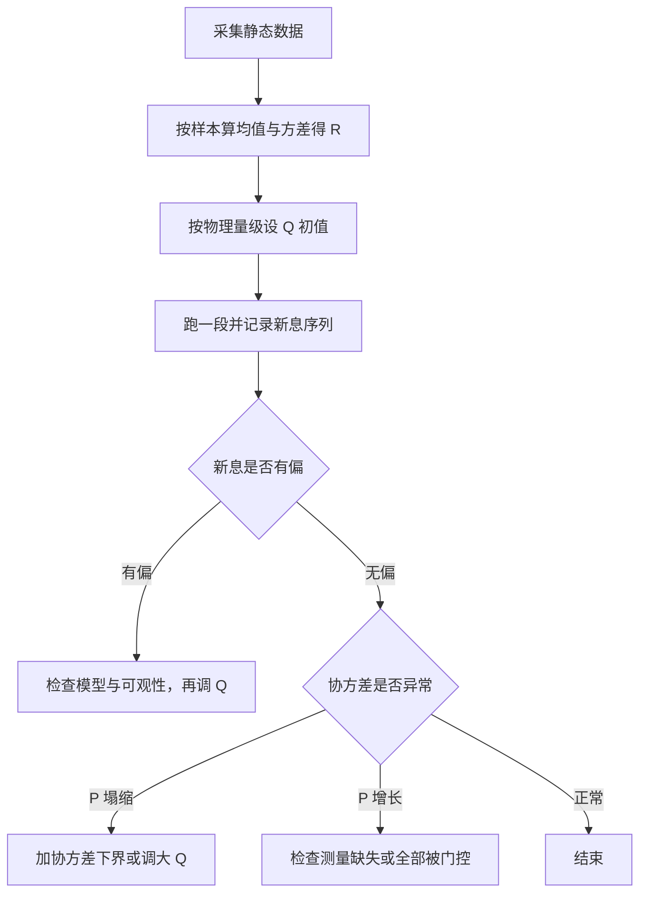

# Q 与 R 调参与防发散

卡尔曼滤波的结构是固定的，能改的只有过程噪声 $Q$、观测噪声 $R$ 与初始协方差 $P_0$。$Q/R$ 的比值决定滤波器带宽：比值大则更信测量，跟踪快但噪声进状态；比值小则更信模型，平滑但滞后。$P_0$ 只影响前几拍的收敛速度，之后的状态被新息主导。三个量配得不好，滤波器会先出现滞后或抖动，进一步可能发散。

三个旋钮的作用方向不同：$Q$ 与 $R$ 的比值决定带宽，$P_0$ 只影响前几拍。$R$ 可以用静态实验或新息匹配来估，马氏距离门控与三种防发散手段在滤波器出现异常时使用。素材来源是 `03_sensor_algorithms/kalman_filter/README.md`，实例见 `Algorithm/Src/FusionAHRS.cpp`。

## Q、R、P0 三个旋钮的作用方向

| 参数 | 物理含义 | 调大的后果 | 调小的后果 |
| --- | --- | --- | --- |
| $Q$ | 每拍注入的过程噪声方差 | 更信测量，跟踪快，噪声进状态 | 更信模型，平滑但滞后 |
| $R$ | 单次观测的噪声方差 | 更信模型，更新量小，收敛慢 | 更信测量，估计抖动 |
| $P_0$ | 初始不确定度 | 首拍几乎等于测量 | 长时间不愿接受测量 |

增益对两个量的依赖可以写成比值直觉：标量情形稳态附近 $K \approx P/(P+R)$，而 $P$ 本身由 $Q$ 与 $R$ 共同决定，所以单独调 $Q$ 或单独调 $R$ 的效果在数值上不同，在对数尺度上却常常等价。README 的建议是 $P_0$ 取较大值（约 $1000I$）表示初始不确定，$\hat{x}_0$ 用第一次测量初始化（`README.md`）。这条建议针对的是绝对位置类传感器：$P_0$ 大让第一拍直接采信测量，随后协方差快速回落到稳态。

$Q$ 的量纲容易被忽略。状态是位置与速度时，$Q$ 的左上块量纲是 $\text{m}^2$、右下块是 $(\text{m/s})^2$，两个块不能取同一个数值。$Q$ 的非对角项表示位置与速度误差的相关性，按连续白噪声加速度模型取 $\Delta t^3/3$ 与 $\Delta t^2/2$ 时，非对角项为正。

## 静态实验估计 R 与它的余量

把传感器静止放置，采集一段样本，用样本方差估计 $R$：

```c
float compute_R_from_static_data(const float *samples, int n) {
    float mean = 0, var = 0;
    for (int i = 0; i < n; i++) mean += samples[i];
    mean /= n;
    for (int i = 0; i < n; i++) var += (samples[i] - mean) * (samples[i] - mean);
    return var / (n - 1);
}
```

该片段在 `README.md`，估计的是静态噪声方差，不含动态误差与模型误差。分母用 $n-1$ 而不是 $n$，得到的是无偏样本方差。样本数太少时方差估计本身抖动，通常取几百到几千点；静止期间的慢漂移会被算进方差，让 $R$ 偏大。

实际 $R$ 通常要在样本方差基础上再放大，把未建模误差一并算进去。判断是否需要放大可以用新息序列的幅值：稳态下新息的标准差应约等于 $\sqrt{S}$，若实测新息的标准差明显大于这个值，说明 $S$ 被低估，$R$ 偏小。

## 新息协方差匹配反推 R

自适应方法用新息序列反推 $R$。若模型与噪声统计正确，新息是零均值白噪声，其理论协方差为 $S_k = H_k P_{k|k-1} H_k^T + R_k$。用滑动窗口内的样本协方差估计左边，就能解出 $R$：

$$R_k^{\text{est}} = \frac{1}{M}\sum_{j=k-M+1}^{k} y_j y_j^T - H_k P_{k|k-1} H_k^T$$

该式在 `README.md`。窗口长度 $M$ 决定估计的平滑度：$M$ 小则 $R$ 随新息快速波动，等效于增益在抖；$M$ 大则估计滞后，传感器噪声水平变化后要等很久才跟上。窗口内如果出现过野值，样本协方差会被单个大新息抬高，所以这条路径通常与门控配合使用。

估出的 $R$ 可能非正定：样本协方差是半正定的，减去 $H P^- H^T$ 之后可能出现负特征值，尤其在窗口内新息偏小时。工程处理是加下界与对称化，把估计值钳到正的区间内，否则下一步的 $S$ 可能变成奇异或负定，增益方向都会错。

## 马氏距离门控与卡方阈值

门控用新息的马氏距离与卡方阈值比较，示意如下：

```python
# 示意：新息门控
d2 = y.T @ np.linalg.inv(S) @ y        # 马氏距离平方
if d2 > chi2_threshold(dof=len(y), p=0.99):
    reject()                            # 视为野值，跳过这次测量
else:
    x, P = update(x, P, z, H, R)
```

"马氏距离"是按协方差归一化后的距离：同样偏离 3 个单位，新息协方差小的那次更可疑。它比欧氏距离合适，因为测量在不同方向上的可信度本来就不一样。门控阈值查卡方分布表得到——新息在模型正确时近似服从卡方分布，超过 99% 分位数就认为"这次观测与模型不符"。代价是持续拒测期间协方差只增不减，因此需要与协方差下界配合。

异常测量在更新前剔除，避免把野值灌进状态。判据用新息在协方差度量下的平方距离：

$$d_M = y_k^T S_k^{-1} y_k < \chi^2_{m,0.95}$$

$m$ 是观测维数，阈值取卡方分布的 95% 分位数。用 $S^{-1}$ 而不是 $R^{-1}$ 归一化，是因为新息的散布由预测不确定度与观测噪声共同决定，只按 $R$ 归一化会把预测误差当成异常。阈值随观测维数变化，README 的表内三个值为 3.841（$m=1$）、5.991（$m=2$）、7.815（$m=3$），代码在 `README.md`。

门控的自由度必须与观测维数一致。$m=3$ 的位置观测用 $m=1$ 的阈值 3.841，等于把接受域收缩到很小，大量正常测量被拒；反过来用 $m=3$ 的阈值去门控一维测量，野值几乎全部放行（`README.md`）。



门控只解决单次异常，不解决系统性偏差。如果 $H$ 或 $h$ 写错，新息会长期偏大，门控会把绝大多数测量拒掉，滤波器退化成纯预测，$P$ 持续增长，此时的表现与传感器失效相同。判断方法是统计一段时间内的拒测比例：正常工况下 95% 阈值对应的理论拒测率是 5%，长期显著高于这个值说明模型有问题（`README.md`）。

## 协方差下界、遗忘因子与 Joseph 形式

三种防发散手段针对三种失效模式：

| 手段 | 公式 | 针对的失效 | 位置 |
| --- | --- | --- | --- |
| 协方差下界 | $P_{k\vert k} = P_{k\vert k} + \varepsilon I$ | 浮点导致的过度自信，$P$ 塌缩 | `README.md` |
| 遗忘因子 | $P_{k\vert k-1} = \alpha F P F^T + Q$ | 模型漂移，旧信息权重过大 | `README.md` |
| Joseph 形式 | $P_{k\vert k} = (I-KH)P^-(I-KH)^T + KRK^T$ | $K$ 的数值误差破坏正定性 | `README.md` |

协方差下界给 $P$ 加一个正定小量，抵消浮点造成的过度自信。$\varepsilon$ 取得太小不起作用，取得太大等于人为规定一个不确定度下限，稳态精度被限制住。它的常见用途是配合门控：大量测量被拒后 $P$ 会增长，不会塌缩，下界只在正常更新路径上起作用。

遗忘因子在预测步放大协方差，典型值 1.01 到 1.05。$\alpha > 1$ 使旧信息每拍衰减，滤波器更重近期测量，适合模型参数缓慢漂移的场合。$\alpha$ 取得过大时稳态增益过高，测量噪声被放大进状态，表现为输出抖动；这个副作用与调大 $Q$ 类似，区别是遗忘因子对所有方向等比放大，$Q$ 可以有选择地放大某些状态。

Joseph 形式在 $K$ 有数值误差时仍保持正定，代价是两次矩阵乘。它与简单形式在 $K$ 取最优值时等价，$K$ 偏离最优值时简单形式可能失去对称正定性。三条路径不要混用：同一段代码里有的分支用简单式、有的用 Joseph 形式，$P$ 的数值行为在两条路径之间不一致，排查时会看到难以解释的差异（`README.md`）。



## 云台板一维 EKF 的参数实例

云台板的 `GyroBiasEKF` 给出一维参数实例：构造在 `Algorithm/Src/FusionAHRS.cpp` 取 $x_0=0$、$P_0=0.1$、$Q=10^{-6}$、$R=10^{-4}$。静止连续更新时稳态协方差与增益可以手算。标量稳态满足不动点方程

$$P = \frac{(P+Q)R}{P+Q+R}$$

整理成二次式 $P^2 + QP - QR = 0$，取正根

$$P = \frac{-Q + \sqrt{Q^2 + 4QR}}{2}$$

代入 $Q=10^{-6}$、$R=10^{-4}$：$Q^2=10^{-12}$、$4QR=4\times10^{-10}$，$\sqrt{Q^2+4QR}\approx 2\times10^{-5}$，于是 $P \approx 9.5\times10^{-6}$，接近 $\sqrt{QR}=10^{-5}$。稳态增益

$$K = \frac{P}{P+R} \approx \frac{9.5\times10^{-6}}{1.1\times10^{-4}} \approx 0.09$$

每来一个样本，零偏估计按增益 0.09 向测量靠拢，等效一阶时间常数约 $1/K \approx 11$ 个样本；1 kHz 采样下约 10 ms。该组数字为公式手算，未在板上复测。

该实现用的是简单协方差式 `P_ = (1 - K) * P_`，没有 Joseph 形式；也没有门控野值，只有静止标志 `isStatic`。运动期间不更新，$P$ 按每拍 $Q$ 增长，重回静止后增益变大。三条防发散手段里它一条都没用，能稳定运行的原因是只有一个状态、更新由静止判据严格门控、测量本身零均值。

底盘板没有对应的零偏卡尔曼滤波，yaw 只用滑动平均，因此 $Q$、$R$ 调参在本工程只有云台板一处在用。

## 用新息统计反推参数是否合适

不看真值也能判断参数是否合适，依据是新息序列的统计量。理论结论是：模型与噪声统计一致时，新息为零均值白噪声，协方差等于 $S$，归一化平方 $y^T S^{-1} y$ 服从自由度为 $m$ 的卡方分布。

| 观测量 | 理论值 | 偏离的含义 |
| --- | --- | --- |
| 新息均值 | 0 | 长期非零说明模型有常值偏差或状态未收敛 |
| 新息方差 | $S$ 的对应对角元 | 偏大说明 $S$ 被估小，$R$ 或 $Q$ 偏小 |
| 归一化平方的均值 | $m$ | 偏大偏小分别对应 $S$ 估小与估大 |
| 新息自相关 | 滞后非零时应接近 0 | 明显非零说明模型漏掉了动态 |
| 拒测比例 | 5% | 显著偏高说明 $H$、$h$ 或阈值有问题 |

五个量里新息均值与自相关用于查模型，方差与归一化平方用于查 $Q$、$R$，拒测比例用于查门控。这条路径的局限是只能判断统计一致性，定位不到具体环节：$S$ 估小可能来自 $Q$ 偏小、$R$ 偏小或 $H$ 写错，需要结合模型核对才能区分。统计量要跑够长度，几十个样本的方差本身误差很大，通常取几百到上千个新息。

## 常见误用与边界情况

| # | 误用 | 现象 | 位置 |
| --- | --- | --- | --- |
| 1 | 直接用手册噪声当 $R$ | 手册只含传感器自身噪声，未含未建模误差 | `README.md` |
| 2 | $Q$、$R$ 未随 $\Delta t$ 归一 | 采样率一变，等效权重就变 | `README.md` |
| 3 | 门控自由度取错 | 阈值与观测维数不匹配，误拒或漏放 | `README.md` |
| 4 | 把门控当成防发散的唯一手段 | 大量测量被拒后 $P$ 持续增长 | `README.md` |
| 5 | 遗忘因子取过大 | 稳态增益过高，噪声被放大 | `README.md` |
| 6 | Joseph 形式与简单形式混用 | 两条路径的 $P$ 数值行为不一致 | `README.md` |
| 7 | 只调 $Q$、$R$ 不查可观性 | 不可观状态怎么调都不收敛 | `README.md` |
| 8 | 只比较 $Q$ 与 $R$ 的绝对值 | 决定增益的是比值与 $P$ 的尺度 | `README.md` |

第 7 行的判断可以提前到调参之前：先算可观测性矩阵，确认每个状态都有能影响新息的观测行。不可观状态在数学上无法从测量中恢复，$Q$ 调得再大只会让它随模型漂移得更快。云台板的一维 EKF 只有零偏一个状态、一维观测，可观性天然成立，所以不需要做这一步。

## 小结

### 核心概念

- 可调量是 $Q$、$R$ 与 $P_0$，$Q/R$ 的比值决定带宽，$P_0$ 决定初始收敛速度。
- $R$ 可由静态样本方差估计，但需要留出未建模误差的余量。
- 新息协方差匹配用滑动窗口的新息样本协方差反推 $R$，结果需保证正定。
- 马氏距离门控用卡方分布阈值剔除异常测量，阈值随观测维数变化，理论拒测率 5%。
- 协方差下界、遗忘因子、Joseph 形式分别处理过度自信、模型漂移与数值正定性。
- 云台板一维实例取 $Q=10^{-6}$、$R=10^{-4}$，稳态增益约 0.09，时间常数约 10 ms。

### 设计权衡

| 权衡点 | 选择 | 收益 | 代价 |
| --- | --- | --- | --- |
| 门控野值 | 马氏距离阈值 | 野值不进状态 | 阈值偏小时丢失有效测量 |
| 防发散手段 | 叠加使用 | 覆盖多种失效模式 | 增加参数与计算量 |
| $P_0$ 取大 | 首拍信任测量 | 快速给出初值 | 首个样本噪声直接进入状态 |
| 新息窗口 $M$ | 取小 / 取大 | 取小跟得上噪声变化 | 取大估计平滑但滞后 |

## 练习

基础题

1. 用 `README.md` 的静态方差公式处理样本 $-0.02$、$0.01$、$0.00$、$0.03$、$-0.01$（单位 rad/s），算出均值与无偏方差，并说明它作为 $R$ 是否够用。
2. 写出新息协方差匹配公式，并说明窗口内出现一个野值时估计结果朝哪个方向偏。
3. 观测维数 $m=2$，说明门控阈值应取多少；若误用 $m=1$ 的阈值，拒测率会朝哪个方向变。

挑战题

4. 从标量稳态不动点方程 $P=(P+Q)R/(P+Q+R)$ 出发，推导 $P$ 的正根表达式，并计算 $Q=10^{-5}$、$R=10^{-4}$ 时的稳态协方差、增益与时间常数。
5. 遗忘因子 $\alpha=1.05$ 与把 $Q$ 调大 5% 都能提高稳态增益。说明两者对 $P$ 各方向的作用差别，并给出一个能区分两者的实验。
6. 云台板的简单协方差式 `P_ = (1 - K) * P_` 在 $K$ 已由最优公式算出的前提下与 Joseph 形式等价。说明浮点误差累积到什么程度后两者会分叉，以及如何用一段静止数据检测这种分叉。

## 附：本页引用的路径

| 路径 | 用途 |
| --- | --- |
| `03_sensor_algorithms/kalman_filter/README.md` | $Q$、$R$ 调参、门控与防发散 |
| `03_sensor_algorithms/kalman_filter/README.md` | 静态实验估计 $R$ 的代码 |
| `03_sensor_algorithms/kalman_filter/README.md` | 新息协方差匹配与卡方阈值 |
| `03_sensor_algorithms/kalman_filter/README.md` | 三种防发散手段 |
| `Algorithm/Src/FusionAHRS.cpp` | 云台板一维 EKF 的参数初值 |
| `Algorithm/Src/FusionAHRS.cpp` | 门控更新与简单协方差式 |
| 仓库根路径 `~/robot_control_simulation` | 本页所有相对路径的基准 |
| 固件根路径 `/home/wyx/rm/2026SentriOmeniGimbal/2026OmniSentryGimbal` | 云台板实例的基准 |


