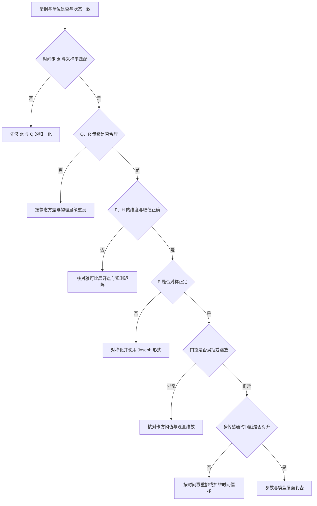
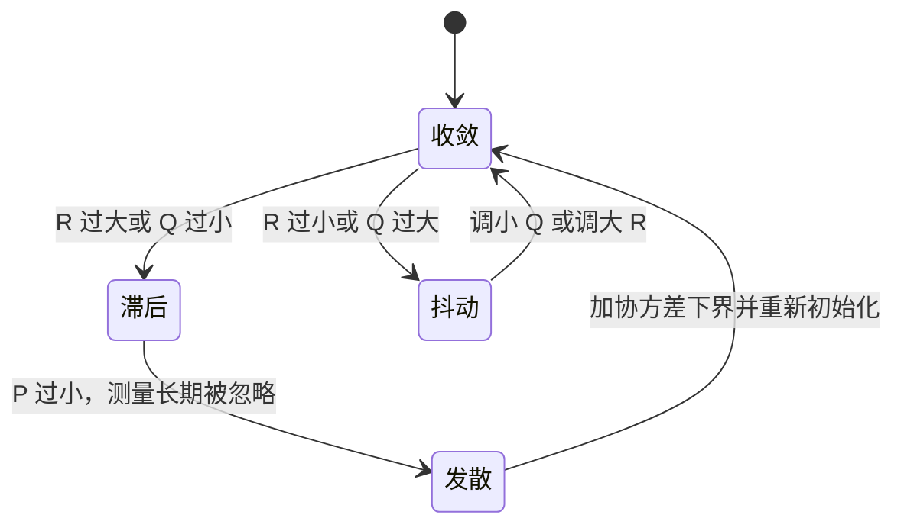

# 易错点与调试

滤波器能跑不等于结果正确。常见形态是输出连续、看着平滑，却始终比真值滞后，或者在机动段被一个野值拉走后再也回不来。这些问题的来源分布在不同环节上，症状与原因之间没有一一对应，所以排查要先按症状缩小到环节，再在该环节里核对具体量。

前五篇出现的失效模式可以串成一条排查路径：先核对量纲与时间步，再看 $Q$、$R$ 的尺度，随后检查雅可比与观测矩阵，最后查协方差正定性、门控与时间同步。素材来源是 `03_sensor_algorithms/kalman_filter/README.md:454-536`，本工程实例见 `Algorithm/Src/FusionAHRS.cpp:22-41`。

## 按症状定位到环节

| 症状 | 优先怀疑 | 检查量 |
| --- | --- | --- |
| 跟踪滞后，测量作用弱 | $R$ 过大或 $Q$ 过小 | 增益 $K$ 的量级、$S$ 与 $P$ 的比值 |
| 输出抖动，噪声大 | $R$ 过小或 $Q$ 过大 | 新息序列的方差与自相关 |
| 缓慢发散，$P$ 越来越小 | 模型误差、线性化误差、浮点不正定 | $P$ 的对角元趋势与对称性 |
| 阶跃后长时间有偏 | $P_0$ 过小或模型缺项 | 新息均值是否长期非零 |
| 机动时偏差大 | 过程噪声不足 | $Q$ 与时间步的乘积 |
| 慢传感器更新后跳变 | 时间戳未对齐 | 测量时刻与状态时刻之差 |
| 协方差出现负对角元 | 数值相消或非正定分解 | Cholesky 是否报错 |

七行症状里前两行属于参数层，中间三行属于模型与参数的交界，最后两行属于实现层。判断时可以用一个简单手段区分：把测量暂时全部拒绝，只保留预测。若输出仍然抖动，问题在预测路径（模型或 $Q$）；若输出立刻变平滑但漂移明显，问题在更新路径（$R$、$H$ 或门控）。

## 从物理量到数值量的排查顺序

量纲或时间步错时，后面所有参数调整都是在错的基础上补偿，所以排查必须从物理量开始。

流程里的前两步可以离线完成：把状态量的单位与 $H$ 的每一列乘一遍，结果应与观测量的单位一致；把控制周期与代码里的 $\Delta t$ 常量对照，两者不等就直接停下。中间三步需要在线数据：$Q$、$R$ 的量级可以从新息统计反推，$F$、$H$ 的取值要用一组已知状态代进去验算，$P$ 的对称性长跑后看对角元与特征值。最后两步只在多传感器系统里出现。

## 数值稳定的三条做法

README 给出三条数值建议（`README.md:520-524`）：用 double 计算 $S^{-1}$ 再转回 float；把协方差对称化，$P=(P+P^T)/2$；避免直接求逆，改用 Cholesky 分解加回代。这三条针对同一类问题：$S$ 与 $P$ 在浮点下失去对称正定性后，增益可能出现负值或巨大值。

| 做法 | 机制 | 代价 |
| --- | --- | --- |
| double 算逆 | 中间运算多一倍有效位数 | 双精度运算在无 FPU 的 MCU 上更慢 |
| 对称化 | 强制 $P$ 的上下三角一致 | 每拍一次转置与加法 |
| Cholesky 回代 | 分解代替显式求逆，条件数更好 | 需要处理非正定时的分支 |

对称化的必要性来自更新式的数值行为：$P=(I-KH)P^-$ 在 $K$ 有误差时会产生不对称的 $P$，下一拍再做 $FPF^T$ 会把不对称放大。协方差的一个基本性质是对称，任何不对称都来自浮点误差，因此可以用 $(P+P^T)/2$ 直接消掉。Cholesky 回代的好处在于解线性方程组时不需要显式构造 $S^{-1}$，条件数差时误差传播更小（`README.md:522`、`:523`）。

## 初始化与低更新率

README 建议 $P_0$ 取约 $1000I$，$\hat{x}_0$ 由首次测量初始化（`README.md:525-527`）。这条组合的含义是首拍完全信任测量，之后让协方差自然回落到稳态。$P_0$ 给小了会出现阶跃后长时间有偏的症状，因为滤波器在头几十拍里几乎不接受测量。

测量长时间缺失时继续预测但不更新，$P$ 持续增长以反映不确定度（`README.md:533-535`）。若把缺失时段的更新照常执行，协方差会被无新息的测量压小，滤波器随后对真实变化反应迟钝。缺失与低更新率是两件事：低更新率只是频率低，$P$ 增长慢；缺失是完全没有测量，$P$ 按每拍 $Q$ 无上限增长。

四态里只有收敛是稳态。滞后与抖动互为反向的调参错误，发散则通常不是参数问题：$P$ 被压小到与真实误差不匹配，新息相对 $S$ 偏大，增益无法把状态拉回，误差与协方差同时偏离。发散态的恢复手段是加协方差下界并重新初始化，单纯调 $Q$ 无法恢复，因为 $P$ 已经不代表真实的不确定度。

## 五组注入试验与判据

参数调完后需要几组固定的注入试验来判定滤波器是否一致。判据来自标准结论，未在本工程实测。

| 测试 | 做法 | 判据 |
| --- | --- | --- |
| 静态零输入 | 状态真值恒定，观察输出 | 输出收敛，新息均值趋于 0 |
| 阶跃响应 | 真值突变，记录收敛时间 | 与增益算出的时间常数一致 |
| 一致性检验 | 统计归一化新息平方 NIS $= y^T S^{-1} y$ | 长时间均值接近观测维数 $m$ |
| 野值注入 | 人为加入离群测量 | 门控拒绝，状态不跳变 |
| 协方差检查 | 长跑后看 $P$ 的特征值 | 始终对称正定，无负对角元 |

NIS 的均值若长期大于 $m$，说明 $S$ 被估小，$Q$ 或 $R$ 需要调大；长期小于 $m$ 则相反。这项检验只用滤波器自身的输出，不需要真值，因此适合在板子上长跑。野值注入试验要同时记录门控的拒测率，5% 是理论值，实测显著高于它说明阈值或 $S$ 有问题。

## 结构体模式与静态标量方案的取舍

素材 README 的 C 实现模式在 `:454-514`，工程注意事项在 `:518-536`。

| README 行号 | 内容 |
| --- | --- |
| `:463-483` | `KalmanFilterCtx` 结构体：维度、状态、参数、函数指针与工作区 |
| `:478-479` | `fjac`、`hjac` 两个雅可比回调指针 |
| `:485-498` | `kf_create`：malloc 与 calloc 分配，$P$ 初始化为单位阵 |
| `:500-513` | `kf_predict`、`kf_update` 只给出注释骨架，没有实现 |
| `:520-524` | double 算逆、协方差对称化、Cholesky 回代 |
| `:525-527` | $P_0$ 取大值与状态初始化 |
| `:529-535` | 时间同步与低更新率处理 |

`kf_create` 连续调用 `malloc` 与四次 `calloc`（`:486-493`），没有检查返回值；结构体也没有对应的释放函数。在嵌入式或长生命周期进程里，分配失败或重复创建会留下未释放的内存。该结论属代码阅读，未运行验证。

`:500-513` 的两个函数只有注释，没有矩阵运算实现。仓库里不存在可编译的滤波器，`README.md` 是设计参考而不是实现。属事实陈述。

本工程的实际实现走的是另一条路：云台板 `Algorithm/Src/FusionAHRS.cpp:22-28` 用值成员保存 $x$、$P$、$Q$、$R$，没有动态分配，`:30-41` 的更新是标量、无矩阵求逆。它对应 README 里 TinyEKF 式的静态内存方案，而不是 `KalmanFilterCtx` 的堆分配方案。

| 对比项 | 结构体加回调 | 静态标量 |
| --- | --- | --- |
| 维度 | 运行期可变 | 编译期固定 |
| 内存 | 堆分配，可能失败 | 值成员，无分配 |
| 雅可比 | 回调函数逐拍求值 | 常数 1，不需要 |
| 复用性 | 一个实现支持多个滤波器 | 每维手写 |
| 适用场合 | 状态维数多、需在线配置 | 单状态、实时性优先 |

两种方案的取舍在这套固件里已经确定：姿态侧只需要一个零偏状态，静态标量的代码量、实时性与可读性都更好。结构体方案的价值在于状态维数大且需要配置多个滤波器实例的场合，本工程没有这种需求。

## 长跑观测与记录项

短时间跑通不能说明滤波器稳定，几类失效只在长时间运行后出现：协方差逐拍漂移、门控比例缓慢变化、分配失败累积。要让问题可复现，长跑时至少要记录下面几项。

| 记录项 | 观察什么 | 对应的失效 |
| --- | --- | --- |
| $P$ 的对角元序列 | 是否收敛到稳态、是否单调塌缩 | 过度自信、下界缺失 |
| $P$ 的不对称量 | $|P_{ij}-P_{ji}|$ 的最大值 | 数值不正定 |
| 新息与 $S$ 的比值 | 是否稳定在 1 附近 | $Q$、$R$ 失配 |
| 拒测计数 | 占更新次数的比例 | 模型错误或阈值不当 |
| 每次更新的耗时 | 是否随运行时间增长 | 内存分配或缓存问题 |
| 未释放的分配次数 | `kf_create` 调用次数减释放次数 | 结构体模式的泄漏 |

这几项里只有第一项是常规调试会看的，后五项属于长跑观测。协方差塌缩在几百拍内看不出来，拒测比例的漂移需要统计上千次更新，而内存泄漏要跑够长时间才能暴露。把这六项固定在同一个日志里，出现异常时可以直接对比各量的变化顺序，判断是参数问题还是实现问题。

## 易错点与调试

| # | 易错点 | 现象 | 对应位置 |
| --- | --- | --- | --- |
| 1 | 量纲不一致 | 位置与速度混用单位，$H$ 看似正确但增益错 | `README.md:437-451`、`:525` |
| 2 | 时间步与 $Q$ 未配套 | 采样率变化后等效带宽变化 | `README.md:520-524`、`:533` |
| 3 | 直接用逆求 $S^{-1}$ | 病态时数值误差放大 | `README.md:523` |
| 4 | 协方差长期不对称 | 对角元转负，增益异常 | `README.md:522` |
| 5 | 不检查分配返回值 | 内存紧张时结构体半初始化 | `README.md:485-498` |
| 6 | 缺失测量仍更新 | 无新息却压缩 $P$ | `README.md:533-535` |
| 7 | 多传感器时间戳未对齐 | 慢测量修正错误时刻 | `README.md:529-531` |
| 8 | 认为注释骨架就是实现 | 直接复制无法编译 | `README.md:500-513` |

第 4 行的现象有一个快速检查方法：长跑一段后打印 $P$ 的对角元与 $|P_{ij}-P_{ji}|$ 的最大值。后者的量级应当只由浮点精度决定，若持续增长到与对角元同量级，说明某一步更新破坏了对称性，先加对称化再查具体环节。

## 小结

### 核心概念

- 调试顺序是先物理量后数值量：量纲、时间步、$Q/R$ 尺度、$F/H$、协方差正定性、门控、时间同步。
- 只用预测跑一段可以区分预测路径与更新路径的问题。
- 数值稳定的三条做法是用 double 算逆、对称化协方差、用 Cholesky 回代替换直接求逆。
- $P_0$ 取大值让首拍信任测量，测量缺失时只预测会让 $P$ 持续增长。
- 收敛、滞后、抖动、发散四态里，发散通常来自 $P$ 与真实误差失配，需要加下界并重新初始化。
- README 的结构体模式用堆分配与雅可比回调，但没有实现预测与更新函数。
- 本工程的实际实现是静态内存的标量形式，与结构体模式的取舍相反。

### 设计权衡

| 权衡点 | 选择 | 收益 | 代价 |
| --- | --- | --- | --- |
| 内存方案 | 静态数组或值成员 | 无分配失败风险，实时性好 | 维度编译期固定 |
| 内存方案 | 堆分配 `kf_create` | 维度运行期可变 | 需要检查返回值与配套释放 |
| 协方差更新 | Joseph 形式 | 数值正定 | 多两次矩阵乘 |
| 野值处理 | 门控拒测 | 状态不被野值污染 | 阈值偏小时丢有效测量 |
| 验证手段 | NIS 自检 | 不需要真值即可判一致性 | 只能发现统计失配，定位不到具体环节 |

## 练习

### 基础题

1. 用 `README.md:365-371` 的静态方差公式处理样本 $-0.02$、$0.01$、$0.00$、$0.03$、$-0.01$（单位 rad/s），算出均值与无偏方差，并说明它作为 $R$ 是否够用。
2. 写出 `README.md:150-179` 中偏置状态 `IDX_BA` 未被使用的两处行号，并指出要让偏置被观测需要补哪个雅可比元素。
3. 对 $n=1$、$\alpha=0.001$、$\kappa=0$，算出 $\lambda$、$n+\lambda$ 与三个 sigma points，并解释 $W_m^{(0)}$ 出现大负值的原因。

### 挑战题

1. 把 `README.md:150-179` 的 7 维 EKF 补成扣除偏置的自洽模型：写出完整的 $f$ 与 $F$，用可观测性矩阵判断只有位置观测时偏置是否可观；若不可观，给出一种让偏置可观的观测组合。
2. 用本页的排查流程分析一个滞后案例：测量作用弱、$P$ 稳定、新息均值非零。写出最可能的三层原因与逐层排除的实验。
3. 为云台板的一维 EKF 设计一组注入试验：静态、阶跃、野值三类各要记录哪些量，才能同时验证增益与协方差是否与理论值一致。

### 附：本页引用的路径

| 路径 | 用途 |
| --- | --- |
| `03_sensor_algorithms/kalman_filter/README.md:454-514` | 结构体式 C 实现模式 |
| `03_sensor_algorithms/kalman_filter/README.md:518-536` | 数值稳定性、初始化、时间同步与低更新率 |
| `03_sensor_algorithms/kalman_filter/README.md:365-371` | 静态方差估计 $R$ |
| `03_sensor_algorithms/kalman_filter/README.md:150-179` | 预测步的状态传播与 F 装配 |
| `Algorithm/Src/FusionAHRS.cpp:22-41` | 本工程云台板的静态内存标量实现 |
| 仓库根路径 `~/robot_control_simulation` | 本页所有相对路径的基准 |
| 固件根路径 `/home/wyx/rm/2026SentriOmeniGimbal/2026OmniSentryGimbal` | 云台板实现的基准 |

