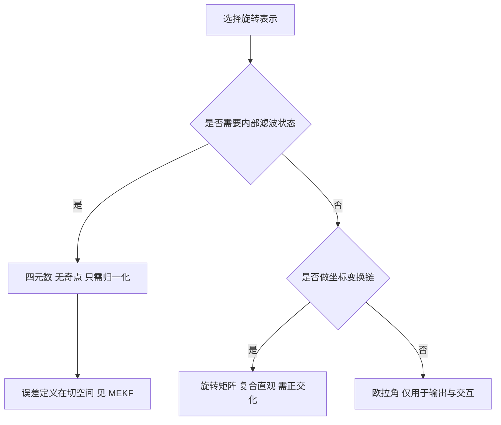

# 旋转表示与四元数运算

姿态估计的输出是一个三维旋转，但三维旋转不是三维向量：它的参数化方式有四种主流选择，各自在奇点、约束、插值与计算量上取舍不同。滤波器的状态定义、误差的定义、以及数值稳定性都取决于这个选择。选错表示时，滤波本身可能完全正确，输出却在某个姿态附近跳变或退化。

素材仓库从四种表示开始讲姿态估计（`03_sensor_algorithms/attitude_estimation/README.md`）。四元数乘法、共轭、向量旋转与归一化是后面所有滤波器的公共部分，实现细节影响滤波器的数值表现。

## 四种旋转表示的取舍

素材给出的对比表按维数、奇点、约束、插值、效率与适用场景六列展开（`README.md`）：

| 表示 | 维数 | 奇点 | 约束 | 插值 | 计算效率 | 适用 |
| --- | --- | --- | --- | --- | --- | --- |
| 欧拉角 | 3 | 有 | 无 | 困难 | 高 | 人机交互、可视化 |
| 旋转矩阵 | 9 | 无 | $R^{\mathsf T}R = I$ | 中等 | 中 | 坐标变换、DH 参数 |
| 四元数 | 4 | 无 | 范数为 1 | 容易，可用 SLERP | 高 | IMU 姿态与滤波 |
| 轴角 | 3 | 无 | 无 | 困难 | 中 | 流形优化、李群 |

维数与自由度的关系决定约束是否存在。欧拉角与轴角用三个参数表示三个自由度，参数空间与旋转流形之间存在拓扑阻碍，奇点不可避免；旋转矩阵与四元数用更多参数表示，参数空间大于流形，必须用约束把多余的自由度压掉。这条关系是姿态表示里最重要的结构性质，选择表示时先看能不能接受约束的维护成本。

计算效率一列与维数相反：欧拉角与四元数运算最少，旋转矩阵要多做矩阵乘，轴角要做三角函数。IMU 姿态估计用四元数的原因就在这里：它既没有奇点，运算量又低，约束只是一次归一化。

## 欧拉角与万向节死锁

ZYX 顺序的欧拉角把旋转写成三个基本旋转的乘积（`README.md`）：

$$
R = R_z(\psi) \, R_y(\theta) \, R_x(\phi)
$$

$\phi$、$\theta$、$\psi$ 分别是滚转、俯仰与偏航。当俯仰角 $\theta = \pm 90^{\circ}$ 时，滚转轴与偏航轴重合，两个参数描述同一个自由度，第三个自由度消失，这就是万向节死锁（`README.md`）。

死锁属于参数化的固有性质，与数值实现无关，换一个旋转顺序只会把死锁挪到另一个姿态。它的实际表现是：姿态接近死锁点时，两个欧拉角的数值剧烈变化而姿态本身连续，滤波器内部若用欧拉角做误差，增益放大与跳变会跟着出现。工程上的处理是只在输出与人机交互层使用欧拉角，内部一律用四元数或旋转矩阵。

## 旋转矩阵与正交化维护

旋转矩阵是三维特殊正交群 SO(3) 的元素（`README.md`）：

$$
R \in \mathbb{R}^{3 \times 3}, \qquad R^{\mathsf T} R = I, \qquad \det R = 1
$$

它的优点是向量旋转只是矩阵乘法 $v' = Rv$，没有奇点；缺点是九个参数表示三个自由度，数值积分后正交性会被破坏。维护方式有两种：每步用 Gram-Schmidt 重新正交化，或把修正后的矩阵投影回 SO(3)。两种方式都引入额外计算，且在多次迭代后可能累积偏差。

多传感器融合里旋转矩阵常用于坐标变换，因为变换链的复合就是矩阵连乘，方向定义直观。滤波器状态则很少直接用矩阵，原因就是上面那条约束维护成本。

## 四元数的定义与乘法

四元数乘法是姿态运算的基本操作，示意如下：

```python
# 示意：单位四元数乘法 q = [w, x, y, z]
def qmul(a, b):
    w1, x1, y1, z1 = a; w2, x2, y2, z2 = b
    return np.array([
        w1*w2 - x1*x2 - y1*y2 - z1*z2,
        w1*x2 + x1*w2 + y1*z2 - z1*y2,
        w1*y2 - x1*z2 + y1*w2 + z1*x2,
        w1*z2 + x1*y2 - y1*x2 + z1*w2,
    ])

def qnorm(q):
    return q / np.linalg.norm(q)          # 数值误差会让模长偏离 1
```

四元数用四个数表示三维旋转，比旋转矩阵省内存、比欧拉角少奇点，代价是乘法不满足交换律（先后顺序有意义）且需要周期性归一化。归一化不是可选项：连续乘法几百拍后模长会漂到 1 之外，此时"单位四元数"的假设失效，用它的旋转矩阵不再正交。

单位四元数写成（`README.md`）：

$$
q = \left[ \cos\frac{\theta}{2}, \; \sin\frac{\theta}{2} u_x, \; \sin\frac{\theta}{2} u_y, \; \sin\frac{\theta}{2} u_z \right]^{\mathsf T}
$$

$\theta$ 是旋转角，$u$ 是单位旋转轴，标量部分在前、向量部分在后。半角来自四元数与旋转矩阵的对应关系：$q$ 与 $-q$ 表示同一个旋转，因此单位四元数是 SO(3) 的双覆盖。

四元数乘法的四分量展开为（`README.md`）：

$$
(q_1 \otimes q_2)_w = q_{1w}q_{2w} - q_{1x}q_{2x} - q_{1y}q_{2y} - q_{1z}q_{2z}
$$

$$
(q_1 \otimes q_2)_x = q_{1w}q_{2x} + q_{1x}q_{2w} + q_{1y}q_{2z} - q_{1z}q_{2y}
$$

$y$ 与 $z$ 分量按右手循环轮换即可得到。乘法不满足交换律，顺序对应旋转的复合顺序：$q_1 \otimes q_2$ 表示先施加 $q_2$ 再施加 $q_1$（在固定坐标系下）。代码里顺序写错会表现为修正方向反了，姿态朝远离测量值的方向漂移。

## 向量旋转与代码实现的两个细节

单位四元数的共轭等于逆，用它把向量旋转写成共轭夹层 $v' = q \otimes v \otimes q^{*}$（`README.md`）。展开成纯乘加形式后不需要构造中间的 4 元组，直接由 $q$ 的分量算出结果（`README.md`）。

素材这份代码有两个实现细节需要注意。第一，函数开头算了一组 $v_x$、$v_y$、$v_z$、$w_x$、$w_y$、$w_z$，注释把它称为优化版本，但后面的 `result` 完全用另一套展开重算，前面那组只是死代码（`README.md`）。第二，第二套展开里出现的项与标准形式 $v' = v + 2w(u \times v) + 2u \times (u \times v)$ 等价，但项数多、可读性差；若担心漏项，可以改用叉积形式，运算次数更少也更容易核对。

$$
v' = v + 2w (u \times v) + 2 u \times (u \times v)
$$

其中 $w$ 是四元数标量部分，$u$ 是向量部分。这个形式只需要两次叉积与若干乘加，并且每一项的物理含义清楚：第二项是旋转轴方向的修正，第三项是轴向分量保持不变的结果。

## 归一化与数值退化

四元数更新会引入范数偏差，每步归一化是必需动作（`README.md`）。素材的实现先算范数，若小于 $10^{-12}$ 就返回单位四元数，否则各项除以范数。

这个阈值处理的是数值退化：范数接近零意味着四元数各分量都接近零，通常是积分步长过大或输入数据异常造成的。返回单位四元数相当于把状态重置为无旋转，是一种保守处理；另一种做法是保留上一个有效姿态。两种做法都比继续归一化安全，因为除以接近零的范数会产生无穷或极大值，把滤波器状态彻底破坏。

归一化的频率也有取舍。每步归一化最稳但多一次开方；每若干步归一化一次可以省计算，代价是范数偏差在步间累积，误差以姿态尺度的形式进入向量旋转。单精度浮点下，范数偏差每步约在 $10^{-7}$ 量级，数百步不归一化就会影响输出精度。




这条更新链是后面所有滤波器的骨架：互补滤波、Mahony 与 Madgwick 都在归一化之前插入各自的修正项，插入位置不同但前后顺序一致。

## 小结

### 核心概念

- 欧拉角与轴角是三维参数化，奇点不可避免；旋转矩阵与四元数是过参数化，需要用约束压掉多余自由度。
- 欧拉角在俯仰角 $\pm 90^{\circ}$ 处出现万向节死锁，只适合输出与交互层。
- 旋转矩阵无奇点但需要正交化维护，常用于坐标变换链。
- 单位四元数满足范数为 1，$q$ 与 $-q$ 表示同一旋转，乘法顺序对应旋转复合顺序。
- 向量旋转可用 $v' = v + 2w(u \times v) + 2u \times (u \times v)$ 展开；每步归一化是必需动作，范数接近零时应重置而不是继续除。

### 设计权衡

| 选择 | 带来的能力 | 付出的代价 |
| --- | --- | --- |
| 内部用四元数 | 无奇点、计算量低 | 需要每步归一化 |
| 用旋转矩阵做变换 | 复合与求逆直观 | 正交化维护成本 |
| 输出用欧拉角 | 人类可读 | 死锁点附近数值跳变 |
| 每步归一化 | 数值稳定 | 每步一次开方 |
| 保留双覆盖 | 表示范围完整 | 需要处理 $q$ 与 $-q$ 的等价 |

## 练习

### 基础题

1. 说明欧拉角与四元数在参数个数与自由度上的差别，并解释约束的必要性。
2. 写出 $q = [w, x, y, z]$ 旋转角 $\theta = 90^{\circ}$ 绕 $z$ 轴时的四元数分量。
3. 用叉积形式写出向量旋转表达式，并说明两项各自的物理含义。

### 挑战题

4. 取一个接近万向节死锁的姿态，比较欧拉角表示与四元数表示的姿态误差增益，说明死锁点附近的放大倍数。
5. 分析每步归一化与每十步归一化在单精度下的姿态误差，给出误差随步数增长的估算。
6. 说明 $q$ 与 $-q$ 的等价性对滤波器的姿态误差定义有什么要求，给出一种避免符号翻转的处理。

## 附：本页引用的路径

| 路径 | 用途 |
| --- | --- |
| `03_sensor_algorithms/attitude_estimation/README.md` | 素材仓库姿态估计单元根：四种表示、四元数基础运算与代码 |
| `docs/20-状态估计与信号处理/01-卡尔曼滤波KF·EKF·UKF` | 本站状态估计单元，误差状态与协方差维护 |
| `docs/07-姿态解算与 IMU/01-BMI088驱动` | 本站驱动单元，IMU 原始数据的读取与量程 |
| `docs/07-姿态解算与 IMU/03-Fusion AHRS` | 本站融合单元，工程侧姿态解的对照 |
| `~/robot_control_simulation` | 素材仓库根，正文中素材路径均相对该根 |
