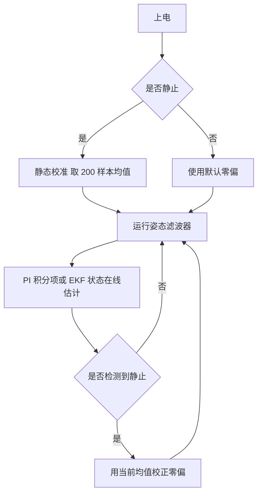

# 陀螺仪积分与零偏估计

姿态估计的高频通道来自陀螺仪积分。加速度计与磁力计给出的是绝对方向，但它们的带宽低、容易被运动加速度与磁干扰污染，因此只能在低频段做修正；姿态的短期变化必须靠角速度积分得到。这条分工决定了整个滤波器结构，也决定了两个误差源：积分漂移与零偏。

零偏是陀螺仪输出里与真实角速度无关的恒定或缓变分量。积分一秒钟的零偏就变成一度的角度误差，一分钟后变成六十度，因此任何长时间运行的姿态估计都必须处理它。误差模型、四元数积分的一阶与二步形式、从静态校准到在线估计的三条路径，共同决定了不同运行时长下的精度上限。

## 陀螺仪测量的误差模型

陀螺仪的输出模型是（`03_sensor_algorithms/attitude_estimation/README.md:483-495`）：

$$
\omega_{\text{meas}} = \omega_{\text{true}} + b_g + n_g
$$

$\omega_{\text{true}}$ 是真实角速度，$b_g$ 是零偏，$n_g$ 是均值为零的测量噪声。零偏并非常量，它是一个随机游走过程

$$
\dot{b}_g = n_b
$$

$n_b$ 是白噪声。这个模型把零偏的变化也写成随机过程，意味着它只能被估计到一个随时间增长的置信区间内，不能一次标定永久使用。

素材给出的 ICM-20948 典型参数是：角度随机游走 $\sigma_g = 0.012$ rad/s，零偏不稳定性 $\sigma_b = 5 \times 10^{-6}$ rad/s²，初始零偏范围 $\pm 0.05$ rad/s（`README.md:497-503`）。三个数对应三类误差：$\sigma_g$ 决定短时间积分的角度误差增长速率，$\sigma_b$ 决定零偏估计能维持多久，初始零偏决定静态校准的必要性。

零偏与噪声的区别在积分中的表现：噪声均值为零，积分后误差按 $\sqrt{t}$ 增长，长期被平均掉；零偏不为零，积分后误差按 $t$ 线性增长，任何平均都无法消除它。这就是静态校准只处理零偏、滤波只抑制噪声的原因。

## 四元数微分方程

角速度驱动的四元数变化率是（`README.md:167-180`）：

$$
\dot{q} = \frac{1}{2} q \otimes \omega
$$

其中 $\omega$ 作为纯四元数 $[0, \omega_x, \omega_y, \omega_z]$ 参与乘法。写成矩阵形式时出现一个反对称矩阵

$$
\Omega(\omega) = \begin{bmatrix}
0 & -\omega_x & -\omega_y & -\omega_z \\
\omega_x & 0 & \omega_z & -\omega_y \\
\omega_y & -\omega_z & 0 & \omega_x \\
\omega_z & \omega_y & -\omega_x & 0
\end{bmatrix}
$$

$\dot{q} = \frac{1}{2} \Omega(\omega) q$（`README.md:169-180`）。这个矩阵的反对称结构保证积分结果保持在单位四元数附近，是四元数适合做姿态积分的原因之一。

## 一阶离散与二步积分

一阶离散把微分方程直接前向欧拉（`README.md:182-198`）：

$$
q(t + \Delta t) = q(t) \otimes \left[ 1, \; \frac{\Delta t}{2}\omega_x, \; \frac{\Delta t}{2}\omega_y, \; \frac{\Delta t}{2}\omega_z \right]^{\mathsf T}
$$

注意第二个乘数是四元数而不是纯四元数：标量部分取 1 而不是 0。这个形式来自把 $q + \dot{q}\Delta t$ 合并成一次四元数乘法，实现上只需要一次乘法加一次归一化（`README.md:189-197`）。

一阶积分的误差是 $O(\Delta t^2)$ 每步。$\Delta t = 1$ ms、角速度 10 rad/s 时，单步姿态误差在 $10^{-5}$ 量级，1 kHz 下每秒累积约 $10^{-2}$ rad，对应半度。这个量级在短时任务里可以忽略，长时间运行仍然要靠绝对参考修正。

需要更高精度时用二步积分（`README.md:200-222`）：先取半步长的斜率 $k_1 = q \otimes [1, \frac{1}{2}\omega]$，用 $q + \Delta t k_1$ 得到中点姿态并归一化，再在同一点取斜率 $k_2$ 并更新。素材这份实现的两次斜率用的是同一个 $\omega$ 采样值，属于用预测器-校正器结构做二阶近似；完整的二阶龙格库塔需要在中点重新采样角速度，陀螺仪输出率足够高时两者差别很小（`README.md:200-222`）。

| 积分方法 | 每步误差 | 计算量 | 适用 |
| --- | --- | --- | --- |
| 一阶欧拉 | $O(\Delta t^2)$ | 一次四元数乘加归一化 | 一般姿态估计 |
| 二步同点校正 | 优于一阶 | 两次乘加归一化 | 角速度变化平缓 |
| 二阶龙格库塔 | $O(\Delta t^3)$ | 需要中点角速度采样 | 高动态、高精度 |

## 零偏的静态校准

最简单的零偏估计是静态校准：把传感器静置，采集一段时间的数据取平均（`README.md:505-528`）。素材的实现采集 200 个样本、间隔 5 ms，总时长 1 s，然后取三轴均值作为零偏。

平均 200 个样本把白噪声的标准差降低到 $1/\sqrt{200} \approx 1/14$。以 $\sigma_g = 0.012$ rad/s 计，平均后的残余噪声约 $8.5 \times 10^{-4}$ rad/s，积分 10 s 产生约 $8.5 \times 10^{-3}$ rad 即半度的误差。要再降低一个数量级需要约二十倍样本数或二十倍时长，收益递减，因此静态校准之后仍然需要在线估计处理零偏的缓慢变化。

校准的前提是传感器确实处于静止状态。设备上电时若正在运动，静态校准会把运动平均成一个错误的零偏，之后滤波器要用很长时间才能修回。稳妥做法是加一个静止判断，不满足就跳过校准并使用默认零偏（通用做法，素材给出的校准函数没有包含判断）。

## 在线估计的三条路径

素材列出三种在线零偏估计方法（`README.md:530-551`）：

| 方法 | 机制 | 优点 | 局限 |
| --- | --- | --- | --- |
| Mahony 的 PI 积分项 | 姿态误差经积分积累 | 实现简单，与滤波器合一 | 只估计与姿态误差相关的方向 |
| EKF 状态扩维 | 零偏作为状态并建随机游走模型 | 有协方差、可与其他量联合估计 | 状态维数上升，需要噪声参数 |
| 静止检测加校正 | 检测到静止时重新估计 | 简单、可与其他方法叠加 | 只在静止时有效 |

第一条的机制在 Mahony 滤波器里已经很自然：姿态误差的积分项在稳态时收敛到零偏，相当于用姿态参考反推陀螺仪零偏。第二条把零偏写进状态向量，用随机游走模型做预测，观测更新时由姿态残差修正它。第三条是前两条的补充，任何滤波器都可以在检测到静止时把当前角速度均值当作零偏重新赋值。

三条路径可以叠加使用：上电静态校准给出初始值，运行时用 PI 积分项或 EKF 状态继续估计，静止检测在两个估计都失效时提供一次校正。

## 静止检测的判据与抖动

素材给出的静止检测是判断角速度模长是否小于阈值（`README.md:544-551`）：

$$
\lVert \omega \rVert < \theta_{\text{th}} \cdot \frac{\pi}{180}
$$

阈值以度每秒给出，函数内部换算成弧度。判据只用陀螺仪数据，不依赖外部传感器，因此可以在任意阶段调用。

判据的抖动来自阈值附近的状态跳变。设备在运动中若角速度恰好落在阈值附近，检测结果会来回翻转，零偏估计随之被反复重置。缓解办法是加滞环：进入静止用一个阈值、退出静止用更低的阈值，或者要求连续若干拍都满足条件。素材的简单实现没有这一步（`README.md:544-551`），工程上建议补上。

另一个细节是零偏估计的更新速率。静止时可以把零偏直接赋值为当前读数均值，也可以按一阶滤波缓慢逼近，后者对短时静止更稳。若静止时间很短，直接赋值会把采样噪声写进零偏，反而不如不更新。

## 小结

### 核心概念

- 陀螺仪误差含零偏与白噪声：噪声积分后按 $\sqrt{t}$ 增长，零偏积分后按 $t$ 线性增长。
- 零偏是随机游走过程 $\dot{b}_g = n_b$，只能被估计到一定置信区间，需要在线更新。
- 四元数积分由 $\dot{q} = \frac{1}{2}q \otimes \omega$ 给出，一阶离散写成 $q \otimes [1, \frac{\Delta t}{2}\omega]$，标量部分取 1。
- 静态校准用 1 s 左右的静止数据取均值，残余噪声降到 $1/\sqrt{N}$，之后仍需在线估计。
- 在线估计有 PI 积分项、EKF 状态扩维与静止检测校正三条路径，可以叠加使用。

### 设计权衡

| 选择 | 带来的能力 | 付出的代价 |
| --- | --- | --- |
| 一阶积分 | 计算最少 | 累积误差 $O(\Delta t^2)$ 每步 |
| 二步积分 | 精度提高 | 每步两次乘加与归一化 |
| 静态校准 | 消除初始零偏 | 要求上电静止 |
| EKF 状态扩维 | 零偏有协方差、可联合估计 | 状态维数与噪声参数增加 |
| 静止阈值简单判定 | 实现短 | 阈值附近抖动 |

## 练习

### 基础题

1. 说明零偏与白噪声在积分后的误差增长规律，并解释为什么静态校准不能永久消除零偏。
2. 写出一阶四元数积分的乘数形式，说明标量部分为什么取 1。
3. 按 $\sigma_g = 0.012$ rad/s 计算静态校准 200 个样本后的残余噪声与积分 10 s 的角度误差。

### 挑战题

4. 比较一阶积分与二步积分在角速度 20 rad/s、$\Delta t = 2$ ms 下的单步误差，说明何时需要换用二步法。
5. 为静止检测设计一个带滞环的状态机，给出进入与退出阈值以及连续拍数要求，并分析误判代价。
6. 设计一个包含静态校准与 EKF 状态扩维的完整零偏估计流程，说明初始协方差与随机游走噪声参数的取法。

## 附：本页引用的路径

| 路径 | 用途 |
| --- | --- |
| `03_sensor_algorithms/attitude_estimation/README.md` | 素材仓库姿态估计单元根：陀螺仪积分与代码（:163-222）、零偏模型与估计（:479-551） |
| `docs/20-状态估计与信号处理/02-姿态估计/01-旋转表示与四元数运算.md` | 本站第一篇，四元数乘法与归一化 |
| `docs/20-状态估计与信号处理/01-卡尔曼滤波KF·EKF·UKF` | 本站状态估计单元，状态扩维与噪声参数 |
| `docs/07-姿态解算与 IMU/01-BMI088驱动` | 本站驱动单元，陀螺仪量程与原始数据换算 |
| `~/robot_control_simulation` | 素材仓库根，正文中素材路径均相对该根 |
