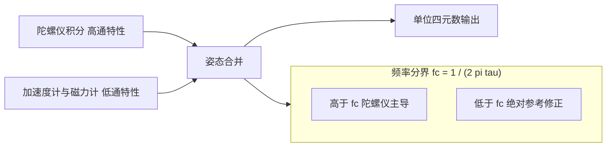
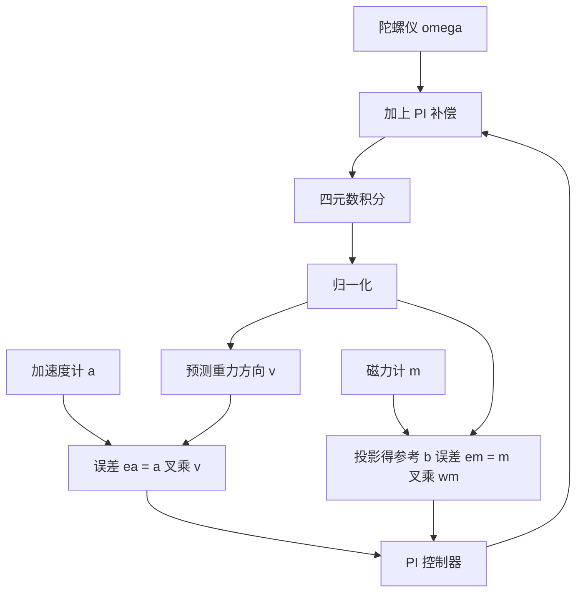

# 互补滤波与Mahony滤波器

陀螺仪积分在短时间内准确，长时间会漂移；加速度计与磁力计给出绝对方向，但噪声大、带宽低，还容易被运动加速度与磁干扰污染。两类传感器的误差特性在频域上恰好分开，把它们按频率加权合并就是姿态融合的基本思路。

互补滤波是最直接的实现，Mahony 滤波器则是这条思路在 SO(3) 上的严格版本：把姿态误差当作 PI 控制器的输入，输出接到角速度上。前者的优点是计算量极低，后者的优点是误差定义有几何意义、零偏可以被积分项吸收。素材代码里有几处实现细节会影响这两种滤波器的实际表现。

## 频域互补为什么可行

陀螺仪积分得到的是相对姿态，短时间精度高但对零偏积分后误差随时间线性增长，相当于一个高通特性：快速变化被准确跟随，缓慢偏差被保留。加速度计测量的是重力方向，长期平均准确，但瞬时值会被运动加速度污染，且输出噪声大，相当于一个低通特性（`03_sensor_algorithms/attitude_estimation/README.md:228-234`）。

两项误差的频段错开后，用高通滤波器处理陀螺仪通道、用低通滤波器处理加速度计通道再相加，总误差可以小于任一单通道。这条互补关系成立的代价是两条通道的截止频率必须一致，否则合并后的传递函数在某段频率既不平坦也不互补。

截止频率与时间常数的关系是 $f_c = 1/(2\pi\tau)$。$\tau = 1$ s 对应 0.16 Hz，$\tau = 0.1$ s 对应 1.6 Hz。频率高于 $f_c$ 的段由陀螺仪主导，低于 $f_c$ 的段由加速度计与磁力计修正。选择 $\tau$ 的过程就是选择这条分界线：分界线越低，长期漂移被压得越紧，但姿态对加速度计噪声的敏感区间也越大。

## 标量互补与alpha的取法

## 标量互补与alpha的取法

素材给出的合并式是（`README.md:232-234`）：

$$
q_k = \alpha \left( q_{k-1} \otimes \Delta q_{\text{gyro}} \right) + (1 - \alpha) q_{\text{accel}}
$$

$\Delta q_{\text{gyro}}$ 是陀螺仪在一步内的增量，$q_{\text{accel}}$ 是由加速度计方向恢复的姿态，$\alpha$ 按时间常数计算

$$
\alpha = \frac{\tau}{\tau + \Delta t}
$$

$\tau$ 取 0.1 到 5 s。$\tau$ 增大时 $\alpha$ 接近 1，滤波器更信任陀螺仪，姿态平滑但漂移修正变慢；$\tau$ 减小时修正变快，加速度计噪声与运动加速度被更多地带进输出。

这里有一个实现口径需要说明：上式对四元数的四个分量做线性加权再归一化，属于一阶近似，与四元数空间上的球面插值不同。两个姿态相差较小时两者几乎一致，相差较大时线性加权会偏离最短路径。互补滤波每次修正量很小，因此这个近似在正常情况下可以接受（`README.md:236-266` 的实现就是逐分量加权后归一化）。

## 从加速度计恢复姿态的失真

加速度计在静止时测量重力方向，可以由它反推滚转与俯仰：把测量向量归一化后与参考重力方向比较，得到两个角度。偏航无法由加速度计确定，因为绕重力轴的旋转不改变重力方向。

失真来自运动加速度。设备平动加速时，加速度计的输出是重力与平动加速度的合矢量，方向偏离重力方向，用合矢量反推的姿态因此错误。幅度上，平动加速度 1 m/s² 约等于 0.1 g，对应约 6 度的方向偏差；急停急启的四旋翼与快速运动的足式机器人都会遇到这个量级。素材把它列为常见问题之一，给出的处置是减小修正强度或增大观测噪声（`README.md:705-708`）。

工程上的两条缓解路径是：在检测到运动激烈时降低加速度计的修正权重，或者把加速度计数据先经过低通滤波，让快速变化的平动加速度被滤掉。两条路径都会减慢姿态修正，需要与漂移速度折中。

素材给出的低通形式是一阶递推 $a_{\text{filtered}} = 0.9 a_{\text{prev}} + 0.1 a_{\text{raw}}$（`03_sensor_algorithms/attitude_estimation/README.md:705`）。这个系数在 1 kHz 采样下对应的截止频率约 17 Hz，与素材建议的加速度计截止频率 10 到 20 Hz 一致（`README.md:701`）。系数越大滤波越强，姿态修正越慢，选择方法与互补滤波里的 $\tau$ 相同。

## Mahony的PI反馈结构

Mahony 滤波器把姿态误差送进 PI 控制器，输出补偿到角速度上（`README.md:271-279`）：

$$
\omega_{\text{comp}} = \omega_{\text{meas}} + k_p e + k_i \int e \, dt
$$

$e$ 是测量方向与预测方向的误差向量。与互补滤波的关键差别在这里：互补滤波直接混合两个姿态，Mahony 混合的是角速度，姿态始终由陀螺仪积分产生。这种做法保证输出姿态始终是单位四元数积分的自然结果，不会因为线性混合引入范数偏差。

误差向量的构造用叉积。预测重力方向由当前姿态旋转参考方向得到

$$
v = q \otimes [0, 0, 1] \otimes q^{*}
$$

测量方向 $a$ 与预测方向 $v$ 的叉积就是误差向量 $e_a = a \times v$（`README.md:303-309`）。叉积的模等于两个方向夹角的正弦，方向垂直于两者所在的平面，正好是修正所需的旋转轴。姿态估计准确时叉积接近零，PI 输出消失，滤波器退化为纯陀螺仪积分。

## 磁力计投影与误差构造

加入磁力计后可以观测偏航。步骤分四步（`README.md:313-321`）：把磁力计测量 $m$ 用当前姿态旋转到世界坐标 $h = q \otimes m$；把 $h$ 的垂直分量保留、水平分量用模长代替，得到参考磁场 $b = [0, \sqrt{h_x^2 + h_y^2}, h_z]$；把 $b$ 转回机体坐标 $w_m = q^{*} \otimes b$；测量与参考的叉积 $e_m = m \times w_m$ 就是偏航误差。

这个投影做的是把磁场的垂直分量当作已知、只保留水平分量：磁倾角随地理位置变化，若把测得的垂直分量也作为观测量，滤波器会把这个分量当作姿态信息，产生系统性偏差。用当地水平磁场强度代替可以避免这个问题。

总误差是两项之和 $e = e_a + e_m$（`README.md:323-324`），再送进 PI。磁力计误差的权重与加速度计相同，若磁干扰严重需要单独降低权重，素材的实现没有区分权重（`README.md:323-324`）。

## 参数整定与积分限幅

素材给出的初始建议是 $k_p = 0.5$、$k_i = 0$（`README.md:347-350`）。$k_p$ 增大时加速度计修正更快，但噪声被更多地带进角速度；$k_i$ 的积分项在稳态时收敛到陀螺仪零偏，因此开启 $k_i$ 后可以获得零偏估计能力，代价是积分项在剧烈机动时可能积累错误的零偏估计。

积分限幅是必需的。素材代码里写着限制积分器饱和，并留了 $0.5$ 的限值变量，但限幅语句本身是省略号占位，没有实际执行（`README.md:331-333`）。工程实现必须补上这一句：在积分更新之后把三轴积分值裁剪到 $\pm 0.5$ 之内。缺少限幅时，长时间单向误差会让积分项持续增长，姿态收敛变慢并在反向机动时出现超调。

另有一处接口不一致：函数注释写着「若无磁力计则传 NULL」，但参数是三个 float，代码用「三轴是否同时为零」来判断磁力计是否有效（`README.md:294-297` 与 `:314`）。这个判据在真实数据上不可靠，磁力计读数恰好为零的概率极低但也不是不可能，更好的做法是显式传入一个有效标志或单独提供一个只用加速度计的重载函数。

## 小结

### 核心概念

- 陀螺仪通道等效高通、加速度计与磁力计通道等效低通，频段错开后互补合并可以减小总误差。
- 标量互补按 $\alpha = \tau/(\tau + \Delta t)$ 逐分量加权再归一化，是球面插值的一阶近似。
- 加速度计只能恢复滚转与俯仰，运动加速度会造成方向偏差，1 m/s² 约对应 6 度。
- Mahony 用叉积构造姿态误差 $e = a \times v$，经 PI 输出补偿到角速度上，姿态始终由积分产生。
- 磁力计误差需要先把磁场投影到水平面，避免把磁倾角当作姿态信息；积分限幅必须实际执行。

### 设计权衡

| 选择 | 带来的能力 | 付出的代价 |
| --- | --- | --- |
| 互补滤波 | 计算量极低，适合无 FPU 平台 | 无零偏估计，偏航漂移 |
| 增大 $\tau$ | 输出平滑 | 漂移修正慢 |
| 减小 $\tau$ | 修正快 | 噪声与运动加速度被带入 |
| Mahony 加 PI | 积分项吸收零偏 | 需要限幅，剧烈机动时估计错误 |
| 用磁力计观测偏航 | 消除偏航漂移 | 受电机磁场干扰 |

## 练习

### 基础题

1. 说明互补滤波两条通道的频域特性，以及截止频率不一致时的后果。
2. 写出由加速度计恢复滚转与俯仰的步骤，说明偏航为什么无法确定。
3. 解释 Mahony 的误差向量为什么用叉积构造，叉积方向对应什么物理量。

### 挑战题

4. 分析线性加权四元数与球面插值在姿态差 30 度时的输出差别，给出归一化后的误差估计。
5. 设计一个在剧烈机动时自动降低加速度计权重的机制，给出检测量与权重曲线。
6. 为 Mahony 的积分项设计限幅与恢复策略，说明限幅值如何随零偏范围选取。

## 附：本页引用的路径

| 路径 | 用途 |
| --- | --- |
| `03_sensor_algorithms/attitude_estimation/README.md` | 素材仓库姿态估计单元根：互补滤波（:228-269）、Mahony 实现与整定（:271-350）、常见问题（:703-708） |
| `docs/20-状态估计与信号处理/02-姿态估计/01-旋转表示与四元数运算.md` | 本站第一篇，四元数乘法与向量旋转 |
| `docs/20-状态估计与信号处理/02-姿态估计/02-陀螺仪积分与零偏估计.md` | 本站第二篇，零偏的 PI 与 EKF 估计 |
| `docs/07-姿态解算与 IMU/03-Fusion AHRS` | 本站融合单元，工程实现侧的对照 |
| `~/robot_control_simulation` | 素材仓库根，正文中素材路径均相对该根 |
