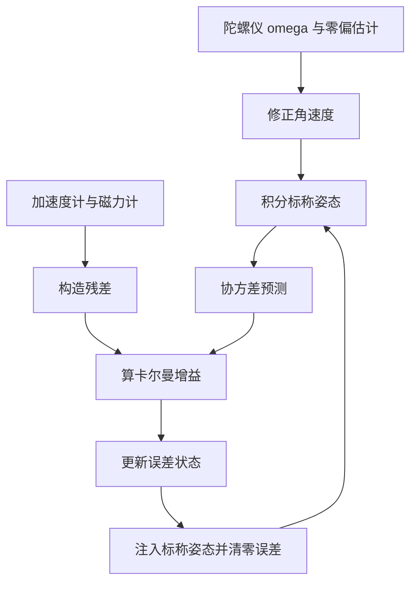

# Madgwick滤波器与MEKF

互补滤波与 Mahony 共用一条假设：绝对参考只在低频段可信，因此修正量必须小。这条假设在多数场景成立，但它没有回答一个更一般的问题：如何用带噪声的向量观测去最优地估计姿态。梯度下降与卡尔曼滤波给出了两条不同层次的答案。

Madgwick 滤波器把姿态估计写成一个最小化问题，用梯度下降在四元数空间里迭代一步，计算量接近互补滤波而收敛特性更好。MEKF 则把姿态误差与陀螺仪零偏作为状态，用协方差描述不确定性，在状态维数与计算量上升的同时给出统计意义上的最优估计。本页分别讲清两者的数学结构与参数口径，素材仓库的公式与代码是主要依据。

## 梯度下降在四元数空间的位置

Madgwick 的核心更新式是（`03_sensor_algorithms/attitude_estimation/README.md:354-365`）：

$$
\dot{q}_k = \frac{1}{2} q_k \otimes \omega_{\text{gyro}} - \beta \frac{\nabla f}{\lVert \nabla f \rVert}
$$

第一项是陀螺仪驱动的姿态变化率，与第二篇的四元数微分方程相同；第二项是梯度下降修正，方向是目标函数梯度的反方向，大小由步长 $\beta$ 控制。两项相加后积分一步，即得到新的姿态。

这个结构与 Mahony 的差别在修正项的来源。Mahony 的修正来自叉积误差经 PI 控制器的输出，本质是几何上的方向对齐；Madgwick 的修正来自目标函数的梯度，本质是数值优化。前者只有一个比例与一个积分增益，后者只有一个步长，但需要目标函数可导并写出梯度。

梯度归一化是必要的。不归一化时修正量的大小随误差大小变化，误差大的初始阶段修正过强、接近收敛时修正过弱；归一化后 $\beta$ 直接对应每步修正的角速度量级，参数含义清楚（`README.md:421-430`）。

## 目标函数与雅可比

加速度计部分的目标函数是让预测重力方向与测量方向重合（`README.md:367-371`）：

$$
f(q, a) = q^{*} \otimes g \otimes q - a = 0
$$

$g = [0, 0, 0, 1]$ 是参考重力方向，$a$ 是归一化后的加速度计测量。三个分量展开后得到（`README.md:402-404`）：

$$
f_1 = 2(q_x q_z - q_w q_y) - a_x
$$

$$
f_2 = 2(q_w q_x + q_y q_z) - a_y
$$

$$
f_3 = 2(0.5 - q_x^2 - q_y^2) - a_z
$$

第三式的常数 0.5 来自 $q_w^2 + q_z^2$ 在单位四元数约束下的替换，这样写可以省去一次平方运算。

梯度是雅可比的转置乘以残差 $J^{\mathsf T} f$，展开成四个分量后与陀螺仪项合并（`README.md:406-410`）。这一步的计算量主要来自 Jacobian 的 12 个元素与残差的三次乘法，总量与 Mahony 的叉积相当，因此两者在 MCU 上的耗时接近。

素材代码里的磁力计部分用省略号占位，没有给出梯度（`README.md:412-413`）。完整实现需要把参考磁场也写成 $\mathbb{R}^3$ 中的向量并对 $q$ 求导，梯度分量数与加速度计部分相同。若只做滚转与俯仰估计，省略磁力计部分不影响姿态收敛，但偏航会漂移（`README.md:706`）。

## 步长的取法与运动加速度

素材给出的步长范围是 0.02 到 0.5，推荐 0.1（`README.md:443-446`）。$\beta$ 增大时加速度计修正更快、初始收敛更快，但对加速度计噪声与运动加速度更敏感；$\beta$ 减小时修正变慢，姿态更依赖陀螺仪。

结构与互补滤波的时间常数一一对应：$\beta$ 相当于修正通道的带宽，$\tau$ 相当于低通时间常数，两者都描述绝对参考对姿态的影响强度。切换滤波器时可以用这个对应关系保持闭环特性不变。

运动加速度的处理与互补滤波一致：检测到激烈机动时降低 $\beta$。Madgwick 的原文建议用 $\beta$ 与一个与运动强度相关的缩放，或把修正项按残差大小加权，残差大时降低权重。素材给出的处置是「减小 $\beta$ 或增大观测噪声」（`README.md:707`），前者针对 Madgwick，后者针对 EKF 类滤波器。

## MEKF的误差状态定义

MEKF 的状态取误差而不是姿态本身（`README.md:448-461`）：

$$
x = [\delta\theta, \; b_g]^{\mathsf T}
$$

$\delta\theta \in \mathbb{R}^3$ 是小角度姿态误差，位于 SO(3) 在标称姿态处的切空间；$b_g \in \mathbb{R}^3$ 是陀螺仪零偏。状态维数 6，而直接估计四元数与零偏需要 7 维。

误差状态的定义解决了三个问题（`README.md:458-461`）。第一，状态维数从 7 降到 6，避免了四元数的单位范数约束出现在协方差里。第二，误差是小量，线性化在一阶意义下成立，协方差矩阵始终保持正定。第三，姿态的标称部分由陀螺仪积分维护，误差部分由观测修正，两者职责分开。

误差状态与标称姿态的合成是乘性的：

$$
q_{\text{true}} = q_{\text{nominal}} \otimes \delta q(\delta\theta)
$$

$\delta q$ 由小角度近似构造。这个乘法结构就是「乘性 EKF」名称的来源，也是它相对加性 EKF 的关键改进：加性更新直接对四元数分量做加法，会破坏单位范数约束，需要用归一化补偿，补偿本身又引入误差。

## 乘性更新的闭环过程

一个完整的 MEKF 周期包含四步。第一，用上一周期的零偏估计修正角速度，积分得到标称姿态。第二，按误差状态的线性化动力学推算误差协方差，过程噪声来自角度随机游走与零偏随机游走。第三，用加速度计与磁力计构造观测残差，计算卡尔曼增益，更新误差状态与协方差。第四，把误差状态注入标称姿态与零偏，再把误差状态清零。

第四步的注入与清零是乘性结构与加性结构的分界点。误差被吸收进标称量之后，滤波器回到误差为零的工作点，线性化始终在小误差附近有效，这也是「高更新率下姿态残差保持一阶」的原因（`README.md:461`）。若省略清零，误差状态会累积成大角，线性化失效。

零偏在滤波器中作为随机游走状态被持续更新（`README.md:536-540`），因此 MEKF 不需要单独的零偏估计模块。这也是它比 Madgwick 更适合长时间运行的原因：Madgwick 的零偏只能间接估计，MEKF 的零偏有明确的协方差与更新方程。

## 与UKF及互补滤波的成本对比

素材给出的五种滤波器对比（`README.md:465-475`，基于 STM32F411 100 MHz 实测）如下：

| 滤波器 | 状态维数 | 计算成本 | 零偏估计 | 磁力计 | 最佳 MCU |
| --- | --- | --- | --- | --- | --- |
| 互补滤波 | 4 | 低于 1 µs | 无 | 无 | M0、M3 |
| Mahony | 4 加 3 积分项 | 2 到 5 µs | 有，PI 积分项 | 有 | M3、M4F |
| Madgwick | 4 | 5 到 15 µs | 间接 | 有 | M3、M4F |
| MEKF | 6 | 15 到 40 µs | 有，状态量 | 有 | M4F、M7 |
| UKF | 7 以上 | 超过 50 µs | 有 | 有 | M7、Linux |

成本差别的来源是矩阵运算：互补滤波与 Madgwick 只有乘加，Mahony 多一组积分状态，MEKF 要做协方差预测与卡尔曼增益，UKF 要传播一组 sigma 点。选择依据是姿态精度需求与可用算力，具体口径在第五篇按机器人类型展开。

## 小结

### 核心概念

- Madgwick 的更新式是陀螺仪项减去归一化梯度乘以步长，修正项来自目标函数的数值优化而不是几何对齐。
- 加速度计目标函数 $f = q^{*} \otimes g \otimes q - a$ 的三个分量可以写成紧凑形式；梯度为 $J^{\mathsf T} f$，计算量与 Mahony 的叉积相当。
- 步长 $\beta$ 取 0.02 到 0.5，推荐 0.1，作用与互补滤波的时间常数一一对应。
- MEKF 用 6 维误差状态替代 7 维姿态加零偏状态，乘性更新保持单位范数约束与协方差正定。
- MEKF 每周期末把误差注入标称量并清零，线性化始终在小误差附近有效；零偏作为状态被持续更新。

### 设计权衡

| 选择 | 带来的能力 | 付出的代价 |
| --- | --- | --- |
| 用梯度下降修正 | 参数少、计算量接近互补滤波 | 需要写出并核对梯度 |
| $\beta$ 取大 | 初始收敛快 | 噪声与运动加速度敏感 |
| $\beta$ 取小 | 姿态平滑 | 漂移修正慢 |
| 用误差状态 | 维数 6、协方差正定 | 需要线性化与状态注入 |
| 用 MEKF 估计零偏 | 零偏有协方差、可联合估计 | 矩阵运算使成本上升数倍 |

## 练习

### 基础题

1. 写出 Madgwick 的更新式，说明两项各自的来源与量纲。
2. 由 $f = q^{*} \otimes g \otimes q - a$ 推导三个残差分量的紧凑形式，解释第三式里 0.5 的来源。
3. 说明 MEKF 的误差状态为什么是 6 维，以及乘性更新相比加性更新解决了什么问题。

### 挑战题

4. 推导加速度计部分的梯度 $J^{\mathsf T} f$，与素材代码的四个分量逐一核对，指出省略项的影响。
5. 把 Madgwick 的 $\beta$ 与互补滤波的 $\tau$ 建立定量对应关系，用阶跃响应说明两者的一致性。
6. 设计一个包含运动加速度检测的 MEKF 观测噪声自适应方案，给出检测量与噪声矩阵的调整曲线。

## 附：本页引用的路径

| 路径 | 用途 |
| --- | --- |
| `03_sensor_algorithms/attitude_estimation/README.md` | 素材仓库姿态估计单元根：Madgwick 公式与代码（:352-446）、MEKF（:448-461）、滤波器对比（:465-475）、常见问题（:703-708） |
| `docs/20-状态估计与信号处理/02-姿态估计/03-互补滤波与Mahony滤波器.md` | 本站第三篇，叉积误差与 PI 反馈 |
| `docs/20-状态估计与信号处理/01-卡尔曼滤波KF·EKF·UKF` | 本站状态估计单元，协方差预测与增益计算 |
| `docs/20-状态估计与信号处理/02-姿态估计/02-陀螺仪积分与零偏估计.md` | 本站第二篇，零偏随机游走模型 |
| `~/robot_control_simulation` | 素材仓库根，正文中素材路径均相对该根 |
