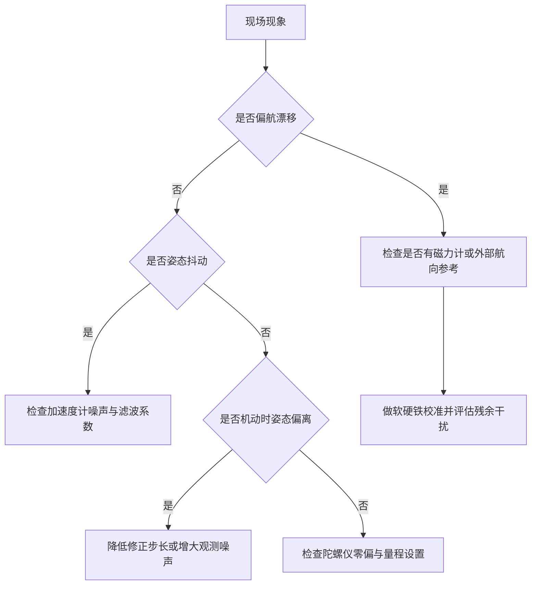
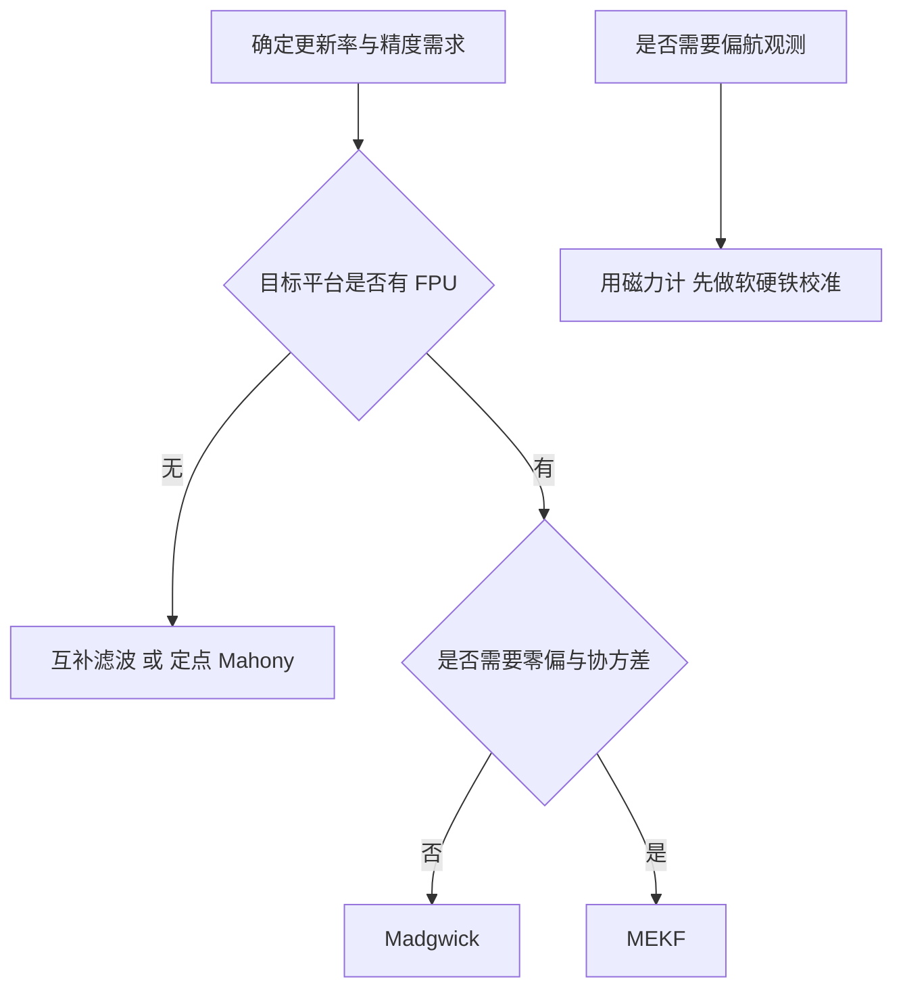

# 滤波器选型与工程问题

前四篇把表示方法、积分、互补滤波与 Mahony、Madgwick 与 MEKF 依次讲完。落到具体项目上还要回答一组工程问题：这个平台该用哪种滤波器、跑在哪一级 MCU 上、传感器量程与滤波频率怎么定、现场出现漂移或抖动时先查哪一项。这些问题没有统一的答案，但素材仓库给出了可以按图索骥的对照表。

对照关系可以分成四条：按机器人类型选滤波器、按 MCU 等级定实现方案、按传感器特性定量程与滤波、按现象定位原因。磁力计的软硬铁校准是偏航观测能否使用的先决条件。

## 选型的四个判据

选型可以写成一段判定骨架，示意如下：

```python
# 示意：按平台与资源选滤波器
if has_magnetometer and needs_global_yaw:
    f = "Mahony 或 Madgwick（带磁修正）"
elif mcu_has_fpu and state_dim <= 6:
    f = "EKF（雅可比可手写，成本可控）"
elif mcu_has_fpu and strong_nonlinearity:
    f = "UKF（每拍 2n+1 次函数评价，算力换精度）"
else:
    f = "互补滤波（纯加减乘，定点也能跑）"
```

"FPU"指浮点运算单元：有它时浮点乘加是硬件指令，没有时只能靠软件模拟定点运算，同样的滤波器要慢一个数量级以上。判据的顺序是先看需要什么样的观测（有没有磁力计、要不要全局偏航），再看资源（MCU 有没有 FPU、状态维数多大），最后才在同等资源下比较精度——本末倒置会让代码在目标平台上跑不动。

上一页的成本表给出五种滤波器的量化对比（`03_sensor_algorithms/attitude_estimation/README.md`），选型时把它折算成四个判据：

| 判据 | 需要看的数据 | 影响 |
| --- | --- | --- |
| 是否需要零偏估计 | 零偏估计一列 | 长时间运行必须处理 |
| 是否需要偏航 | 磁力计支持一列 | 无磁力计时偏航必然漂移 |
| 可用算力 | 计算成本一列 | 决定能否上 MEKF |
| 姿态精度要求 | 状态维数与适用场景 | 高精度场景需要协方差 |

四个判据按顺序使用：先确定是否需要零偏估计与偏航观测，再按这两个需求筛掉部分滤波器，最后在剩下的选项里按算力与精度取舍。顺序颠倒会出现「算力够但功能不足」或「功能够但跑不动」两类返工。

## 按机器人类型的推荐

素材给出的应用场景矩阵覆盖八类平台（`README.md`）：

| 机器人类型 | 推荐滤波器 | 传感器配置 | 更新率 | 特殊要求 |
| --- | --- | --- | --- | --- |
| 四旋翼无人机 | Mahony 或 MEKF | 六轴 IMU 加磁力计 | 400 到 1000 Hz | 低延迟关键 |
| 双足人形机器人 | MEKF 或 EKF | 六轴 IMU 加磁力计 | 100 到 200 Hz | 足部碰撞需异常检测 |
| 机械臂末端 | Madgwick 或 EKF | 六轴 IMU | 200 到 500 Hz | 无磁干扰环境 |
| 水下机器人 | EKF | IMU 加 DVL 与深度与磁力计 | 50 到 100 Hz | 磁力计不可靠 |
| 地面轮式机器人 | 互补滤波或 Mahony | 六轴 IMU | 100 Hz | 简单够用 |
| VR 与 AR 头显 | MEKF 或 UKF | IMU 加磁力计 | 1000 Hz | 极低延迟、高精度 |
| 平衡车与独轮车 | 互补滤波 | 六轴 IMU | 200 到 500 Hz | 只需滚转与俯仰 |
| 四足机器人 | MEKF | IMU 加磁力计加足端接触 | 200 到 400 Hz | 冲击鲁棒性 |

这张表里有两个模式需要注意。更新率与滤波器复杂度不总成正比：四旋翼用 Mahony 也能跑到 1000 Hz，因为它的姿态动态快、延迟敏感，简单滤波器反而合适；机械臂末端用 Madgwick 是因为工作环境里电机磁场会污染磁力计，偏航不可用。特殊要求一列往往比滤波器本身更决定实现方式，足端接触检测与冲击鲁棒性都要求在滤波之外增加逻辑。

## MCU平台与FPU要求

素材给出的平台对照是（`README.md`）：

| MCU 等级 | 推荐滤波器 | 理由 |
| --- | --- | --- |
| Cortex-M0 与 M0+ | 互补滤波 | 无 FPU，用定点或模拟单精度 |
| Cortex-M3 | Mahony 或 Madgwick | 无 FPU，72 MHz 下 Madgwick 约 50 µs |
| Cortex-M4F | Madgwick 或 MEKF | 单精度 FPU，MEKF 约 20 到 40 µs |
| Cortex-M7 | MEKF 或 UKF 或全 EKF | 双精度 FPU，可跑更复杂滤波器 |
| Cortex-A 与 Linux | 任意 | 算力充裕 |

FPU 的影响在素材里被单独强调（`README.md`）：互补滤波不需要 FPU，定点实现足够；Mahony 与 Madgwick 建议有 FPU，无 FPU 时速度慢约五倍；MEKF 与 UKF 必须有 FPU。这条差别来自运算类型：互补滤波是乘加与一次开方，定点可以覆盖；Mahony 的叉积与归一化需要三角函数与开方，定点实现要做大量缩放；MEKF 的矩阵运算与协方差更新在定点下的动态范围不够。

选平台时把滤波器成本与 MCU 的周期预算对照：M4F 上 MEKF 约 20 到 40 µs，1 kHz 更新占用 2% 到 4% 的主频预算，余量足够；M3 上 Madgwick 约 50 µs，1 kHz 占用 3.6%，但无 FPU 时同样算法会涨到 250 µs，接近预算上限。

## 传感器量程与采样率

素材给出的传感器配置要点有四条（`README.md`）：

| 项目 | 取值 | 依据 |
| --- | --- | --- |
| 加速度计量程 | $\pm 2g$ 到 $\pm 8g$ | 机器人最大运动加速度加余量 |
| 陀螺仪量程 | 一般 $\pm 500^{\circ}/s$ | 常规平台足够 |
| 陀螺仪量程（人形腿部） | $\pm 2000^{\circ}/s$ | 摆动腿角速度高 |
| 采样率 | 至少为系统带宽的 5 倍 | 保证相位损失可控 |
| 陀螺仪低通截止 | 20 到 40 Hz | 抑制结构振动 |
| 加速度计低通截止 | 10 到 20 Hz | 抑制高频运动加速度 |

量程与分辨率是一对矛盾：量程越大，同样的位数分到每个刻度的灵敏度越低。陀螺仪从 $\pm 500$ 度每秒换到 $\pm 2000$ 度每秒，量程扩大四倍，分辨率相应下降四倍，零偏与噪声的量化成分都会变差。因此量程按实际最大角速度选取，只在确实需要时提高。

采样率的判据是相位损失。滤波器在采样频率附近的相位滞后随频率上升，5 倍带宽对应约 11 度的相位损失，10 倍带宽降到约 6 度。姿态估计的环路对相位不敏感，但姿态反馈进控制回路后，这部分相位会占用控制器的相位裕度，因此采样率不能只按估计精度定。

## 四类现场问题的成因与处置

素材列出的常见问题有四项（`README.md`），逐项对应不同的处理：

| 现象 | 成因 | 处置 |
| --- | --- | --- |
| 加速度计噪声过大 | 测量噪声进入修正通道 | 加一阶低通，系数约 0.9 |
| 偏航漂移 | 无绝对航向参考 | 使用磁力计或外部航向源 |
| 运动加速度干扰 | 平动加速度被当作重力方向 | 减小步长或增大观测噪声 |
| 磁力计干扰 | 电机电流与铁磁结构产生磁场 | 软硬铁校准 |

前两条是能力问题，后两条是干扰问题。能力问题必须从传感器配置上解决：偏航漂移无法靠调参消除，只能引入磁力计、视觉或轮式里程计等外部参考。干扰问题的处理是降低对应通道的权重，代价是修正变慢，因此需要在机动强度与漂移速度之间折中。

姿态估计的调试顺序建议先看陀螺仪单独积分的漂移量，再加加速度计修正，最后加磁力计。每一步都能单独复现，出问题时归因清晰。若一开始就打开三个通道，噪声、零偏与磁干扰三类误差混在一起，很难定位。

## 磁力计的软硬铁校准

磁力计的误差分两类（`README.md`）。硬铁误差来自固定的磁性材料与电流产生的恒定磁场，表现为测量值整体偏移一个常向量；软铁误差来自导磁材料改变磁场分布，表现为测量椭球被拉伸与旋转。未校准时磁力计的方向误差可达数十度，比姿态滤波器的收敛误差大一个量级。

校准的做法是把传感器绕各个方向旋转，采集一组覆盖全方向的样本，然后拟合椭球：硬铁是椭球中心偏移，取样本均值即可；软铁是椭球的形状，由样本协方差矩阵分解得到。校准后的读数是

$$
m_{\text{cal}} = \text{soft\_iron}^{-1} \left( m_{\text{raw}} - \text{hard\_iron} \right)
$$

素材给出的实现框架只写了注释与步骤（`README.md`），实际使用时需要选择椭球拟合算法。工程上常见的简化是只用硬铁校准，即减去三轴均值；这对偏移大、形变小的场合已经能明显改善偏航估计，软件复杂度也低。

车载与机载场合的磁干扰会随电机电流变化，静态校准只能修正固定部分。缓解办法有三种：把磁力计装在远离电机与大电流回路的位置；在电机电流变化时降低磁力计权重；或用电流传感器在线估计干扰量。三种办法的实际效果取决于结构设计，通常需要先做静态校准再评估残余误差。





## 小结

### 核心概念

- 选型按四个判据排序：是否需要零偏估计与偏航、可用算力、精度要求。
- 场景矩阵给出八类平台的推荐滤波器与更新率，特殊要求往往比滤波器本身更决定实现方式。
- FPU 是关键分界：互补滤波可定点，Mahony 与 Madgwick 建议有 FPU，MEKF 与 UKF 必须有 FPU。
- 传感器量程按实际最大角速度选取，采样率至少是系统带宽的 5 倍，陀螺仪低通取 20 到 40 Hz、加速度计取 10 到 20 Hz。
- 偏航漂移与运动加速度干扰分别属于能力问题与干扰问题，处置路径不同；磁力计校准分硬铁与软铁两部分。

### 设计权衡

| 选择 | 带来的能力 | 付出的代价 |
| --- | --- | --- |
| 互补滤波跑无 FPU 平台 | 成本极低 | 无零偏估计、无偏航观测 |
| M4F 上 MEKF | 零偏与姿态联合估计 | 占用 2% 到 4% 周期预算 |
| 陀螺仪量程取大 | 覆盖高角速度机动 | 分辨率与零偏量化变差 |
| 采样率取带宽 5 倍 | 相位损失可控 | 中断负担上升 |
| 只用硬铁校准 | 实现简单 | 软铁形变未处理 |

## 练习

### 基础题

1. 按四个判据说明平衡车与四旋翼分别适合哪种滤波器。
2. 计算 M4F 上 MEKF 在 1 kHz 更新率下占用的主频百分比，并说明余量是否足够。
3. 说明偏航漂移为什么无法通过调参消除，列出两种可行方案的代价。

### 挑战题

4. 为一个四足机器人设计姿态估计方案：选定滤波器与更新率，给出传感器配置与冲击鲁棒性措施。
5. 推导硬铁校准的均值估计在样本含软铁形变时的偏差，说明只用硬铁校准的适用范围。
6. 设计一套姿态估计的验证流程：从静态漂移、阶跃机动、磁干扰三个场景给出记录量与判断标准。

## 附：本页引用的路径

| 路径 | 用途 |
| --- | --- |
| `03_sensor_algorithms/attitude_estimation/README.md` | 素材仓库姿态估计单元根：滤波器对比、场景矩阵、MCU 选型、工程经验 |
| `docs/20-状态估计与信号处理/02-姿态估计/04-Madgwick滤波器与MEKF.md` | 本站第四篇，成本表与状态维数 |
| `docs/07-姿态解算与 IMU/01-BMI088驱动` | 本站驱动单元，量程配置与原始数据换算 |
| `docs/07-姿态解算与 IMU/03-Fusion AHRS` | 本站融合单元，工程侧实现对照 |
| `~/robot_control_simulation` | 素材仓库根，正文中素材路径均相对该根 |
