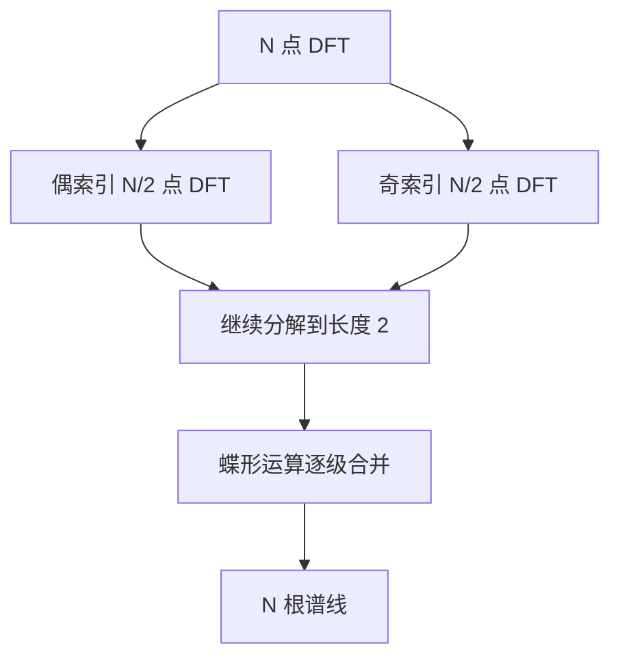
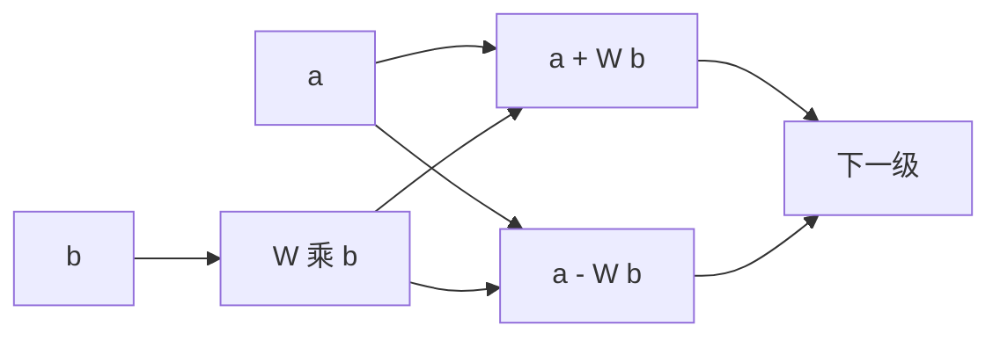

# DFT与Radix-2 FFT的推导

振动、电流、力与声音这几类传感器信号的价值大量藏在频域里。轴承的故障特征频率、齿轮的啮合频率、电机转子断条产生的边带、机械结构的共振峰，在时域波形上只是形状略有不同的曲线，在频谱上却是位置明确、幅值可比的几根谱线。要在嵌入式设备上做这类判断，就要把时域序列变换到频域。

变换的数学定义是离散傅里叶变换（DFT），它的直接计算量是 $N^2$，在机器人常用的 $N = 64$ 到 1024 上开销过高。Cooley-Tukey 算法把 DFT 递归分解成两个半长的 DFT，计算量降到 $N \log N$，这就是快速傅里叶变换（FFT）。下面推导这条分解，说明蝶形运算与旋转因子的作用，并给出复杂度与适用规模。

## 从传感器时域信号到频谱

时域给出的是幅值随时间的变化。周期性成分在时域表现为波形的重复，判断它是否存在、周期多长、幅值多少，需要额外的检测逻辑；多个周期成分叠加时，时域判断的难度迅速上升。频谱把信号分解成一组不同频率的正弦分量，每个分量对应一根谱线，位置是频率、高度是幅值，判定规则变成「某频率附近是否有超阈值的峰」。

这个转换对采样有两个前提。第一，采样率必须满足奈奎斯特条件 $f_s > 2 f_{\max}$，否则高频成分会折叠到低频，频谱上的峰出现在错误的位置。第二，分析时长决定了频率分辨率，短窗无法区分两个接近的频率。两个前提都在下面的频率 bin 一节里量化。

素材仓库把 FFT 的典型应用列为振动分析、电机故障检测、力控系统滤波与其他四类（`03_sensor_algorithms/fft/README.md:60-91`），它们的共同点是关心特定频率的成分而不是波形的整体形状。

## DFT的定义与逆变换

长度为 $N$ 的序列 $x[n]$ 的 DFT 定义为（`README.md:7-11`）：

$$
X[k] = \sum_{n=0}^{N-1} x[n] \, e^{-j 2\pi k n / N}, \qquad k = 0, 1, \dots, N-1
$$

指数项可以展开成余弦与正弦的组合 $e^{-j2\pi kn/N} = \cos(2\pi kn/N) - j \sin(2\pi kn/N)$，因此 $X[k]$ 是复数，实部与虚部分别对应余弦分量与正弦分量的系数。

逆变换把频谱还原成时域序列（`README.md:13-15`）：

$$
x[n] = \frac{1}{N} \sum_{k=0}^{N-1} X[k] \, e^{j 2\pi k n / N}
$$

逆变换与正变换的差别只有指数符号与前面的 $1/N$ 系数。这个对称性让同一段代码可以复用：改变旋转因子的符号并加缩放的系数即可。

## 频率bin与可观测范围

第 $k$ 根谱线对应的频率是

$$
f_k = k \frac{f_s}{N}, \qquad k = 0, 1, \dots, \frac{N}{2}
$$

相邻谱线的间隔就是频率分辨率 $\Delta f = f_s / N$（`README.md:259-263`）。$k = 0$ 是直流分量，$k = N/2$ 对应奈奎斯特频率 $f_s/2$；由于实信号的频谱共轭对称，$k > N/2$ 的部分与前半段重复，因此实际可用的谱线只有 $N/2 + 1$ 根。

分辨率由采样率与点数共同决定。素材给出的对照表显示，$f_s = 1$ kHz 时 $N = 64$ 对应 15.6 Hz、$N = 256$ 对应 3.91 Hz；$f_s = 10$ kHz 时同样点数的分辨率放大十倍（`README.md:265-268`）。提高分辨率的办法是增大 $N$ 或降低采样率，后者受奈奎斯特条件限制，前者让计算量按 $N \log N$ 增长（`README.md:270-272`）。

一个容易混淆的点是「补零不提高分辨率」。补零只是让谱线在频域上插值更密，真实的频率分辨能力由有效数据时长 $N/f_s$ 决定。要分辨两个相隔 5 Hz 的峰，有效窗长必须超过 0.2 s，补零无法替代。

## Cooley-Tukey的奇偶分解

Cooley-Tukey 算法的出发点是旋转因子的周期性与对称性，做法是按奇偶索引把序列一分为二（`README.md:19-31`）：

$$
X[k] = \sum_{m=0}^{N/2-1} x[2m] \, e^{-j 2\pi k (2m)/N} + \sum_{m=0}^{N/2-1} x[2m+1] \, e^{-j 2\pi k (2m+1)/N}
$$

第一个和式里的指数可以写成 $e^{-j 2\pi k m/(N/2)}$，正好是半长序列的 DFT 核。把偶索引子序列的 DFT 记为 $E[k]$、奇索引子序列的 DFT 记为 $O[k]$，并定义旋转因子 $W_N^k = e^{-j2\pi k/N}$，上式化为

$$
X[k] = E[k] + W_N^k \, O[k]
$$

利用 $W_N^{k + N/2} = -W_N^k$ 这一对称性，还能同时得到后半段的谱线

$$
X\left[k + \frac{N}{2}\right] = E[k] - W_N^k \, O[k]
$$

两条式子合起来说明：一个 $N$ 点 DFT 可以由两个 $N/2$ 点 DFT 加上一次复数乘法和两次复数加法得到。递归下去，直到子序列长度为 1，DFT 退化为恒等运算，整棵分解树的叶子就是原始样本。

## 蝶形运算与旋转因子

分解到最底层后，合并过程由蝶形运算完成（`README.md:35-45`）。输入两个复数 $a$、$b$ 与旋转因子 $W$，输出是

$$
a' = a + W b, \qquad b' = a - W b
$$

一次蝶形包含一次复数乘法（$Wb$）与两次复数加法，结构上是一进两出、两路交叉，画出来像蝴蝶，因此得名。一个 $N$ 点 radix-2 分解共有 $\frac{N}{2}\log_2 N$ 个蝶形，$N = 64$ 时是 192 个（`README.md:45`）。

旋转因子的性质是分解成立的原因。周期性 $W_N^{k+N} = W_N^k$ 让分解出来的子 DFT 可以复用同一张旋转因子表；对称性 $W_N^{k+N/2} = -W_N^k$ 让后半段谱线不必单独计算。这两条性质把旋转因子的存储需求压到 $N/2$ 个复数以内，同时把复数乘法的次数降到蝶形个数。

## 复杂度与适用规模

两种算法的运算次数对比如下（`README.md:47-56`）：

| 方法 | 乘法次数 | 加法次数 | $N = 64$ 时 |
| --- | --- | --- | --- |
| DFT 直接计算 | $N^2$ | $N(N-1)$ | 4096 与 4032 |
| Radix-2 FFT | $\frac{N}{2}\log_2 N$ | $N \log_2 N$ | 192 与 384 |

$N = 64$ 时 FFT 的乘法次数是直接计算的二十三分之一。$N$ 增大后差距继续拉开：$N = 1024$ 时直接计算要一百万次乘法量级，FFT 只需约五千次。

| $N$ | DFT 乘法 | FFT 乘法 | 倍数 |
| --- | --- | --- | --- |
| 64 | 4096 | 192 | 约 21 |
| 256 | 65536 | 1024 | 约 64 |
| 1024 | 1048576 | 5120 | 约 205 |

radix-2 的前提是 $N$ 为 2 的幂。点数不是 2 的幂时可以用混合基或 Bluestein 算法，复杂度与实现难度都上升，嵌入式场景通常直接把点数取到最近的 2 的幂。

## 实数输入的对称性利用

加速度计、电流采样、力传感器给出的都是实序列。实序列的 DFT 满足共轭对称

$$
X[k] = X^{*}[N-k]
$$

后半段谱线是前半段的共轭，只需要计算 $N/2 + 1$ 个频率点（`README.md:125-135`）。CMSIS-DSP 与 KissFFT 都提供实数优化接口（arm_rfft_f32 与 kiss_fftr），把计算量与内存减半。机器人场景里的输入绝大多数是实数，选型时优先用实数接口，只有在需要同时处理两路实信号时才用复数接口打包复用（通用做法，素材只给出实数接口的用法）。

## 小结

### 核心概念

- DFT 把长度 $N$ 的时域序列变换成 $N$ 个复数谱线，逆变换只差指数符号与 $1/N$ 系数。
- 第 $k$ 根谱线对应频率 $k f_s / N$，频率分辨率 $\Delta f = f_s / N$，实信号可用谱线为 $N/2 + 1$ 根。
- Cooley-Tukey 按奇偶索引分解，利用 $X[k] = E[k] + W_N^k O[k]$ 与 $W_N^{k+N/2} = -W_N^k$ 得到前后半段谱线。
- 蝶形运算每级包含一次复数乘法与两次复数加法，总数 $\frac{N}{2}\log_2 N$，$N = 64$ 时为 192。
- 复杂度从 $O(N^2)$ 降到 $O(N \log N)$；实输入用共轭对称可把计算量再减半。

### 设计权衡

| 选择 | 带来的能力 | 付出的代价 |
| --- | --- | --- |
| 用 FFT 替代直接 DFT | 计算量大幅下降 | 需要 $N$ 为 2 的幂 |
| $N$ 取大 | 频率分辨率提高 | 计算量与内存按 $N \log N$ 增长 |
| 降低采样率提高分辨率 | 不需要增大 $N$ | 受奈奎斯特条件限制 |
| 用实数接口 | 计算量与内存减半 | 无法直接处理双路复数输入 |
| 补零 | 谱线更密、便于观察 | 不提高真实分辨率 |

## 练习

### 基础题

1. 写出 DFT 与 IDFT 的定义，指出两者的差别。
2. 已知 $f_s = 2$ kHz、$N = 512$，计算频率分辨率与奈奎斯特频率。
3. 说明旋转因子的周期性与对称性各在分解中起了什么作用。

### 挑战题

4. 推导 $X[k+N/2] = E[k] - W_N^k O[k]$，说明它为什么能省去一半计算。
5. 计算 $N = 256$ 时 FFT 与直接 DFT 的乘法次数之比，并估算在 100 MHz 单精度 MCU 上的耗时差距。
6. 说明补零为什么不能提高频率分辨率，给出一个用有效窗长判断能否分辨相隔 5 Hz 两个峰的例子。

## 附：本页引用的路径

| 路径 | 用途 |
| --- | --- |
| `03_sensor_algorithms/fft/README.md` | 素材仓库 FFT 单元根：应用一览（:60-91）、DFT 与分解（:5-56）、实数优化（:125-135）、频率分辨率（:259-272） |
| `docs/20-状态估计与信号处理/01-卡尔曼滤波KF·EKF·UKF` | 本站状态估计单元，时域滤波与频域分析的对照 |
| `docs/20-状态估计与信号处理/02-姿态估计/05-滤波器选型与工程问题.md` | 本站姿态单元第五篇，滤波截止频率的选取 |
| `~/robot_control_simulation` | 素材仓库根，正文中素材路径均相对该根 |
