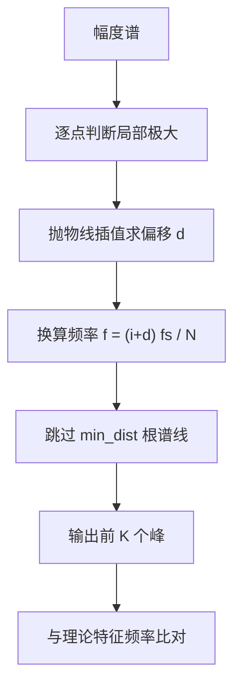

# 振动分析与电机故障检测

频谱拿到之后要回答的是「哪根谱线代表什么」。频谱上的每个峰都对应一个物理来源：转子转频、啮合频率、轴承故障特征频率、结构共振，或者传感器与电源引入的干扰。诊断的工作是把峰的位置换算成物理量，与理论特征频率比对，再看幅值是否超过阈值。

素材仓库列出了振动分析与电机故障检测两类应用各自的特征频率公式（`03_sensor_algorithms/fft/README.md`），这些公式都需要机械参数与转速，这些量来自铭牌与转速测量，不属于 FFT 本身能给出的信息。

## 振动信号里要找什么

振动信号来自加速度计或陀螺仪，反映的是机械部件的运动状态。素材把振动分析的目标归为三类（`README.md`）：轴承故障检测、齿轮啮合分析、共振频率识别。

三类的区别在频率来源。轴承与齿轮的特征频率由结构与转速决定，属于确定性成分，位置可预测；共振频率由结构的质量与刚度决定，与转速无关，需要扫频或冲击激励才能激发。共振一旦被激发，振动幅值会放大数倍，因此识别共振峰是结构设计验证的重要环节。

判读的基础是转速。特征频率都是转速的整数倍或与转速相关的组合，转速测量误差会按比例传递到频率判断上。若转速未知，也可以用频谱上最强的低频成分反推转频，但需要先排除电源频率与工频干扰。

## 轴承故障的特征频率

轴承内外圈与滚动体的故障频率由几何参数算出，示意如下（参数为滚珠数 n、滚珠直径 d、节径 D、接触角 α）：

```python
# 示意：轴承故障特征频率（fr 为轴转频）
ratio = (d / D) * np.cos(alpha)
bpfo = (n / 2) * fr * (1 - ratio)      # 外圈故障
bpfi = (n / 2) * fr * (1 + ratio)      # 内圈故障
bsf  = (D / (2 * d)) * fr * (1 - ratio ** 2)   # 滚动体自转
ftf  = (fr / 2) * (1 - ratio)          # 保持架
```

诊断的做法是把频谱峰位换算成频率、与这些理论特征频率比对，并检查边带结构：外圈故障的频率通常稳定，内圈故障因为随轴旋转会伴随转频边带，调制关系是区分两者的关键。只看"有没有峰"容易误报——结构共振、齿啮合与电源干扰都会在频谱上留下峰，所以判读要结合转速与负载工况。

滚动轴承有四组特征频率（`README.md`）：

| 特征频率 | 含义 | 物理来源 |
| --- | --- | --- |
| BPFO | 外圈通过频率 | 外圈滚道缺陷与滚子依次接触 |
| BPFI | 内圈通过频率 | 内圈滚道缺陷 |
| BSF | 滚子自转频率 | 滚子表面缺陷 |
| FTF | 保持架频率 | 保持架与滚子组的不均匀 |

四组频率都由轴承几何参数与转速决定，各自在频谱上表现为一根基频谱线加上若干谐波。缺陷严重时基频两侧出现边带，边带间隔等于转频，这是区分单点缺陷与分布缺陷的依据。

工程判据通常看趋势而不是单次是否出现峰：同一特征频率的幅值在数天或数周内是否持续上升。单次测量受负载、转速与安装状态影响，绝对阈值容易误报，趋势判断更可靠。

## 齿轮啮合与边带调制

齿轮的啮合频率由齿数与转速给出（`README.md`）：

$$
f_{\text{mesh}} = f_{\text{shaft}} \times N_{\text{teeth}}
$$

啮合频率本身在任何正常齿轮上都存在，它反映的是轮齿依次接触的固有节律。诊断关注的是它两侧的边带：边带间隔为转频或其整数倍，边带幅值上升表示该齿轮的啮合刚度出现周期性调制，通常对应齿面磨损、偏心或断齿。

边带宽度与调制深度有关。轻微磨损产生对称的小边带，偏心产生的边带一侧强一侧弱。用第一对边带与啮合主峰的幅值差作为指标，可以量化调制强度，这个差值的单位是 dB，与前面窗函数旁瓣衰减用同一量纲。

## 电机电流频谱的三类故障特征

对电机相电流做 FFT 可以得到电气侧的诊断信息。素材给出三类特征（`README.md`）：

| 故障 | 特征频率 | 参数含义 |
| --- | --- | --- |
| 转子断条 | $f_{sb} = f_s (1 \pm 2s)$ | $f_s$ 供电频率，$s$ 转差率 |
| 定子绕组故障 | $f_{st} = f_s (k/p \pm 1)$ | $k$ 谐波次数，$p$ 极对数 |
| 气隙偏心 | $f_{ecc} = f_s \pm k f_r$ | $f_r$ 转子机械频率 |

三类特征的共同点是都在供电频率附近形成边带，边带间隔与转差率或转子频率相关。转子断条在 $(1 - 2s)f_s$ 处的边带最典型，$s$ 随负载变化，因此判读时需要同步测量转速或估计转差率。

电流频谱对采样率的要求比振动低：关注频率在数百赫兹以内，$f_s$ 取 5 到 10 kHz 即可，$N$ 取大一些提高分辨率。电流信号通常叠加了 PWM 开关噪声，采样前需要模拟低通，否则开关频率会折叠到关注频段。

## 力控系统中的谐振与陷波

力与力矩传感器的信号处理也用 FFT，但用途偏设计（`README.md`）：通过频域乘窗再逆变换设计低通或带通 FIR 滤波器；识别机械谐振并把它滤除；为自适应陷波滤波器提供参数估计。

谐振识别与振动分析的差别在信号来源。力控的谐振出现在力闭环内部，与执行器、连杆与传感器的动力学相关，频率随负载变化；振动分析的频率相对固定。因此力控里的陷波频率往往需要在线估计，做法是在频谱上找幅值最高的窄峰，把它的中心频率送给陷波器。

频域设计 FIR 的流程是：给出期望幅频响应，做逆 FFT 得到冲激响应，加窗截断到需要的阶数。截断会产生纹波，窗的选择与前一页相同。机器人力控的采样率通常高于 1 kHz，滤波器阶数受限于计算量，常用 8 到 32 阶。

## 峰值搜索的实现口径

频谱诊断的第一步是从幅度谱里找出峰值。素材给出的实现包含三个要点（`README.md`）：结构体记录频率、幅值与 bin 索引；三点比较判断局部极大；抛物线插值把频率细化到 bin 以下。

判据是中间点同时大于左右两点：

$$
m[i] > m[i-1] \quad \text{且} \quad m[i] > m[i+1]
$$

抛物线插值给出峰值相对 bin 中心的偏移

$$
d = \frac{m[i+1] - m[i-1]}{2 \left( 2m[i] - m[i-1] - m[i+1] \right)}
$$

峰值频率是

$$
f = (i + d) \cdot \frac{f_s}{2n}
$$

其中 $n$ 是幅度谱长度，实输入时 $n = N/2$，因此 $f_s/(2n) = f_s/N$，与第一篇的频率 bin 间隔一致。$d$ 的取值范围在 $-1$ 与 $1$ 之间，插值后的频率精度可以提高一个数量级。

搜索循环里还有一个细节：检出峰值后跳过 $min\_dist$ 根谱线，避免同一个峰群被重复计入（`README.md`）。这个参数要按主瓣宽度设置：Hann 窗的主瓣占两个 bin，跳过距离取 2 到 3 比较合适。



## 判读边界与误报来源

频谱诊断有四类常见误报来源。第一是转速误差，特征频率按比例偏移，转速估错 5% 就可能把转频的谐波误判为轴承特征。第二是谐波混叠，结构共振或电气谐波落在同一频段。第三是窗与分辨率不足，两根相近谱线合并成一根，幅值与位置都失真。第四是采样率与模拟滤波不足，高频噪声折叠到关注频段。

处理顺序是先确认采样链正确（奈奎斯特、模拟低通、量程），再确认转速与机械参数，再看谱线位置，最后看幅值趋势。幅值判据要配合基线数据使用，单次测量只能给出定性结论。素材给出的特征频率公式是判读的理论依据，具体阈值需要按设备与工况建立基线（按工程通用做法，素材未给出阈值）。


## 小结

### 核心概念

- 振动分析的目标是轴承故障、齿轮啮合与结构共振三类频率成分，判读基础是转速。
- 轴承有四组特征频率：BPFO、BPFI、BSF、FTF，单点缺陷在基频两侧产生间隔为转频的边带。
- 齿轮啮合频率为 $f_{\text{shaft}} \times N_{\text{teeth}}$，诊断关注两侧边带的幅值。
- 电机电流频谱的三类特征分别是转子断条、定子绕组故障与气隙偏心，均表现为供电频率附近的边带。
- 峰值搜索用三点比较加抛物线插值，频率精度可细化到 bin 以下，并需设置最小间隔避免重复检出。

### 设计权衡

| 选择 | 带来的能力 | 付出的代价 |
| --- | --- | --- |
| 用特征频率判据 | 故障定位有理论依据 | 需要准确的转速与机械参数 |
| 用边带幅值 | 量化调制强度 | 受分辨率与窗影响 |
| 抛物线插值 | 频率精度提高一个数量级 | 需要相邻三点均有效 |
| 最小间隔跳过 | 避免同峰重复检出 | 间隔过大漏掉邻近峰 |
| 用趋势判据 | 减少误报 | 需要长期基线数据 |

## 练习

### 基础题

1. 列出轴承的四组特征频率并说明各自对应的缺陷位置。
2. 已知转频 25 Hz、齿数 40，计算啮合频率；若边带间隔为 25 Hz 说明什么。
3. 写出峰值搜索的三点判据与抛物线插值公式，说明 $d$ 的取值范围。

### 挑战题

4. 为滚动轴承建立 BPFO 与 BPFI 的计算式，说明需要哪些几何参数，并分析参数误差对判读的影响。
5. 设计一个自适应陷波器：从频谱估计谐振频率，给出陷波器系数的更新步骤与稳定性检查。
6. 说明转子断条特征频率随转差率移动时，如何用固定 $N$ 的 FFT 稳定检出它，给出两种方案。

## 附：本页引用的路径

| 路径 | 用途 |
| --- | --- |
| `03_sensor_algorithms/fft/README.md` | 素材仓库 FFT 单元根：振动与电机应用、峰值搜索实现 |
| `docs/20-状态估计与信号处理/03-FFT与振动分析/02-加窗与实时流式频谱.md` | 本站第二篇，加窗与主瓣宽度 |
| `docs/20-状态估计与信号处理/03-FFT与振动分析/04-嵌入式实现与选型.md` | 本站第四篇，实现方案与性能基准 |
| `~/robot_control_simulation` | 素材仓库根，正文中素材路径均相对该根 |
