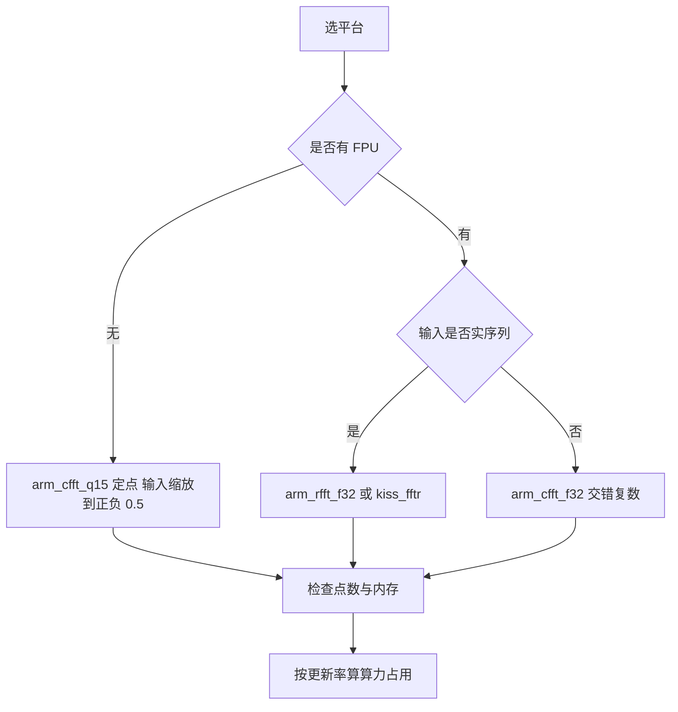

# 嵌入式实现与选型

算法推导完之后，嵌入式实现要回答三个问题：用哪个库、数据在内存里怎么排、无 FPU 时精度怎么保。这三个问题的答案互相牵连：库决定了接口与内存布局，FPU 的有无决定了用浮点还是定点接口，而定点接口又要求输入信号先缩放，缩放因子反过来影响能检测的最小信号。

素材仓库给出三条实现路线（CMSIS-DSP、KissFFT、定点 Q15）与一组 MCU 实测基准（`03_sensor_algorithms/fft/README.md:94-199` 与 `:282-299`）。接口、内存、精度、性能四条线的取舍决定了选型。

## CMSIS-DSP的接口与内存布局

CMSIS-DSP 是 ARM 官方的优化库，对 Cortex-M4 及以上有 FPU 与 SIMD 优化（`README.md:96-98`）。使用分三步：声明实例结构体、初始化点数、执行变换（`README.md:102-117`）：

$$
\text{arm\_cfft\_init\_f32}(\&S, N)
$$

$$
\text{arm\_cfft\_f32}(\&S, pSrc, \text{ifftFlag}, \text{bitReverseFlag})
$$

实例结构体内部保存旋转因子表与点数，初始化阶段分配一次，运行时不再分配。$N$ 必须是库支持的点数（radix-2 或 radix-4 组合），错误点数会在初始化时返回失败状态。

输入数组按实部虚部交错排列（`README.md:119-123`）：

$$
pSrc = [\operatorname{Re}(x_0), \operatorname{Im}(x_0), \operatorname{Re}(x_1), \operatorname{Im}(x_1), \dots]
$$

对实输入来说，虚部全部填零，数组长度是 $2N$ 个浮点数。这个布局与复数运算的通用性一致，但内存占用是实数存储的两倍，$N = 1024$ 时占 8 KB（单精度）。

调用参数里有两个标志位：ifftFlag 选择正变换或逆变换，bitReverseFlag 选择是否做位反序。位反序把时域样本按二进制位翻转的顺序重排，是 radix-2 就地算法的前置步骤。CMSIS-DSP 支持自动位反序，调用时传 1 即可；关掉它可以省掉重排但与库内部的输入顺序约定不符（`README.md:111-113`）。

## 实数接口与共轭对称

实输入的频谱满足共轭对称，只需要 $N/2 + 1$ 根谱线。CMSIS-DSP 为此提供实数接口（`README.md:125-135`）：

$$
\text{arm\_rfft\_fast\_init\_f32}(\&R, N), \qquad \text{arm\_rfft\_fast\_f32}(\&R, pSrc, pFreq, 0)
$$

实数接口把 $N$ 个实样本打包成 $N/2$ 个复数做一次半长复数 FFT，再用旋转因子把结果还原成 $N/2 + 1$ 根谱线，计算量与内存都减半。机器人场景的输入几乎全是实序列，加速度计、电流、力与声音都属于这一类，因此实数接口是默认选择。

输出数组的长度是 $N/2 + 1$ 个复数，即 $2(N/2 + 1)$ 个浮点数。KissFFT 的实数接口输出长度同样是 $N/2 + 1$，$N = 64$ 时是 35 个复数（`README.md:164-174`）。

## KissFFT的跨平台用法

KissFFT 是纯 C 实现，没有平台依赖，适合 Linux 与 MCU 共用同一份算法代码（`README.md:137-139`）。标准用法分四步（`README.md:141-162`）：

| 步骤 | 调用 | 说明 |
| --- | --- | --- |
| 分配配置 | kiss_fft_alloc(N, 0) | 0 表示正变换 |
| 填充输入 | 逐点写实部与虚部 | 交错或结构体数组 |
| 执行变换 | kiss_fft(cfg, fin, fout) | 就地或换地 |
| 释放 | free(cfg) 等 | 三块内存都要释放 |

这条路径的代价是动态内存。素材的示例用 malloc 分配配置与输入输出缓冲（`README.md:145-147`），在带操作系统的平台上没有问题，在 MCU 上会引入堆碎片与不可预测的分配时间。KissFFT 的分配接口支持由调用方提供内存块，可以把配置与工作缓冲放在静态数组里，运行时不再调用 malloc（通用做法，素材示例未展开这一用法）。机器人固件推荐用后者。

## 定点实现的动态范围

无 FPU 的 MCU（Cortex-M0、M3）使用 Q15 定点接口（`README.md:177-197`）：

$$
\text{arm\_cfft\_init\_q15}(\&S_{q15}, N), \qquad \text{arm\_cfft\_q15}(\&S_{q15}, pSrc, \text{ifftFlag}, \text{bitReverseFlag})
$$

Q15 用一位符号加十五位小数表示 $[-1, 1)$ 区间的数，分辨率是 $2^{-15} \approx 3.05 \times 10^{-5}$（`README.md:193-197`）。两个 Q15 数相乘得到 Q30 结果，需要左移一位去掉多余的符号位才能存回 Q15；蝶形运算里的加法会增长位宽，若不缩放输入，多级累加后会溢出。

素材给出的溢出保护做法是把输入信号缩放到 $[-0.5, 0.5)$（`README.md:197`）。这个缩放留出一倍余量覆盖蝶形加法的增长，代价是可用动态范围减半：分辨率不变但满量程减半，等效信噪比下降 6 dB。若关注的是频率位置而不是微小幅值，这个代价可以接受；若要检测低幅值谱线，应当改用带 FPU 的平台或分块缩放（块浮点）。

定点与浮点的耗时差别在 3 到 5 倍量级（`README.md:274-278`）。这个倍数说明无 FPU 平台的方案不仅速度慢，还直接决定了能处理的最大点数与实时性。选型时先看算法是否必须定点，再看点数能否满足分辨率需求。

## MCU性能基准

素材引用的实测数据如下（`README.md:282-296`，$N = 64$ 与 $N = 256$，arm_cfft_f32）：

| MCU | 架构 | 主频 | $N = 64$ | $N = 256$ | FPU |
| --- | --- | --- | --- | --- | --- |
| STM32F411 | Cortex-M4F | 100 MHz | 152 µs | 823 µs | 单精度 |
| ESP32 | Xtensa LX6 | 240 MHz | 75 µs | 420 µs | 单精度 |
| STM32H743 | Cortex-M7 | 480 MHz | 23 µs | 128 µs | 双精度 |
| STM32G031 | Cortex-M0+ | 64 MHz | 520 µs（Q15） | 未给出 | 无 |
| RP2040 | Cortex-M0+ | 133 MHz | 310 µs（Q15） | 未给出 | 无 |

两点读法。第一，$N$ 从 64 增到 256 时耗时约增长 5.4 倍，与 $N \log N$ 的比例吻合（$256 \times 8 / (64 \times 6) \approx 5.3$）。第二，无 FPU 平台只用 Q15 数据，M0+ 上 64 点 FFT 要 310 到 520 µs，比同级的 M4F 慢一个数量级，与 3 到 5 倍的估算相比更差，原因是主频更低且没有 SIMD。

## 实时性判断与算力预算

实时性判断的公式是

$$
T_{\text{FFT}} \times f_{\text{update}} < 1
$$

$f_{\text{update}}$ 是频谱更新率。以 50% 重叠、$f_s = 1$ kHz、$N = 256$ 为例，更新率是 $2 f_s / N = 7.8$ Hz，STM32F411 每次 823 µs，占用率约 0.64%；STM32H743 每次 128 µs，占用率约 0.1%。两台平台都能轻松满足（`README.md:296`）。

反过来说，$N = 1024$、$f_s = 20$ kHz 的高分辨率振动监测更新率是 39 Hz，M4F 上每次 FFT 约 4 ms，占用率超过 15%，还需要叠加加窗、幅值计算与峰值搜索的开销。这种配置下要重新评估点数、重叠比例与平台等级三项。

算力预算要把 FFT 之外的步骤算进去：加窗是 $N$ 次乘法，幅值谱是 $N/2$ 次开方（可用平方代替比较），峰值搜索是 $N/2$ 次比较。这些步骤的合计开销通常小于 FFT 本身，但加窗的三角函数若不查表会显著增加开销，实现时通常预计算窗表。

## 选型建议与对应关系

素材给出的选型对照如下（`README.md:460-469`）：

| 场景 | 推荐方案 | 理由 |
| --- | --- | --- |
| STM32 M4F 与 M7 | CMSIS-DSP arm_cfft_f32 | 硬件优化、随库提供 |
| ESP32 | ESP-DSP 或 KissFFT | ESP-DSP 有优化版本 |
| Linux 加 ARM | KissFFT 或 FFTW | FFTW 速度最快但体积大 |
| 无 FPU 的 MCU | arm_cfft_q15 定点 | 无硬件 FPU 必须定点 |
| 实时流处理 | arm_rfft_f32 加乒乓缓冲 | 实数优化与无锁切换 |
| 分辨率优先 | 增大 $N$ 加 KissFFT | 大 $N$ 需要更灵活的内存管理 |

按这张表选型之后，还要回到第一篇的两条前提检查：采样率是否满足奈奎斯特条件、点数是否为 2 的幂。前者决定频谱是否有效，后者决定能否用 radix-2 以及内存与耗时的规模。

## 小结

### 核心概念

- CMSIS-DSP 用实例结构体保存旋转因子表，初始化一次；输入按实部虚部交错排列，长度为 $2N$。
- 实输入用 arm_rfft_f32 或 kiss_fftr，计算量与内存减半，输出 $N/2 + 1$ 根谱线。
- KissFFT 无平台依赖但默认用 malloc，MCU 上应改用调用方提供的内存块。
- Q15 定点分辨率约 $3.05 \times 10^{-5}$，乘法后需左移一位，输入缩放到 $[-0.5, 0.5)$ 防止蝶形溢出。
- 实测耗时随 $N \log N$ 增长；M4F 上 256 点约 823 µs，M7 上 128 µs，无 FPU 的 M0+ 上 64 点 Q15 要 310 到 520 µs。

### 设计权衡

| 选择 | 带来的能力 | 付出的代价 |
| --- | --- | --- |
| 用实数接口 | 计算量与内存减半 | 只能处理实输入 |
| 用 CMSIS-DSP | 平台优化、随库提供 | 绑定 ARM 与库版本 |
| 用 KissFFT | 跨平台、代码可移植 | 需要自管内存分配 |
| 用 Q15 定点 | 无 FPU 平台可运行 | 动态范围减半、耗时增数倍 |
| 提高重叠比例 | 更新率上升 | 算力占用按比例增加 |

## 练习

### 基础题

1. 写出 CMSIS-DSP 复数 FFT 的三步调用，说明输入数组的排列方式与长度。
2. 说明实数接口为什么能减半计算量，并给出 $N = 128$ 时输出谱线的根数。
3. 计算 Q15 分辨率与 $[-0.5, 0.5)$ 缩放后的等效满量程，说明信噪比的损失。

### 挑战题

4. 按 $N = 512$、$f_s = 5$ kHz、50% 重叠，计算 STM32F411 与 STM32H743 上的算力占用，判断哪台能满足 20% 以内的预算。
5. 设计一套块浮点 FFT 的缩放策略，在保持动态范围的同时避免蝶形溢出，给出每级缩放因子的确定方法。
6. 为振动监测设计完整的数据通路：从传感器采样、加窗、FFT、幅值谱到峰值搜索，逐级给出内存与耗时预算。

## 附：本页引用的路径

| 路径 | 用途 |
| --- | --- |
| `03_sensor_algorithms/fft/README.md` | 素材仓库 FFT 单元根：CMSIS-DSP 与实数接口（:96-135）、KissFFT（:137-175）、定点（:177-197）、FPU 需求（:274-278）、MCU 基准（:282-296）、选型建议（:460-469） |
| `docs/20-状态估计与信号处理/03-FFT与振动分析/01-DFT与Radix-2 FFT的推导.md` | 本站第一篇，复杂度与实数对称性 |
| `docs/20-状态估计与信号处理/03-FFT与振动分析/02-加窗与实时流式频谱.md` | 本站第二篇，重叠窗口与更新率 |
| `~/robot_control_simulation` | 素材仓库根，正文中素材路径均相对该根 |
