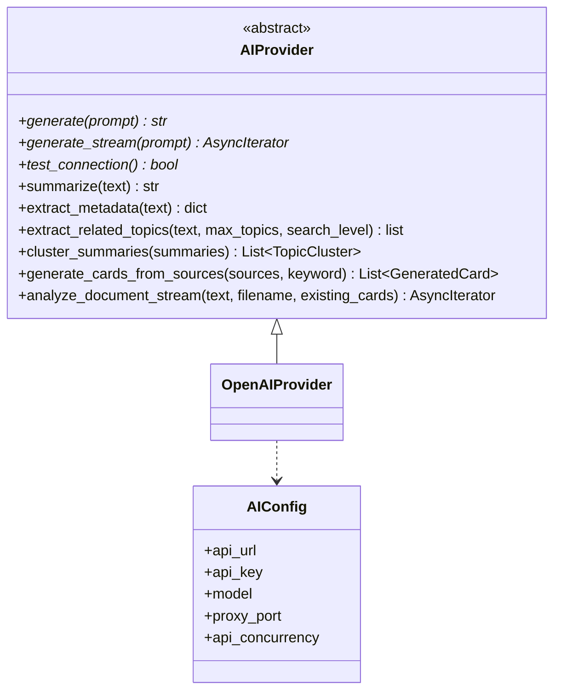

# Provider 抽象与配置加载

换一家模型服务商时，如果每处调用都直接 import SDK，改动会散落在流水线、文档分析与改进策略里。这个仓库的做法是把调用收进一个对象：AI Provider。它负责把一段提示词发出去，把模型返回的文本或流取回来，切换服务商只改配置与实现类，上层代码不动——代价是抽象一旦定义得不合适，所有实现都要迁就它。

抽象层的设计有一个明显的分层：三条方法必须实现，其余九条带默认实现，默认实现直接抛“未实现”。因此一个最小可用的 Provider 只要能对话、能流式对话、能测连通性就够了；摘要、翻译、聚类属于可选扩展。

## 三个数据模型

Provider 文件里先定义三个 Pydantic 模型（`backend/ai/provider.py`）。Pydantic 是数据校验库，字段用类型标注声明，实例化时自动检查类型与必填：

| 模型 | 字段 | 用途 |
| --- | --- | --- |
| `AIConfig` | 服务地址、密钥、模型名、备注、代理端口、并发数 | 构造客户端 |
| `TopicCluster` | 主题名、来源索引列表、描述 | 聚类结果 |
| `GeneratedCard` | 标题、正文、来源索引、标签、置信度 | 生成卡片 |

`AIConfig` 的前三个字段没有默认值，注释写明它们必须由配置加载层显式提供。后面三个有默认值：模型备注为空字符串、代理端口为 0、并发数为 10。没有默认值的字段是必填项，缺了就无法构造客户端。

`TopicCluster` 的 `source_indices` 用的是整数索引，指向传入的摘要列表位置。`GeneratedCard` 的 `confidence` 默认 0.5，与质量评分里“缺数据取中性值”的做法一致。

## 三条必选接口

必选接口用抽象基类（ABC）声明，未实现的子类在实例化或调用时就会失败，而不是等到上线才暴露：

```python
# 示意：三条必选接口的声明形式
class AIProvider(ABC):
    @abstractmethod
    async def chat(self, messages, **kw) -> str: ...
    @abstractmethod
    async def chat_stream(self, messages, **kw) -> AsyncIterator[str]: ...
    @abstractmethod
    async def health_check(self) -> bool: ...
```

抽象基类把"必须实现什么"变成语言层面的约束：忘记实现时实例化直接报错。可选能力用带默认实现的方法声明，默认实现抛"未实现"，这样调用方可以统一用`try`兜底，而不必逐个检查`hasattr`。

`AIProvider` 继承抽象基类，三条带装饰器的方法是硬约束（`provider.py`）：

```python
@abstractmethod
async def generate(self, prompt: str, **kwargs) -> str: ...
@abstractmethod
async def generate_stream(self, prompt: str, **kwargs) -> AsyncIterator[str]: ...
@abstractmethod
async def test_connection(self) -> bool: ...
```

`generate` 返回完整文本，`generate_stream` 逐个片段产出，`test_connection` 返回布尔值。注意前两条都带 `**kwargs`，抽象层没有规定额外参数的语义——具体实现可以自行解释，调用方需要知道自己在用哪个实现。

## 九条可选能力

其余方法都有默认实现，统一抛 `NotImplementedError`（`provider.py`）：

| 方法 | 语义 | 关键参数 |
| --- | --- | --- |
| `summarize` | 纯摘要 | — |
| `summarize_with_metadata` | 摘要加元数据，合并为一次调用 | — |
| `extract_metadata` | 只抽元数据 | — |
| `extract_related_topics` | 抽取相关主题 | 最多主题数、搜索层级 |
| `translate_to_chinese` | 翻成中文 | — |
| `cluster_summaries` | 摘要聚类 | 摘要列表 |
| `generate_cards_from_sources` | 多来源生成卡片 | 来源列表、关键词 |
| `generate_cards_from_sources_stream` | 流式版本 | 同上 |
| `analyze_document_stream` | 文档分析出三层卡片 | 正文、文件名、已有卡标题 |

注释里给出了文档分析输出的形状：一个主卡片加若干章节卡片（`provider.py`）。这条注释是调用方拼接 JSON 的契约来源，因为流式接口只产出文本片段，完整结构要靠调用方解析。



## 配置从哪来

配置加载只有一个函数（`backend/ai/config.py`），从全局配置模块取出五个常量，组装成 `AIConfig`：

```python
def load_config() -> AIConfig:
    return AIConfig(
        api_url=AI_API_URL,
        api_key=AI_API_KEY,
        model=AI_MODEL,
        proxy_port=AI_PROXY_PORT,
        api_concurrency=AI_CONCURRENCY,
    )
```

模块注释写明环境变量优先于全局默认值，优先级逻辑在 `backend.config` 里，本模块只做搬运。`AIConfig` 的 `model_note` 字段没有被填，保持默认空字符串——这一项当前不在加载路径上。

| 配置项 | 来源常量 | 影响 |
| --- | --- | --- |
| 服务地址 | `AI_API_URL` | 客户端 base_url |
| 密钥 | `AI_API_KEY` | 鉴权 |
| 模型名 | `AI_MODEL` | 每次请求的 model |
| 代理端口 | `AI_PROXY_PORT` | 配置层使用 |
| 并发数 | `AI_CONCURRENCY` | 构造全局限流器 |


## 包对外暴露什么

`backend/ai/__init__.py` 导出五个名字：配置模型、抽象基类、两个数据模型以及具体实现 `OpenAIProvider`（`backend/ai/__init__.py`）。因此上层只需要 `from backend.ai import AIProvider, OpenAIProvider` 就能拿到抽象与实现，不必知道文件布局。

导出具体实现意味着包初始化时会导入 `openai` SDK。如果某个环境只想用抽象而不装 SDK，导入这个包会失败。这是便利性与可裁剪性之间的取舍，当前选择偏向便利。

## 易错点

1. 认为九条可选能力都可用。默认实现直接抛异常。
2. 构造 `AIConfig` 时漏掉前三个字段。它们没有默认值。
3. 认为 `generate` 与 `generate_stream` 的额外参数有统一语义。
4. 把 `model_note` 当必填。当前不在加载路径上。
5. 认为配置优先级在本模块。它在全局配置模块。
6. 导入 `backend.ai` 却未安装 SDK。包初始化会连带导入实现。

## 小结

### 核心概念

| 概念 | 取值或做法 | 来源 |
| --- | --- | --- |
| 必选接口 | generate、generate_stream、test_connection | `backend/ai/provider.py` |
| 可选能力 | 九条，默认抛未实现 | — |
| 配置模型 | 三必填加三默认 | — |
| 聚类结果 | 主题名、来源索引、描述 | — |
| 生成卡片 | 标题、正文、来源索引、标签、置信度 | — |
| 配置加载 | 从全局常量组装 | `backend/ai/config.py` |
| 包导出 | 抽象、实现与三个模型 | `backend/ai/__init__.py` |

### 设计权衡

| 决策 | 收益 | 代价 |
| --- | --- | --- |
| 必选接口只留三条 | 新实现成本低 | 可选能力运行时才暴露缺失 |
| 可选方法抛未实现 | 接口完整、可静态检查 | 调用方需自行捕获 |
| 配置集中在全局模块 | 环境变量优先级统一 | 本模块看不出覆盖规则 |
| 包导出具体实现 | 使用方便 | 强制依赖 SDK |

## 练习

### 基础题

1. 列出三条必选接口与九条可选能力，说明分界依据。
2. 写出 `AIConfig` 六个字段与各自的默认情况。
3. 说明配置加载的输入与输出。

### 挑战题

4. 设计一个只实现必选接口的最小 Provider，用于测试环境，说明它如何处理可选调用。
5. 把 `generate` 的额外参数语义标准化，给出兼容现有调用的方案。
6. 讨论把实现类移出包导出、改为显式导入的影响与迁移步骤。

### 附：本页引用的路径

| 路径 | 用途 |
| --- | --- |
| `backend/ai/provider.py` | 抽象基类与数据模型 |
| `backend/ai/config.py` | 配置加载 |
| `backend/ai/__init__.py` | 包导出 |
| `backend/config` | 全局配置常量来源 |
