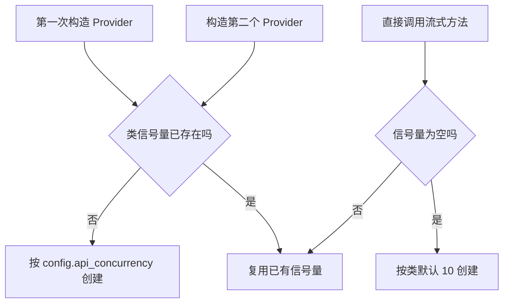
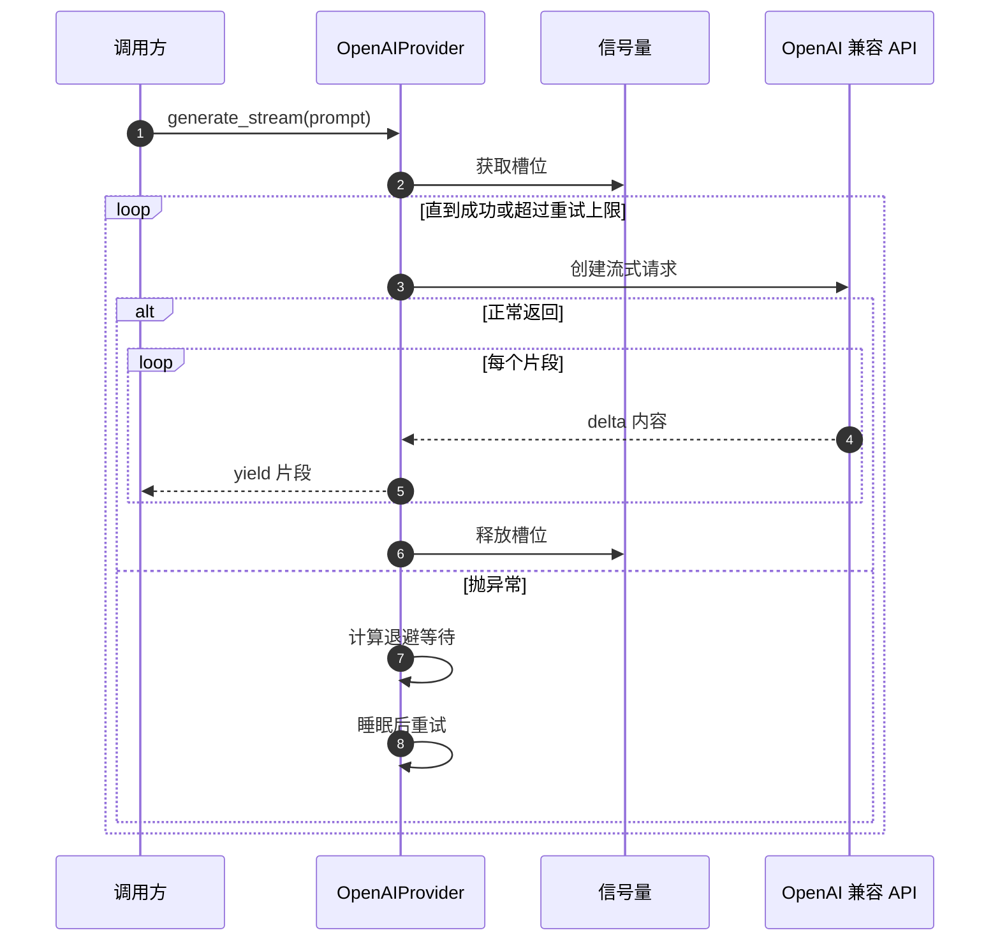

# OpenAI 客户端与并发重试

调用外部模型有两个绕不开的工程问题：并发太多会被服务端限流，偶发失败又不能让上层感知。实现把这两件事都收在 Provider 内部：一个类级别的信号量控制同时在飞的请求数，一个自建的重试循环按指数退避重发。上层看到的只有“产出片段”或“最终抛错”。

还有一个细节容易被忽略：OpenAI SDK 自带重试，但这里把它关掉了（`max_retries=0`），改用自建循环。这样重试间隔、并发槽位的持有策略都由自己决定。代价是要自己实现退避逻辑，好处是重试期间不会叠加 SDK 的内部等待。

## 客户端是延迟创建的

构造函数只保存配置，不创建网络客户端（`backend/ai/openai_provider.py`）。实际创建发生在第一次调用：

```python
if self._http_client is not None:
    return self._http_client
return AsyncOpenAI(
    api_key=self.config.api_key,
    base_url=self._normalize_url(self.config.api_url),
    timeout=self.timeout,
    max_retries=0,
)
```

允许注入外部客户端（`http_client` 参数），这是测试替换的入口。URL 会先经过规范化：去掉末尾的 `/chat/completions` 或 `/responses` 后缀，但保留 `/v1`。注释解释了两个方向的原因——SDK 会在 base_url 后追加 endpoint，所以 base_url 不能再带 endpoint；而 `/v1` 是 base_url 的一部分，必须保留。

请求超时默认 180 秒。参数注释给出了取值理由：它约束首片段等待时间，长输入时服务端排队可能超过 30 秒，10 秒会误杀。`max_retries=0` 把 SDK 的内部重试关掉。

## 类级信号量

限流用信号量实现，示意如下：

```python
# 示意：信号量 + 指数退避重试
sem = asyncio.Semaphore(MAX_INFLIGHT)      # 同时在飞的请求数上限

async def call(payload):
    async with sem:                          # 拿不到槽位就在此排队
        for attempt in range(MAX_RETRY):
            try:
                return await raw_call(payload)
            except RETRYABLE as e:
                await asyncio.sleep(BASE * 2 ** attempt + jitter())  # 退避
        raise
```

"信号量"是一个计数锁：容量为 N 时最多允许 N 个协程同时进入临界区，多出来的排队等待。它是类级别的，因此同一个进程里的所有 Provider 实例共享同一个上限。指数退避指第 k 次重试等待$	ext{base}	imes 2^k$，再加一点随机抖动，避免多个请求在同一时刻同时重发、形成新的尖峰。

限流器写在类属性上，所有实例共享（`openai_provider.py`）：

```python
class OpenAIProvider(AIProvider):
    _api_semaphore: Optional[asyncio.Semaphore] = None
    _api_concurrency: int = 10

    def __init__(self, config, ...):
        ...
        if OpenAIProvider._api_semaphore is None:
            OpenAIProvider._api_semaphore = asyncio.Semaphore(config.api_concurrency)
```

共享的目的是让多个流水线实例共用同一池槽位，避免每个实例各自放大并发。这里有一个从代码读出的取舍：信号量只在第一次构造时按当时的 `config.api_concurrency` 创建，之后构造的实例即使传入不同并发数也不会生效。流式方法里还有一段兜底，如果信号量仍为空就用类默认的 10 创建。因此实际并发由“第一个构造者”决定。

| 场景 | 并发值 |
| --- | --- |
| 首次构造传 5 | 5 |
| 之后构造传 20 | 仍为 5 |
| 从未构造过就调用流式方法 | 类默认 10 |



## 一次调用经过哪些阶段

`generate` 是非流式的门面：它内部调用流式方法，把片段拼成完整字符串。这样只有一套请求逻辑，非流式路径自动获得重试与限流。

`generate_stream` 的结构是“获取信号量，再进重试循环”：

| 阶段 | 行为 |
| --- | --- |
| 获取槽位 | `async with sem` |
| 组装消息 | 单条 user 消息 |
| 请求 | 调用 `_create_stream` |
| 成功 | 逐片段产出后返回 |
| 失败 | 未超过重试上限则等待后重试，否则抛错 |

重试等待按 `5 乘以 2 的 retries 次方` 计算，默认重试上限 3，因此等待序列是 5 秒、10 秒、20 秒。信号量的持有范围覆盖整个重试过程，注释写明这样做的理由：重试时不释放槽位，避免加重服务端拥塞。代价是一个卡在重试里的请求会长时间占用一个槽位。



流式请求本身很简单：`stream=True`，遍历返回对象，只取每个片段的增量内容，增量为空时跳过。这层过滤保证调用方拿到的都是非空字符串。

## 连通性测试

`test_connection` 发一条 “Hello”，限制最多一个 token，非流式。返回值是“choices 是否非空”，任何异常都被吞掉并返回假：

```python
try:
    response = await client.chat.completions.create(...)
    return response.choices is not None
except Exception:
    return False
```

这个设计适合健康检查，不适合诊断——失败原因不会出现在返回值里。排查连通性问题需要看日志。

## 从回答里抠 JSON

模型经常会多说两句，返回内容里夹着解释、思考标签或 Markdown 代码块。解析器按这个顺序处理（`openai_provider.py`）：

1. 去掉 `think` 标签包裹的推理过程；
2. 找 Markdown 代码块，块内是合法 JSON 就直接返回；
3. 从每个 `[` 或 `{` 位置尝试 `raw_decode`，取第一个能解出的完整对象；
4. 都不成功时返回原文本。

第一步针对带推理过程的模型，第二步针对常见的代码块输出，第三步应对“JSON 嵌在自然语言里”。第四步把失败留给调用方：返回原文本后，调用方尝试 `json.loads` 会抛错，走各自的兜底分支。

| 输入形态 | 处理 |
| --- | --- |
| 带思考标签加 JSON | 去标签后解析 |
| Markdown 代码块 | 取块内内容 |
| 纯 JSON | 直接解析 |
| JSON 混在解释中 | 扫描起始符 |
| 没有 JSON | 返回原文 |

## 易错点

1. 认为每个实例有自己的并发上限。信号量是类级共享。
2. 构造时传并发数就以为生效。首次构造之后不再改变。
3. 认为 SDK 会重试。`max_retries` 已设为 0。
4. 把重试等待当成固定间隔。它按 5 秒倍增。
5. 用 `test_connection` 的结果定位失败原因。异常被吞掉。
6. 假设模型一定返回纯 JSON。解析器为此专门做四层兼容。

## 小结

### 核心概念

| 概念 | 取值或做法 | 来源 |
| --- | --- | --- |
| 客户端创建 | 延迟，可注入 | `backend/ai/openai_provider.py` |
| URL 规范化 | 去 endpoint 后缀，保留 `/v1` | `backend/ai/openai_provider.py` |
| 超时 | 默认 180 秒 | `backend/ai/openai_provider.py` |
| SDK 重试 | 关闭 | `backend/ai/openai_provider.py` |
| 限流 | 类级信号量，首构造者决定 | `backend/ai/openai_provider.py` |
| 退避 | 5 秒乘 2 的 n 次方，上限 3 次 | `backend/ai/openai_provider.py` |
| 流式产出 | 只取非空增量 | `backend/ai/openai_provider.py` |
| 连通测试 | 一个 token，异常返回假 | `backend/ai/openai_provider.py` |
| JSON 提取 | 四层兼容 | `backend/ai/openai_provider.py` |

### 设计权衡

| 决策 | 收益 | 代价 |
| --- | --- | --- |
| 自建重试、关闭 SDK 重试 | 退避与槽位策略可控 | 需自己维护重试逻辑 |
| 重试期间持有槽位 | 不给拥塞的服务端加压 | 长重试占用并发 |
| 类级共享信号量 | 多实例不放大并发 | 并发数不可按实例调整 |
| 客户端延迟创建 | 构造无副作用 | 首次调用延迟略增 |
| 连通测试吞异常 | 健康检查简单 | 无法定位原因 |

## 练习

### 基础题

1. 说明客户端延迟创建与可注入设计的好处。
2. 写出重试等待序列与上限，说明重试期间是否释放槽位。
3. 列出 JSON 解析器的四层处理顺序。

### 挑战题

4. 让并发数可按实例生效，给出实现方案与对现有共享语义的影响。
5. 为流式请求增加首片段超时与整体超时两档限制，说明参数与取消方式。
6. 设计一个诊断用的连通性检查，在返回布尔值之外保留失败原因。

### 附：本页引用的路径

| 路径 | 用途 |
| --- | --- |
| `backend/ai/openai_provider.py` | 客户端、并发、重试、流式与 JSON 解析 |
| `backend/ai/provider.py` | 抽象接口定义 |
| `backend/utils/titles.py` | 标题归一化（解析与去重共用） |
